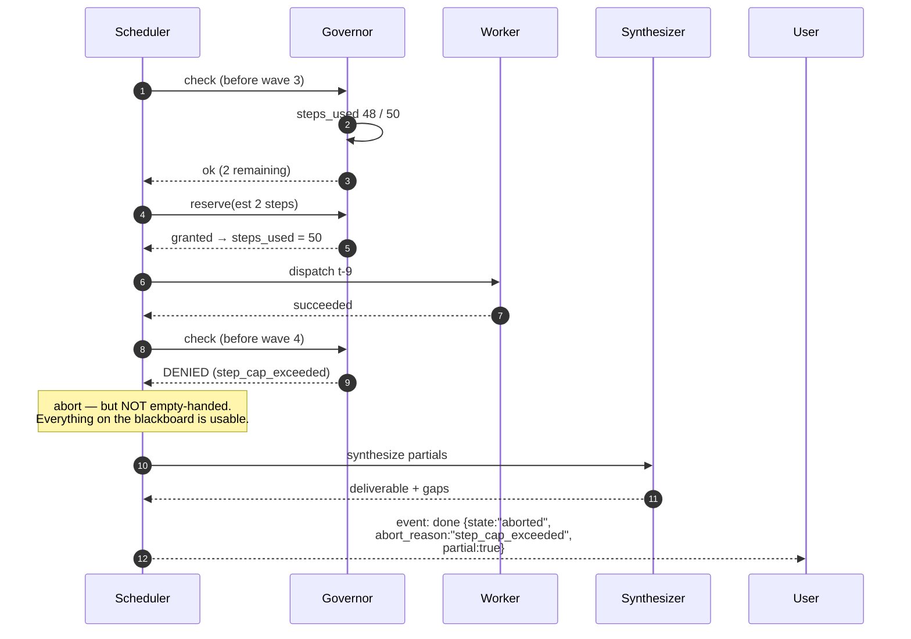
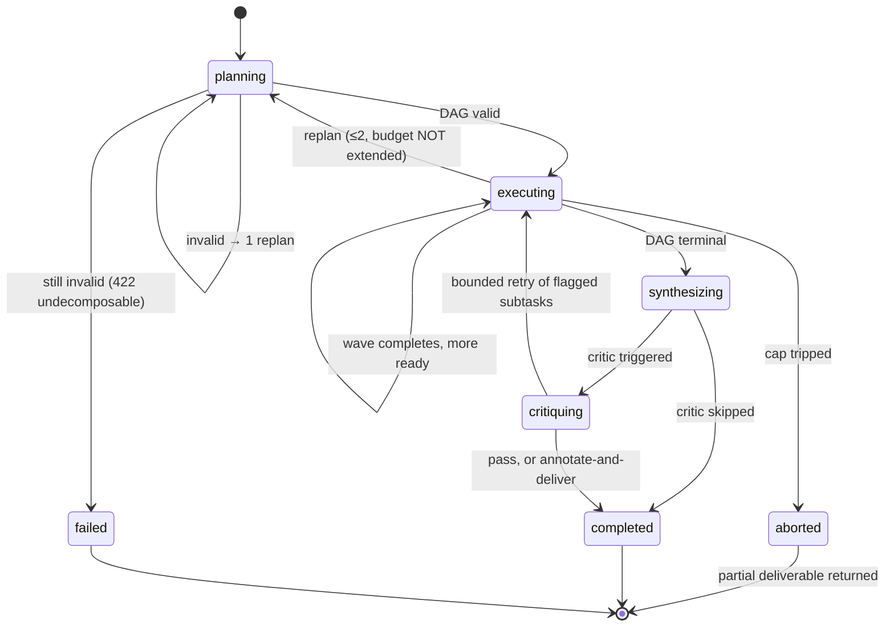
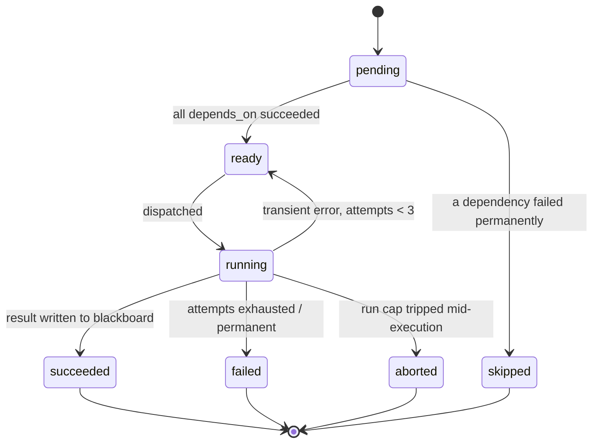

# 03 · Low-Level Design — Multi-Agent System

> **Phase 3 of 4** · [← HLD](02_hld.md) · [Production & interview →](04_production_and_interview.md)

---

## 3.1 Data models

### Runs and the budget ledger

```sql
CREATE TABLE runs (
    run_id          UUID PRIMARY KEY,
    tenant_id       UUID NOT NULL,
    user_id         UUID NOT NULL,
    goal            TEXT NOT NULL,

    state           TEXT NOT NULL DEFAULT 'planning',
    plan_version    INT  NOT NULL DEFAULT 1,        -- increments per replan
    replan_count    INT  NOT NULL DEFAULT 0,        -- capped at 2 (F2)

    -- Budget: allocated once, decremented atomically, NEVER extended by a replan
    tokens_budget   INT  NOT NULL,
    tokens_used     INT  NOT NULL DEFAULT 0,
    steps_budget    INT  NOT NULL DEFAULT 50,
    steps_used      INT  NOT NULL DEFAULT 0,
    cost_cap_usd    NUMERIC(8,4) NOT NULL DEFAULT 5.00,
    cost_used_usd   NUMERIC(10,6) NOT NULL DEFAULT 0,
    deadline_at     TIMESTAMPTZ NOT NULL,           -- created_at + 10 min

    abort_reason    TEXT,                           -- which cap tripped, if any
    partial         BOOLEAN NOT NULL DEFAULT FALSE,
    created_at      TIMESTAMPTZ NOT NULL DEFAULT now(),
    completed_at    TIMESTAMPTZ,

    CONSTRAINT runs_state_chk CHECK (state IN
        ('planning','executing','synthesizing','critiquing','completed','aborted','failed')),
    CONSTRAINT runs_replan_chk CHECK (replan_count <= 2)
);

CREATE INDEX idx_runs_active ON runs (state, deadline_at)
    WHERE state IN ('planning','executing','synthesizing','critiquing');
CREATE INDEX idx_runs_tenant ON runs (tenant_id, created_at DESC);
```

| Index | Serves |
|---|---|
| `idx_runs_active` | The reaper that aborts runs past `deadline_at` — partial, so it scans only live runs |
| `idx_runs_tenant` | Per-tenant cost attribution and history |

**`CONSTRAINT runs_replan_chk` puts the replan cap in the database, not just the application.** The
cap that prevents unbounded spend ([F2](02_hld.md#25-failure-modes--blast-radius)) shouldn't depend on
one code path remembering to check it.

### Tasks — the DAG

```sql
CREATE TABLE tasks (
    task_id       UUID PRIMARY KEY,
    run_id        UUID NOT NULL REFERENCES runs(run_id) ON DELETE CASCADE,
    plan_version  INT  NOT NULL,                    -- tasks belong to a plan generation

    role          TEXT NOT NULL,                    -- 'researcher' | 'db_analyst' | 'summarizer'
    instruction   TEXT NOT NULL,
    depends_on    UUID[] NOT NULL DEFAULT '{}',     -- the DAG edges
    output_schema JSONB NOT NULL,                   -- expected result shape

    state         TEXT NOT NULL DEFAULT 'pending',
    attempts      INT  NOT NULL DEFAULT 0,
    steps_used    INT  NOT NULL DEFAULT 0,
    cost_usd      NUMERIC(10,6) NOT NULL DEFAULT 0,

    result_key    TEXT,                             -- blackboard key holding the output
    error         TEXT,
    started_at    TIMESTAMPTZ,
    finished_at   TIMESTAMPTZ,

    CONSTRAINT tasks_state_chk CHECK (state IN
        ('pending','ready','running','succeeded','failed','skipped','aborted'))
);

-- The scheduler's hot query: which tasks are dispatchable right now?
CREATE INDEX idx_tasks_dispatch ON tasks (run_id, state)
    WHERE state IN ('pending','ready');
CREATE INDEX idx_tasks_run_plan ON tasks (run_id, plan_version);
```

**`depends_on` as a `UUID[]` rather than an edge table** — DAGs here are ≤ 10 nodes, so an array is
simpler and the dependency check is one array-containment test rather than a join. At 100+ nodes an
edge table would win; at 10 it's needless indirection.

### The blackboard — where concurrency correctness lives

```sql
CREATE TABLE blackboard (
    run_id      UUID NOT NULL REFERENCES runs(run_id) ON DELETE CASCADE,
    key         TEXT NOT NULL,
    value       JSONB NOT NULL,

    version     INT  NOT NULL DEFAULT 1,            -- the lost-update guard (F4)
    written_by  UUID NOT NULL REFERENCES tasks(task_id),
    written_at  TIMESTAMPTZ NOT NULL DEFAULT now(),

    PRIMARY KEY (run_id, key)                       -- partitioning key: runs never share state
);

CREATE INDEX idx_blackboard_task ON blackboard (written_by);   -- provenance for attribution
```

> **`version` is the column that prevents silent data loss.** Two workers finishing at the same moment
> and both updating a shared key would, under last-write-wins, drop one result — the run completes, the
> deliverable is missing a competitor, and **nothing anywhere reports an error**
> ([F4](02_hld.md#25-failure-modes--blast-radius)). Every write is a compare-and-set on `version`; a
> mismatch is a retryable conflict, not an overwrite.

**`PRIMARY KEY (run_id, key)` is also the shard key.** Runs never share blackboard state, so scaling out
is partitioning by `run_id` with no cross-partition coordination — which is what makes bottleneck 2 in
[§2.6](02_hld.md#26-scale-plan) tractable.

### Steps — the trace and the loop-detection source

```sql
CREATE TABLE steps (
    step_id       UUID PRIMARY KEY,
    run_id        UUID NOT NULL REFERENCES runs(run_id) ON DELETE CASCADE,
    task_id       UUID REFERENCES tasks(task_id),
    ordinal       INT  NOT NULL,

    agent_role    TEXT NOT NULL,
    kind          TEXT NOT NULL,        -- 'llm' | 'tool' | 'blackboard_read' | 'blackboard_write'
    tool_name     TEXT,
    args_hash     BYTEA,                -- SHA-256 over canonicalized args — loop detection (F3)

    model_version TEXT,
    tokens_in     INT,
    tokens_out    INT,
    cost_usd      NUMERIC(10,6),
    latency_ms    INT,
    outcome       TEXT NOT NULL,        -- 'ok' | 'error' | 'denied' | 'timeout'
    error         TEXT,
    created_at    TIMESTAMPTZ NOT NULL DEFAULT now()
);

-- Loop detection: has this (role, tool, args) triple already run 3× in this run?
CREATE INDEX idx_steps_loop ON steps (run_id, agent_role, tool_name, args_hash);
CREATE INDEX idx_steps_trace ON steps (run_id, ordinal);
```

`idx_steps_loop` exists for exactly one query — the loop check in
[§3.3](03_lld.md#the-budget-governor). Without the index that check is a table scan on every step.

---

## 3.2 API contracts

### `POST /v1/runs`

```http
POST /v1/runs HTTP/1.1
Authorization: Bearer <jwt>
Idempotency-Key: run-7f3e...

{
  "goal": "Research Acme, Globex, Initech, Umbrella and Soylent — produce a comparison memo covering pricing, positioning and recent funding.",
  "max_cost_usd": 2.00,
  "max_wall_clock_seconds": 300,
  "allow_partial": true
}
```

```
202 Accepted
{ "run_id": "r-91", "state": "planning", "poll_url": "/v1/runs/r-91",
  "stream_url": "/v1/runs/r-91/events" }
```

**202, not 200.** Runs are minutes long; a synchronous contract would force the client to hold a
connection for five minutes and lose everything on a transient disconnect.

### `GET /v1/runs/{id}/events` (SSE progress)

```
event: plan
data: {"plan_version":1,"tasks":[
        {"task_id":"t-1","role":"researcher","instruction":"Research Acme…","depends_on":[]},
        {"task_id":"t-6","role":"summarizer","instruction":"Compare pricing…",
         "depends_on":["t-1","t-2","t-3","t-4","t-5"]}]}

event: task_started
data: {"task_id":"t-1","role":"researcher","wave":1}

event: task_completed
data: {"task_id":"t-1","state":"succeeded","result_key":"acme.findings",
       "cost_usd":0.011,"steps":4}

event: budget
data: {"steps_used":22,"steps_budget":50,"cost_used_usd":0.089,"cost_cap_usd":5.00,
       "seconds_remaining":168}

event: task_failed
data: {"task_id":"t-4","error":"tool_timeout","attempts":3,"downstream_impact":["t-6"]}

event: done
data: {"state":"completed","partial":true,
       "gaps":["Umbrella — research failed after 3 attempts"],
       "deliverable_url":"/v1/runs/r-91/deliverable",
       "usage":{"cost_usd":0.147,"steps":41,"seconds":238}}
```

**The `budget` event exists so the user can see spend accruing** rather than discovering it afterwards.
**`gaps` in the `done` event is the honest-partial contract from
[Q1](01_requirements.md#open-questions)** — the deliverable states what it couldn't cover instead of
quietly omitting Umbrella.

### Remaining endpoints

```http
GET    /v1/runs/{id}                  # state, budget, task summary
GET    /v1/runs/{id}/deliverable      # final output + per-claim attribution
GET    /v1/runs/{id}/trace            # full step trace (audit / debug)
POST   /v1/runs/{id}:abort            # user-initiated; returns partials
GET    /v1/runs/{id}/blackboard       # inspect shared state (debug only)
```

**Error responses:**

| Status | Meaning | Behaviour |
|---|---|---|
| `400` | Goal empty or beyond max length | — |
| `402` | Tenant budget exhausted | `{"error":"tenant_budget_exhausted","resets_at":"…"}` |
| `409` | Idempotency key reused with a different goal | Return the original run |
| `422` | Planner could not produce a valid DAG after one replan | `{"error":"undecomposable_goal"}` — honest failure |
| `503` | Provider capacity unavailable at planning time | Retry-After; don't half-start a run |

**`422 undecomposable_goal` is a real outcome worth naming.** Some goals genuinely don't decompose
("write me something good"). Returning an honest failure beats executing a nonsense plan and billing
for it.

---

## 3.3 Core algorithms

### The scheduler loop

```python
MAX_REPLANS = 2
MAX_TASK_ATTEMPTS = 3

async def execute_run(run: Run) -> RunResult:
    plan = await plan_and_validate(run)          # raises Undecomposable after 1 replan
    if plan is None:
        return RunResult(state="failed", reason="undecomposable_goal")

    while True:
        # ---- 1. Governor gate BEFORE selecting work. Cheapest possible abort. ----
        verdict = await governor.check(run.id)
        if not verdict.ok:
            return await finalize_partial(run, abort_reason=verdict.reason)

        # ---- 2. Which tasks have all dependencies satisfied? ----
        ready = await select_ready_tasks(run.id, plan.version)
        if not ready:
            if await all_terminal(run.id, plan.version):
                break                             # DAG complete
            await asyncio.sleep(0.05)              # deps still running
            continue

        # ---- 3. Dispatch the wave IN PARALLEL — the point of the architecture.
        #         Staggered to avoid synchronized provider bursts (F6).
        results = await asyncio.gather(
            *[dispatch_with_stagger(t, i) for i, t in enumerate(ready)],
            return_exceptions=True,
        )

        # ---- 4. Failures: retry transient, skip downstream of permanent ----
        for task, outcome in zip(ready, results):
            if isinstance(outcome, TransientError) and task.attempts < MAX_TASK_ATTEMPTS:
                await mark_ready(task)             # retry WITHOUT restarting the run (FR-7)
            elif isinstance(outcome, Exception):
                await mark_failed(task, str(outcome))
                await skip_unreachable_downstream(task)   # DAG continues where it can

    deliverable = await synthesize(run)            # attribution per claim
    if await should_critique(run):                 # CONDITIONAL — saves ~20s (§1.5)
        deliverable = await critique_and_maybe_retry(run, deliverable)
    return RunResult(state="completed", deliverable=deliverable,
                     partial=await has_gaps(run.id))


async def dispatch_with_stagger(task: Task, index: int):
    """Stagger within a wave: parallel waves ARE synchronized bursts, which is
    exactly what provider rate limiters punish (F6)."""
    await asyncio.sleep(index * 0.15)
    return await run_worker(task)
```

**Four decisions worth defending:**

1. **Governor check before task selection.** Checking after dispatch means paying for the work that
   exceeded the cap.
2. **`return_exceptions=True`** — one worker raising must not cancel its siblings. Losing four
   completed research subtasks because the fifth timed out would be the expensive kind of bug.
3. **Retry marks the task ready, not the run.** [FR-7](01_requirements.md#execution) — completed work
   is preserved.
4. **Stagger inside the wave.** 150 ms × 5 costs 600 ms of wall-clock and buys a large reduction in
   429s. The parallelism that delivers speedup is also what trips rate limiters, and that tension is
   inherent, not incidental.

### The budget governor

```python
async def check(run_id: UUID) -> Verdict:
    """Five caps, checked cheapest-first. They fail DIFFERENTLY — a dollar cap
    won't stop a cheap infinite loop; a loop check won't stop a $5 burst (§1.6)."""
    run = await load_run_for_update(run_id)          # row lock: atomic decrement

    if now() >= run.deadline_at:
        return Verdict(False, "wall_clock_exceeded")
    if run.steps_used >= run.steps_budget:
        return Verdict(False, "step_cap_exceeded")
    if run.cost_used_usd >= run.cost_cap_usd:
        return Verdict(False, "cost_cap_exceeded")
    if run.tokens_used >= run.tokens_budget:
        return Verdict(False, "token_budget_exceeded")
    if run.replan_count > MAX_REPLANS:
        return Verdict(False, "replan_cap_exceeded")
    return Verdict(True, None)


async def reserve(run_id: UUID, est_tokens: int, est_cost: float) -> bool:
    """Pre-flight reservation. Reserving BEFORE the call means an expensive
    call cannot push the run past its cap and only be noticed afterwards."""
    async with db.transaction():
        run = await load_run_for_update(run_id)
        if (run.cost_used_usd + est_cost > run.cost_cap_usd
                or run.tokens_used + est_tokens > run.tokens_budget):
            return False
        await db.execute("""
            UPDATE runs SET tokens_used = tokens_used + $2,
                            cost_used_usd = cost_used_usd + $3,
                            steps_used = steps_used + 1
            WHERE run_id = $1
        """, run_id, est_tokens, est_cost)
        return True


async def check_loop(run_id: UUID, role: str, tool: str, args: dict) -> bool:
    """(role, tool, args) three times means the agent is stuck. Catches the
    cheap-but-endless cycle that no aggregate cap would notice for minutes (F3)."""
    h = sha256(canonical_json(args))
    count = await db.fetchval("""
        SELECT count(*) FROM steps
        WHERE run_id=$1 AND agent_role=$2 AND tool_name=$3 AND args_hash=$4
    """, run_id, role, tool, h)
    return count >= 3
```

**Reserve-before-call, reconcile-after.** Estimating and reserving first means a single expensive call
can't blow the cap; the actual usage reconciles the reservation afterwards. Checking only after the
call means discovering the overage once you've already paid for it.

### Blackboard compare-and-set

```python
async def write(run_id: UUID, key: str, value: dict,
                task_id: UUID, expected_version: int | None) -> int:
    """Optimistic concurrency. NEVER last-write-wins on a shared key (F4)."""
    if expected_version is None:                    # first write
        try:
            return await db.fetchval("""
                INSERT INTO blackboard (run_id, key, value, version, written_by)
                VALUES ($1,$2,$3,1,$4) RETURNING version
            """, run_id, key, value, task_id)
        except UniqueViolation:
            raise BlackboardConflict(key, "key already exists")

    updated = await db.fetchval("""
        UPDATE blackboard SET value=$3, version=version+1,
                              written_by=$4, written_at=now()
        WHERE run_id=$1 AND key=$2 AND version=$5
        RETURNING version
    """, run_id, key, value, task_id, expected_version)

    if updated is None:
        raise BlackboardConflict(key, "version mismatch — re-read and retry")
    return updated
```

**Conflicts are retryable, not fatal.** The worker re-reads, merges, and retries — the same pattern as
any optimistic-concurrency system. What matters is that a conflict *surfaces* rather than silently
discarding a result.

---

## 3.4 Sequence diagrams

### Parallel wave with one failure

```mermaid
sequenceDiagram
    autonumber
    participant U as User
    participant SCH as Scheduler
    participant GOV as Governor
    participant W1 as Worker t-1
    participant W4 as Worker t-4
    participant BB as Blackboard
    participant SYN as Synthesizer

    U->>SCH: POST /v1/runs (5 competitors)
    SCH->>GOV: allocate budget
    SCH->>SCH: plan → validate DAG (acyclic ✓)
    SCH-->>U: 202 + event: plan

    SCH->>GOV: check → ok
    SCH->>SCH: select ready = [t-1..t-5]

    par wave 1 (staggered 150ms apart)
        SCH->>W1: dispatch t-1
        W1->>BB: read run context
        W1->>W1: tool: web_search (allow-listed)
        W1->>BB: write acme.findings (CAS v1)
        W1-->>SCH: succeeded
    and
        SCH->>W4: dispatch t-4
        W4->>W4: tool: web_search → TIMEOUT ×3
        W4-->>SCH: TransientError (attempts exhausted)
    end

    SCH->>SCH: mark t-4 failed; skip unreachable downstream
    SCH-->>U: event: task_failed {downstream_impact:[t-6]}

    Note over SCH: t-6 depends on t-1..t-5.<br/>4 of 5 succeeded → run it with a declared gap.

    SCH->>GOV: check → ok
    SCH->>SYN: synthesize from blackboard
    SYN->>BB: read all findings
    SYN-->>SCH: deliverable + gaps:["Umbrella"]
    SCH-->>U: event: done {partial:true, gaps:[...]}
```

**The judgement call is at step 15.** With 4 of 5 competitors researched, the options are abort or
deliver-with-a-declared-gap. Delivering is right *provided the gap is stated* — a memo silently missing
a competitor is worse than one that says which competitor it couldn't cover.

### A cap trips mid-run



**A tripped cap produces a partial deliverable, not an error.** The work already on the blackboard is
paid for and useful; discarding it would waste the spend that triggered the cap in the first place.

---

## 3.5 State machines

### Run lifecycle



**`executing → planning` is the dangerous edge.** It's how genuine new information gets used, and it's
also the replanning loop ([F2](02_hld.md#25-failure-modes--blast-radius)). Two guards: capped at 2, and
**the budget is not reset** — a replan continues spending the original allocation.

### Task lifecycle



**`skipped` is distinct from `failed`** — a task whose dependency failed never ran and shouldn't be
reported as a failure. That distinction is what lets the `gaps` list say *"Umbrella research failed"*
rather than listing five confusing downstream failures.

---

## 3.6 Edge cases & correctness

| # | Edge case | Handling | Why |
|---|---|---|---|
| E1 | **Planner emits a cycle** | Deterministic validation → 1 replan → `422` | An unvalidated cycle is an infinite loop with a bill |
| E2 | Planner emits > 10 subtasks | Reject at validation; replan with an explicit limit | Breaches the step cap before starting |
| E3 | **Two workers write the same key simultaneously** | CAS on `version`; loser re-reads and retries | Last-write-wins loses a result **silently** ([F4](02_hld.md#25-failure-modes--blast-radius)) |
| E4 | One subtask fails permanently | Skip unreachable downstream; synthesize with declared gaps | Partial-with-honesty beats nothing |
| E5 | **All subtasks fail** | Return `failed` with per-task reasons — do **not** synthesize | A memo from zero evidence is pure fabrication |
| E6 | Cap trips mid-wave | Let in-flight finish (already paid for); dispatch nothing new | Cancelling paid-for work wastes the spend |
| E7 | **Worker tries a non-allow-listed tool** | Gateway denies; step recorded as `denied` | Gateway is authoritative; prompts are not a control |
| E8 | Agent loops the same tool call | `(role, tool, args_hash)` × 3 → fail the task | Aggregate caps wouldn't notice for minutes |
| E9 | **Injected instructions in a fetched web page** | Fetched content fenced as untrusted; allow-list bounds damage; side effects need approval | A researcher agent reads adversarial content by design |
| E10 | Two subtasks reach contradictory conclusions | Synthesizer surfaces **both** with attribution | Silently picking is confidently wrong half the time ([Q2](01_requirements.md#open-questions)) |
| E11 | Critic always fails | Bounded retries → annotate and deliver; alert if pass rate < 50% | An always-blocking critic delivers nothing ([F8](02_hld.md#25-failure-modes--blast-radius)) |
| E12 | Duplicate run submission | `Idempotency-Key` → return the original run | Runs cost real money; double-submitting doubles it |
| E13 | **Blackboard unavailable mid-run** | Run pauses; resumes when healthy — the blackboard *is* run state | Nothing is lost because nothing lives only in a worker |
| E14 | Client disconnects from the SSE stream | Run continues; results retrievable via `GET /v1/runs/{id}` | Unlike a chat turn, the work is worth finishing |
| E15 | Task succeeds but writes a malformed result | Validate against `output_schema`; treat mismatch as a failure | An unvalidated result poisons synthesis |
| E16 | Replan produces a DAG orphaning completed tasks | Keep their blackboard entries; the synthesizer may still use them | Paid-for work shouldn't be discarded by a replan |
| E17 | **Provider 429 across a whole wave** | Stagger + backoff; if the wave can't start, pause without consuming steps | A rate limit is not the run's fault and shouldn't burn its budget |
| E18 | Wall-clock expires while the critic runs | Deliver the un-critiqued output, labelled as such | An uncritiqued memo beats no memo, if the label is honest |

**E5 is the one worth stating explicitly.** If every research subtask fails, a synthesizer *will*
produce a plausible comparison memo from its own priors — fluent, well-structured, and entirely
fabricated. The synthesizer must refuse when the blackboard holds no evidence, which is the same
retrieval-gate logic as [01](../01_production_rag_system/03_lld.md#retrieve--rerank--assemble)'s
refusal path.

---

**Next:** [04_production_and_interview.md →](04_production_and_interview.md)
