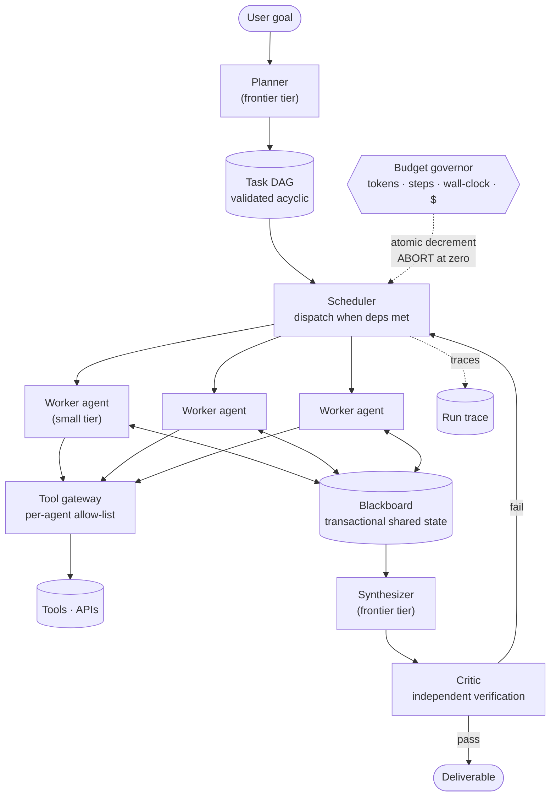

# 03 — Multi-Agent AI System

> **Prompt:** Design a multi-agent AI system — agent orchestration, planner/executor, communication, shared state, tool management, failure handling, cost control.

---

## The three-sentence compression

*Rehearse this before opening any other file. It is the opening answer.*

1. **The choice that matters most:** a **planner-produced DAG executed by stateless workers against a transactional blackboard**, with **hard budget caps enforced atomically** — because multi-agent cost is *multiplicative*, not additive, and an unbounded replanning loop is unbounded spend. The caps are P0 infrastructure, not a nice-to-have.
2. **The alternative I rejected:** free-form agent-to-agent conversation ("agents negotiating"). It's the version people picture, and it degrades into token-burning loops with no audit point and no way to bound cost. Structured writes to a shared blackboard give the same coordination with deterministic cost and a replayable trace.
3. **The failure mode I'd volunteer:** **I'd first argue against the premise.** Multi-agent is frequently chosen for fashion rather than need, and a single agent with good tools beats it for most tasks at a fraction of the cost. It earns its complexity only when subtasks are genuinely parallelizable, need *different* privileges, or require independent verification — and I'd want to establish that before designing it.

---

## Architecture at a glance

**The budget governor is drawn touching the scheduler, not the workers, deliberately** — a worker that
has already started cannot be trusted to police its own spend.

---

## Key numbers

| Dimension | Value |
|---|---|
| **Run shape** | ≤ 10 subtasks · ≤ 50 agent steps |
| **E2E** | p95 < 5 min for a 10-subtask run |
| **Parallel speedup** | ≥ 3× vs sequential — *the justification for the architecture* |
| **Cost** | ≤ $2.00/run · **hard abort at $5.00** |
| Naive cost | ≈ $0.94/run · **≈ $1.9 with one retry per subtask** |
| Task success | ≥ 0.80 on the eval suite |
| Determinism | Same input + versions → **same plan** (execution may vary) |
| Availability | 99.9% — async, retries absorb blips |

---

## The findings that matter

**1. Cost is multiplicative, and that changes what "budget" means.** 10 subtasks × 5 turns × frontier
tier ≈ $0.83, plus planner/synthesizer/critic ≈ $0.12 — about **$0.94/run**. Add *one* retry per
subtask and it's ~$1.9, at the ceiling. Add unbounded replanning and it's unbounded. This is why
[FR-5](01_requirements.md#control--the-p0-that-designs-usually-defer) (hard caps) is P0 rather than a later hardening pass.

**2. The design must justify itself before it describes itself.** Three conditions justify
multi-agent; if none hold, the correct design is a single agent with good tools:

| Condition | Present here? |
|---|---|
| Subtasks genuinely **parallelizable** | ✅ — research 5 competitors independently |
| Subtasks need **different tools/privileges** | ✅ — web research vs internal DB vs file write |
| Result needs **independent verification** | ✅ — a critic that didn't produce the work |

Compare [02](../02_customer_support_agent/02_hld.md#the-conversation-plane), where none hold and
single-agent is correct.

**3. Free-form agent chat is the trap.** It's the mental image the phrase "multi-agent" evokes, and
it's the version that burns tokens in loops with no audit trail. **Structured blackboard writes give
the same coordination with bounded cost** — see [§2.2](02_hld.md#22-component-choices).

---

## Files

| File | Contents |
|---|---|
| **[01_requirements.md](01_requirements.md)** | When multi-agent is justified · functional requirements · NFRs · non-goals · cost arithmetic · assumptions |
| **[02_hld.md](02_hld.md)** | Architecture · planner/executor split · blackboard vs message-passing · budget governor · failure modes · scale plan |
| **[03_lld.md](03_lld.md)** | DAG + blackboard schemas · APIs · scheduler and budget algorithms · sequence diagrams · run/task state machines · edge cases |
| **[04_production_and_interview.md](04_production_and_interview.md)** | AI-specific concerns · runbook · common mistakes · interview follow-ups · glossary |

**Shared front-matter:** [`../00_requirements_all_systems.md#3-multi-agent-ai-system`](../00_requirements_all_systems.md#3-multi-agent-ai-system)

---

## Relationship to the other designs

| Relates to | How |
|---|---|
| [02 — Support agent](../02_customer_support_agent/README.md) | The **contrast case** — sequential, one privilege set, so single-agent wins. Read its [§2.2](../02_customer_support_agent/02_hld.md#the-conversation-plane) alongside this |
| [01 — RAG](../01_production_rag_system/README.md) | Worker agents use it as a tool |
| [10 — Enterprise platform](../00_requirements_all_systems.md#10-enterprise-ai-agent-platform) | Generalizes this orchestration model as a multi-tenant product |
