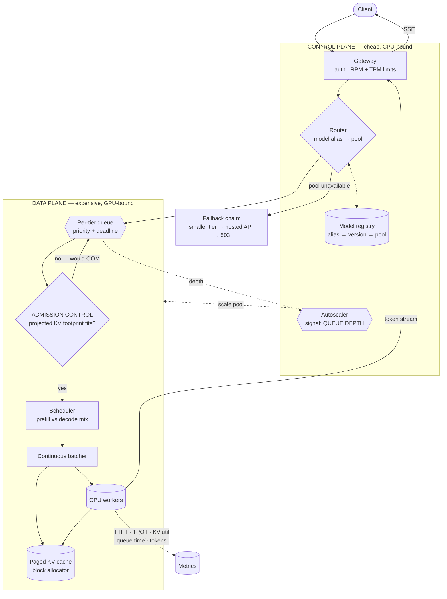

# 02 · High-Level Design — LLM Inference Platform

> **Phase 2 of 4** · [← Requirements](01_requirements.md) · [LLD →](03_lld.md)

---

## 2.1 Architecture

Two planes with different scaling behaviour, plus a per-model-tier pool structure:

| Plane | Contains | Scales on | Failure consequence |
|---|---|---|---|
| **Control plane** | Gateway, router, rate limiter, autoscaler, model registry | Request rate (CPU-bound, cheap) | Requests rejected — recoverable |
| **Data plane** | Per-tier pools: scheduler, admission control, batcher, GPU workers | **Queue depth** (GPU-bound, expensive) | Requests queue or fail — the expensive plane |

**Admission control is a first-class component, not a detail inside the batcher** — because rejecting
(or deferring) a request whose KV footprint won't fit is the difference between graceful queueing and
an OOM that kills every in-flight request on that GPU.

---

## 2.2 Component choices

### Batching — the throughput decision

| Concern | Choice | Why | Rejected alternative (and why not) | Revisit when |
|---|---|---|---|---|
| **Batching strategy** | **Continuous batching** (a.k.a. iteration-level scheduling) | Finished sequences leave the batch immediately and new ones join mid-flight ⇒ **~5× throughput** at equal latency | **Static batching** — the batch runs at the pace of its *longest* sequence while finished slots sit idle. Simpler, and wastes most of the GPU | Never for shared serving. Static is fine for offline batch jobs where latency is irrelevant |
| **KV allocation** | **Paged** — fixed-size blocks, allocated on demand | A request reserving for its *worst-case* length wastes the budget; blocks let short requests release early | **Contiguous per-request reservation** — simple, and strands large fractions of KV on requests that finish at 200 tokens | — |
| **Prefill/decode mix** | Chunked prefill interleaved with decode | Prefill is compute-bound, decode bandwidth-bound; interleaving keeps both units busy | **Prefill-priority** — one 32k prompt stalls every in-flight decode, spiking TPOT for everyone. **Decode-priority** — new requests starve, TTFT collapses | — |
| **Quantization** | **int4 weights, fp16 KV** | int4 frees ~35 GB on a 70B, which is what makes batching possible ([§1.5](01_requirements.md#15-the-memory-arithmetic-that-sizes-everything)) | **fp16 weights** — 140 GB, needs 2 GPUs before serving one request. **int4 KV** — more concurrency, measurable quality loss on long contexts | Quality regression traced to quantization |

**Why continuous batching gives ~5×, concretely.** In a static batch of 16 where sequences finish at
wildly different lengths (say 50 to 2,000 tokens), the batch occupies the GPU until the 2,000-token
sequence completes. Fifteen slots sit idle for most of that. Continuous batching evicts each finished
sequence at its own completion step and admits a waiting request into the freed slot, so the batch
stays near-full. **The gain comes from eliminating idle slots, and it's larger the more variable your
output lengths are** — which in production they always are.

> **Mental model:** static batching is a **bus that waits for every passenger to reach their stop
> before picking anyone up**; continuous batching is a bus where people get off and on at every stop.
>
> *Where the analogy breaks:* GPU batching also has a *memory* constraint the bus doesn't — a new
> passenger can only board if there's KV room for their entire remaining journey, whose length nobody
> knows yet. That's the admission-control problem.

### Admission and scheduling

| Concern | Choice | Why | Rejected alternative | Revisit when |
|---|---|---|---|---|
| **Admission control** | **KV-aware** — admit on *projected* footprint | Concurrency is a function of context length, not a fixed count ([§1.5](01_requirements.md#the-concurrency-ceiling)). Admitting by count OOMs on long prompts | **Fixed max-batch-size** — works until someone sends 32k contexts, then it OOMs and kills every in-flight request on that GPU | Never |
| Length estimation | `max_tokens` if given, else a per-tenant p90 estimate | You must guess to admit; guessing high wastes budget, low risks preemption | **Assume worst case (32k)** — admits ~4 requests and idles the GPU | — |
| **Preemption** | Recompute-based, lowest-priority first | When an admitted request grows beyond its estimate, something must yield. Recompute is cheaper than swapping KV over PCIe | **Swap KV to host memory** — PCIe bandwidth makes this slower than recomputing. **Hard-fail the request** — punishes the victim for the scheduler's estimate | Host memory bandwidth improves materially |
| **Queue discipline** | Priority + deadline-aware FIFO within tier | Interactive traffic must not queue behind batch jobs | **Pure FIFO** — a batch backlog blocks interactive requests indefinitely | — |

**Preemption exists because admission is a *guess*.** You must admit a request before knowing how long
its output will be. When the guess is wrong and KV runs short, the scheduler evicts a low-priority
request's cache and recomputes it later — expensive, but bounded and fair. Without preemption the only
options are OOM (kills everyone) or refusing to admit (idles the GPU).

### Autoscaling and routing

| Concern | Choice | Why | Rejected alternative | Revisit when |
|---|---|---|---|---|
| **Autoscale signal** | **Queue depth + queue wait time** | GPU inference leaves CPU largely idle while the GPU saturates; queue depth is the only signal that tracks unmet demand | **CPU utilization** — nearly uncorrelated with GPU saturation; scales late on load and early on idle. **GPU utilization** — saturates at 100% long before queueing starts, so it can't distinguish "busy" from "overloaded" | — |
| Scale-up granularity | Whole nodes, pre-warmed pool | Model load is minutes; cold-starting on demand blows the 3-min NFR | **Scale from zero** — first request after scale-up waits for a multi-GB model load | Model load times drop dramatically |
| **Model aliasing** | `prod-fast` → pinned version | Callers pin an alias; the platform moves the version underneath after evaluation | **Callers pin versions directly** — every model retirement becomes a 30-team migration | — |
| **Fallback** | Explicit chain, **caller informed of the served model** | Silent 70B→8B substitution makes quality regressions undebuggable | **Silent fallback** — teams chase phantom quality bugs. **No fallback** — capacity loss becomes an outage | — |

**Why GPU utilization is a bad autoscaling signal, specifically.** A well-batched inference server runs
at ~100% GPU utilization by design — that's the goal. Utilization therefore hits its ceiling long
before the system is *overloaded*, so it cannot distinguish "efficiently busy" from "requests are
piling up." Queue depth and queue *wait* directly measure demand that isn't being served, which is what
autoscaling should respond to.

---

## 2.3 Data flow

### A streaming request

1. **Gateway**: authenticate; check **both** RPM and TPM budgets. TPM matters because token volume, not
   request count, consumes the scarce resource.
2. **Router**: resolve the model alias via the registry to a concrete version and pool. Unavailable →
   fallback chain.
3. **Enqueue** into the tier's priority queue with a deadline.
4. **Admission control**: estimate the request's KV footprint (`prompt_tokens + expected_output`), check
   against free KV blocks. Fits → admit. Doesn't → leave queued (do **not** reject; capacity frees
   continuously).
5. **Scheduler**, each iteration: decide the prefill/decode mix. Chunk large prefills so one 32k prompt
   can't stall every in-flight decode.
6. **Batcher**: run the forward pass over the current batch — mixed prefill chunks and decode steps.
7. **Paged KV allocator**: allocate blocks as sequences grow; free them the instant a sequence
   completes; a completed sequence's blocks are immediately available to a queued request.
8. **Stream tokens** back through the gateway as generated. First token stops the TTFT clock.
9. **On completion**: free all blocks, emit metrics (tokens, TTFT, TPOT, queue time, KV peak, model
   version served).
10. **If KV pressure spikes mid-generation**: preempt the lowest-priority in-flight request, free its
    blocks, requeue it for recompute.

**Step 4 is the one that distinguishes this from a naive design** — and note it *queues* rather than
rejects. KV frees up continuously as sequences complete, so a request that doesn't fit now very likely
fits in a few hundred milliseconds.

---

## 2.4 NFR mapping

| NFR | Target | Delivered by |
|---|---|---|
| TTFT p95 < 400 ms (8B) | 400 ms | Chunked prefill · prefix cache reuse ([FR-7](01_requirements.md#throughput--capacity)) · queue wait < 200 ms · pre-warmed capacity |
| TPOT < 25 ms | 25 ms | Continuous batching · int4 weights (less bandwidth per token) · optional speculative decoding |
| Throughput ≥ 2,500 tok/s/node | — | Continuous batching (~5×) · paged KV keeping the batch full |
| **GPU util ≥ 60%** | 60% | Continuous batching · queue-depth autoscaling (scales down when idle, unlike CPU-based) |
| Queue wait p95 < 200 ms | 200 ms | Autoscale on queue depth · priority queue · admission that defers rather than blocks |
| Max context 32k | — | Paged KV · KV-aware admission · **TPM rate limiting** |
| Availability 99.9% | — | Multi-AZ pools · fallback chain · drain-based rolling updates |
| Zero dropped on update | — | Blue/green pool with drain ([§3.5](03_lld.md#35-state-machines)) |
| Per-tenant fairness | — | RPM **and** TPM limits · priority queueing |
| Cost | ⚠️ see [§1.6](01_requirements.md#16-capacity--cost-estimation) | Utilization is the only real lever; **the target is unachievable for small models** |

---

## 2.5 Failure modes & blast radius

| # | Failure | Detection | Blast radius | Mitigation & degraded mode |
|---|---|---|---|---|
| **F1** | **KV cache OOM** | Allocation failure | **Every in-flight request on that GPU dies** | KV-aware admission control · paged allocation · preemption before exhaustion. *The failure the design exists to prevent* |
| **F2** | One tenant sends many 32k-context requests | KV occupancy per tenant | Whole pool starved | **TPM limits** (not just RPM) · per-tenant KV quota · priority demotion |
| **F3** | Long prefill stalls all decodes | TPOT p99 spike | Every in-flight request | **Chunked prefill** — split large prompts across iterations |
| **F4** | Autoscaler scales on the wrong signal | Queue grows while CPU looks idle | All requests queue | Queue depth as the signal ([§2.2](02_hld.md#autoscaling-and-routing)) |
| **F5** | GPU node hardware fault | Health check, ECC errors | In-flight requests on that node | Drain and replace · in-flight requests fail and are retried by the client · **never** silently reroute mid-stream |
| **F6** | Model load fails after scale-up | Readiness probe | Reduced capacity | Node stays out of rotation; alert; fallback chain absorbs |
| **F7** | Preemption thrashing | Preemption rate | Throughput collapse | Cap preemptions per request; admit more conservatively when the rate is high |
| **F8** | **Bad model version deployed** | Eval gate + canary metrics | Traffic on the new version | Alias-based rollback — repoint the alias, no caller changes |
| **F9** | GPU capacity unprocurable | Queue wait rising with no scale-up headroom | All requests degraded | **Fallback to hosted API** — the honest degraded mode, if policy permits it |
| **F10** | Speculative decoding rejects heavily | Acceptance rate | Wasted compute, worse TPOT | Disable per-model when acceptance < ~60% |
| **F11** | Client disconnects mid-stream | Connection state | Wasted GPU | **Abort generation and free KV immediately** — a disconnected client's request holds scarce KV |

**On F1, because everything traces back to it.** A KV OOM is not a graceful per-request failure — the
allocation happens mid-forward-pass, so **every sequence sharing that GPU is lost**. One tenant's 32k
prompt can therefore kill forty other tenants' in-flight requests. That asymmetry is why admission
control is a P0 component and why TPM limiting isn't optional.

**On F11, because it's easy to miss and directly wastes the scarce resource.** In a hosted-API design a
disconnected client just means wasted tokens you still pay for. Here it means a *request continues
occupying KV blocks* that queued requests need. Detecting disconnect and freeing blocks immediately is
a real throughput lever, not just tidiness.

---

## 2.6 Scale plan

### 10× (200k output tok/s peak, ~160 nodes)

| # | Bottleneck | Why | Change |
|---|---|---|---|
| 1 | **GPU procurement** | 1,280 H100s is a supply-chain problem, not a budget line | Multi-region capacity · reserved commitments · **hosted-API overflow as a permanent tier**, not just a fallback |
| 2 | Scheduler per pool | One scheduler per pool becomes the coordination limit | Shard pools by model *and* region; schedulers stay independent |
| 3 | Model registry / routing | Every request resolves an alias | Cache the alias→version map at the gateway with short TTL |
| 4 | Metrics volume | Per-request KV/token metrics at 10× | Sample the high-cardinality dimensions; keep counters exact |
| 5 | Cost | ~$3.7M/month | **Forces the [§1.6](01_requirements.md#16-capacity--cost-estimation) conversation properly** — at this scale the frontier-tier comparison is the only one that justifies building |

**Bottleneck 1 is the one that actually bites.** Software scales; GPU allocations arrive on a vendor's
timeline. The architectural answer is to treat hosted APIs as a **standing overflow tier** rather than
an emergency fallback — which also means the design must already handle "some traffic served
externally" as a normal condition, including its data-residency implications.

### 100× (2M output tok/s)

| Concern | Change |
|---|---|
| Topology | Multi-region active-active with geo-routing; KV never crosses regions |
| Models | Fewer, larger, better-utilized pools; retire underused tiers |
| Scheduling | Disaggregated **prefill and decode clusters** — they have opposite bottlenecks (compute vs bandwidth), so co-locating them is a compromise you can stop making at scale |
| Hardware | Mixed fleet (H100/H200/B-class); scheduler must be capability-aware |
| Cost | Dedicated capacity-planning function; utilization becomes a tracked business metric |

**Prefill/decode disaggregation is the interesting 100× move.** Prefill is compute-bound; decode is
memory-bandwidth-bound. Running both on the same GPU means every scheduling decision trades one against
the other ([§1.5](01_requirements.md#prefill-vs-decode--why-one-number-wont-do)). At sufficient scale
you can afford separate pools optimized for each, transferring KV between them — removing the
compromise entirely.

### What does *not* change

- **KV cache, not weights, is the constraint.** More acute at scale.
- **Admission control is KV-aware.**
- **Autoscale on queue depth, never CPU.**
- **TPM limits alongside RPM.**
- **Callers are told which model actually served them.**
- **Free KV immediately on client disconnect.**

---

## 2.7 Tech stack

> Shared substrate and the reasoning behind it: [`../00_tech_stack.md`](../00_tech_stack.md). This section
> carries only what is **specific to this system**.

| Layer | Choice | Rejected | Why | Revisit when |
|---|---|---|---|---|
| **Inference engine** | **vLLM** | Triton, TGI, raw Transformers | **PagedAttention is the reason the KV-cache arithmetic works at all.** Without paged KV, the ~327 KB/token figure caps concurrency far lower | vLLM stops tracking new architectures |
| **Autoscaling** | **KEDA on queue depth + KV-cache utilization** | HPA on CPU or GPU-util % | **The central finding: GPU serving is not CPU-bound**, and GPU utilization stays high while the queue grows. Scaling on either is blind | Never |
| Node management | **Karpenter** with GPU node pools, warm minimum | Cluster Autoscaler | GPU node provisioning is minutes; a warm floor is the difference between p95 and a timeout | — |
| **Batching** | **Continuous batching** (vLLM native) | Static batching | Static batching wastes the whole batch on the slowest sequence | Never |
| Model storage | **S3** + local NVMe cache, pre-pulled into the image where size allows | Pull-on-start | A 16 GB weight pull on cold start is a multi-minute outage for that replica | — |
| Routing | Small/frontier tiers behind aliases, **queue-aware** | Round-robin | Round-robin ignores KV pressure, which is the actual constraint | — |
| Admission control | **KV-cache-aware rejection with `Retry-After`** | Unbounded queueing | Queueing past KV capacity converts a fast rejection into a slow timeout for everyone | Never |
| Quantization | **AWQ / int8** for the small tier; fp16 frontier | Quantize everything | Small-tier quality loss is tolerable; frontier quality is the reason the tier exists | Benchmarks show negligible loss at fp8 |
| Non-LLM models | **Triton** | vLLM for everything | Fixed-shape models want a fixed-shape batcher | — |
| Observability | Prometheus (vLLM metrics) + **queue depth, KV utilization, TTFT/TPOT split** | Aggregate latency | TTFT and TPOT have different causes — prefill is compute-bound, decode is bandwidth-bound | Never |

**KEDA on queue depth rather than CPU is the choice this whole design hinges on.** A GPU serving LLM
traffic sits at high utilization by construction; CPU is nearly idle. Scale on CPU and you never scale;
scale on GPU-util and you scale too late, because utilization is already high when the queue starts
growing. **Queue depth plus KV-cache utilization are the only two signals that lead the failure rather
than trail it.**

**And the stack does not change the build-vs-buy verdict.** Even with vLLM, Karpenter, and a well-tuned
autoscaler, self-hosting an 8B model came out ~10× more expensive than a small hosted API at realistic
utilization — and [the ops cost of this stack](../00_tech_stack.md#what-the-stack-costs-to-operate) is
~2 engineers on top of that. **Good tooling makes self-hosting *possible*; it doesn't make it cheaper.**

---

**Next:** [03_lld.md →](03_lld.md) — model registry schema, OpenAI-compatible contracts, the admission/batching/eviction algorithms, sequence diagrams including a preemption, request and rollout state machines, and edge cases.
