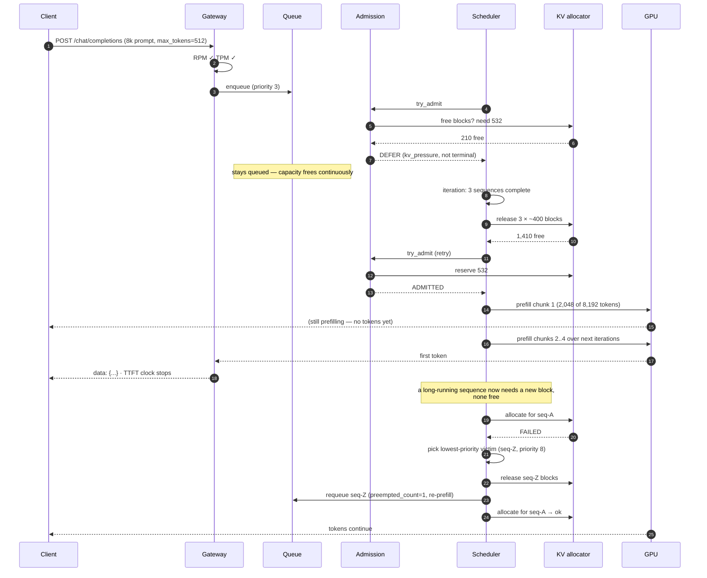
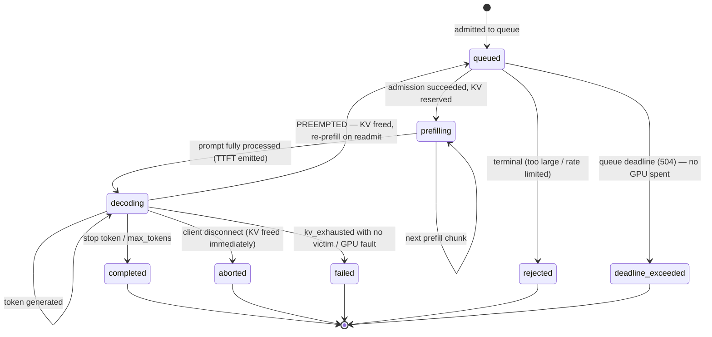
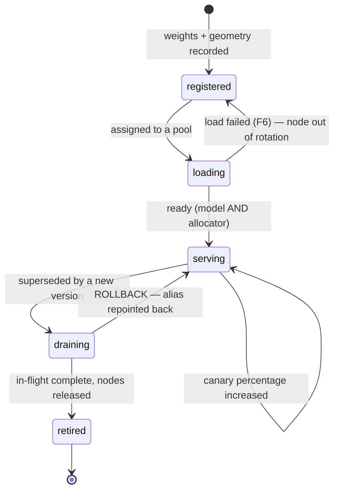

# 03 · Low-Level Design — LLM Inference Platform

> **Phase 3 of 4** · [← HLD](02_hld.md) · [Production & interview →](04_production_and_interview.md)

---

## 3.1 Data models

Most state here is **in-GPU-memory and ephemeral** — the KV cache is the real data structure, and it
lives and dies within a request. The durable schemas are control-plane concerns: registry, quotas, and
metrics.

### Model registry — what makes alias-based rollback possible

```sql
CREATE TABLE model_versions (
    model_version_id UUID PRIMARY KEY,
    family           TEXT NOT NULL,              -- 'llama-8b' | 'mistral-24b' | 'llama-70b'
    version          TEXT NOT NULL,              -- immutable, e.g. '2026-03-11-int4'
    weights_uri      TEXT NOT NULL,
    quantization     TEXT NOT NULL,              -- 'fp16' | 'int8' | 'int4'

    -- The parameters that drive the KV arithmetic (§1.5) — stored, not assumed
    n_layers         INT  NOT NULL,
    n_kv_heads       INT  NOT NULL,              -- GQA: far smaller than n_heads
    head_dim         INT  NOT NULL,
    max_context      INT  NOT NULL,
    kv_bytes_per_token INT GENERATED ALWAYS AS
        (2 * n_layers * n_kv_heads * head_dim * 2) STORED,   -- 2=K+V, 2=fp16

    weights_bytes    BIGINT NOT NULL,
    state            TEXT NOT NULL DEFAULT 'registered',
    eval_passed      BOOLEAN NOT NULL DEFAULT FALSE,
    created_at       TIMESTAMPTZ NOT NULL DEFAULT now(),

    CONSTRAINT mv_uniq UNIQUE (family, version),
    CONSTRAINT mv_state_chk CHECK (state IN ('registered','loading','serving','draining','retired'))
);

-- Callers pin ALIASES; the platform moves the version underneath after evaluation
CREATE TABLE model_aliases (
    alias            TEXT PRIMARY KEY,           -- 'prod-fast' | 'prod-balanced' | 'prod-quality'
    model_version_id UUID NOT NULL REFERENCES model_versions(model_version_id),
    canary_version_id UUID REFERENCES model_versions(model_version_id),
    canary_percent   SMALLINT NOT NULL DEFAULT 0,
    updated_by       TEXT NOT NULL,
    updated_at       TIMESTAMPTZ NOT NULL DEFAULT now()
);

CREATE TABLE alias_history (                     -- rollback needs to know the previous target
    alias            TEXT NOT NULL,
    model_version_id UUID NOT NULL,
    effective_from   TIMESTAMPTZ NOT NULL,
    effective_to     TIMESTAMPTZ,
    PRIMARY KEY (alias, effective_from)
);
```

> **`kv_bytes_per_token` as a generated column is the most useful line in this schema.** The admission
> controller needs it on every decision, and computing it from stored model geometry rather than a
> hardcoded constant means a new model with different GQA grouping is handled correctly the moment it's
> registered. Hardcoding 327 KB and then serving a model with 64 kv-heads instead of 8 would
> under-estimate footprint by 8× and OOM the pool ([F1](02_hld.md#25-failure-modes--blast-radius)).

**`alias_history` exists purely for rollback.** Repointing an alias is the rollback mechanism
([F8](02_hld.md#25-failure-modes--blast-radius)); without a record of what it previously pointed at,
"roll back" becomes "guess which version was good."

### Quotas — RPM *and* TPM

```sql
CREATE TABLE tenant_quotas (
    tenant_id        UUID PRIMARY KEY,
    rpm_limit        INT NOT NULL,
    tpm_limit        INT NOT NULL,               -- the limit that maps to the SCARCE resource
    max_context      INT NOT NULL DEFAULT 8192,  -- per-tenant cap; blunt but effective vs F2
    kv_blocks_quota  INT,                        -- optional hard ceiling on concurrent KV
    priority         SMALLINT NOT NULL DEFAULT 5,-- 1=highest; interactive above batch
    allowed_aliases  TEXT[] NOT NULL DEFAULT '{}'
);
```

**`max_context` per tenant is the crude control that prevents [F2](02_hld.md#25-failure-modes--blast-radius).**
TPM limits token *rate*; they don't stop one request from being enormous. A tenant capped at 8k context
cannot single-handedly consume 10.5 GB of KV, regardless of their TPM allowance.

### Request metrics (time-series, not OLTP)

```sql
CREATE TABLE request_metrics (
    request_id       UUID NOT NULL,
    tenant_id        UUID NOT NULL,
    alias            TEXT NOT NULL,
    model_version_id UUID NOT NULL,              -- WHICH version actually served it (FR-6)
    was_fallback     BOOLEAN NOT NULL DEFAULT FALSE,

    prompt_tokens    INT NOT NULL,
    output_tokens    INT NOT NULL,
    est_output_tokens INT,                       -- what admission GUESSED — for calibration
    queue_ms         INT NOT NULL,
    ttft_ms          INT NOT NULL,
    tpot_ms_p50      REAL NOT NULL,
    total_ms         INT NOT NULL,

    kv_blocks_peak   INT NOT NULL,
    preempted_count  SMALLINT NOT NULL DEFAULT 0,
    prefix_cache_hit BOOLEAN NOT NULL DEFAULT FALSE,
    outcome          TEXT NOT NULL,              -- 'ok'|'client_abort'|'timeout'|'oom'|'rate_limited'
    created_at       TIMESTAMPTZ NOT NULL DEFAULT now()
) PARTITION BY RANGE (created_at);
```

**Storing both `est_output_tokens` and `output_tokens` is deliberate.** Admission control must *guess*
output length to reserve KV ([§3.3](03_lld.md#admission-control)); the gap between guess and reality is
the calibration signal. Systematically over-estimating idles the GPU; under-estimating causes
preemption thrashing ([F7](02_hld.md#25-failure-modes--blast-radius)). You cannot tune the estimator
without recording both.

---

## 3.2 API contracts

### `POST /v1/chat/completions` — OpenAI-compatible

Compatibility is a **migration** requirement ([FR-1](01_requirements.md#serving)): adoption depends on
consuming apps changing only a base URL.

```http
POST /v1/chat/completions HTTP/1.1
Authorization: Bearer <tenant_api_key>
Content-Type: application/json

{
  "model": "prod-fast",                 // an ALIAS, not a version
  "messages": [{"role":"system","content":"..."},{"role":"user","content":"..."}],
  "max_tokens": 512,                    // ← used by admission control; see below
  "stream": true,
  "temperature": 0.7
}
```

> **`max_tokens` is load-bearing here in a way it isn't against a hosted API.** It's the primary input
> to the KV footprint estimate. A request omitting it forces a conservative per-tenant p90 estimate,
> which reserves more KV and reduces achievable concurrency. **Documenting "always send `max_tokens`"
> is a real throughput optimization**, not a style preference.

**Streaming response — with platform-specific headers:**

```
200 OK
Content-Type: text/event-stream
X-Model-Version: llama-8b/2026-03-11-int4     ← WHICH version served it
X-Served-By: pool-8b-us-east-1c
X-Queue-Ms: 34
X-Fallback: false                              ← was this a fallback? (FR-6)

data: {"id":"c-1","choices":[{"delta":{"role":"assistant"},"index":0}]}

data: {"id":"c-1","choices":[{"delta":{"content":"The "},"index":0}]}

data: {"id":"c-1","choices":[{"delta":{"content":"answer"},"index":0}]}

data: {"id":"c-1","choices":[{"delta":{},"finish_reason":"stop","index":0}],
       "usage":{"prompt_tokens":842,"completion_tokens":193,"total_tokens":1035}}

data: [DONE]
```

**The `X-Model-Version` and `X-Fallback` headers are additive**, so OpenAI SDKs ignore them while
platform-aware clients can log which version served each request. This is what makes
[FR-6](01_requirements.md#serving)'s "never a silent substitution" real: a team seeing a quality
regression can check whether they were quietly served an 8B instead of a 70B.

**Error responses:**

| Status | Meaning | Headers / body |
|---|---|---|
| `400` | Context exceeds the model's `max_context`, or tenant's cap | `{"error":{"code":"context_length_exceeded","max":8192}}` |
| `401` | Bad API key | — |
| `403` | Alias not in `allowed_aliases` | — |
| `429` | RPM **or** TPM exceeded | `Retry-After`, `X-RateLimit-Limit-Tokens`, `X-RateLimit-Remaining-Tokens` — **say which limit tripped** |
| `499` | Client disconnected | **KV freed immediately** ([F11](02_hld.md#25-failure-modes--blast-radius)) |
| `503` | Pool unavailable and fallback exhausted | `Retry-After`; `{"error":{"code":"no_capacity"}}` |
| `504` | Queue deadline exceeded before admission | Never admitted ⇒ no GPU spent |

**Distinguishing RPM from TPM in the 429 matters operationally.** A client hitting TPM needs to send
shorter prompts; one hitting RPM needs to batch differently. An undifferentiated 429 leaves them
guessing.

### Control-plane endpoints

```http
GET    /v1/models                                # aliases + the versions they resolve to
POST   /internal/v1/models/{version_id}:load     # stage weights into a pool
POST   /internal/v1/aliases/{alias}              # {model_version_id, canary_percent}
POST   /internal/v1/aliases/{alias}:rollback     # repoint to the previous alias_history entry
GET    /internal/v1/pools                        # per-pool: nodes, KV util, queue depth, batch size
POST   /internal/v1/pools/{pool}:drain           # stop admitting; finish in-flight
GET    /health/ready                             # model loaded AND KV allocator initialized
```

**`/health/ready` must check that the model is loaded *and* the KV allocator is initialized.** A node
reporting ready before the allocator exists receives traffic it cannot serve — which is
[F6](02_hld.md#25-failure-modes--blast-radius) presenting as a mysterious burst of 503s.

---

## 3.3 Core algorithms

### Admission control

The function that prevents [F1](02_hld.md#25-failure-modes--blast-radius).

```python
BLOCK_SIZE_TOKENS = 16          # paged KV block granularity
SAFETY_MARGIN = 0.90            # never plan to fill KV completely

def estimate_kv_blocks(req: Request, model: ModelVersion) -> int:
    """Projected KV footprint, in blocks. Guessing is unavoidable: output length
    is unknown at admission (§1.5). Guess high → idle GPU; low → preemption (F7)."""
    if req.max_tokens is not None:
        expected_output = req.max_tokens
    else:
        # No max_tokens ⇒ fall back to this tenant's p90 observed output.
        # This is why "always send max_tokens" is a throughput optimization.
        expected_output = tenant_output_p90(req.tenant_id)

    total_tokens = req.prompt_tokens + expected_output
    return ceil(total_tokens / BLOCK_SIZE_TOKENS)


def try_admit(req: Request, pool: Pool, model: ModelVersion) -> AdmitDecision:
    needed = estimate_kv_blocks(req, model)
    usable = int(pool.kv_blocks_total * SAFETY_MARGIN)

    # 1. Structural rejection — will NEVER fit, even on an empty GPU. Fail fast.
    if needed > usable:
        return AdmitDecision(False, terminal=True, reason="context_length_exceeded")

    # 2. Per-tenant KV ceiling — stops one tenant monopolizing the pool (F2)
    if req.tenant_kv_quota and pool.kv_in_use_by(req.tenant_id) + needed > req.tenant_kv_quota:
        return AdmitDecision(False, terminal=False, reason="tenant_kv_quota")

    # 3. Right now? If not, QUEUE — don't reject. KV frees continuously as
    #    sequences complete, so this very likely fits within a few hundred ms.
    if pool.kv_blocks_free < needed:
        return AdmitDecision(False, terminal=False, reason="kv_pressure")

    pool.reserve(req.id, needed)
    return AdmitDecision(True, blocks=needed)
```

**`terminal` distinguishes the two rejection kinds, and conflating them is a real bug.** A request too
large for an empty GPU must fail immediately with `400` — queueing it forever is a hang. A request that
merely doesn't fit *now* must be queued, because capacity frees continuously. Returning `400` for the
second case would reject requests the platform can trivially serve moments later.

### The continuous batching loop

```python
def scheduler_step(pool: Pool) -> None:
    """One iteration. The key property: sequences JOIN and LEAVE mid-flight,
    which is the ~5× throughput win over static batching (§2.2)."""

    # 1. Retire completed sequences FIRST — frees KV for admissions below
    for seq in pool.batch.completed():
        pool.release(seq.id)                 # blocks immediately available
        pool.emit_metrics(seq)

    # 2. Free KV for aborted clients (F11) — a disconnected client holding KV
    #    is pure waste of the scarce resource
    for seq in pool.batch.client_disconnected():
        pool.batch.remove(seq)
        pool.release(seq.id)

    # 3. Admit from the queue while capacity allows
    while pool.kv_blocks_free > 0:
        req = pool.queue.peek_highest_priority()
        if req is None:
            break
        decision = try_admit(req, pool, pool.model)
        if decision.admitted:
            pool.queue.pop()
            pool.batch.add(req, phase="prefill")
        elif decision.terminal:
            pool.queue.pop()
            req.fail(400, decision.reason)   # never queue an impossible request
        else:
            break                            # head-of-line waits for capacity

    # 4. Compose this iteration's work: chunked prefill + decode.
    #    An unchunked 32k prefill would stall every in-flight decode (F3).
    prefill_budget = pool.config.prefill_token_budget      # e.g. 2048 tokens/iter
    work = []
    for seq in pool.batch.prefilling():
        chunk = min(seq.remaining_prompt_tokens, prefill_budget)
        work.append(PrefillChunk(seq, chunk))
        prefill_budget -= chunk
        if prefill_budget <= 0:
            break
    work += [DecodeStep(seq) for seq in pool.batch.decoding()]

    # 5. Grow KV for decoding sequences; preempt if we've run short
    for seq in pool.batch.decoding():
        if seq.needs_new_block() and not pool.try_allocate_block(seq.id):
            victim = pool.batch.lowest_priority_preemptable(exclude=seq)
            if victim is None:
                seq.fail(503, "kv_exhausted")     # nothing to yield
            else:
                pool.preempt(victim)              # recompute later — cheaper than PCIe swap
                pool.try_allocate_block(seq.id)

    pool.gpu.forward(work)                        # ONE fused pass over mixed work
```

**Four decisions worth defending:**

1. **Retire before admit.** Freeing first means admissions see the true free capacity in the same
   iteration, rather than waiting a step.
2. **Handle disconnects explicitly.** Not tidiness — a disconnected client's sequence is occupying KV
   that queued requests need.
3. **Head-of-line blocking on `kv_pressure` is intentional.** Skipping ahead to smaller requests would
   starve large ones indefinitely. The priority queue, not opportunistic reordering, handles fairness.
4. **Chunked prefill with a per-iteration token budget.** This is what stops one 32k prompt from
   spiking TPOT for every other user ([F3](02_hld.md#25-failure-modes--blast-radius)).

### Preemption — recompute, not swap

```python
def preempt(pool: Pool, victim: Sequence) -> None:
    """Recompute-based preemption. Swapping KV to host memory sounds cheaper but
    PCIe bandwidth makes it SLOWER than recomputing the prefill (§2.2)."""
    pool.batch.remove(victim)
    pool.release(victim.id)                       # blocks back to the allocator

    victim.preempted_count += 1
    if victim.preempted_count > MAX_PREEMPTIONS:  # anti-starvation
        victim.priority = 0                       # highest — next admission wins
    pool.queue.push(victim, phase="prefill")      # re-prefill from scratch on readmit

    metrics.incr("preemption", model=pool.model.family)
```

**Escalating a repeatedly-preempted request's priority prevents starvation.** Without it, a large
request could be preempted indefinitely while smaller ones keep fitting — the classic starvation
pattern, and it presents as a mysterious p99 tail rather than an error.

### Prefix cache reuse

```python
def prefix_cache_lookup(req: Request) -> tuple[int, list[Block]]:
    """Shared system prompts are identical across requests. Reusing their KV
    blocks cuts prefill work and delivers the ≥30% TTFT win (FR-7)."""
    hashes = rolling_block_hashes(req.token_ids, BLOCK_SIZE_TOKENS)
    reused, matched_tokens = [], 0
    for h in hashes:
        block = pool.prefix_cache.get(h)
        if block is None:
            break                                 # prefix match must be CONTIGUOUS from the start
        block.pin()                                # don't evict while in use
        reused.append(block)
        matched_tokens += BLOCK_SIZE_TOKENS
    return matched_tokens, reused
```

**The match must be a contiguous prefix from token 0** — attention is causal, so a cached block is only
valid if every preceding token matches too. A "best-effort partial match" would silently corrupt
attention state, which is why the loop `break`s rather than continuing past the first miss.

---

## 3.4 Sequence diagrams

### Admission under KV pressure, with preemption



**The judgement call is at step 15.** The alternatives were failing seq-A (punishing a request for the
scheduler's own estimate being wrong) or OOM (killing everything). Preempting the lowest-priority
sequence is the only option that bounds the damage to one request, and that request is retried rather
than lost.

### Rolling model update, zero dropped requests

```mermaid
sequenceDiagram
    autonumber
    participant OP as Operator
    participant REG as Registry
    participant PB as Pool B (new)
    participant PA as Pool A (current)
    participant RT as Router

    OP->>REG: register version 2026-03-11-int4
    OP->>PB: load weights (minutes)
    PB->>PB: init KV allocator
    PB-->>REG: /health/ready ✓ (model AND allocator)

    OP->>REG: alias prod-fast → canary 5% → new version
    RT->>PB: 5% of traffic
    Note over RT: watch TTFT · TPOT · error rate · eval metrics

    OP->>REG: canary 100% (alias repointed)
    RT->>PB: all new requests

    OP->>PA: drain
    PA->>PA: stop admitting; finish in-flight
    Note over PA: existing streams complete normally —<br/>ZERO dropped requests (FR-9)
    PA-->>OP: drained (queue empty, batch empty)
    OP->>PA: release nodes

    Note over OP,REG: Rollback at any point = repoint the alias<br/>from alias_history. No caller changes.
```

**Draining rather than terminating is what delivers [FR-9](01_requirements.md#serving).** In-flight
streams complete on the old pool while new requests route to the new one; nobody's connection is cut.

---

## 3.5 State machines

### Request lifecycle



**`decoding → queued` on preemption is the unusual edge**, and it's why `preempted_count` is tracked
per request — a sequence can traverse this loop more than once, and unbounded traversal is starvation.

### Model version lifecycle



**`draining → serving` is the rollback path**, and it's only available while the old pool still exists.
That's the argument for keeping the previous pool drained-but-alive for a cooldown window rather than
releasing its nodes immediately — GPU nodes are expensive, so the window is a real cost/safety trade
worth deciding explicitly.

---

## 3.6 Edge cases & correctness

| # | Edge case | Handling | Why |
|---|---|---|---|
| E1 | **Prompt exceeds `max_context`** | `400` immediately — `terminal=True` | Queueing an impossible request is a hang |
| E2 | Prompt fits the model but not the tenant's `max_context` | `400` with the tenant's limit | Per-tenant cap is the blunt guard against [F2](02_hld.md#25-failure-modes--blast-radius) |
| E3 | **`max_tokens` omitted** | Conservative p90 estimate | Reserves more KV, lowers concurrency — hence "always send it" |
| E4 | Output exceeds the estimate | Allocate more blocks; preempt if needed | Admission is a guess; preemption is the correction |
| E5 | **Preemption thrashing** | Cap preemptions/request; escalate priority; admit more conservatively when rate is high | Otherwise throughput collapses ([F7](02_hld.md#25-failure-modes--blast-radius)) |
| E6 | **Client disconnects mid-stream** | Abort generation; **free KV immediately** | A disconnected client holding scarce KV is pure waste |
| E7 | Long prefill stalls decodes | Chunked prefill with a per-iteration budget | Prevents TPOT spikes for everyone ([F3](02_hld.md#25-failure-modes--blast-radius)) |
| E8 | **Prefix cache partial match** | Only a **contiguous prefix from token 0** is reusable | Causal attention — a non-contiguous match silently corrupts state |
| E9 | Prefix-cache block evicted while in use | Pin blocks for in-flight sequences | Eviction mid-generation corrupts the sequence |
| E10 | GPU fault mid-generation | Fail in-flight on that node; **do not silently reroute mid-stream** | Partial output from two different models is worse than a clean error |
| E11 | **Model load fails after scale-up** | Node stays out of rotation; alert | A node that reports ready without an allocator serves 503s |
| E12 | Two aliases point at one version | Allowed; refcount before retiring | Retiring a version another alias still uses is an outage |
| E13 | Rollback after the old pool is released | Cannot roll back — must reload | The argument for a drained-but-alive cooldown window |
| E14 | Speculative decoding acceptance collapses | Disable per-model below ~60% acceptance | Rejected drafts are wasted compute — worse than not speculating |
| E15 | **Tenant sends many concurrent 32k requests** | TPM limit + per-tenant KV quota + `max_context` cap | Three layers because RPM alone cannot stop this |
| E16 | Queue deadline exceeded before admission | `504`, never admitted | **No GPU spent** — cheapest possible failure |
| E17 | Fallback tier is a *different* model family | Serve, but set `X-Fallback: true` and `X-Model-Version` | Silent substitution makes quality regressions undebuggable |
| E18 | int4 quantization degrades a specific model | Per-model quantization config, not a global setting | Quantization tolerance is model-specific |

**E8 is the subtle correctness bug in this list.** Prefix caching looks like a pure optimization, but
reusing a cached block whose *preceding* tokens differ produces attention over the wrong context —
generating fluent, wrong output with no error anywhere. The contiguity requirement isn't a performance
detail; it's a correctness invariant.

---

**Next:** [04_production_and_interview.md →](04_production_and_interview.md)
