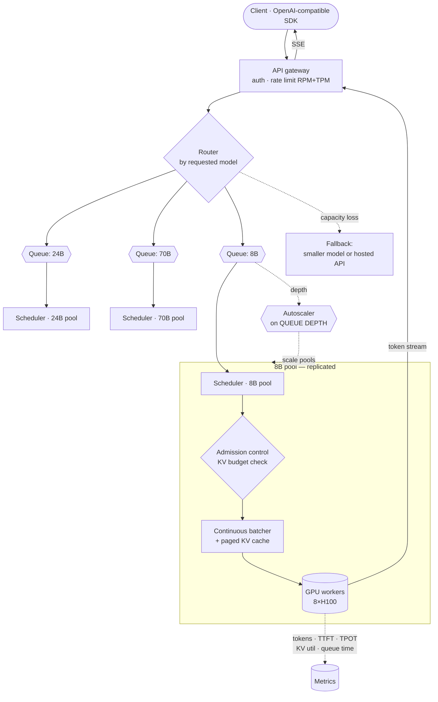

# 04 — LLM Inference Platform

> **Prompt:** Design an LLM inference platform — model routing, GPU management, batching, streaming, autoscaling, latency, rate limiting, fallback models, observability.

---

## The three-sentence compression

*Rehearse this before opening any other file. It is the opening answer.*

1. **The choice that matters most:** **continuous batching with paged KV-cache management, autoscaled on queue depth** — because **KV cache, not model weights, is what caps concurrency**, and a scheduler that admits requests without accounting for their KV footprint will either OOM or leave the GPU idle.
2. **The alternative I rejected:** static batching with a fixed batch size and CPU-based autoscaling. It's far simpler, and it gives up roughly 5× throughput — because a static batch runs at the pace of its longest sequence while finished slots sit idle, and CPU utilization is nearly uncorrelated with GPU saturation.
3. **The failure mode I'd volunteer:** **I'd first challenge the premise on cost.** At the assumed utilization, self-hosting an 8B model costs roughly **10× more** than a small hosted API. Self-hosting is justified by data residency, latency floors, or privacy — **not by cost** — unless utilization exceeds ~80% with reserved pricing, or the comparison is against a frontier-tier API. I'd want the real driver named before building this.

---

## Architecture at a glance



**Admission control is drawn as a distinct gate before batching, deliberately** — a request is admitted
only if its projected KV footprint fits, which is the constraint the whole design turns on.

---

## Key numbers

| Dimension | Value |
|---|---|
| **Models** | 8B · 24B · 70B class, served concurrently |
| **TTFT** | p95 < 400 ms (8B) · < 900 ms (70B) |
| **TPOT** | < 25 ms → **≥ 40 tokens/s** perceived |
| **Throughput** | ≥ 2,500 output tok/s per 8×H100 node (8B, batched) |
| **GPU utilization** | ≥ 60% — below this, self-hosting loses to APIs |
| Queue wait | p95 < 200 ms |
| Max context | 32k tokens |
| Availability | 99.9% |
| **Cost target** | ≤ $0.30 per 1M output tokens (8B) — ⚠️ **not achieved; see below** |

---

## The findings that matter

**1. KV cache — not weights — caps concurrency.** The arithmetic that determines the entire design:

```
70B, int4 weights = 35 GB  →  ~45 GB usable KV cache on one H100-80GB
KV per token ≈ 327 KB  →  a single 32k-context request needs ~10.5 GB

⇒ ~4 concurrent full-context requests.  With realistic 4k contexts: ~34.
```

A design that discusses GPU memory only in terms of model weights has missed the actual bottleneck.
This is why paged KV management and KV-aware admission control are load-bearing rather than
optimizations. Full derivation in [§1.5](01_requirements.md#15-the-memory-arithmetic-that-sizes-everything).

**2. Self-hosting is ~10× more expensive than a small hosted API here.** At 60% utilization on
on-demand pricing, an 8B model costs ≈ **$5.90 per 1M output tokens** versus ≈ $0.60 for a small hosted
API. **The cost case fails.** Self-hosting wins only when:

| Condition | Effect |
|---|---|
| Utilization > 80% **and** reserved/spot pricing | Cuts GPU cost 60–70% → ≈ $1.50–2.00/1M |
| Comparison is against a **frontier**-tier API ($15/1M out) | $5.90 vs $15 → a genuine 2.5× win |
| **Non-cost driver dominates** | Residency, privacy, latency floor, no per-token billing |

**Do not justify this platform on cost unless the arithmetic supports it.** Name the real driver.

**3. Autoscale on queue depth, never CPU.** GPU inference leaves CPU largely idle while the GPU
saturates, so CPU-based autoscaling scales at the wrong time in both directions. Queue depth is the
signal that actually tracks unmet demand.

---

## Files

| File | Contents |
|---|---|
| **[01_requirements.md](01_requirements.md)** | Why self-host at all · functional requirements · NFRs · non-goals · **the memory arithmetic** · cost arithmetic · assumptions |
| **[02_hld.md](02_hld.md)** | Architecture · continuous vs static batching · paged KV · admission control · autoscaling signal · failure modes · scale plan |
| **[03_lld.md](03_lld.md)** | Schemas · OpenAI-compatible contracts · batching/admission/eviction algorithms · sequence diagrams · request & model-rollout state machines · edge cases |
| **[04_production_and_interview.md](04_production_and_interview.md)** | AI-specific concerns · runbook · common mistakes · interview follow-ups · glossary |

**Shared front-matter:** [`../00_requirements_all_systems.md#4-llm-inference-platform`](../00_requirements_all_systems.md#4-llm-inference-platform)

---

## Relationship to the other designs

| Relates to | How |
|---|---|
| [09 — Multi-provider gateway](../00_requirements_all_systems.md#9-multi-provider-llm-platform) | **The buy-side inverse.** 09 abstracts third-party APIs; this hosts weights. Read both — the build-vs-buy decision needs both sets of numbers |
| [01 — RAG](../01_production_rag_system/README.md) | A consumer; its cost model assumes hosted APIs, and [§1.6](01_requirements.md#16-capacity--cost-estimation) explains why self-hosting wouldn't have helped it |
| [08 — Voice](../00_requirements_all_systems.md#8-real-time-ai-voice-assistant) | The most latency-sensitive consumer — a 250 ms TTFT requirement that only a small model on warm capacity can meet |
