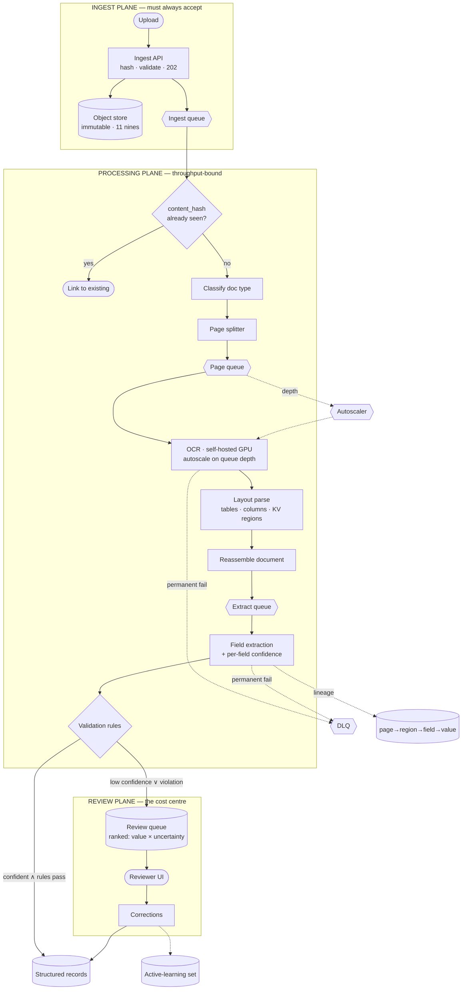

# 02 · High-Level Design — Document Intelligence System

> **Phase 2 of 4** · [← Requirements](01_requirements.md) · [LLD →](03_lld.md)

---

## 2.1 Architecture

Three planes, separated by what fails when each one does:

| Plane | Contains | Must be | Failure consequence |
|---|---|---|---|
| **Ingest plane** | Upload API, object store, queue | **Highly available (99.9%)** | Document lost — possibly unrecoverable |
| **Processing plane** | Classify, OCR, layout, extract, validate | Throughput-optimized | Documents queue — recoverable |
| **Review plane** | Queue, ranking, reviewer UI, corrections | Efficient | Backlog grows — expensive but visible |

**The `DEDUP` gate is placed before any expensive work, deliberately** — source systems re-send
documents, and re-OCRing 8 pages to discover you've seen them is the cheapest avoidable cost in the
pipeline.

---

## 2.2 Component choices

### OCR — the build-vs-buy that goes the other way

| Concern | Choice | Why | Rejected alternative (and why not) | Revisit when |
|---|---|---|---|---|
| **OCR** | **Self-hosted on GPU** | **~107× cheaper** at 4M pages/day: $56 vs $6,000 per day ([§1.6](01_requirements.md#ocr--where-self-hosting-wins-100)) | **Cloud OCR API** — vastly simpler and ~$180k/month. Right choice below ~100k pages/day, wrong at 4M | Volume drops below ~100k pages/day, or accuracy on hard documents demands a specialist vendor |
| Model | Modern open-weight OCR / document-VLM | Handles layout + text jointly; avoids a separate detector stage | **Classical OCR (Tesseract-class)** — free but materially worse CER on scans, which propagates into every downstream field | CER exceeds the 2% NFR |
| Batching | Page-level, autoscaled on **queue depth** | Pages are independent — the natural parallel unit | **Document-level** — an 800-page contract monopolizes a worker for an hour | — |

**Why self-hosting wins here but loses in [04](../04_llm_inference_platform/README.md).** Same question,
opposite answer, and the reasons generalize into a test:

| Factor | This system (OCR) | [04](../04_llm_inference_platform/01_requirements.md#16-capacity--cost-estimation) (LLM serving) |
|---|---|---|
| Utilization | Near-saturated — 4M pages/day, steady | ~60%, interactive and bursty |
| Model size | Hundreds of MB | 35–140 GB; KV cache binds concurrency |
| API price vs compute | $1.50/1k pages for ~25 ms GPU work | $0.60/1M tokens — already close to cost |
| **Verdict** | **Self-host** ✅ | **Buy** ❌ |

**The test: self-hosting wins when utilization is high, the model is small, and per-unit API pricing is
expensive relative to the underlying compute.** OCR hits all three; interactive LLM serving hits none.

### Extraction

| Concern | Choice | Why | Rejected alternative | Revisit when |
|---|---|---|---|---|
| **Extraction method** | **LLM over parsed text + layout hints**, typed output schema | Handles format variation without per-vendor templates; schema forces typed, validatable output | **Per-template rules/regex** — near-perfect on known layouts, brittle on anything new, and unbounded maintenance across vendors. **Pure vision model on raw pages** — skips OCR but far more expensive per page and harder to attribute | Document classes are few and stable, making templates viable |
| **Cost placement** | Extraction runs **once per document** on parsed text | ~$0.00069/doc; running per *page* would be 8× for no gain | Per-page extraction — costs 8× and loses cross-page context (a total on page 8 belongs to line items on page 3) | — |
| **Confidence** | **Per-field**, calibrated | Reviewer corrects one field, not a page. Sets the auto-approval rate, which dominates cost | **Document-level score** — routes 40 correct fields to review to fix one ([§1.6](01_requirements.md#the-total-and-the-finding)) | Never |
| Calibration | Temperature scaling / isotonic fit on a labelled holdout | Raw model probabilities are poorly calibrated; the fix is cheap and post-hoc | **Raw probabilities** — overconfident, so wrong fields auto-approve silently | — |

**Why the schema is load-bearing rather than cosmetic.** Asking for `{"total": 1234.50, "currency":
"USD", "due_date": "2026-03-11"}` gives typed values that validation rules can check arithmetically and
that downstream systems can consume. Free-text extraction produces "the total appears to be about
$1,234.50" — unvalidatable, unusable, and impossible to score for accuracy.

### Confidence & routing — where the money is

| Concern | Choice | Why | Rejected alternative | Revisit when |
|---|---|---|---|---|
| **Routing rule** | Auto-approve iff **all P0 fields ≥ threshold AND all rules pass** | Any uncertain P0 field or violated rule needs a human | **Average confidence** — averages away the one dangerous field | Never |
| **Queue ranking** | **Expected cost of error** = `document_value × (1 − confidence)` | Bounded reviewer capacity should meet the highest-value uncertainty first | **FIFO** — a $2 invoice reviewed before a $2M contract | — |
| Thresholds | **Per document class and per field**, tuned on labelled data | An invoice total and a memo footer have different error costs | **One global threshold** — simultaneously too strict and too loose | Continuously — retune as calibration drifts |
| **Validation rules** | Deterministic, declarative per class; **flag, never correct** | Rules encode domain arithmetic (line items sum to total) that models get wrong | **Silent correction** — destroys the evidence that something was wrong ([FR-6](01_requirements.md#extraction--confidence)) | Never |

**Queue ranking by expected cost of error is the highest-ROI design decision after calibration itself.**
Reviewer capacity is fixed at ~156 FTE ([§1.6](01_requirements.md#worker-sizing)); when the queue
exceeds capacity — which it will at peak — ranking determines whether the backlog consists of $2
invoices or $2M contracts. FIFO makes that outcome random.

### Storage & lifecycle

| Concern | Choice | Why | Rejected alternative | Revisit when |
|---|---|---|---|---|
| Source documents | Object store, **immutable**, versioned | Often the legal record; must never be mutated | Filesystem — no durability guarantee at 11 nines | — |
| Lifecycle | Hot 30 d → cold 7 yr | 2 PB at 7 years; hot-tier pricing would be ~6× cold | Keep everything hot — ~$48k/month vs ~$8k | — |
| Extractions | Postgres, partitioned by month | Structured, queryable, retention by partition drop | Object store — loses queryability that operations needs | — |

---

## 2.3 Data flow

### The auto-approved path (~70%)

1. **Upload accepted.** Compute `content_hash`; write the source to the object store immutably; enqueue.
   **Return `202` immediately** — accept must be fast and must not depend on processing health.
2. **Dedupe.** Hash already seen → link to the existing extraction and stop. Cheapest possible win.
3. **Classify** the document type (one small-model call) → selects the extraction schema, validation
   rules, and thresholds for everything downstream.
4. **Split into pages**, enqueue each. Pages are the parallel unit.
5. **OCR each page** on the GPU pool, autoscaled on queue depth.
6. **Layout parse** — tables, columns, headers, key-value regions — preserving bounding boxes for
   lineage.
7. **Reassemble** the document, ordered, with structure retained.
8. **Extract** once per document: LLM over parsed text plus layout hints, emitting the typed schema with
   **per-field confidence**.
9. **Validate** deterministically: sums, date plausibility, ID formats, cross-field consistency.
10. **Route.** All P0 fields above threshold and all rules passing → auto-approve; write the structured
    record and lineage.

### The review path (~30%)

Steps 1–9 identical, then:

10. **Enqueue for review**, ranked by `document_value × (1 − min_confidence)`, with the specific
    low-confidence fields and violated rules attached.
11. **Reviewer UI** opens on the flagged field with the source region highlighted — not on page 1 of the
    document. This is the difference between a 10-second correction and a 60-second one, and at 150k
    documents/day it's worth ~$470k/year.
12. **Correction saved** → structured record written; correction captured for active learning.

**Step 11 is engineering effort that looks like UI polish and is actually cost reduction.** The
arithmetic in [§1.6](01_requirements.md#the-total-and-the-finding) makes 30 s/document the dominant cost
term; halving it saves more than eliminating all compute.

---

## 2.4 NFR mapping

| NFR | Target | Delivered by |
|---|---|---|
| 500k docs/day · 25 docs/s peak | — | Page-level parallelism · queue-depth autoscaling · queues absorbing 4× peak |
| E2E p95 < 5 min | 5 min | Budget [§1.5](01_requirements.md#15-latency-budget) · parallel page OCR · single-pass extraction |
| p99 < 30 min | 30 min | Deliberately loose for the 500-page tail |
| **Ingestion accept 99.9%** | 99.9% | Small stateless API · object store · **accept does not depend on processing** |
| Durability 11 nines | — | Object store; immutable, versioned |
| CER < 2% | — | Modern OCR model; benchmarked in CI |
| Table F1 ≥ 0.85 | — | Layout-aware parsing, not raw OCR text |
| Field accuracy ≥ 0.95 (P0) | — | Typed schema · validation rules · class-specific prompts |
| **Calibration ECE < 0.05** | — | Post-hoc calibration on a labelled holdout · monitored continuously |
| **Auto-approval ≥ 70%** | 70% | Calibrated per-field confidence · per-class thresholds · rules that flag rather than block |
| Idempotency | — | `content_hash` dedupe · unique constraint on `(source, external_id)` |
| No silent drops | — | DLQ with replay · queue depth alerting |
| Lineage | — | Bounding boxes retained page → region → field |
| Cost ≤ $0.05/doc | ~$0.0008 | Self-hosted OCR · single-pass extraction · storage lifecycle |
| Retention 7 yr | — | Cold-tier lifecycle · partition-based extraction retention |

---

## 2.5 Failure modes & blast radius

| # | Failure | Detection | Blast radius | Mitigation & degraded mode |
|---|---|---|---|---|
| **F1** | **Miscalibrated confidence — overconfident** | ECE monitoring; sampled audit of auto-approved | **Wrong fields flow downstream unchecked** | Continuous calibration monitoring · **sampled audit of auto-approved documents** · tighten thresholds on drift. *The failure I'd volunteer* |
| **F2** | Miscalibrated — underconfident | Auto-approval rate drops | Review cost balloons | Same monitoring; retune. Visible in cost, unlike F1 |
| **F3** | Ingest API down | Health check, upload error rate | **Documents rejected — possibly lost** | Multi-AZ · minimal dependencies · **accept-and-queue even if downstream is unhealthy** |
| **F4** | OCR GPU pool saturated | Page queue depth | Latency grows; **no data loss** | Autoscale on queue depth · **queue absorbs it** — this is why async matters |
| **F5** | OCR quality degrades on a document class | CER by class; downstream field accuracy | That class | Per-class CER monitoring · route the class to a fallback OCR · alert |
| **F6** | Extraction LLM outage | Error rate | Extraction stalls | Queue absorbs · retry with backoff · fallback provider via [09](../00_requirements_all_systems.md#9-multi-provider-llm-platform) |
| **F7** | **Duplicate processing (at-least-once delivery)** | Duplicate detection | **Duplicate downstream records — moves money** | `content_hash` dedupe · idempotency on `(source, external_id)` · **downstream writes are idempotent** |
| **F8** | DLQ fills silently | **DLQ depth alert** | Documents never processed | Alert on depth > 0 · **document status visible to the uploader** ("processing failed") rather than silent |
| **F9** | **Review queue backlog exceeds capacity** | Queue depth; oldest-item age | Latency for flagged documents | **Ranking means the right things are still reviewed** · alert on age · surface staffing need |
| **F10** | Validation rule wrong (false violations) | Violation rate by rule | Unnecessary review volume | Per-rule violation-rate monitoring · rules are versioned and revertible |
| **F11** | 500-page document blocks a worker | Per-document duration | One worker | Page-level parallelism · per-page timeouts |
| **F12** | Object-store write succeeds, queue enqueue fails | Reconciliation job | Document stored, never processed | **Reconcile object store against document rows**; enqueue orphans |

**On F1, because it fails silently in the expensive direction.** An overconfident model auto-approves
wrong fields, and every dashboard looks *better*: auto-approval rate up, review cost down, throughput
up. The errors surface weeks later in a downstream reconciliation, or not at all. Two controls are
required and neither is optional: **continuous ECE monitoring**, and a **sampled human audit of
auto-approved documents** — you cannot detect false approvals by only looking at what you sent to
review.

**On F12, because it's the classic dual-write bug.** Writing to the object store and enqueuing are two
operations that can partially fail. A document stored but never enqueued is invisible — no DLQ entry, no
error, no queue depth. The only detection is a reconciliation job comparing the object store against
document rows, which is why it exists.

---

## 2.6 Scale plan

### 10× (5M docs/day, 40M pages/day)

| # | Bottleneck | Why | Change |
|---|---|---|---|
| 1 | **Human review capacity** | 1.5M docs/day to review ⇒ ~1,560 FTE. **People don't scale like services** | Push auto-approval hard (each point ≈ $2,700/day at this scale) · tiered review (junior for simple fields) · sampled rather than exhaustive review on low-value classes |
| 2 | OCR GPU pool | 40M pages/day ⇒ ~280 GPU-hr/day, ~20–60 GPUs with peak | Horizontal pool; well-understood scaling |
| 3 | Storage | 8 TB/day ⇒ 240 TB/month; 20 PB at 7 years | Aggressive lifecycle · consider per-class retention (do all classes need 7 years?) |
| 4 | Extraction LLM | 5M calls/day ≈ 58 QPS | Fine-tune a smaller model for the top classes; batch API for non-urgent |
| 5 | Postgres extractions | 5M rows/day | Partition by month + class; archive cold partitions |

**Bottleneck 1 is not an engineering problem, and that's the point.** At 10×, review is ~$187k/day. The
only levers are raising auto-approval, making review faster, or reviewing less exhaustively — and the
third requires a policy decision about acceptable error rates that engineering cannot make alone
([Q2](01_requirements.md#open-questions)).

### 100× (50M docs/day)

| Concern | Change |
|---|---|
| Review | **Exhaustive review becomes economically impossible.** Statistical sampling with per-class error budgets; humans only on high-value or anomalous documents |
| Extraction | Own fine-tuned models per major class; hosted APIs only for the long tail |
| OCR | Dedicated inference fleet; consider model distillation for throughput |
| Pipeline | Stream processing (Kafka-class) rather than queue-per-stage; backpressure end to end |
| Storage | Tiered with per-class retention policies; deletion becomes a first-class workflow |
| Org | Ingest, processing, and review become separately-owned services |

### What does *not* change

- **Accept must always succeed**, independent of processing health.
- **Per-field confidence**, not document-level.
- **Calibration is monitored continuously**, with a sampled audit of auto-approvals.
- **Validation flags, never corrects.**
- **Queue ranked by expected cost of error.**
- **Dedupe before expensive work.**
- **Page-level parallelism.**

---

## 2.7 Tech stack

> Shared substrate and the reasoning behind it: [`../00_tech_stack.md`](../00_tech_stack.md). This section
> carries only what is **specific to this system**.

| Layer | Choice | Rejected | Why | Revisit when |
|---|---|---|---|---|
| **OCR** | **PaddleOCR (or Tesseract) self-hosted on Triton**, int8, dynamic batching | Hosted OCR API (Textract / Document AI) | **~107× cheaper at this volume** — fixed-shape model, batchable, near-constant utilization. The opposite verdict to [04](../04_llm_inference_platform/README.md), for [a reason worth knowing](../00_tech_stack.md#when-self-hosting-flips--the-transferable-pattern) | Volume drops below ~60% sustained GPU utilization |
| **Pipeline orchestration** | **Temporal** — one workflow per document | Celery chains | A document can sit in human review for days, and each stage retries independently. Celery has no durable answer to either | Below ~1k docs/day with no human step |
| **Queue** | **Kafka** for ingestion; Temporal for per-document state | Kafka for everything | Kafka is the durable intake and replay log; per-document *state* is a workflow, not a message | — |
| Layout / structure | **unstructured.io** + PaddleOCR layout models | Rules on raw OCR output | Table structure is where naive OCR pipelines lose the most accuracy | — |
| Extraction | Small-tier LLM with **per-field confidence**, JSON-schema constrained | One frontier call per document | Per-field confidence is what makes the review queue rankable — and the queue is 45× the compute cost | — |
| Validation | **Pydantic** schemas + business rules in code | LLM self-validation | Type and range checks are deterministic; spending tokens on them is a category error | — |
| **Human review** | Purpose-built UI, queue ranked by **expected cost of error** | FIFO review queue | Human review is **$18,750/day = 45× compute**. Ranking the queue is the highest-leverage optimization in the system | Never |
| Storage | **S3** with lifecycle policies + Postgres for extractions | Blobs in Postgres | Lifecycle policy *is* the retention design | — |
| Idempotency | Content hash as the document key | Filename or upload ID | The same invoice arrives twice from two channels routinely | — |
| Observability | OpenTelemetry + per-stage accuracy and review-rate dashboards | Throughput only | **Review rate is the cost driver**, so it's the primary metric, not a secondary one | — |

**Self-hosted OCR is the standout choice, and it's the mirror image of [04](../04_llm_inference_platform/README.md).**
Both questions look identical — "self-host or use an API?" — and the answers differ because OCR is a small
fixed-shape model that keeps a GPU genuinely busy, while LLM serving is KV-cache-bound and leaves it idle.
**Utilization × shape variance decides it, not the word "model".**

**Temporal is chosen for the human-in-the-loop step specifically.** A pipeline whose slowest stage is a
person cannot be modelled as a task chain: it needs durable waits measured in days, per-stage retries, and
a queryable state per document. **That's the whole reason the review queue can be ranked at all** — the
state is addressable rather than in flight somewhere.

---

**Next:** [03_lld.md →](03_lld.md) — schemas with full lineage, APIs, calibration and ranking algorithms, sequence diagrams, the job state machine, and edge cases.
