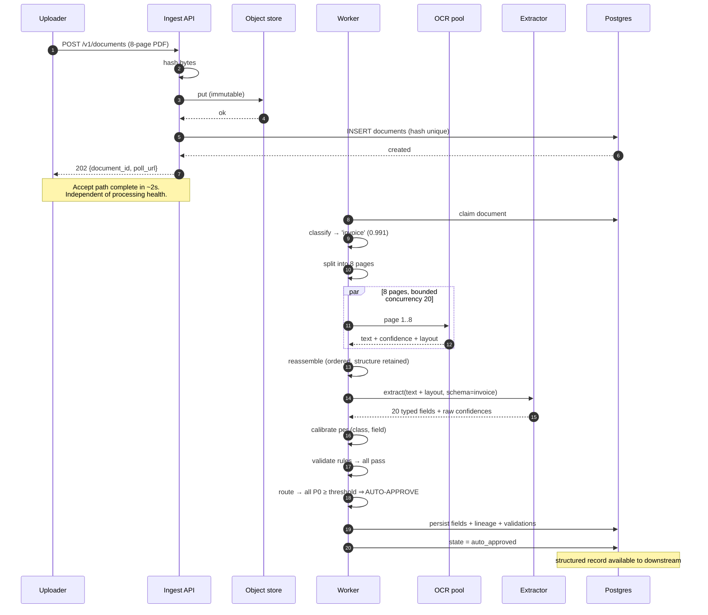
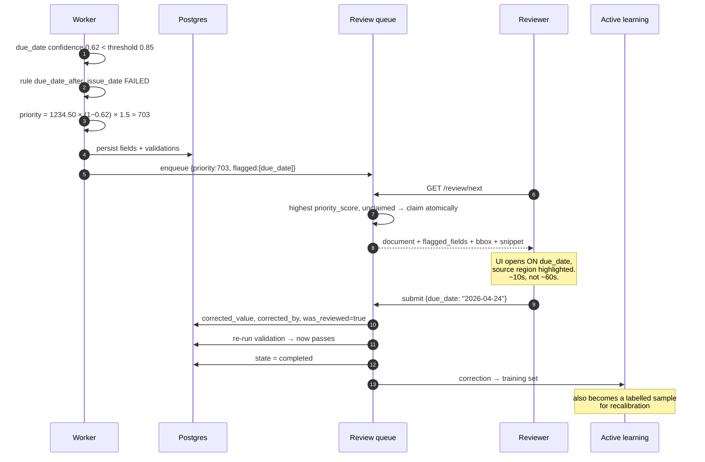
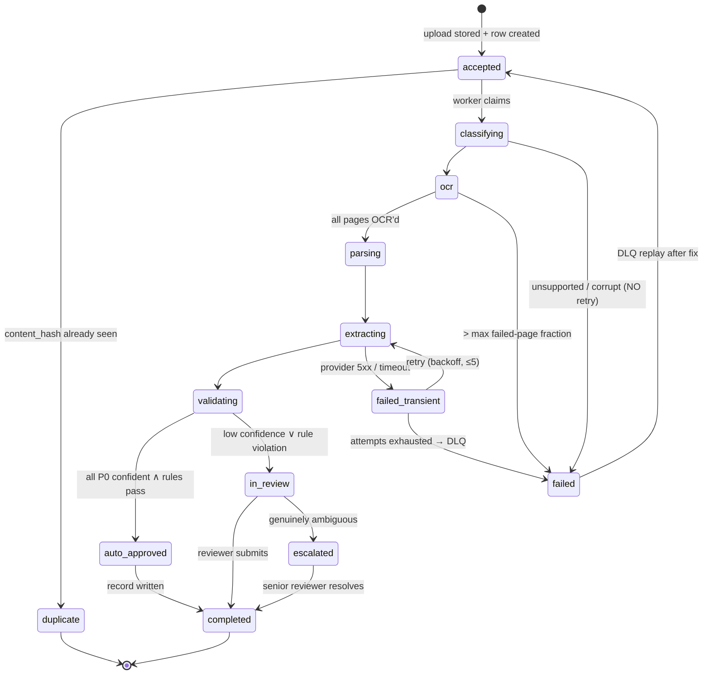
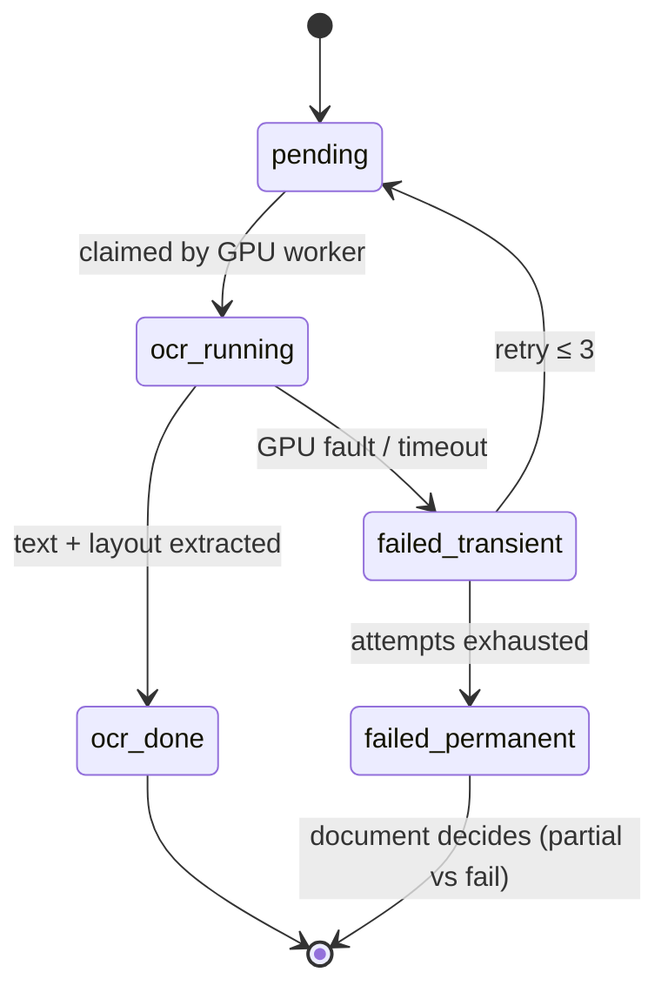

# 03 · Low-Level Design — Document Intelligence System

> **Phase 3 of 4** · [← HLD](02_hld.md) · [Production & interview →](04_production_and_interview.md)

---

## 3.1 Data models

### Documents

```sql
CREATE TABLE documents (
    document_id     UUID PRIMARY KEY,
    tenant_id       UUID NOT NULL,

    -- Idempotency: the two guards against duplicate processing (F7)
    content_hash    BYTEA NOT NULL,              -- SHA-256 of the raw bytes
    source_system   TEXT  NOT NULL,
    external_id     TEXT,                        -- id in the source system, if any

    doc_class       TEXT,                        -- NULL until classified
    class_confidence REAL,
    page_count      INT,
    mime_type       TEXT NOT NULL,
    bytes           BIGINT NOT NULL,
    object_uri      TEXT NOT NULL,               -- immutable source location

    state           TEXT NOT NULL DEFAULT 'accepted',
    attempts        INT  NOT NULL DEFAULT 0,
    error           TEXT,

    -- Routing outcome
    auto_approved   BOOLEAN,
    review_required BOOLEAN,
    doc_value_usd   NUMERIC(14,2),               -- drives queue ranking

    accepted_at     TIMESTAMPTZ NOT NULL DEFAULT now(),
    completed_at    TIMESTAMPTZ,

    CONSTRAINT docs_state_chk CHECK (state IN
        ('accepted','classifying','ocr','parsing','extracting','validating',
         'auto_approved','in_review','completed','failed','duplicate')),
    CONSTRAINT docs_hash_uniq UNIQUE (tenant_id, content_hash)
);

CREATE UNIQUE INDEX idx_docs_external ON documents (source_system, external_id)
    WHERE external_id IS NOT NULL;
CREATE INDEX idx_docs_pipeline ON documents (state, accepted_at)
    WHERE state NOT IN ('completed','failed','duplicate');
CREATE INDEX idx_docs_reconcile ON documents (accepted_at) WHERE state = 'accepted';
```

| Index / constraint | Serves |
|---|---|
| `docs_hash_uniq` | **The dedupe gate** — an insert conflict *is* the duplicate detection, atomically |
| `idx_docs_external` | Second idempotency path when the source has stable IDs but re-sends modified bytes |
| `idx_docs_pipeline` | Partial index over in-flight documents only — not 7 years of history |
| `idx_docs_reconcile` | Finds documents stuck in `accepted` — the [F12](02_hld.md#25-failure-modes--blast-radius) dual-write orphan check |

**Two idempotency keys, not one, because they catch different things.** `content_hash` catches
byte-identical resends. `(source_system, external_id)` catches a source re-sending the *same logical
document* with different bytes (a re-scan, a re-export). Relying on hash alone would process a re-scanned
invoice as new.

### Pages and OCR output

```sql
CREATE TABLE pages (
    page_id      UUID PRIMARY KEY,
    document_id  UUID NOT NULL REFERENCES documents(document_id) ON DELETE CASCADE,
    page_number  INT  NOT NULL,

    ocr_text     TEXT,
    ocr_confidence REAL,                          -- mean per-character confidence
    ocr_engine   TEXT,                            -- which engine/version — needed for F5 triage
    ocr_ms       INT,

    layout       JSONB,                           -- blocks/tables/KV regions with bounding boxes
    state        TEXT NOT NULL DEFAULT 'pending',
    attempts     INT  NOT NULL DEFAULT 0,

    CONSTRAINT pages_uniq UNIQUE (document_id, page_number)
);

CREATE INDEX idx_pages_work ON pages (state) WHERE state IN ('pending','failed_transient');
```

**Storing `ocr_engine` per page is what makes [F5](02_hld.md#25-failure-modes--blast-radius) diagnosable.**
When field accuracy drops for one document class, the question is immediately "which OCR engine version
processed those pages?" — and without the column that's unanswerable.

### Extracted fields — where lineage and confidence live

```sql
CREATE TABLE extracted_fields (
    field_id       UUID PRIMARY KEY,
    document_id    UUID NOT NULL REFERENCES documents(document_id) ON DELETE CASCADE,

    field_name     TEXT NOT NULL,                -- 'invoice_total' | 'due_date' | ...
    field_priority SMALLINT NOT NULL,            -- 0 = P0 (gates auto-approval), 1 = P1
    value_type     TEXT NOT NULL,                -- 'number'|'date'|'string'|'currency'
    value_text     TEXT,                         -- raw extracted string
    value_typed    JSONB,                        -- parsed/normalized value

    -- Confidence: RAW and CALIBRATED stored separately (see note)
    confidence_raw   REAL NOT NULL,
    confidence_cal   REAL NOT NULL,
    calibrator_version TEXT NOT NULL,

    -- LINEAGE: value → region → page → source (FR-12)
    page_number    INT,
    bbox           JSONB,                         -- {x,y,w,h} in page coordinates
    source_snippet TEXT,                          -- the text the value came from

    -- Review outcome
    was_reviewed   BOOLEAN NOT NULL DEFAULT FALSE,
    corrected_value JSONB,
    corrected_by   UUID,
    corrected_at   TIMESTAMPTZ,

    CONSTRAINT fields_uniq UNIQUE (document_id, field_name)
);

CREATE INDEX idx_fields_doc ON extracted_fields (document_id);
-- Calibration monitoring: reviewed fields are the labelled set for measuring ECE
CREATE INDEX idx_fields_calibration ON extracted_fields (calibrator_version, confidence_cal)
    WHERE was_reviewed = TRUE;
```

> **Storing `confidence_raw` and `confidence_cal` separately is the design decision that makes
> calibration maintainable.** Raw model probabilities are poorly calibrated; the calibrator is a
> post-hoc fit that will be retrained. Keeping both means (a) you can re-fit a new calibrator against
> historical raw scores without re-running extraction, and (b) `calibrator_version` lets you attribute
> a calibration regression to a specific fit. Overwriting raw with calibrated destroys both abilities.

**`bbox` plus `source_snippet` is what makes the reviewer UI land on the right field** — the highest-ROI
detail in the system per [§2.3](02_hld.md#the-review-path-30), since it converts a 60-second correction
into a 10-second one across 150k documents/day.

### Validation and review

```sql
CREATE TABLE validation_results (
    document_id   UUID NOT NULL REFERENCES documents(document_id) ON DELETE CASCADE,
    rule_id       TEXT NOT NULL,
    rule_version  TEXT NOT NULL,                 -- rules are versioned and revertible (F10)
    passed        BOOLEAN NOT NULL,
    detail        TEXT,                          -- e.g. 'line items sum 1230.00 ≠ total 1234.50'
    fields_involved TEXT[] NOT NULL,
    PRIMARY KEY (document_id, rule_id)
);

CREATE TABLE review_queue (
    document_id    UUID PRIMARY KEY REFERENCES documents(document_id) ON DELETE CASCADE,
    tenant_id      UUID NOT NULL,
    doc_class      TEXT NOT NULL,

    -- Ranking: expected cost of error (§2.2)
    priority_score NUMERIC(16,4) NOT NULL,
    doc_value_usd  NUMERIC(14,2),
    min_confidence REAL NOT NULL,
    reason         TEXT NOT NULL,                -- 'low_confidence' | 'rule_violation' | 'both'
    flagged_fields TEXT[] NOT NULL,              -- open the UI directly on these

    claimed_by     UUID,
    claimed_at     TIMESTAMPTZ,
    enqueued_at    TIMESTAMPTZ NOT NULL DEFAULT now()
);

-- The reviewer's "next item" query: highest expected cost of error, unclaimed
CREATE INDEX idx_review_next ON review_queue (priority_score DESC, enqueued_at)
    WHERE claimed_by IS NULL;
```

**`idx_review_next` is a partial index on exactly the unclaimed set**, ordered by the ranking score. It
serves the single hottest query in the review plane — 156 reviewers polling for work — and without the
partial predicate it would sort the entire backlog on every request.

---

## 3.2 API contracts

### `POST /v1/documents` — accept fast, always

```http
POST /v1/documents HTTP/1.1
Authorization: Bearer <jwt>
Content-Type: multipart/form-data

file: <binary>
metadata: {"source_system":"ap_portal","external_id":"INV-2026-8891",
           "doc_value_usd": 1234.50, "hint_class": "invoice"}
```

```
202 Accepted
{
  "document_id": "d-9f2",
  "state": "accepted",
  "duplicate_of": null,
  "poll_url": "/v1/documents/d-9f2"
}
```

**On a duplicate:**

```
200 OK
{ "document_id": "d-771", "state": "completed", "duplicate_of": "d-771",
  "message": "Identical content already processed" }
```

> **`202` and a `poll_url`, never a synchronous result.** Accept must succeed even when every downstream
> stage is unhealthy — the queue exists precisely so that processing outages don't become ingestion
> outages ([F3](02_hld.md#25-failure-modes--blast-radius)). A synchronous contract would couple
> ingestion availability to the availability of OCR, extraction, and an LLM provider.

**Returning `200` with `duplicate_of` rather than an error** is deliberate: the caller resent something
we already have, which is a *successful* outcome from their perspective, not a client error.

**Error responses:**

| Status | Meaning | Behaviour |
|---|---|---|
| `400` | Unsupported MIME type; zero bytes; exceeds max size | `{"error":"unsupported_type","supported":[...]}` |
| `401` / `403` | Auth | — |
| `413` | File exceeds the per-document limit | State the limit |
| `429` | Tenant ingest rate limit | `Retry-After` |
| `503` | **Object store unavailable** | The **only** reason to reject an upload — we cannot durably accept it |

**`503` on object-store failure is the one acceptable rejection**, and it's worth stating why: accepting
a document we cannot durably store is worse than rejecting it, because the uploader believes it's safe.
Every *other* dependency failing still permits acceptance.

### Status and lineage

```http
GET /v1/documents/{id}
```

```json
{
  "document_id": "d-9f2",
  "state": "in_review",
  "doc_class": "invoice",
  "class_confidence": 0.991,
  "page_count": 8,
  "fields": [
    { "name": "invoice_total", "priority": 0, "value": 1234.50,
      "confidence": 0.97, "page": 8,
      "bbox": {"x":412,"y":901,"w":88,"h":22},
      "source_snippet": "Total Due  $1,234.50" },
    { "name": "due_date", "priority": 0, "value": "2026-04-10",
      "confidence": 0.62, "page": 1, "flagged": true,
      "bbox": {"x":88,"y":204,"w":140,"h":20},
      "source_snippet": "Payment due 10 Apr 26" }
  ],
  "validation": [
    { "rule_id": "line_items_sum_to_total", "passed": true },
    { "rule_id": "due_date_after_issue_date", "passed": false,
      "detail": "due_date 2026-04-10 precedes issue_date 2026-04-14" }
  ],
  "review": { "reason": "both", "flagged_fields": ["due_date"],
              "priority_score": 469.3, "queue_position": 12 }
}
```

**Every field carries its lineage inline** — page, bounding box, and the source text it came from. That
payload is what the reviewer UI uses to open directly on the uncertain field with the region
highlighted, and what compliance uses to answer "where did this number come from?"

### Review plane

```http
GET  /internal/v1/review/next?reviewer_id=...     # highest priority_score, atomically claimed
POST /internal/v1/review/{document_id}:submit     # {corrections:[{field,value}], notes?}
POST /internal/v1/review/{document_id}:release    # unclaim (reviewer went offline)
POST /internal/v1/review/{document_id}:escalate   # {reason} — genuinely ambiguous document
GET  /internal/v1/dlq?limit=100                   # failed documents
POST /internal/v1/dlq/{document_id}:replay        # after a fix
```

**`:release` exists because reviewers close laptops.** Without it, a claimed document is invisible to
every other reviewer until a timeout expires — and at 150k documents/day even a small leak of
permanently-claimed items becomes a real backlog.

---

## 3.3 Core algorithms

### Confidence calibration

```python
def calibrate(raw_confidence: float, doc_class: str, field_name: str) -> float:
    """Raw model probabilities are poorly calibrated — typically OVERCONFIDENT,
    which fails silently in the expensive direction (F1).

    Fitted per (doc_class, field_name) on a labelled holdout of reviewed fields,
    because an invoice_total and a memo footer have different error profiles."""
    calibrator = CALIBRATORS.get((doc_class, field_name)) or CALIBRATORS[("_default", "_default")]
    return float(calibrator.transform(raw_confidence))


def expected_calibration_error(samples: list[tuple[float, bool]], bins: int = 10) -> float:
    """ECE: mean |confidence − accuracy| across confidence bins.
    Well-calibrated ⇒ of fields scored 0.9, ~90% are actually correct.
    Monitored continuously; NFR is < 0.05 (§1.3)."""
    total, ece = len(samples), 0.0
    for i in range(bins):
        lo, hi = i / bins, (i + 1) / bins
        bucket = [(c, ok) for c, ok in samples if lo <= c < hi]
        if not bucket:
            continue
        mean_conf = sum(c for c, _ in bucket) / len(bucket)
        accuracy  = sum(1 for _, ok in bucket if ok) / len(bucket)
        ece += (len(bucket) / total) * abs(mean_conf - accuracy)
    return ece
```

**The labelled set for calibration is the reviewed fields** — that's what `idx_fields_calibration`
indexes. But note the sampling bias this creates: reviewed fields are, by construction, the
*low-confidence* ones. Measuring ECE only on them tells you nothing about whether high-confidence
auto-approvals are correct, which is exactly why a **sampled audit of auto-approved documents** is
required ([§4.1](04_production_and_interview.md#41-ai-specific-concerns)) and not optional.

### The routing decision

```python
def route(doc: Document, fields: list[Field],
          validations: list[ValidationResult]) -> RoutingDecision:
    """Auto-approve iff EVERY P0 field clears its threshold AND every rule passes.
    Deliberately NOT an average — averaging hides the one dangerous field (§2.2)."""
    thresholds = THRESHOLDS[doc.doc_class]

    p0 = [f for f in fields if f.field_priority == 0]
    low = [f for f in p0 if f.confidence_cal < thresholds[f.field_name]]
    violated = [v for v in validations if not v.passed]

    if not low and not violated:
        return RoutingDecision(auto_approve=True)

    # Ranking = EXPECTED COST OF ERROR. Bounded reviewer capacity should meet
    # the highest-value uncertainty first; FIFO makes that outcome random.
    min_conf = min((f.confidence_cal for f in p0), default=1.0)
    value = float(doc.doc_value_usd or DEFAULT_DOC_VALUE[doc.doc_class])
    priority = value * (1.0 - min_conf)

    # A violated rule means something is definitely wrong, not merely uncertain.
    if violated:
        priority *= RULE_VIOLATION_MULTIPLIER      # e.g. 1.5

    return RoutingDecision(
        auto_approve=False,
        priority_score=priority,
        reason=("both" if low and violated else
                "low_confidence" if low else "rule_violation"),
        flagged_fields=[f.field_name for f in low] +
                       [f for v in violated for f in v.fields_involved],
    )
```

**Three decisions worth defending:**

1. **All-must-pass, not average.** One 0.3-confidence total among nineteen 0.99 fields averages to 0.96
   and would auto-approve — sending a wrong invoice total downstream.
2. **Rule violations are weighted above mere uncertainty.** Low confidence means "might be wrong"; a
   failed sum check means "something *is* wrong."
3. **`flagged_fields` includes fields from violated rules**, not just low-confidence ones — because the
   reviewer needs to see the fields that *caused* the arithmetic failure, which may all be
   high-confidence individually.

### Page-level fan-out with reassembly

```python
async def process_document(doc_id: UUID) -> None:
    """Page-level parallelism so an 800-page contract doesn't monopolize a worker
    for an hour (FR-10), while an 8-page invoice still completes in seconds."""
    doc = await load(doc_id)

    # Dedupe BEFORE any expensive work — the cheapest available saving
    existing = await find_by_hash(doc.tenant_id, doc.content_hash)
    if existing and existing.document_id != doc_id:
        await mark_duplicate(doc_id, of=existing.document_id)
        return

    doc.doc_class, doc.class_confidence = await classify(doc)
    pages = await split_pages(doc)

    # Bounded concurrency: parallel enough to be fast, bounded so one huge
    # document can't consume the entire OCR pool
    sem = asyncio.Semaphore(MAX_PAGES_IN_FLIGHT)      # e.g. 20

    async def do_page(p: Page):
        async with sem:
            p.ocr_text, p.ocr_confidence = await ocr(p)     # GPU pool
            p.layout = await parse_layout(p)
            await save(p)

    results = await asyncio.gather(*(do_page(p) for p in pages),
                                   return_exceptions=True)

    failed = [p for p, r in zip(pages, results) if isinstance(r, Exception)]
    if failed:
        # Partial OCR: extract from what we have IF the failures are non-critical
        # pages; otherwise fail the document rather than extract from a hole.
        if len(failed) / len(pages) > MAX_FAILED_PAGE_FRACTION:      # e.g. 0.1
            await fail_document(doc_id, f"{len(failed)}/{len(pages)} pages failed OCR")
            return
        await log_partial(doc_id, failed)

    assembled = await reassemble(pages)                  # ordered, structure retained
    fields = await extract(assembled, doc.doc_class)     # ONE call per document
    validations = await validate(fields, doc.doc_class)
    decision = route(doc, fields, validations)
    await persist(doc, fields, validations, decision)
```

**The `MAX_FAILED_PAGE_FRACTION` check is the interesting judgement.** Extracting from a document with a
10% OCR hole may be fine (a blank page failed) or catastrophic (the page with the total failed). The
fraction is a crude proxy; the honest position is that it's tuned per class, and for high-value classes
it should be zero — see [E7](#36-edge-cases--correctness).

---

## 3.4 Sequence diagrams

### Auto-approved path



### Low confidence → review → correction



**Note step 9's payload.** Sending `flagged_fields` + `bbox` + `source_snippet` is what makes the
correction take ten seconds instead of sixty — and at 150k reviews/day that difference is worth roughly
$470k/year ([§1.6](01_requirements.md#the-total-and-the-finding)).

---

## 3.5 State machines

### Document lifecycle



**Two distinctions that matter:**

- **`failed` (no retry) vs `failed_transient` (retry).** A corrupt PDF is corrupt on attempt five;
  retrying deterministic failures burns capacity and buries the real error in noise.
- **`escalated` is separate from `in_review`.** Some documents are genuinely ambiguous — a reviewer who
  can't determine the value needs an escape hatch that isn't "guess." Without it, ambiguous documents get
  arbitrary values, which is worse than a slow resolution.

### Page lifecycle



---

## 3.6 Edge cases & correctness

| # | Edge case | Handling | Why |
|---|---|---|---|
| E1 | **Same document uploaded twice** | `content_hash` unique constraint → `200` with `duplicate_of` | Insert conflict *is* atomic dedupe; also prevents duplicate downstream records ([F7](02_hld.md#25-failure-modes--blast-radius)) |
| E2 | Same logical document, re-scanned (different bytes) | `(source_system, external_id)` unique index | Hash alone would process it as new |
| E3 | **Object store write succeeds, DB insert fails** | Reconciliation over `idx_docs_reconcile` | The dual-write orphan — invisible without reconciliation ([F12](02_hld.md#25-failure-modes--blast-radius)) |
| E4 | Corrupt / password-protected PDF | `failed`, **no retry**; visible to uploader | Deterministic failure; retrying wastes capacity |
| E5 | **800-page document** | Page-level fan-out, bounded concurrency 20 | Lands in the p99 < 30 min budget; can't monopolize the pool |
| E6 | Blank page | OCR returns empty; not an error | Blank pages are legitimate |
| E7 | **Some pages fail OCR** | Fail the document above `MAX_FAILED_PAGE_FRACTION`; otherwise proceed and log | Extracting from a hole risks missing the field that matters — **threshold should be 0 for high-value classes** |
| E8 | Table spans a page boundary | Layout parser stitches by column geometry; flag if ambiguous | A split table detaches rows from headers |
| E9 | **Line items don't sum to the total** | **Flag, never correct** | Silent correction destroys the evidence something was wrong ([FR-6](01_requirements.md#extraction--confidence)) |
| E10 | Field genuinely absent from the document | Emit `null` with **high** confidence | "Confidently absent" is different from "uncertain" — conflating them sends correct documents to review |
| E11 | **Overconfident calibration** | ECE monitoring + **sampled audit of auto-approved** | Reviewed fields are a biased sample; you cannot detect false approvals from them ([F1](02_hld.md#25-failure-modes--blast-radius)) |
| E12 | Reviewer claims a document then disappears | Claim TTL + `:release` | Otherwise items become permanently invisible |
| E13 | Two reviewers open the same document | Atomic claim (`UPDATE … WHERE claimed_by IS NULL RETURNING`) | Duplicated effort on a capacity-bound resource |
| E14 | **Review queue exceeds capacity** | Ranking means the *right* items are reviewed; alert on oldest-item age | Backlog is acceptable; backlog of high-value items is not ([F9](02_hld.md#25-failure-modes--blast-radius)) |
| E15 | Validation rule itself is wrong | Per-rule violation-rate monitoring; rules versioned and revertible | A bad rule floods review with false violations ([F10](02_hld.md#25-failure-modes--blast-radius)) |
| E16 | New document class appears | Classifier low-confidence → route to review; alert | Open-set problem ([Q1](01_requirements.md#open-questions)); never guess a schema |
| E17 | Extraction returns malformed JSON | Schema-validate; treat as `failed_transient` and retry once | An unvalidated result poisons downstream records |
| E18 | **7-year-old document must be deleted (erasure request)** | Tombstone → purge source, pages, fields, lineage | Retention is a *maximum*, not an obligation; deletion must reach every table |

**E10 is the one most implementations get wrong.** A model asked for `discount_amount` on an invoice with
no discount should return `null` with *high* confidence — the absence is a confident finding. Systems that
emit low confidence for absent fields route large volumes of perfectly-extracted documents to human
review, directly attacking the auto-approval rate that dominates cost.

---

**Next:** [04_production_and_interview.md →](04_production_and_interview.md)
