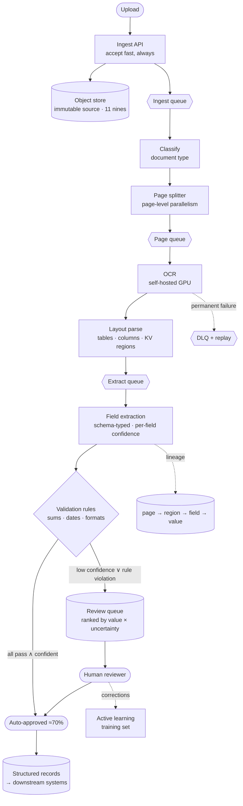

# 05 — Large-Scale Document Intelligence System

> **Prompt:** Design a large-scale document intelligence system — PDF/image ingestion, OCR, document parsing, extraction, validation, asynchronous processing, retries, storage.

> **Overlaps** [`21_ai-system-design-deep-dives/02_document_intelligence_agent.md`](../../21_ai-system-design-deep-dives/02_document_intelligence_agent.md), which covers loan/bond term extraction in a fintech domain and goes deeper on domain-specific validation. **This one is the generic, high-throughput pipeline** — any document type, OCR-first, batch scale. Read both.

---

## The three-sentence compression

*Rehearse this before opening any other file. It is the opening answer.*

1. **The choice that matters most:** **calibrated per-field confidence driving a value-weighted human review queue** — because at 500k documents/day, **human review costs ~45× more than all compute combined**, so every percentage point of auto-approval rate is worth ~$270/day. Confidence calibration is not a quality nicety here; it is the primary cost lever in the system.
2. **The alternative I rejected:** a single document-level confidence score with a fixed threshold. It's much simpler, and it routes whole documents to humans when one field is uncertain — reviewing 40 correct fields to fix one. Per-field confidence lets a reviewer correct one value in seconds instead of re-keying a page.
3. **The failure mode I'd volunteer:** **miscalibrated confidence, which fails silently in the expensive direction.** If the model is overconfident, wrong fields auto-approve and flow into downstream systems with nobody checking; if underconfident, review volume balloons and the ROI evaporates. Both look like a working pipeline on every dashboard, so calibration needs its own continuously-monitored metric.

---

## Architecture at a glance



**Note what is *not* here: a synchronous request path.** This is a throughput-bound async pipeline, and
that single property changes nearly every decision relative to [01](../01_production_rag_system/README.md)
and [02](../02_customer_support_agent/README.md).

---

## Key numbers

| Dimension | Value |
|---|---|
| **Volume** | 500k documents/day · ~8 pages each ⇒ **4M pages/day** |
| Throughput | ~6 docs/s average · 25 docs/s peak |
| **E2E latency** | p95 < 5 min · p99 < 30 min (async, not interactive) |
| **Ingestion availability** | 99.9% *accept* — rejecting an upload is the unacceptable failure |
| Durability | 11 nines on source documents |
| Field accuracy | ≥ 0.95 (P0 fields) · ≥ 0.85 (P1) |
| **Auto-approval rate** | **≥ 70%** — the business case |
| Compute cost | ≈ **$0.0008/doc** (vs a $0.05 ceiling) ✅ |
| **Human review cost** | ≈ **$18,750/day — 45× compute** ⚠️ |
| Retention | 7 years (source + extractions) |

---

## The findings that matter

**1. Compute is not the constraint — humans are.** The ceiling was set at $0.05/document and compute
lands at ~$0.0008. But at 70% auto-approval, 150k documents/day reach human review:

```
150,000 docs × 30 s ÷ 3600 × $15/hr ≈ $18,750/day   ← 45× the entire compute bill
```

**Every 1% improvement in auto-approval rate is worth ~$270/day (~$98k/year).** This reframes
confidence calibration from a quality metric into the highest-leverage engineering target in the
system — and it means effort spent shaving OCR cost is effort spent in the wrong place.

**2. Self-hosting OCR is ~100× cheaper than a cloud OCR API here** — the opposite conclusion to
[04](../04_llm_inference_platform/README.md)'s finding about self-hosting LLMs:

| Option | Daily cost at 4M pages |
|---|---:|
| Cloud OCR API (~$1.50/1,000 pages) | ≈ $6,000 |
| Self-hosted OCR on GPU (~40 pages/s/GPU) | ≈ **$56** |

The difference is that OCR is a small, fixed-size model at extremely high, steady utilization — exactly
the conditions [04](../04_llm_inference_platform/01_requirements.md#16-capacity--cost-estimation)
identifies as making self-hosting win.

**3. "Available" means something different here.** Ingestion must accept uploads at 99.9%; *processing*
can be down for an hour and the queue absorbs it. Conflating the two would lead to over-engineering the
expensive half and under-engineering the cheap half.

---

## Files

| File | Contents |
|---|---|
| **[01_requirements.md](01_requirements.md)** | Problem & users · functional requirements · NFRs · non-goals · latency budget · **the human-cost arithmetic** · assumptions |
| **[02_hld.md](02_hld.md)** | Architecture · OCR build-vs-buy · extraction strategy · confidence & review routing · failure modes · scale plan |
| **[03_lld.md](03_lld.md)** | Schemas with lineage · APIs · confidence calibration & queue-ranking algorithms · sequence diagrams · job state machine · edge cases |
| **[04_production_and_interview.md](04_production_and_interview.md)** | AI-specific concerns · runbook · common mistakes · interview follow-ups · glossary |

**Shared front-matter:** [`../00_requirements_all_systems.md#5-large-scale-document-intelligence-system`](../00_requirements_all_systems.md#5-large-scale-document-intelligence-system)

---

## Relationship to the other designs

| Relates to | How |
|---|---|
| [04 — Inference platform](../04_llm_inference_platform/README.md) | **The contrasting build-vs-buy verdict.** Self-hosting loses for LLMs, wins ~100× for OCR — same question, opposite answer, and the reason why is instructive |
| [01 — RAG](../01_production_rag_system/README.md) | A downstream consumer: extracted text feeds the corpus. Also the contrast case — latency-bound vs throughput-bound |
| [07 — Eval platform](../00_requirements_all_systems.md#7-llm-evaluation-platform) | Field-accuracy and calibration evals belong there |
