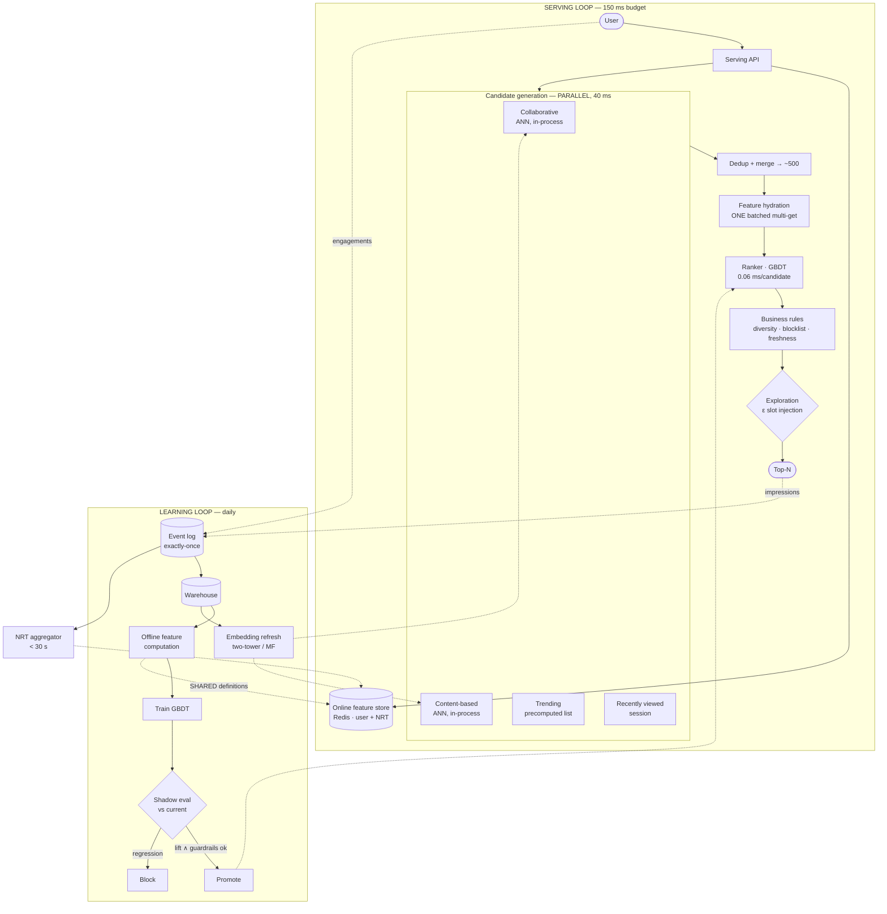

# 02 · High-Level Design — Recommendation System

> **Phase 2 of 4** · [← Requirements](01_requirements.md) · [LLD →](03_lld.md)

---

## 2.1 Architecture

Two loops with radically different time constants — conflating them is the classic recommender mistake:

| Loop | Path | Time constant | Failure consequence |
|---|---|---|---|
| **Serving loop** | Request → candidates → rank → response | **150 ms** | Blank/slow feed — immediately visible |
| **Learning loop** | Impressions → warehouse → retrain → promote | **~24 h** | Model quality drifts — invisible for weeks |

**The `FE ⟶ UF` dashed edge labelled "SHARED definitions" is the most important line in the diagram.**
It represents the feature-store contract that prevents train/serve skew — the failure mode that silently
ruins recommender projects ([F2](#25-failure-modes--blast-radius)).

---

## 2.2 Component choices

### Candidate generation

| Concern | Choice | Why | Rejected alternative (and why not) | Revisit when |
|---|---|---|---|---|
| **Shape** | **Two-stage: cheap recall → expensive rank** | Not a preference — **single-stage is arithmetically impossible** ([§1.6](01_requirements.md#single-stage-is-not-merely-worse--its-impossible)) | **Single-stage over 5M items** — 6M compute-hours/day | Never |
| **Sources** | **Four, run in parallel** | Each covers the others' blind spots; parallel costs the max, not the sum | **One "best" source** — collaborative alone fails on new items, content alone misses co-engagement patterns | A source contributes < 5% unique recall ⇒ drop it |
| ANN index | In-process HNSW over 5M × 256-dim | 5 GB **fits in node memory** ⇒ **zero network hops**, which is what makes the 40 ms budget work | **Separate vector service** — adds a network hop the budget can't absorb | > ~50M items (250 GB) — then it must become a sharded service |
| Embeddings | Two-tower / matrix factorization, refreshed daily | Captures co-engagement; batch-computable | **Real-time embedding updates** — large complexity for marginal gain at daily taste drift | — |

**Why the in-process ANN index matters more than it looks.** At 5M items the embedding table is 5 GB,
which fits on every serving node. That eliminates a network hop from the hottest path in a 150 ms budget
with 3 ms of slack. **This is the single assumption most likely to break at 10×** — and when it does,
candidate generation becomes a sharded service and the latency budget must be re-derived.

### The ranking tier

| Concern | Choice | Why | Rejected alternative | Revisit when |
|---|---|---|---|---|
| **Model class** | **GBDT** (~500 trees, depth 6) | **Forced by 0.06 ms/candidate** ([§1.6](01_requirements.md#the-arithmetic-that-forces-the-architecture)). Strong on tabular features, cheap, SIMD-friendly, interpretable | **Transformer/DNN** — better quality potentially, ~1 ms/candidate ⇒ 16× over the entire budget. **Logistic regression** — cheaper but materially worse on feature interactions | GBDT plateaus below +10% CTR **and** the latency budget is re-derived (e.g. fewer candidates) |
| Inference | Batched, CPU, in-process | 500 candidates in one call; no GPU, no network hop | GPU serving — adds a hop and cost for a model that doesn't need it | Model class changes |
| Objective | Predicted engagement on the **true** objective | Depends on [Q1](01_requirements.md#open-questions) — **the label choice is upstream of everything** | Optimizing CTR by default — **actively harmful** if the real goal is retention | [Q1](01_requirements.md#open-questions) resolves |
| Diversity | **Post-ranking** MMR-style pass | Simple, explainable, tunable without retraining | **In-objective diversity** — better in principle, much harder to train and tune | Post-ranking diversity costs too much of the 10 ms budget |

**Why GBDT rather than deep learning, defensibly.** Three reasons beyond latency: recommendation features
are overwhelmingly **tabular** (counts, rates, categoricals, recency) where GBDTs are genuinely
competitive with or better than DNNs; they need no GPU, so serving is a library call rather than a
service; and they're **interpretable** via feature importance, which matters when a seller asks why their
item stopped being shown. The honest caveat: GBDTs can't learn from raw sequences the way a session
transformer can, so if sequential intent turns out to dominate, this decision gets revisited — with a
re-derived latency budget.

### Feature store — the train/serve contract

| Concern | Choice | Why | Rejected alternative | Revisit when |
|---|---|---|---|---|
| **Skew prevention** | **Single feature definition, two materializations** | The definition is declared once and compiled to both the offline (warehouse) and online (Redis) paths | **Separate implementations** — SQL for training, application code for serving. **Guarantees** drift, and it's silent ([F2](#25-failure-modes--blast-radius)) | Never |
| Online store | Redis, ~40 GB | Sub-ms reads; 20 ms budget for user features | **Postgres** — too slow for the budget at this QPS | — |
| **Point-in-time correctness** | Training features computed **as of the impression timestamp** | Using *today's* feature values to predict a *past* click leaks the future and inflates offline metrics | **Latest-value joins** — the classic label-leakage bug; model looks great offline, fails online | Never |
| NRT features | Stream aggregation, < 30 s | Session intent — three camera views should influence the next request | Batch-only — misses in-session signal entirely | — |

**Point-in-time correctness is subtle and worth spelling out.** If you train on "user's lifetime click
count" joined at *training time*, that count includes clicks that happened *after* the impression you're
predicting. The model learns from the future, offline AUC looks excellent, and online performance is
mediocre — with no error anywhere. This is the second-most-common silent recommender bug after train/serve
skew, and it's the same class of problem: the offline and online worlds disagree.

### Exploration — the feedback-loop defence

| Concern | Choice | Why | Rejected alternative | Revisit when |
|---|---|---|---|---|
| **Strategy** | **ε% of slots to unranked candidates** | Simple, tunable, auditable. Keeps the training distribution from collapsing onto the ranker's own preferences | **No exploration** — the ranker narrows its own world; popular items entrench while offline metrics *improve* ([F1](#25-failure-modes--blast-radius)) | Never remove; the *value* of ε is tunable |
| Advanced | Thompson sampling / UCB per item | Better exploration efficiency | ε-greedy first — establish the baseline and the measurement discipline | Coverage plateaus despite exploration |
| Position | Fixed low-prominence slots | Bounds the engagement cost | Random position — higher cost, better data | [Q3](01_requirements.md#open-questions) sets the budget |

**Exploration is a deliberate, measurable cost paid for long-term catalogue health**, which makes it a
product decision ([Q3](01_requirements.md#open-questions)) rather than a purely technical one. The
argument for it: without exploration the system can only learn about items it already shows, so the
long tail becomes permanently invisible and the catalogue's value decays — invisibly, because every
offline metric improves.

---

## 2.3 Data flow

### The serving path

1. **Request arrives** with `user_id` and context (surface, device, time).
2. **Fetch user features** — one pipelined Redis round trip: profile embedding, aggregates, NRT
   last-N interactions.
3. **Candidate generation, four sources concurrently:**
   - *Collaborative:* ANN over the in-process item-embedding index using the user embedding.
   - *Content-based:* ANN using preferred attributes.
   - *Trending:* precomputed per-segment list.
   - *Recently viewed:* session store.
4. **Dedup and merge** to ~500, keeping each candidate's source (a feature the ranker uses).
5. **Feature hydration** — **one batched multi-get** for 500 items' features. 500 individual lookups
   would consume the entire budget.
6. **Rank** — one batched GBDT call over 500 × ~200 features.
7. **Business rules** — dedup near-identical items, blocklists, freshness, then a diversity pass.
8. **Exploration** — inject ε% unranked candidates into designated slots.
9. **Return top-N**; log the impression set **with the ranker version and feature values used**.

**Step 9's payload is what makes the learning loop honest.** Logging the *served* feature values — rather
than recomputing them later — is what allows point-in-time-correct training and makes train/serve skew
detectable ([§4.1](04_production_and_interview.md#41-ml-specific-concerns)).

### The learning path

1. **Impressions + engagements** stream to the event log with exactly-once semantics.
2. **NRT aggregator** updates last-N features within 30 s.
3. **Warehouse ingestion** — impressions joined to engagements to form labels.
4. **Offline features** computed **as of each impression's timestamp** (point-in-time correct), using the
   *shared* definitions.
5. **Train** the GBDT on ~500M sampled rows.
6. **Shadow eval** against the current production model: offline AUC/NDCG plus guardrail metrics.
7. **Promote** only on lift with no guardrail regression; otherwise block and alert.
8. **Embedding refresh** runs on its own daily cadence, feeding candidate generation.

---

## 2.4 NFR mapping

| NFR | Target | Delivered by |
|---|---|---|
| p95 < 150 ms | 150 ms | Budget [§1.5](01_requirements.md#15-latency-budget) · **parallel** candidate generation · in-process ANN (no hop) · one batched hydration · GBDT at 0.06 ms/candidate |
| 5k QPS / 20k peak | — | Stateless serving nodes · in-process indices · Redis replicas |
| Availability 99.95% | — | Multi-AZ · **popularity fallback always available** · degrade by skipping stages |
| Recall@500 ≥ 0.80 | — | Four complementary sources · daily embedding refresh · measured per source |
| CTR +10% | — | GBDT over ~200 features · daily retrain · A/B gated |
| **Zero train/serve skew** | — | **Single feature definition, two materializations** · served feature values logged |
| Offline/online parity | — | Point-in-time correct training · shadow eval · A/B validation of offline predictions |
| Behaviour freshness < 30 s | — | Stream aggregation into the online store |
| **Catalogue coverage** | — | **ε exploration** · coverage monitoring |
| Cost ≤ $0.30/1k | ~$0.0012 | CPU inference · in-process indices · no LLM anywhere in the path |

---

## 2.5 Failure modes & blast radius

| # | Failure | Detection | Blast radius | Mitigation & degraded mode |
|---|---|---|---|---|
| **F1** | **Feedback loop — ranker narrows its own world** | **Catalogue coverage declining while offline AUC improves** | Whole catalogue over weeks | **ε exploration** (P0) · coverage as a first-class metric · alert on coverage decline. *The failure I'd volunteer* |
| **F2** | **Train/serve skew** | Compare logged served features vs offline-recomputed | All predictions — **silently** | Single feature definition · **log served feature values** · automated skew check in CI |
| **F3** | **Point-in-time leakage** | Offline AUC excellent, online lift absent | All predictions | Features computed as of impression time · a leakage test in the training pipeline |
| **F4** | Redis feature store down | Health, error rate | All personalization | **Degrade to popularity fallback** — never a blank feed |
| **F5** | Ranker model corrupt / fails to load | Readiness probe | All requests on that node | Node out of rotation · previous model version pinned · fallback to candidate-generation order |
| **F6** | Candidate generation source fails | Per-source recall contribution | Reduced recall | **Other three sources continue** — this is the resilience dividend of four sources |
| **F7** | **Latency budget breached (3 ms slack)** | p95, per-stage | All requests | Shed load by reducing candidates 500 → 300 (costs recall, keeps latency) · cache session-repeat responses |
| **F8** | **Bad model promoted** | Guardrail metrics in A/B | Traffic in the treatment arm | Shadow eval gate · A/B with automatic rollback on guardrail breach · **instant version repin** |
| **F9** | Event log loses impressions | Reconciliation counts | Training data quality | Exactly-once semantics · impression counts reconciled against the warehouse |
| **F10** | Popularity feedback (rich-get-richer) | Gini coefficient of impression distribution | Long tail | Exploration · diversity pass · optional exposure floors ([Q2](01_requirements.md#open-questions)) |
| **F11** | **CTR up, retention down** | **Guardrail metrics in every A/B** | User base — slowly | **Guardrails are mandatory in the A/B framework** ([FR-9](01_requirements.md#learning-loop)); this is why [Q1](01_requirements.md#open-questions) blocks |
| **F12** | Cold-start user gets a poor feed | First-session engagement by cohort | New users — **the worst place to be bad** | Content-based + trending fallback · onboarding signals |

**On F1, because it's the one that hides.** The mechanism: the ranker is trained on impressions, but
impressions only exist for items *it* chose to show. Items never shown generate no positive labels, so
they look worse, so they're shown less — a self-reinforcing narrowing. Meanwhile **offline AUC improves**,
because the model gets better at predicting clicks within the ever-narrower distribution it created. The
only detection is watching **catalogue coverage** alongside accuracy, which is why coverage is an NFR and
exploration is P0.

**On F2 and F3 together, because they share a signature.** Both produce "excellent offline, mediocre
online" with no error anywhere. Skew means the model sees different inputs at serving time than in
training; leakage means it was trained on information that didn't exist yet. Both are prevented by
architecture (shared definitions, point-in-time joins) rather than caught by tests — though logging served
feature values makes skew *detectable* after the fact.

---

## 2.6 Scale plan

### 10× (50k QPS, 50M items)

| # | Bottleneck | Why | Change |
|---|---|---|---|
| 1 | **In-process ANN index** | 50M × 256 × 4 B = **250 GB — no longer fits in node memory** | Candidate generation becomes a **sharded service**; adds a network hop that the 3 ms of slack cannot absorb ⇒ **the latency budget must be re-derived**, likely by reducing candidates |
| 2 | Ranking compute | 2.16 trillion scorings/day | Horizontal CPU scale-out; consider quantized trees; reduce candidates |
| 3 | Feature store | 100M users, 50M items | Redis cluster sharded by user; item features to a read-replica tier |
| 4 | Event log | 4.3B impressions/day, ~860 GB | Sample impressions for training (keep all engagements); tiered retention |
| 5 | Training | ~5B usable rows | Distributed training; more aggressive negative sampling |

**Bottleneck 1 is the architectural break, and it's worth naming precisely.** Everything about the 150 ms
budget depends on candidate generation being an in-memory library call. Once the index needs sharding,
that becomes an RPC — and with 3 ms of headroom there is nowhere to put it. The design response isn't
"add a service"; it's **re-derive the budget**, probably by cutting candidates to 300 and accepting the
recall cost, or by caching aggressively within a session.

### 100× (500k QPS, 500M items)

| Concern | Change |
|---|---|
| Candidate generation | Distributed ANN with scatter-gather; approximate-approximate retrieval |
| Ranking | Two-tier ranking: cheap model 500 → 100, expensive model on 100 |
| Features | Feature-store-as-a-service with strict SLOs; embeddings quantized to int8 |
| Training | Continuous/incremental rather than daily full retrain |
| Exploration | Contextual bandits rather than ε-greedy — exploration efficiency starts to matter economically |
| Org | Candidate generation, ranking, and the feature platform become separately-owned services |

**Two-tier *ranking* at 100× mirrors the two-stage retrieval move**, applied one level down — the same
"cheap filter, expensive scorer" pattern that
[01](../01_production_rag_system/02_hld.md#retrieval-tier) uses for retrieval and reranking.

### What does *not* change

- **Two-stage retrieve-then-rank.** Arithmetically mandatory at any scale.
- **Recall measured at the candidate-generation boundary**, not the final N.
- **One feature definition, two materializations.**
- **Point-in-time-correct training features.**
- **Exploration and coverage monitoring.**
- **Popularity fallback** — never a blank feed.
- **Guardrail metrics on every A/B.**

---

## 2.7 Tech stack

> Shared substrate and the reasoning behind it: [`../00_tech_stack.md`](../00_tech_stack.md). This section
> carries only what is **specific to this system**.

| Layer | Choice | Rejected | Why | Revisit when |
|---|---|---|---|---|
| **Ranker** | **LightGBM**, compiled with **Treelite** | A neural ranker, or an LLM | **0.06 ms/candidate across 216B scorings/day.** A neural ranker is ~20× slower and an LLM is ~1,000× — the budget forbids both | Latency budget triples, or features become genuinely sequential |
| **Candidate generation** | **FAISS (or ScaNN) in-process**, HNSW | A vector database service | A network hop is ~5 ms of a 150 ms *total* budget, for a lookup that takes 1 ms in-process | Index outgrows a single node's memory |
| **Feature store** | **Feast** — Redis online, Parquet/S3 offline | Hand-rolled feature tables | The value is **one definition serving both paths**, which is what prevents train/serve skew | — |
| **Streaming features** | **Flink** | Micro-batch (Spark Streaming) | Recency features are the strongest signal and micro-batching adds minutes of staleness | Recency stops mattering |
| Point-in-time correctness | **Feast point-in-time joins** on the offline path | `JOIN` on latest values | Training on features that didn't exist at label time is **the** classic silent leak | Never |
| Embeddings (items/users) | Trained offline, **served from Redis**, versioned together | Live embedding computation | Embeddings must be version-matched with the index or scores are meaningless | — |
| Model registry / experiments | **MLflow** | Spreadsheets, ad-hoc S3 paths | Rollback needs a versioned artifact plus its feature schema | — |
| Serving runtime | **Go or Rust** for the ranking service | Python | 3 ms of slack in the budget doesn't survive a GIL | — |
| Event collection | **Kafka** → Flink → Feast + offline store | Direct DB writes | Replay rebuilds features after a definition change | — |
| **Feedback-loop control** | Explicit **exploration budget** + catalogue-coverage metric | Pure exploitation | Without it the model narrows to what it already showed and coverage collapses | Never |
| Observability | Prometheus + **coverage, staleness, train/serve skew** dashboards | CTR alone | CTR rises while coverage collapses — that's the failure mode, and CTR hides it | — |

**LightGBM instead of anything neural is forced by arithmetic, and it's the most useful "no LLM here"
example in the set.** 216B scorings/day at 0.06 ms/candidate leaves no room for a bigger model; a
two-stage retrieve-then-rank design is the only shape that fits. **The right answer to "where's the LLM?"
is that there isn't one, and being able to say why is the point.**

**Feast is chosen for a correctness property, not convenience.** Train/serve skew is the defect that
degrades a recommender silently — offline metrics improve while production doesn't — and it comes from two
implementations of one feature drifting apart. **One definition compiled to both paths is the structural
fix; point-in-time joins are the other half.**

---

**Next:** [03_lld.md →](03_lld.md) — schemas, APIs, candidate generation / ranking / diversity / exploration algorithms, sequence diagrams, the model-promotion state machine, and edge cases.
