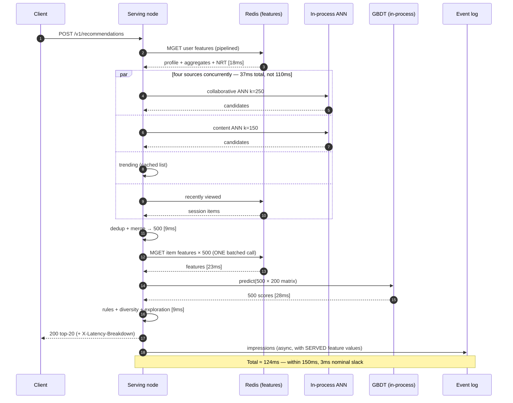
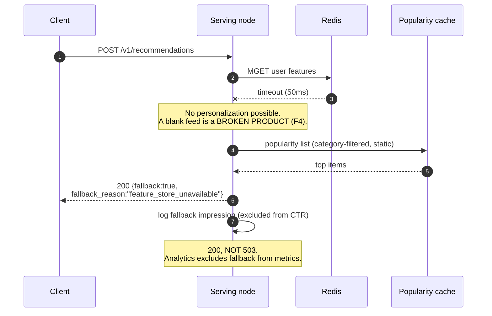
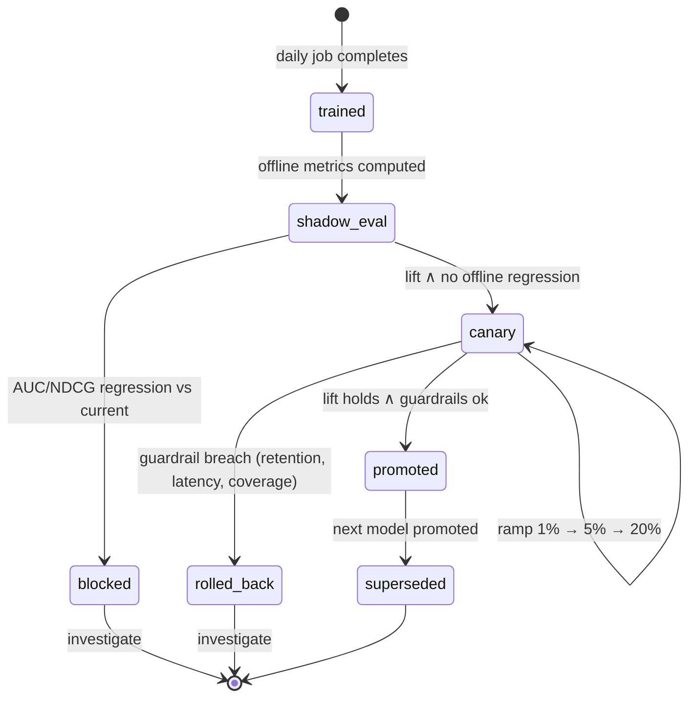
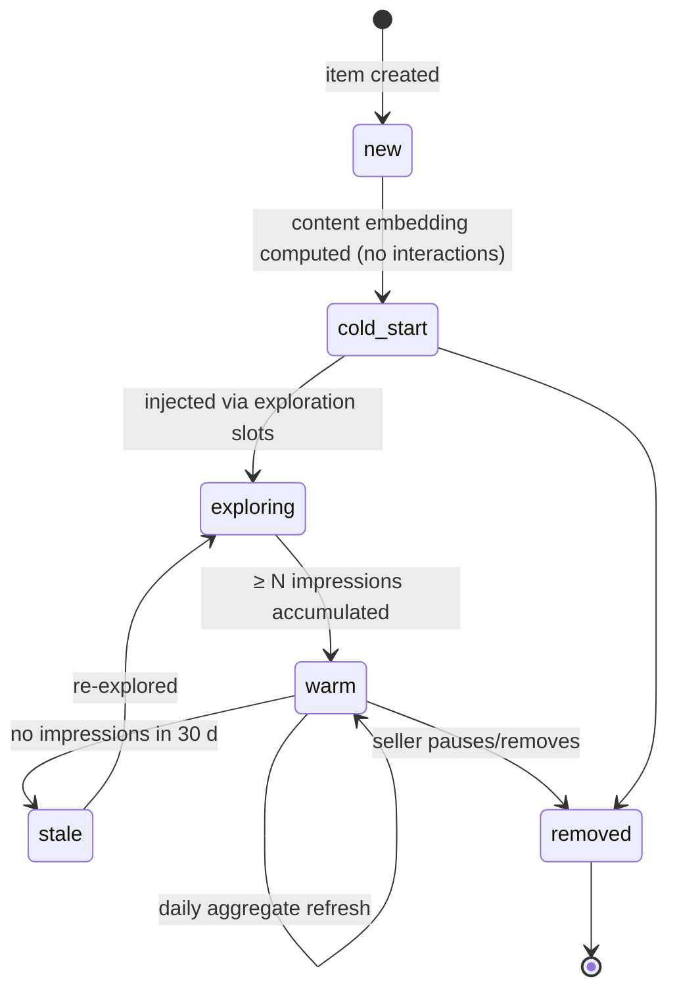

# 03 · Low-Level Design — Recommendation System

> **Phase 3 of 4** · [← HLD](02_hld.md) · [Production & interview →](04_production_and_interview.md)

---

## 3.1 Data models

### Items and embeddings

```sql
CREATE TABLE items (
    item_id        BIGINT PRIMARY KEY,
    seller_id      BIGINT NOT NULL,
    category_id    INT    NOT NULL,
    title          TEXT   NOT NULL,
    price_cents    BIGINT,

    state          TEXT   NOT NULL DEFAULT 'active',   -- 'active'|'paused'|'removed'
    created_at     TIMESTAMPTZ NOT NULL DEFAULT now(),

    -- Denormalized aggregates, refreshed by the daily batch.
    -- Denormalized deliberately: hydrating 500 candidates in 25 ms cannot afford joins.
    impressions_7d BIGINT NOT NULL DEFAULT 0,
    clicks_7d      BIGINT NOT NULL DEFAULT 0,
    ctr_7d         REAL   NOT NULL DEFAULT 0,
    engagement_7d  REAL   NOT NULL DEFAULT 0,

    embedding      vector(256),
    embed_version  SMALLINT NOT NULL,

    CONSTRAINT items_state_chk CHECK (state IN ('active','paused','removed'))
);

CREATE INDEX idx_items_ann ON items USING hnsw (embedding vector_cosine_ops)
    WHERE state = 'active' AND embed_version = 3;
CREATE INDEX idx_items_category ON items (category_id, engagement_7d DESC)
    WHERE state = 'active';
```

| Index | Serves |
|---|---|
| `idx_items_ann` — partial on `state` **and** `embed_version` | ANN candidate generation. **The `embed_version` predicate is the same correctness boundary as [01](../01_production_rag_system/03_lld.md#chunks--the-table-the-whole-system-turns-on)** — cosine similarity across embedding versions is meaningless, and mixing them fails silently |
| `idx_items_category` | Trending-per-category precomputation |

**Note this table is the *source of truth*, not the serving path.** At serving time the embedding index
and item features live **in-process** on each node (5 GB, [§1.6](01_requirements.md#serving-cost)) — the
150 ms budget with 3 ms of slack cannot absorb a database round trip. Postgres is where the daily batch
writes and where the in-process snapshots are built from.

### Feature definitions — the artifact that prevents skew

```sql
-- ONE definition, compiled to BOTH the offline (warehouse SQL) and online (Redis)
-- materializations. This table is the contract that prevents F2.
CREATE TABLE feature_definitions (
    feature_name   TEXT PRIMARY KEY,
    entity         TEXT NOT NULL,              -- 'user' | 'item' | 'user_item'
    value_type     TEXT NOT NULL,
    definition_sql TEXT NOT NULL,              -- the SINGLE source of truth
    window         TEXT,                       -- '7d' | '30d' | 'session'
    freshness      TEXT NOT NULL,              -- 'batch_daily' | 'nrt_30s'
    version        INT  NOT NULL,
    online_key_tpl TEXT NOT NULL,              -- e.g. 'u:{user_id}:ctr_7d'
    created_at     TIMESTAMPTZ NOT NULL DEFAULT now()
);
```

> **This table is the single most important structure in the design**, and it isn't a model or an index.
> Train/serve skew ([F2](02_hld.md#25-failure-modes--blast-radius)) happens when a feature is computed one
> way for training (SQL over the warehouse) and another way at serving (application code over Redis).
> Storing the definition **once** and generating both materializations from it makes divergence a build
> failure instead of a silent quality regression. Without this, the failure is invisible: excellent
> offline metrics, mediocre online performance, no error anywhere.

### Impressions — logged with the features actually used

```sql
CREATE TABLE impressions (
    impression_id  UUID   NOT NULL,
    request_id     UUID   NOT NULL,
    user_id        BIGINT NOT NULL,
    item_id        BIGINT NOT NULL,
    position       SMALLINT NOT NULL,          -- position bias is a real, large effect

    -- Provenance: needed for per-source recall attribution and debugging
    candidate_source TEXT NOT NULL,            -- 'collab'|'content'|'trending'|'recent'|'explore'
    is_exploration BOOLEAN NOT NULL DEFAULT FALSE,

    -- Model provenance
    ranker_version TEXT NOT NULL,
    embed_version  SMALLINT NOT NULL,
    predicted_score REAL NOT NULL,

    -- THE SERVED FEATURE VALUES. Logged, not recomputed later. (§2.3 step 9)
    features       JSONB NOT NULL,

    served_at      TIMESTAMPTZ NOT NULL,
    PRIMARY KEY (impression_id, served_at)
) PARTITION BY RANGE (served_at);

CREATE TABLE engagements (
    engagement_id  UUID   NOT NULL,
    impression_id  UUID   NOT NULL,
    user_id        BIGINT NOT NULL,
    item_id        BIGINT NOT NULL,
    kind           TEXT   NOT NULL,            -- 'click'|'add_to_cart'|'purchase'|'dwell'
    value          REAL,                        -- dwell seconds, order value, ...
    occurred_at    TIMESTAMPTZ NOT NULL,
    PRIMARY KEY (engagement_id, occurred_at)
) PARTITION BY RANGE (occurred_at);
```

**`features JSONB` — logging the values actually served — is what makes two things possible:**

1. **Point-in-time-correct training** without reconstructing history. The features as-of the impression
   are recorded, so no risky "latest value" join is needed
   ([F3](02_hld.md#25-failure-modes--blast-radius)).
2. **Skew detection.** Recompute the offline features for a sampled impression and diff against what was
   logged. A mismatch is skew, caught after the fact rather than never.

It costs storage — ~200 B/impression × 432M/day ≈ 86 GB/day — and it is worth it. **Sampling the JSONB
(say 5%) while keeping every row's scalar columns is the reasonable compromise at scale.**

**`position` is logged because position bias is large and real.** An item in slot 1 gets clicked far more
than the same item in slot 20, so training on raw clicks teaches the model that "items we ranked highly
get clicked" — circular. Position is either a training feature (then zeroed at inference) or handled by
inverse-propensity weighting.

---

## 3.2 API contracts

### `POST /v1/recommendations`

```http
POST /v1/recommendations HTTP/1.1
Authorization: Bearer <jwt>
Content-Type: application/json

{
  "user_id": 88213,
  "surface": "home_feed",
  "count": 20,
  "context": { "device": "ios", "session_id": "s-91f", "locale": "en-GB" },
  "exclude_item_ids": [4412, 9981]
}
```

```
200 OK
X-Ranker-Version: gbdt-2026-03-11
X-Request-Id: r-7c1
X-Latency-Breakdown: feat=18,cand=37,hydrate=23,rank=28,rules=9

{
  "request_id": "r-7c1",
  "items": [
    { "item_id": 5521, "score": 0.412, "position": 1, "source": "collab" },
    { "item_id": 8830, "score": 0.388, "position": 2, "source": "content" },
    { "item_id": 1204, "score": null,  "position": 7, "source": "explore",
      "is_exploration": true }
  ],
  "fallback": false
}
```

**`X-Latency-Breakdown` per stage is deliberate.** With 3 ms of headroom
([§1.5](01_requirements.md#15-latency-budget)), a p95 breach needs to be attributable to a stage
immediately — not diagnosed by bisection during an incident.

**The exploration item carries `score: null` and `is_exploration: true`** so downstream analytics never
mistake an exploration impression for a ranked one. Conflating them would corrupt both CTR measurement
and training labels.

**Degraded response — the shape that matters most:**

```
200 OK
X-Ranker-Version: fallback-popularity

{ "request_id": "r-7c2",
  "items": [ /* popularity-ordered, category-filtered */ ],
  "fallback": true,
  "fallback_reason": "feature_store_unavailable" }
```

> **This returns `200`, not `503`, and that is the important design decision.** A blank feed is
> indistinguishable from a broken site ([F4](02_hld.md#25-failure-modes--blast-radius)). A popularity feed
> is worse than a personalized one and vastly better than nothing. The `fallback` flag lets monitoring
> and analytics exclude these from CTR measurement without the user seeing an error.

**Error responses:**

| Status | Meaning | Behaviour |
|---|---|---|
| `400` | Malformed request; `count` beyond max | — |
| `401` | Auth | — |
| `429` | Per-caller rate limit | `Retry-After` |
| `200` + `fallback:true` | **Any internal degradation** | **Preferred over any 5xx** — see above |
| `503` | Total failure (even popularity unavailable) | Should be near-impossible; popularity is a static cached list |

### Supporting endpoints

```http
POST /v1/events                       # impressions + engagements (batched, at-least-once + dedupe)
GET  /internal/v1/features/{user_id}  # debug: what the serving path would read
POST /internal/v1/models/{v}:promote  # gated on shadow eval + guardrails
POST /internal/v1/models:rollback     # repin previous ranker_version
GET  /internal/v1/coverage            # catalogue coverage — the F1 guardrail
GET  /internal/v1/skew?sample=1000    # recompute offline features, diff vs logged (F2)
```

**`/internal/v1/skew` is an endpoint rather than only a batch job** so it can be run on demand during an
incident. "Excellent offline, mediocre online" is the signature of both skew and leakage, and this is the
fastest way to rule one of them in.

---

## 3.3 Core algorithms

### Candidate generation — parallel, four sources

```python
CANDIDATE_TARGET = 500

async def generate_candidates(user: UserFeatures, ctx: Context) -> list[Candidate]:
    """Four sources CONCURRENTLY. Serially this is ~110ms and blows the 40ms
    budget (§1.5). Each source covers the others' blind spots."""
    results = await asyncio.gather(
        collaborative(user, k=250),      # ANN over in-process item index
        content_based(user, k=150),      # ANN over attribute preferences
        trending(ctx, k=100),            # precomputed per-segment list
        recently_viewed(user, k=50),     # session store
        return_exceptions=True,          # one source failing must not fail the request (F6)
    )

    merged: dict[int, Candidate] = {}
    for source_name, res in zip(SOURCE_NAMES, results):
        if isinstance(res, Exception):
            metrics.incr("candgen.source_failed", source=source_name)
            continue                     # DEGRADE: the other sources still produce a feed
        for item_id, score in res:
            # Keep the FIRST source that produced it, in priority order.
            # Source is a ranker feature, so this attribution matters.
            if item_id not in merged:
                merged[item_id] = Candidate(item_id, source_name, score)

    return list(merged.values())[:CANDIDATE_TARGET]
```

**`return_exceptions=True` is the resilience dividend of four sources.** Losing collaborative filtering
costs recall; it doesn't cost the request. A single-source design has no such degradation path.

### Ranking

```python
def rank(user: UserFeatures, candidates: list[Candidate],
         item_features: dict[int, dict]) -> list[Scored]:
    """ONE batched GBDT call. 500 candidates × ~200 features in ~30ms
    ⇒ ~0.06 ms/candidate, which is what forces the model class (§1.6)."""

    # Build the feature matrix. Feature ORDER must match training exactly —
    # a silent reorder is a skew bug that produces plausible garbage.
    rows = []
    for c in candidates:
        item = item_features[c.item_id]
        rows.append(FEATURE_ORDER.build(
            user=user,
            item=item,
            cross=cross_features(user, item),      # e.g. category affinity
            candidate_source=c.source,             # source is informative
            position=0,                            # ZEROED at inference — see note
        ))

    scores = ranker.predict(np.asarray(rows, dtype=np.float32))   # batched, SIMD
    return sorted(
        (Scored(c.item_id, float(s), c.source) for c, s in zip(candidates, scores)),
        key=lambda x: x.score, reverse=True,
    )
```

> **`position=0` at inference is not a placeholder — it's the standard treatment of position bias.**
> Position is included as a *training* feature so the model can attribute some of an item's click rate to
> where it appeared rather than to the item itself. At inference, every candidate is scored as if it were
> in the top slot, so the ranking reflects item quality rather than the previous ranker's layout. Omitting
> position from training entirely means the model learns "items we ranked highly get clicked" — circular
> and self-reinforcing ([F1](02_hld.md#25-failure-modes--blast-radius)).

**`FEATURE_ORDER` as an explicit shared object** is the guard against the most trivial and most damaging
skew bug: a reordered feature vector. GBDTs accept any float array of the right width and will happily
produce confident nonsense.

### Diversity — a post-ranking pass

```python
def diversify(ranked: list[Scored], n: int, lambda_: float = 0.3) -> list[Scored]:
    """MMR-style greedy selection: relevance minus similarity to what's already chosen.
    Post-ranking rather than in-objective — simpler, tunable without retraining (§2.2)."""
    selected: list[Scored] = []
    pool = ranked[: n * 5]                          # bounded work for the 10ms budget

    while len(selected) < n and pool:
        best, best_val = None, float("-inf")
        for cand in pool:
            if selected:
                max_sim = max(similarity(cand.item_id, s.item_id) for s in selected)
            else:
                max_sim = 0.0
            val = (1 - lambda_) * cand.score - lambda_ * max_sim
            if val > best_val:
                best, best_val = cand, val
        selected.append(best)
        pool.remove(best)

    return selected
```

**`pool = ranked[:n*5]` bounds the quadratic cost.** Full MMR over 500 candidates is ~125k similarity
computations; restricting to the top 100 keeps it inside the 10 ms rules budget with negligible quality
loss, since diversity only matters among items good enough to show.

### Exploration

```python
def inject_exploration(ranked: list[Scored], all_candidates: list[Candidate],
                       n: int, epsilon: float = 0.05) -> list[Scored]:
    """Deliberately show items the ranker did NOT choose, so the training
    distribution doesn't collapse onto the ranker's own preferences (F1).

    A measurable engagement cost paid for long-term catalogue health (Q3)."""
    n_explore = max(1, int(n * epsilon))
    chosen_ids = {s.item_id for s in ranked[:n]}

    # Prefer items with LOW impression counts — that's where the model is most
    # uncertain and where coverage is most needed.
    unranked = [c for c in all_candidates if c.item_id not in chosen_ids]
    unranked.sort(key=lambda c: impression_count_7d(c.item_id))
    picks = unranked[:n_explore]

    out = ranked[: n - n_explore]
    for slot, pick in zip(EXPLORE_SLOTS, picks):    # fixed low-prominence slots
        out.insert(min(slot, len(out)),
                   Scored(pick.item_id, score=None, source="explore",
                          is_exploration=True))
    return out[:n]
```

**Fixed low-prominence slots rather than random positions** bounds the engagement cost while still
generating unbiased-ish labels for under-shown items. Random placement gives better data at higher cost —
which is precisely the trade [Q3](01_requirements.md#open-questions) exists to settle.

### Skew detection

```python
def detect_skew(sample_size: int = 1000) -> SkewReport:
    """Recompute offline features for sampled impressions and diff against the
    values that were actually SERVED. The only way to catch F2 after the fact."""
    impressions = sample_recent_impressions(sample_size)
    mismatches, checked = [], 0

    for imp in impressions:
        offline = compute_offline_features(       # SAME definitions, offline path
            user_id=imp.user_id, item_id=imp.item_id, as_of=imp.served_at
        )
        for name, served_val in imp.features.items():
            checked += 1
            off_val = offline.get(name)
            if off_val is None or not approx_equal(served_val, off_val):
                mismatches.append(SkewMismatch(name, served_val, off_val))

    return SkewReport(
        checked=checked,
        mismatch_rate=len(mismatches) / max(checked, 1),
        by_feature=Counter(m.feature for m in mismatches),
    )
```

**`as_of=imp.served_at` is what makes this a valid comparison.** Recomputing with *current* values would
show mismatches everywhere for legitimately-changed features, and the check would be useless. Passing the
impression timestamp is also exactly the discipline that prevents leakage
([F3](02_hld.md#25-failure-modes--blast-radius)) — the same mechanism serving both purposes.

---

## 3.4 Sequence diagrams

### The serving path



**Step 12 being a single batched `MGET` is not a micro-optimization.** 500 sequential lookups at even
0.2 ms each would be 100 ms — two-thirds of the entire budget.

### Degradation: feature store unavailable



**Logging the fallback impression but excluding it from CTR is the subtle part.** Including these would
depress measured CTR during an incident and pollute training labels with impressions the ranker never
chose.

---

## 3.5 State machines

### Model promotion



**Two gates, not one, because they catch different things.** Shadow eval catches offline regressions
cheaply before any user sees the model. The canary catches what offline evaluation *structurally cannot*:
guardrail effects like retention and coverage, and the offline/online parity failure itself
([A4](01_requirements.md#assumptions)). A model can pass shadow eval and still be rolled back — and that's
the system working, not failing.

### Item lifecycle (cold start)



**`stale → exploring` is the anti-entrenchment edge.** Without it, an item that stops being shown stays
unshown forever — since no impressions means no positive labels means lower predicted score means fewer
impressions. Periodic re-exploration is the mechanism that keeps
[F1](02_hld.md#25-failure-modes--blast-radius) from being permanent.

---

## 3.6 Edge cases & correctness

| # | Edge case | Handling | Why |
|---|---|---|---|
| E1 | **Brand-new user, no history** | Content-based + trending; onboarding signals if any | First session dominates retention — **the worst place to be bad** |
| E2 | **Brand-new item, no interactions** | Content embedding + exploration slots | Otherwise it can never accumulate the labels it needs to rank |
| E3 | Feature store unavailable | **`200` + popularity fallback**, `fallback:true` | A blank feed is a broken product ([F4](02_hld.md#25-failure-modes--blast-radius)) |
| E4 | One candidate source fails | Other three continue; log per-source failure | The resilience dividend of four sources |
| E5 | **All sources return < N candidates** | Backfill from trending; never return fewer than requested | A short feed reads as broken |
| E6 | **Feature vector order changes** | `FEATURE_ORDER` shared between train and serve; CI asserts equality | GBDTs accept any float array and produce confident nonsense |
| E7 | **Mixed `embed_version` in the ANN index** | Partial index predicate on `embed_version` | Cross-version cosine similarity is meaningless — same bug as [01](../01_production_rag_system/03_lld.md#chunks--the-table-the-whole-system-turns-on) |
| E8 | **Point-in-time leakage in training** | Features computed `as_of` impression time; leakage test in the pipeline | Excellent offline, mediocre online, **no error** ([F3](02_hld.md#25-failure-modes--blast-radius)) |
| E9 | **Position bias in labels** | Position as a training feature, zeroed at inference | Otherwise the model learns "what we ranked highly gets clicked" — circular |
| E10 | Duplicate impression events | Dedupe on `impression_id`; exactly-once into the warehouse | Duplicates inflate the CTR denominator and bias labels |
| E11 | Blocked / removed item still in the index | Filter `state='active'` **in** the ANN predicate | Post-filtering can empty the result set |
| E12 | User requests the same feed twice in a session | Session-scoped response cache | Saves budget; also avoids a jarringly different feed on refresh |
| E13 | **Exploration item performs terribly** | Expected and fine — that's the information | Exploration is a **cost paid for information**, not a quality failure |
| E14 | **CTR rises while retention falls** | Guardrail metrics block promotion | The clickbait failure mode ([F11](02_hld.md#25-failure-modes--blast-radius)); why [Q1](01_requirements.md#open-questions) blocks |
| E15 | Catalogue coverage declining week over week | Alert; raise ε; check exploration is reaching low-impression items | The [F1](02_hld.md#25-failure-modes--blast-radius) early warning |
| E16 | Seller floods the catalogue with near-duplicates | Dedup by content similarity in business rules; per-seller caps | One seller could otherwise dominate a feed |
| E17 | **Ranker predicts identical scores for everything** | Score-variance monitor; fall back to candidate order | A corrupt or mis-loaded model looks like a working ranker |
| E18 | Locale/region mismatch | Hard filter in candidate generation, not post-ranking | Post-filtering shrinks the set unpredictably |

**E17 is the failure that's easy to miss.** A model that loads but is corrupt — wrong feature width,
truncated file — often returns a constant or near-constant score for every candidate. Every request
succeeds, latency is normal, no error is logged, and the feed is effectively random. **Monitoring the
variance of predicted scores** catches it; monitoring error rates does not.

---

**Next:** [04_production_and_interview.md →](04_production_and_interview.md)
