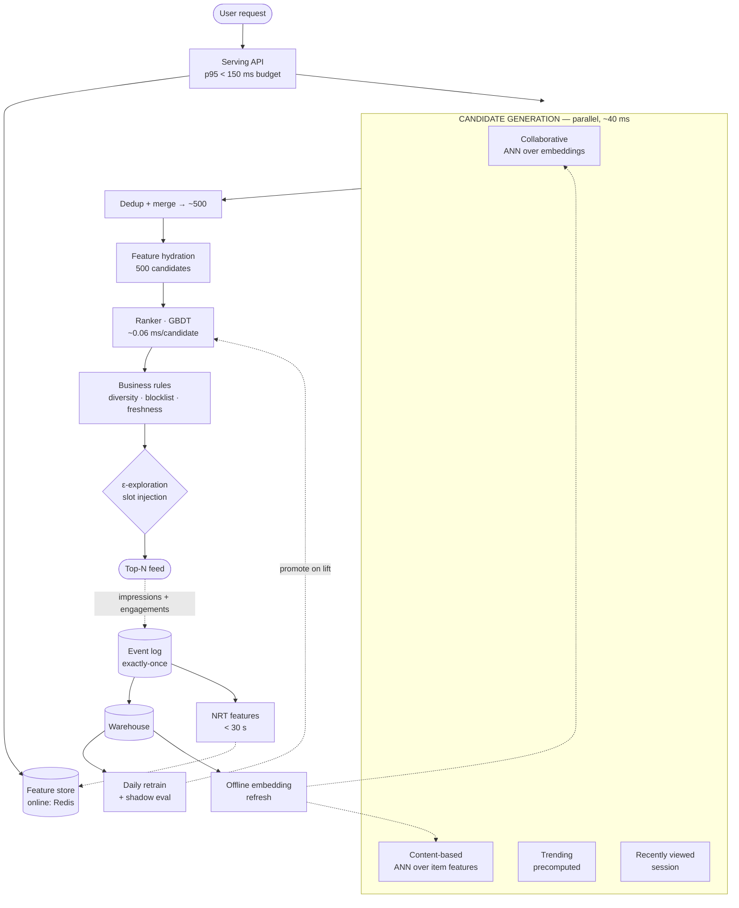

# 06 — AI Recommendation System

> **Prompt:** Design an AI recommendation system — candidate generation, ranking, embeddings, feature store, online/offline inference, feedback loops, personalization.

> **⚠️ This is classical ML system design, not LLM design — deliberately.** Knowing *when not to reach for an LLM* is itself a signal. An LLM in the ranking hot path at 5k QPS would be both too slow and roughly 1000× too expensive. LLMs appear here only in offline roles.

---

## The three-sentence compression

*Rehearse this before opening any other file. It is the opening answer.*

1. **The choice that matters most:** a **two-stage retrieve-then-rank architecture** — cheap multi-source candidate generation narrowing 5M items to ~500, then an expensive learned ranker scoring only those. Not a preference: at 5k QPS × 5M items, single-stage scoring is **arithmetically impossible**, and the arithmetic in [§1.6](01_requirements.md#16-capacity--cost-estimation) is what forces the shape.
2. **The alternative I rejected:** a single powerful model scoring the full catalogue, and separately an LLM-based ranker. The first needs ~2.5M CPU-hours/day; the second costs ~1000× a gradient-boosted tree for a fraction of the latency budget. I'd revisit the ranker choice if a GBDT plateaus below the CTR target, but not the two-stage shape.
3. **The failure mode I'd volunteer:** **the feedback loop.** The ranker is trained on logged impressions, but impressions are only generated for items the *previous* ranker chose to show — so the model progressively narrows its own world and popular items entrench. It looks like improving offline metrics while catalogue coverage silently collapses, which is why exploration and coverage monitoring are P0 rather than refinements.

---

## Architecture at a glance



**Note the two loops.** The fast one (request → response) has a 150 ms budget. The slow one (impressions
→ warehouse → retrain → promote) runs daily and is where the feedback-loop risk lives.

---

## Key numbers

| Dimension | Value |
|---|---|
| **Scale** | 10M monthly actives · 5M-item catalogue |
| Throughput | **5k QPS sustained · 20k peak** |
| **Serving latency** | p95 < 150 ms · p99 < 250 ms |
| Candidates scored | ~500 per request (from 5M) |
| **Scorings/day** | **216 billion** — the number that forces the architecture |
| Ranker budget | **~0.06 ms/candidate** |
| Recall@500 | ≥ 0.80 vs the engaged set |
| CTR lift | ≥ +10% vs popularity baseline |
| Behaviour freshness | < 30 s |
| Model freshness | Daily retrain |
| Availability | 99.95% — **a blank feed is a broken product** |
| Cost | ≈ $0.0008 per 1k requests (vs a $0.30 ceiling) ✅ |

---

## The findings that matter

**1. The arithmetic dictates the architecture — there is no design freedom here.**

```
5,000 QPS × 86,400 s        = 432M requests/day
432M × 500 candidates       = 216 BILLION scorings/day

A transformer at 1 ms/candidate → 216B ms = 2.5M CPU-hours/day.  Absurd.
Budget backwards from 30 ms for 500 candidates → ~0.06 ms/candidate.
⇒ Only a GBDT or shallow DNN fits. The model class is FORCED, not chosen.
```

This is also why two-stage exists: you cannot afford an expensive model over 5M items, and you cannot
get good ranking from a cheap model alone. **Cheap recall over millions, expensive ranking over
hundreds.**

**2. Cost is not the constraint — latency and the feedback loop are.** At ~$0.0008 per 1k requests
against a $0.30 ceiling, there's 375× headroom. Contrast [01](../01_production_rag_system/README.md),
where cost was 185× *over* budget. **Identifying which constraint actually binds is the first job in any
design.**

**3. The system trains on data it generated.** Impressions exist only for items a previous ranker chose
to show. Without deliberate exploration, the model narrows its own candidate world, popular items
entrench, and the long tail becomes invisible — while offline AUC *improves*. See
[§2.5 F1](02_hld.md#25-failure-modes--blast-radius).

---

## Files

| File | Contents |
|---|---|
| **[01_requirements.md](01_requirements.md)** | Why not an LLM · functional requirements · NFRs · non-goals · latency budget · **the 216B-scorings arithmetic** · assumptions |
| **[02_hld.md](02_hld.md)** | Two-stage architecture · model choices · feature store & train/serve skew · exploration · failure modes · scale plan |
| **[03_lld.md](03_lld.md)** | Schemas · APIs · candidate generation, ranking, diversity & exploration algorithms · sequence diagrams · model-promotion state machine · edge cases |
| **[04_production_and_interview.md](04_production_and_interview.md)** | ML-specific concerns · runbook · common mistakes · interview follow-ups · glossary |

**Shared front-matter:** [`../00_requirements_all_systems.md#6-ai-recommendation-system`](../00_requirements_all_systems.md#6-ai-recommendation-system)

---

## Relationship to the other designs

| Relates to | How |
|---|---|
| **[01 — RAG](../01_production_rag_system/README.md)** | **Same two-stage shape, different domain.** ANN recall → expensive rerank is the identical pattern; compare [01 §2.2](../01_production_rag_system/02_hld.md#retrieval-tier) |
| [04 — Inference platform](../04_llm_inference_platform/README.md) | Not used — the whole point. Ranking runs on CPU at 0.06 ms/candidate |
| [07 — Eval platform](../00_requirements_all_systems.md#7-llm-evaluation-platform) | Different eval discipline: offline AUC → **online A/B**, not LLM-as-judge |
