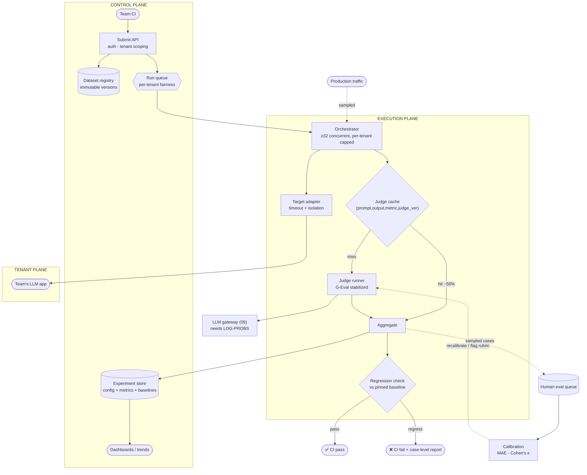

# 02 · High-Level Design — LLM Evaluation Platform

> **Phase 2 of 4** · [← Requirements](01_requirements.md) · [LLD →](03_lld.md)

---

## 2.1 Architecture

Three planes, separated by trust and by who owns what:

| Plane | Contains | Owned by | Failure consequence |
|---|---|---|---|
| **Control plane** | Dataset registry, run submission, experiment store, dashboards | Platform | Runs can't start — CI blocked, recoverable |
| **Execution plane** | Orchestrator, target adapters, judge runner, cache | Platform | Runs slow or fail — CI flaky, **erodes trust** |
| **Tenant plane** | The team's app under test, their datasets, their thresholds | The team | Their suite fails — their problem, but must not affect others |

**The tenant plane being drawn *outside* the execution plane matters.** The platform calls into a system it
doesn't control, at a latency it can't predict — which is why per-tenant concurrency caps and hard
per-case timeouts are architectural rather than defensive
([F5](#25-failure-modes--blast-radius)).

---

## 2.2 Component choices

### The judge — where the platform's credibility lives

| Concern | Choice | Why | Rejected alternative (and why not) | Revisit when |
|---|---|---|---|---|
| **Judge scoring** | **G-Eval-style: fixed CoT steps + probability-weighted score** | Brings σ under 0.05, well below the 3-point gate threshold. Without it the gate fires on noise | **Naive "score 0–10"** — multi-point swings on identical inputs make regression detection statistically meaningless. **Ensemble of 3 judges** — reduces variance but triples cost and latency | Log-probs become unavailable ([A1](01_requirements.md#assumptions)) — then an ensemble is the fallback |
| **Judge model tier** | **Small for cheap metrics, frontier for correctness/groundedness** | 60% cost reduction; relevance and format checks don't need frontier reasoning | **Frontier everywhere** — $4.50/run on judges alone. **Small everywhere** — correctness judgements degrade materially | Small-tier MAE vs human exceeds 1.0 on a given metric |
| **Determinism controls** | `temperature=0` · pinned judge version · fixed CoT steps · cached verdicts | Four independent sources of drift, each closed | Any subset — each omission reintroduces variance | — |
| Human eval | Sampled cases; **Cohen's κ** reported | Calibrates the judge *and* validates the rubric | Judge-only — no ground truth to calibrate against | — |

**Why fixed CoT steps rather than letting the judge reason freely.** A judge asked to evaluate
"correctness" re-derives what correctness *means* on every call, and that derivation varies — which is the
dominant source of score drift. Generating the evaluation steps **once** per metric and reusing them
verbatim removes that variance while keeping the reasoning benefit. Mechanism detail in
[`16_evals/15`](../../16_evals/15-mastering-g-eval-deterministic-judge.md).

> **Mental model:** the judge is a **rubric-following grader**, not an expert forming an opinion.
>
> *Where the analogy breaks:* a human grader applying a rubric can notice the rubric is wrong for a given
> answer and flag it. A stabilized judge is deliberately prevented from doing that — which is why human
> eval and κ exist: **the judge's consistency is bought at the cost of its judgement**, and something has
> to check the rubric.

### Datasets

| Concern | Choice | Why | Rejected alternative | Revisit when |
|---|---|---|---|---|
| **Versioning** | **Immutable, content-addressed versions** | A metric change between runs must be attributable to the *code*, not a silently-edited test | **Mutable datasets** — comparison becomes meaningless with no error signal | Never |
| Storage | Postgres + object store for large payloads | Structured queries over cases; blobs out of the row | Object store only — loses queryability | — |
| **Isolation** | `tenant_id` from the auth token, mandatory predicate | Datasets contain product-sensitive content | Trusting a body-supplied tenant | Never |
| Curation | Platform suggests from failures; **humans approve** | Auto-added cases can encode a *wrong* expectation permanently | Fully automatic — a bad golden case poisons the gate indefinitely | Judge parity with humans |

### Caching and cost control

| Concern | Choice | Why | Rejected alternative | Revisit when |
|---|---|---|---|---|
| **Judge cache** | Key `(prompt_hash, output_hash, metric, judge_version)` | Iterative PRs re-judge mostly-identical outputs. ~50% saving on cost **and** latency | **No cache** — pays full price to re-derive known verdicts | — |
| **Invalidation** | Any judge/metric version change invalidates | A stale verdict from an older judge silently corrupts comparison | Time-based TTL only — would serve stale verdicts across a judge upgrade | — |
| **Tiered suites** | 50-case smoke on PR · 200-case full nightly | Resolves the requirement conflict ([§1.6](01_requirements.md#the-three-levers)) | **One suite on every PR** — $102k/month and 10 min gates ⇒ teams disable it | Cost ceiling rises, or judge cost falls materially |
| Target-call reuse | Cache target outputs by `(app_version, prompt_version, case_id)` | Re-running an *unchanged* app shouldn't re-invoke it | Always re-invoke — pays the tenant's inference cost repeatedly | — |

**Target-output caching is the lever people miss.** Re-running a suite after changing only a *metric*
shouldn't re-execute the tenant's app 200 times — that's 35% of run cost
([§1.6](01_requirements.md#the-naive-design)) spent regenerating identical outputs.

### Regression detection

| Concern | Choice | Why | Rejected alternative | Revisit when |
|---|---|---|---|---|
| **Baseline** | **Pinned run**, explicitly promoted | Comparing to "last run" lets quality ratchet down invisibly, one acceptable step at a time | **Rolling previous run** — permits slow drift with every individual comparison passing | — |
| Threshold | Per-metric, platform default with team override | A 3-point drop in correctness ≠ 3 points in tone | One global threshold — simultaneously too strict and too loose | — |
| **Statistical treatment** | Report the metric delta **with a confidence interval** on 50-case suites | 50 cases is a small sample; a 3-point move may be noise | Point estimates only — flaky gates on small suites | — |
| Failure output | **Case-level diff**, not just the aggregate | "Correctness fell 4 points" is unactionable; "these 6 cases regressed" is | Aggregate only — engineers can't act on it | — |

**Pinned baselines prevent the ratchet.** With rolling comparison, twenty consecutive 2-point drops each
pass a 3-point threshold and the feature quietly loses 40 points. A pinned baseline makes cumulative drift
visible, and promoting a new baseline becomes a deliberate act.

**Confidence intervals on the smoke suite are what keep tiering honest.** A 50-case suite has real sampling
error; reporting a bare delta invites teams to chase noise. Reporting "−2.1 points (95% CI: −5.4 to +1.2)"
correctly signals *inconclusive* — and defers to the nightly full suite.

---

## 2.3 Data flow

### A PR-triggered smoke run

1. **CI submits** a run: target app + version, prompt version, model version, suite = `smoke`, and the
   baseline run ID to compare against. `tenant_id` comes from the token.
2. **Resolve the dataset version** — immutable, recorded on the run. A run can always be replayed against
   exactly the cases it used.
3. **Queue** with per-tenant fairness so one team's burst doesn't starve another's PR.
4. **Orchestrate, 32 concurrent, capped per tenant:**
   - **Target output cache** — hit if `(app_version, prompt_version, case_id)` was seen. Miss → invoke the
     tenant's app with a hard timeout.
   - **Judge cache** per (case, metric) — hit returns the verdict free; miss goes to the judge runner.
5. **Judge runner** applies the metric's pre-generated CoT steps, calls the judge at `temperature=0`,
   requests log-probs, and computes the probability-weighted score.
6. **Aggregate** per metric; compute confidence intervals.
7. **Regression check** against the pinned baseline, per-metric thresholds.
8. **Persist** run, per-case results, and traces to the experiment store.
9. **Return** pass/fail plus a **case-level diff** of what regressed.
10. **Sample** a few cases into the human eval queue for ongoing calibration.

**Step 10 runs on a small fraction of runs, continuously.** Calibration isn't a one-off setup task — judge
agreement drifts as products change, and a judge that was calibrated six months ago may no longer be.

### The nightly full run

Same flow with the 200-case suite, plus: online-eval sampling from production traffic, trend
recomputation, and dataset-rot detection (cases whose expected outputs no longer match the product's
intended behaviour).

---

## 2.4 NFR mapping

| NFR | Target | Delivered by |
|---|---|---|
| Suite runtime p95 < 10 min | 10 min | Budget [§1.5](01_requirements.md#15-runtime-budget) · 32 concurrency · judge + target caches · tiering |
| Smoke runtime < 3 min | 3 min | 50 cases at the same concurrency |
| **Judge σ < 0.05** | — | **Fixed CoT steps · probability-weighted scoring · `temperature=0` · pinned judge version** |
| Judge–human MAE ≤ 1.0 | — | Sampled human eval · per-metric calibration · κ to validate rubrics |
| Regression detection | — | Pinned baseline · per-metric thresholds · confidence intervals on small suites |
| Cost ≤ ceiling | ~$0.90 / $2.30 | Tiered judges · judge cache · target-output cache · tiered suites |
| 500 runs/day | — | Stateless orchestrator · queue with per-tenant fairness |
| Availability 99.5% | — | Stateless execution · idempotent runs · CI retry is acceptable |
| **Tenant isolation** | — | `tenant_id` from token as a mandatory predicate on datasets, runs, and traces |
| Retention 1 yr | — | Partitioned run/trace tables |
| Experiment comparability | — | Immutable datasets · recorded versions for app, prompt, model, judge, metric |

---

## 2.5 Failure modes & blast radius

| # | Failure | Detection | Blast radius | Mitigation & degraded mode |
|---|---|---|---|---|
| **F1** | **Judge variance exceeds the gate threshold** | Determinism canary: re-run a fixed case set, measure σ | **Every gate on the platform becomes noise** | Determinism canary on every judge version · block judge upgrades on σ regression · fall back to the previous judge version. *The failure I'd volunteer* |
| **F2** | **Judge drifts from human agreement** | Rolling MAE from sampled human eval | All gates — quietly wrong | Continuous calibration · alert on MAE > 1.0 · recalibrate or repin |
| **F3** | **Dataset rot** | Cases whose expected output contradicts current product behaviour | One tenant's gates — **pass while quality drifts** | Periodic review prompts · flag cases unchanged for > N months · [Q1](01_requirements.md#open-questions) ownership |
| **F4** | Log-probs unavailable from the provider | Judge runner error | Determinism lost platform-wide | Ensemble-of-3 fallback (higher cost, similar variance reduction) · alert loudly ([A1](01_requirements.md#assumptions)) |
| **F5** | **One tenant's app is very slow** | Per-tenant target latency | **Could starve all runs** | Per-tenant concurrency cap · hard per-case timeout · that tenant's run fails, others proceed |
| **F6** | Tenant app returns errors for most cases | Error rate per run | That tenant's run | Fail the run with a clear "target unhealthy" reason — **not** a quality regression, which would mislead |
| **F7** | Judge provider outage | Error rate | All runs | Fallback judge via [09](../00_requirements_all_systems.md#9-multi-provider-llm-platform) — **but a different judge invalidates comparability**, so mark runs as non-comparable rather than silently substituting |
| **F8** | Stale judge cache after a metric change | Version mismatch check | Wrong verdicts | Version in the cache key; a metric edit bumps the version |
| **F9** | **Baseline never promoted** | Baseline age | Gates compare against something ancient | Alert on baseline age > 90 days · prompt promotion at release |
| **F10** | Team sets thresholds so loose the gate is meaningless | Threshold audit | That tenant | Platform minimums; thresholds visible in dashboards; **make loosening a reviewed change** |
| **F11** | Queue starvation across tenants | Queue wait per tenant | Slow teams | Fair queueing; per-tenant concurrency reservation |
| **F12** | Human eval queue unattended | Oldest-item age | Calibration goes stale | Alert; degrade to reporting MAE staleness rather than a stale MAE value |

**On F1, because it invalidates everything else.** If judge variance exceeds the regression threshold, every
gate becomes a coin flip: teams see failures they can't reproduce, lose faith, and disable the gate — and
the platform still reports green dashboards while providing no signal. The control is a **determinism
canary**: a fixed set of cases re-scored on every judge version, with σ measured and any regression
blocking the upgrade. It's cheap and it's the single most important test the platform runs on itself.

**On F3, because it's slow and silent.** Dataset rot means the *tests* stop representing the product while
the infrastructure works perfectly. Gates keep passing, teams keep trusting them, quality drifts
unmeasured. There is no clever technical detection — it needs an owner and a review cadence, which is why
[Q1](01_requirements.md#open-questions) is a staffing question and worth raising before launch.

**On F7, because the tempting fix is wrong.** Falling back to a different judge model keeps runs *executing*
but breaks the thing runs are *for* — comparability. A score from judge B isn't comparable to a baseline
from judge A. The honest behaviour is to run and **mark the result non-comparable**, so nobody gates on it.

---

## 2.6 Scale plan

### 10× (5,000 runs/day, 200 teams)

| # | Bottleneck | Why | Change |
|---|---|---|---|
| 1 | **Judge provider rate limits** | 32 concurrent × many simultaneous runs ⇒ large synchronized bursts | Global concurrency budget across runs · request shaping · multi-provider judging **within a metric family** to preserve comparability |
| 2 | **Dataset ownership** | 200 teams' datasets rotting in parallel — the [F3](#25-failure-modes--blast-radius) problem multiplied | Rot detection as a platform feature; dataset "health score" surfaced to owners |
| 3 | Target app capacity | 5k runs × 200 cases = 1M target invocations/day | Target-output caching becomes essential rather than an optimization; per-tenant quotas |
| 4 | Experiment store | 1M runs/year | Partition by tenant + month; archive cold |
| 5 | Human eval throughput | Calibration for 200 teams' metrics | Shared metric library ([Q5](01_requirements.md#open-questions)) so calibration amortizes across tenants |

**Bottleneck 2 is the one that decides whether the platform stays useful.** Infrastructure scales; dataset
quality doesn't scale by itself. At 200 teams the platform must make rot *visible* — otherwise it becomes
200 teams' worth of green gates measuring nothing.

### 100× (50,000 runs/day)

| Concern | Change |
|---|---|
| Judging | Self-host the judge on [04](../04_llm_inference_platform/README.md) — at this volume utilization is high enough to flip the build-vs-buy verdict, and it guarantees log-prob access |
| Metrics | A shared, versioned metric library becomes mandatory; per-team custom metrics move to a plugin model |
| Suites | Continuous evaluation on production samples largely replaces scheduled full runs |
| Calibration | Systematic human-eval pipeline with dedicated annotators |
| Org | Metric definitions, judging infrastructure, and dataset curation become separately-owned |

**Self-hosting the judge at 100× is the interesting inversion.** It resolves
[A1](01_requirements.md#assumptions) permanently (log-probs guaranteed), and the utilization conditions that
made self-hosting lose in [04](../04_llm_inference_platform/01_requirements.md#16-capacity--cost-estimation)
— low, bursty usage — no longer hold for a continuously-running judge fleet.

### What does *not* change

- **Fixed CoT steps + probability-weighted scoring** for judge determinism.
- **Immutable, versioned datasets.**
- **Pinned baselines**, not rolling comparison.
- **Case-level failure output**, not just aggregates.
- **Version in every cache key.**
- **A different judge means non-comparable**, never a silent substitution.
- **Determinism canary on every judge upgrade.**

---

## 2.7 Tech stack

> Shared substrate and the reasoning behind it: [`../00_tech_stack.md`](../00_tech_stack.md). This section
> carries only what is **specific to this system**.

| Layer | Choice | Rejected | Why | Revisit when |
|---|---|---|---|---|
| **Judge cache** | **Redis**, keyed on `(prompt, output, metric, judge_version)` | No cache | ~50% hit rate on iterative PRs — the single largest avoidable cost. **`judge_version` in the key is what makes recalibration safe** | Never |
| **Determinism canary** | Fixed cases that **bypass the cache** on every run | Cached like everything else | A cached canary always agrees with itself and measures nothing. **The bypass is the whole point** | Never |
| **Judge scoring** | **Log-prob-weighted G-Eval** over score tokens | "Rate this 0–10" | A naive judge swings several points across identical reruns, so a 3-point gate fires on noise | Provider stops exposing logprobs ([A1](01_requirements.md#assumptions)) — then variance rises and every gate weakens |
| **Run orchestration** | **Argo Workflows** (or Ray) — ≥32 concurrent cases | Sequential runs | A CI gate has a wall-clock ceiling; concurrency is what makes tiering viable | — |
| **Dataset registry** | **S3 + content-addressed versions**, immutable, Postgres index | Mutable dataset tables | A gate compared against a silently edited dataset is meaningless | Never |
| Experiment tracking | **MLflow** | Bespoke tables | Runs, params, and metric history with lineage, for free | — |
| Metric library | **DeepEval** + custom metrics, pinned versions | Rolling your own from scratch | RAG-triad and G-Eval implementations are well-trodden; the platform's value is the harness | — |
| Target adapter | HTTP contract + per-tenant timeout/concurrency | In-process import of the app | The platform must not be able to break a tenant's app, or vice versa | — |
| Results / trends | **PostgreSQL** partitioned; traces in S3 | ClickHouse | 500 runs/day is small — Postgres is the right size | Runs exceed ~10M rows/day |
| Human eval | Labelling UI + **MAE / Cohen's κ vs judge** | Trust the judge | Judge calibration is only credible against human labels | — |
| CI integration | GitHub Actions / GitLab CI with a **tiered** invocation | One suite on every PR | $6.78/run against a $2.00 ceiling — tiering is the structural fix | — |

**The cache-bypassing determinism canary is the choice that keeps the platform honest.** Everything else in
the system is optimized for cache hits, because re-judging identical pairs is the dominant cost. But a
canary that hits the cache returns the stored verdict and reports perfect stability while the judge drifts
underneath. **A small, deliberate, explicitly uncached carve-out is what makes the stability number real.**

**`judge_version` in the cache key is the second half of the same idea.** Recalibrating the judge must
invalidate every cached verdict, and putting the version in the key makes that automatic rather than an
operational step someone can forget — the same version-in-key discipline as
[01's `embed_version`](../01_production_rag_system/README.md) and [09's prompt versions](../09_multi_provider_llm_platform/README.md).

---

**Next:** [03_lld.md →](03_lld.md) — schemas, APIs, the G-Eval scoring / caching / regression algorithms, sequence diagrams, run and dataset state machines, and edge cases.
