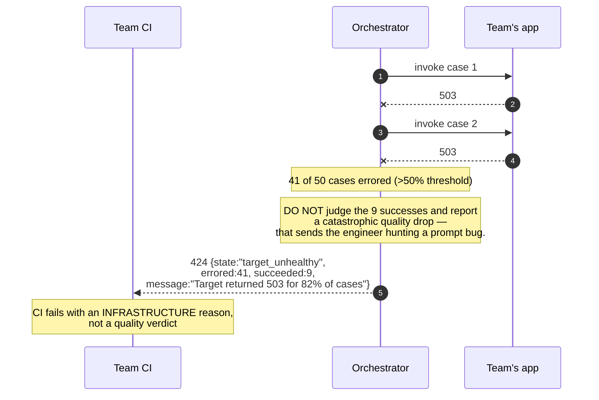
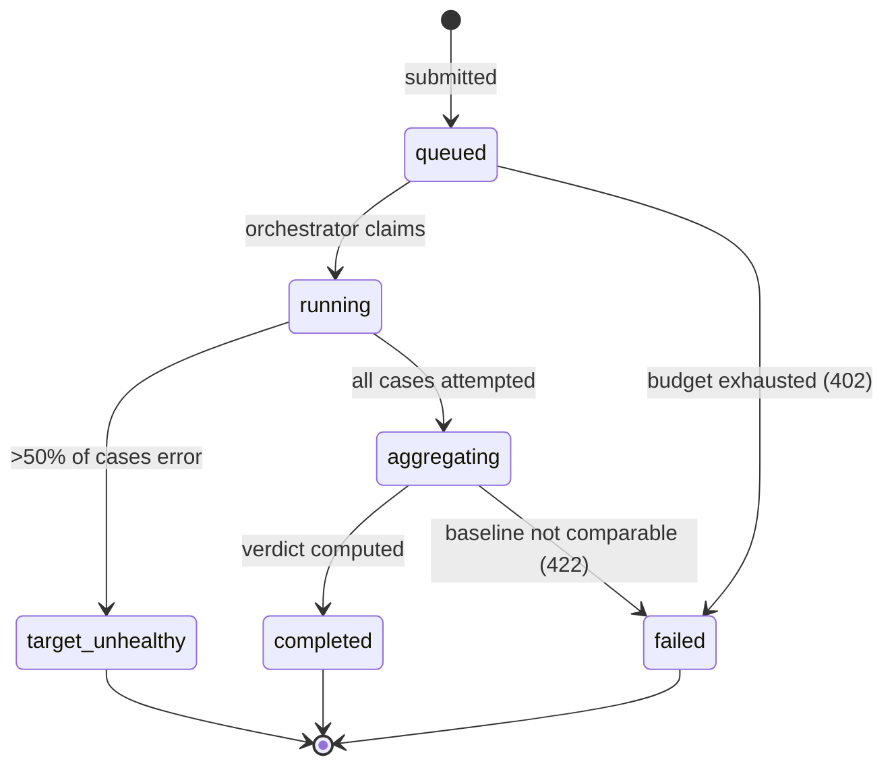
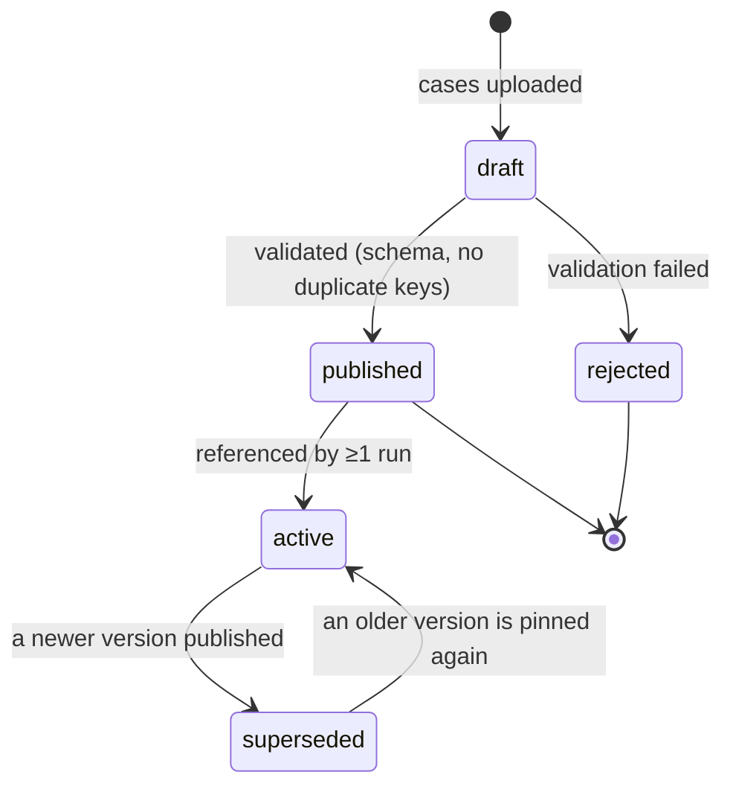

# 03 · Low-Level Design — LLM Evaluation Platform

> **Phase 3 of 4** · [← HLD](02_hld.md) · [Production & interview →](04_production_and_interview.md)

---

## 3.1 Data models

### Datasets — immutable and content-addressed

```sql
CREATE TABLE datasets (
    dataset_id   UUID PRIMARY KEY,
    tenant_id    UUID NOT NULL,                    -- mandatory predicate on every read
    name         TEXT NOT NULL,
    description  TEXT,
    owner_email  TEXT NOT NULL,                    -- Q1: datasets need an owner or they rot
    created_at   TIMESTAMPTZ NOT NULL DEFAULT now(),
    CONSTRAINT datasets_name_uniq UNIQUE (tenant_id, name)
);

CREATE TABLE dataset_versions (
    version_id    UUID PRIMARY KEY,
    dataset_id    UUID NOT NULL REFERENCES datasets(dataset_id),
    version_no    INT  NOT NULL,
    content_hash  BYTEA NOT NULL,                  -- hash over all cases: content-addressed
    case_count    INT  NOT NULL,
    created_by    TEXT NOT NULL,
    change_note   TEXT,
    created_at    TIMESTAMPTZ NOT NULL DEFAULT now(),
    CONSTRAINT dsv_uniq UNIQUE (dataset_id, version_no),
    CONSTRAINT dsv_hash_uniq UNIQUE (dataset_id, content_hash)
);

CREATE TABLE cases (
    case_id       UUID PRIMARY KEY,
    version_id    UUID NOT NULL REFERENCES dataset_versions(version_id),
    external_key  TEXT NOT NULL,                   -- stable across versions: tracks one case over time
    input         JSONB NOT NULL,                  -- query, context, conversation history
    expected      JSONB,                           -- ideal answer / expected fields; NULL for reference-free
    tags          TEXT[] NOT NULL DEFAULT '{}',     -- 'smoke' selects the tiered subset
    difficulty    TEXT,
    CONSTRAINT cases_key_uniq UNIQUE (version_id, external_key)
);

CREATE INDEX idx_cases_version ON cases (version_id);
CREATE INDEX idx_cases_smoke ON cases (version_id) WHERE 'smoke' = ANY(tags);
```

| Structure | Why |
|---|---|
| **No `UPDATE` path on `cases`** | Immutability is enforced by the absence of a mutation API, not by convention. A "change" creates a new `dataset_version` |
| `dsv_hash_uniq` | Content-addressed: re-uploading identical cases returns the existing version rather than creating a duplicate |
| `external_key` | Stable identity for one logical case **across** versions — how you track whether *this* case regressed over six months |
| `idx_cases_smoke` | Partial index serving the 50-case tiered subset ([§1.6](01_requirements.md#the-three-levers)) |

**`owner_email` on the dataset is a technical response to a staffing problem.** Dataset rot
([F3](02_hld.md#25-failure-modes--blast-radius)) is the failure that quietly invalidates every gate, and it
has no clever detection — only an owner and a review cadence. Putting the field in the schema makes
ownership a required input rather than an afterthought.

### Metrics — versioned, with the CoT steps that stabilize them

```sql
CREATE TABLE metrics (
    metric_id      UUID PRIMARY KEY,
    tenant_id      UUID,                            -- NULL = platform-provided shared metric
    name           TEXT NOT NULL,                   -- 'groundedness' | 'correctness' | ...
    version        INT  NOT NULL,

    kind           TEXT NOT NULL,                   -- 'reference_based' | 'reference_free'
    criteria       TEXT NOT NULL,                   -- the human-authored high-level criteria
    -- Generated ONCE from `criteria`, then FROZEN. Regenerating per call is the
    -- dominant source of judge drift (§2.2).
    eval_steps     JSONB NOT NULL,
    rubric         JSONB,                           -- score-band definitions
    judge_tier     TEXT NOT NULL,                   -- 'small' | 'frontier'
    score_range    INT2RANGE NOT NULL DEFAULT '[0,10]',

    created_at     TIMESTAMPTZ NOT NULL DEFAULT now(),
    CONSTRAINT metrics_uniq UNIQUE (tenant_id, name, version)
);
```

> **`eval_steps` being stored rather than generated at call time is the single most important line in this
> schema.** A judge asked to evaluate "correctness" re-derives what correctness *means* on every
> invocation, and that derivation varies — which is the main source of score drift. Generating the steps
> once from `criteria`, freezing them, and versioning the pair is what delivers σ < 0.05
> ([FR-4](01_requirements.md#judging--where-the-platforms-credibility-lives)). Bumping `version` is what correctly invalidates every cached
> verdict.

### Runs and results

```sql
CREATE TABLE runs (
    run_id         UUID PRIMARY KEY,
    tenant_id      UUID NOT NULL,
    suite          TEXT NOT NULL,                   -- 'smoke' | 'full'

    -- Everything needed to make a run reproducible and comparable
    dataset_version_id UUID NOT NULL REFERENCES dataset_versions(version_id),
    target_app     TEXT NOT NULL,
    target_version TEXT NOT NULL,
    prompt_version TEXT NOT NULL,
    model_version  TEXT NOT NULL,
    judge_version  TEXT NOT NULL,
    metric_versions JSONB NOT NULL,                 -- {metric_name: version}

    baseline_run_id UUID REFERENCES runs(run_id),   -- PINNED, not "previous"
    comparable     BOOLEAN NOT NULL DEFAULT TRUE,   -- FALSE if a fallback judge was used (F7)

    state          TEXT NOT NULL DEFAULT 'queued',
    verdict        TEXT,                            -- 'pass' | 'fail' | 'inconclusive'
    cost_usd       NUMERIC(10,6),
    duration_ms    INT,
    ci_ref         TEXT,                            -- PR / commit link

    created_at     TIMESTAMPTZ NOT NULL DEFAULT now(),
    completed_at   TIMESTAMPTZ,

    CONSTRAINT runs_state_chk CHECK (state IN
        ('queued','running','aggregating','completed','failed','target_unhealthy'))
) PARTITION BY RANGE (created_at);

CREATE INDEX idx_runs_tenant_time ON runs (tenant_id, created_at DESC);
CREATE INDEX idx_runs_baseline ON runs (baseline_run_id) WHERE baseline_run_id IS NOT NULL;

CREATE TABLE case_results (
    run_id        UUID NOT NULL,
    case_id       UUID NOT NULL,
    metric_name   TEXT NOT NULL,

    score         REAL,                             -- probability-weighted, 0..1 normalized
    score_raw     REAL,                             -- argmax token value, for comparison
    reason        TEXT,                             -- judge's stated reasoning
    from_cache    BOOLEAN NOT NULL DEFAULT FALSE,

    target_output TEXT,                             -- what the app produced
    tokens_in     INT,
    tokens_out    INT,
    cost_usd      NUMERIC(10,6),
    latency_ms    INT,
    error         TEXT,

    PRIMARY KEY (run_id, case_id, metric_name)
) PARTITION BY RANGE (run_id);
```

**Storing `score` and `score_raw` side by side** lets you demonstrate the stabilization is working:
`score_raw` is what a naive judge would have returned (the argmax token), `score` is the
probability-weighted value. The variance gap between them across reruns is the measurable benefit of
G-Eval, and it's what the determinism canary compares.

**`comparable BOOLEAN`** encodes [F7](02_hld.md#25-failure-modes--blast-radius): when a judge fallback fires,
the run still executes but is flagged so nothing gates on it. Silently substituting a judge would break
comparability while appearing to work.

### The judge cache

```sql
CREATE TABLE judge_cache (
    cache_key     BYTEA PRIMARY KEY,   -- H(prompt_hash, output_hash, metric, metric_ver, judge_ver)
    score         REAL NOT NULL,
    score_raw     REAL NOT NULL,
    reason        TEXT,
    judge_version TEXT NOT NULL,
    metric_version INT  NOT NULL,
    hit_count     INT  NOT NULL DEFAULT 0,
    created_at    TIMESTAMPTZ NOT NULL DEFAULT now(),
    last_hit_at   TIMESTAMPTZ
);

CREATE INDEX idx_judge_cache_evict ON judge_cache (last_hit_at NULLS FIRST);
```

**Every version that could change the verdict is *in the key*, not checked afterwards.** A stale verdict
from an older judge or an edited metric would silently corrupt a comparison — the kind of failure that
produces confident, wrong gate results ([F8](02_hld.md#25-failure-modes--blast-radius)).

### Human eval and calibration

```sql
CREATE TABLE human_labels (
    label_id     UUID PRIMARY KEY,
    run_id       UUID NOT NULL,
    case_id      UUID NOT NULL,
    metric_name  TEXT NOT NULL,
    rater_id     UUID NOT NULL,
    score        REAL NOT NULL,                     -- same scale as the judge
    notes        TEXT,
    labelled_at  TIMESTAMPTZ NOT NULL DEFAULT now(),
    CONSTRAINT hl_uniq UNIQUE (run_id, case_id, metric_name, rater_id)
);

-- Multiple raters per (case, metric) enable Cohen's κ — which tells you whether
-- the RUBRIC is ambiguous, not just whether the judge is off (FR-8).
CREATE INDEX idx_hl_agreement ON human_labels (run_id, case_id, metric_name);
```

**`UNIQUE (…, rater_id)` permits multiple raters per case deliberately.** Without at least two raters on
overlapping cases you can compute judge-vs-human MAE but not human-vs-human κ — and if κ is low, the judge
isn't the problem: **no judge can be more consistent than the definition it was given.**

---

## 3.2 API contracts

### `POST /v1/runs`

```http
POST /v1/runs HTTP/1.1
Authorization: Bearer <ci_token>          # tenant_id derived here, never from the body
Idempotency-Key: ci-run-8891

{
  "dataset": "support-agent-golden",
  "dataset_version": 14,                  // or "latest" — resolved and RECORDED
  "suite": "smoke",
  "target": {
    "app": "support-agent",
    "endpoint": "https://support-agent.internal/v1/answer",
    "app_version": "a1b2c3d",
    "prompt_version": "p-2026-03-11",
    "model_version": "claude-sonnet-5"
  },
  "metrics": ["correctness", "groundedness", "answer_relevance"],
  "baseline_run_id": "r-7712",            // PINNED baseline
  "ci_ref": "github.com/org/repo/pull/912"
}
```

```
202 Accepted
{ "run_id": "r-8830", "state": "queued", "suite": "smoke",
  "dataset_version_resolved": 14,
  "estimated_cost_usd": 0.91, "estimated_duration_s": 120,
  "poll_url": "/v1/runs/r-8830", "stream_url": "/v1/runs/r-8830/events" }
```

**`estimated_cost_usd` returned at submission** lets a team see the price before the run executes — which
matters when the platform is charging back and when a team is about to accidentally submit a full suite on
every commit.

**`dataset_version_resolved`** makes `"latest"` safe: the concrete version is resolved once, recorded on the
run, and reported back. A run is always replayable against exactly the cases it used.

### Result

```http
GET /v1/runs/r-8830
```

```json
{
  "run_id": "r-8830",
  "state": "completed",
  "verdict": "fail",
  "comparable": true,
  "suite": "smoke",
  "case_count": 50,
  "metrics": {
    "correctness": {
      "score": 0.87, "baseline": 0.92, "delta": -0.05,
      "ci95": [-0.09, -0.01], "threshold": -0.03,
      "verdict": "fail", "judge_tier": "frontier"
    },
    "groundedness": {
      "score": 0.95, "baseline": 0.94, "delta": 0.01,
      "ci95": [-0.02, 0.04], "threshold": -0.03,
      "verdict": "pass", "judge_tier": "frontier"
    },
    "answer_relevance": {
      "score": 0.91, "baseline": 0.90, "delta": 0.01,
      "ci95": [-0.03, 0.05], "threshold": -0.03,
      "verdict": "pass", "judge_tier": "small"
    }
  },
  "regressed_cases": [
    { "case_id": "c-11", "external_key": "refund-multi-step",
      "metric": "correctness", "score": 0.4, "baseline_score": 0.9,
      "reason": "Answer omits the 14-day window stated in the policy.",
      "target_output": "You can request a refund by contacting support.",
      "expected": "Refunds may be requested within 14 days of purchase…" }
  ],
  "usage": { "cost_usd": 0.88, "duration_ms": 118400,
             "judge_calls": 150, "cache_hits": 78, "target_calls": 50 }
}
```

**`regressed_cases` with the actual outputs is the payload that makes a failed gate actionable.**
"Correctness fell 5 points" tells an engineer nothing they can fix; *this case, this output, this expected
answer, this reason* tells them exactly what broke.

**`ci95` alongside `delta` is what keeps a 50-case suite honest.** Here correctness has a delta of −0.05 with
a CI that excludes zero, so it's a real regression. Had the CI been [−0.09, +0.03], the correct verdict
would be **inconclusive** — defer to the nightly full suite rather than block on noise.

### Error responses

| Status | Meaning | Behaviour |
|---|---|---|
| `400` | Unknown metric; dataset version doesn't exist | Name the valid options |
| `401` / `403` | Auth, or dataset belongs to another tenant | 403 logged as a **security event** |
| `402` | Tenant eval budget exhausted | `{"error":"budget_exhausted","resets_at":…}` |
| `409` | Idempotency key reused with different parameters | Return the original run |
| `422` | **Baseline used a different judge or metric version** | `{"error":"baseline_not_comparable"}` — refuse rather than compare invalid numbers |
| `424` | **Target app unhealthy** (majority of cases errored) | `state: target_unhealthy` — **explicitly not a quality regression** |
| `429` | Per-tenant concurrency limit | `Retry-After` |

**`422` and `424` are the two that prevent misleading verdicts.** Comparing against a baseline judged by a
different judge version produces a meaningless delta; and a target app that's simply down would otherwise
look like a catastrophic quality regression and send an engineer hunting a prompt bug that doesn't exist.

### Remaining endpoints

```http
POST /v1/datasets/{name}/versions        # upload cases → new immutable version (content-addressed)
GET  /v1/datasets/{name}/versions        # history with change notes
POST /v1/runs/{id}:promote-baseline      # deliberate act; records who and when
GET  /v1/trends?app=…&metric=…&days=90   # experiment-store time series
POST /v1/human-labels                    # submit human eval labels
GET  /v1/calibration?metric=…            # MAE vs human, Cohen's κ, sample size
GET  /internal/v1/determinism-canary     # σ per metric for the current judge version (F1)
```

---

## 3.3 Core algorithms

### G-Eval scoring — the stabilization

```python
SCORE_TOKENS = [str(i) for i in range(11)]      # "0".."10"

async def judge_case(case: Case, target_output: str, metric: Metric,
                     judge_version: str) -> Verdict:
    """Two mechanisms deliver σ < 0.05 (FR-4):
       1. FROZEN eval_steps — the judge does not re-derive what the metric means
       2. Probability-weighted score over candidate score tokens, not the argmax
    """
    cache_key = sha256(
        hash_prompt(case, metric), sha256(target_output),
        metric.name, metric.version, judge_version,
    )
    if (hit := await judge_cache.get(cache_key)) is not None:
        return Verdict(score=hit.score, score_raw=hit.score_raw,
                       reason=hit.reason, from_cache=True)

    prompt = build_judge_prompt(
        criteria=metric.criteria,
        eval_steps=metric.eval_steps,        # FROZEN — the key to determinism
        rubric=metric.rubric,
        case_input=case.input,
        expected=case.expected,              # None for reference-free metrics
        actual=target_output,
    )

    resp = await llm.complete(
        prompt=prompt,
        model=JUDGE_MODELS[metric.judge_tier],
        temperature=0,                       # necessary, NOT sufficient
        max_tokens=8,
        logprobs=True, top_logprobs=10,      # ← hard dependency (A1)
    )

    score = probability_weighted_score(resp.top_logprobs)
    score_raw = parse_int_or_none(resp.text)

    await judge_cache.put(cache_key, score, score_raw, resp.reason, judge_version,
                          metric.version)
    return Verdict(score, score_raw, resp.reason, from_cache=False)


def probability_weighted_score(top_logprobs: list[TokenLogprob]) -> float:
    """Expectation over plausible scores instead of the single sampled token.

    A judge genuinely torn between 7 and 8 returns ~7.5 every time, rather than
    flipping between 7 and 8 across reruns — which is exactly the multi-point
    swing that makes a 3-point gate threshold meaningless.
    """
    numeric = [(int(t.token), math.exp(t.logprob))
               for t in top_logprobs if t.token.strip() in SCORE_TOKENS]
    if not numeric:
        raise JudgeParseError("no numeric score token in top logprobs")

    total = sum(p for _, p in numeric)        # renormalize over kept tokens only
    weighted = sum(v * (p / total) for v, p in numeric)
    return weighted / 10.0                    # normalize to 0..1
```

**Why `temperature=0` alone is insufficient.** It makes *sampling* deterministic but not the *score*:
provider-side batching, hardware non-determinism, and floating-point ordering all shift which token wins
when two are nearly tied — and near-ties are exactly the ambiguous cases that matter. Probability weighting
sidesteps the tie-break entirely by using the distribution rather than the winner.

### Regression detection

```python
def check_regression(run: Run, baseline: Run, metric: str,
                     threshold: float) -> MetricVerdict:
    """Pinned baseline, per-metric threshold, and a confidence interval —
    because a 50-case smoke suite has real sampling error (§2.2)."""

    # Refuse to compare across judge/metric versions: the delta would be
    # measuring the judge change, not the app change (422).
    if (baseline.judge_version != run.judge_version
            or baseline.metric_versions.get(metric) != run.metric_versions.get(metric)):
        raise BaselineNotComparable(metric)

    cur = scores_for(run, metric)
    base = scores_for(baseline, metric)
    delta = mean(cur) - mean(base)

    # Welch's t-interval on the difference of means — unequal variances, unequal n
    lo, hi = welch_ci95(cur, base)

    if hi < threshold:
        verdict = "fail"           # confidently worse than allowed
    elif lo > threshold:
        verdict = "pass"           # confidently within tolerance
    else:
        verdict = "inconclusive"   # CI straddles the threshold — don't block on noise

    return MetricVerdict(mean(cur), mean(base), delta, (lo, hi), threshold, verdict)
```

**Three verdicts, not two.** A binary pass/fail on a 50-case suite forces a decision the data can't support.
`inconclusive` is the honest answer when the confidence interval straddles the threshold — the smoke suite
defers to the nightly full suite rather than blocking a PR on sampling noise. **This is what makes tiering
safe**: the fast suite is allowed to say "I don't know."

### The determinism canary

```python
async def determinism_canary(judge_version: str, reruns: int = 5) -> CanaryReport:
    """Re-score a fixed case set N times and measure σ per metric.
    Blocks judge upgrades on variance regression — the cheapest and most
    important test the platform runs on ITSELF (F1)."""
    report = {}
    for metric in PLATFORM_METRICS:
        per_case: dict[str, list[float]] = defaultdict(list)
        for _ in range(reruns):
            for case in CANARY_CASES:                       # ~20 fixed cases
                v = await judge_case(case, CANARY_OUTPUTS[case.case_id],
                                     metric, judge_version)
                per_case[case.case_id].append(v.score)

        sigmas = [statistics.stdev(v) for v in per_case.values() if len(v) > 1]
        report[metric.name] = CanaryMetric(
            sigma_mean=mean(sigmas), sigma_max=max(sigmas),
            passes=max(sigmas) < DETERMINISM_SIGMA_LIMIT,   # 0.05
        )
    return CanaryReport(judge_version, report)
```

**The canary must bypass the judge cache**, or it measures cache-hit consistency (trivially perfect) rather
than judge determinism. That's a subtle implementation trap: the obvious code path returns σ = 0 and looks
like a pass.

### Calibration

```python
def calibration_report(metric: str, window_days: int = 30) -> Calibration:
    """Two independent measurements. Both required (§1.3):
       MAE — is the judge ACCURATE vs humans?
       κ   — is the RUBRIC unambiguous enough for humans to agree?
    """
    pairs = fetch_judge_human_pairs(metric, window_days)
    mae = mean(abs(j - h) for j, h in pairs)

    multi = fetch_multi_rater_cases(metric, window_days)
    kappa = cohens_kappa(multi) if multi else None

    # Diagnosis depends on BOTH numbers, which is why both are collected.
    if kappa is not None and kappa < 0.6:
        diagnosis = "rubric_ambiguous"      # humans disagree — fix the rubric, not the judge
    elif mae > 1.0:
        diagnosis = "judge_miscalibrated"   # humans agree, judge doesn't match — recalibrate
    else:
        diagnosis = "healthy"

    return Calibration(metric, mae, kappa, len(pairs), diagnosis)
```

**The `kappa < 0.6` branch is checked first, and the order matters.** If humans can't agree with each other,
a high MAE isn't the judge's fault — it's measuring an ambiguous definition. Recalibrating the judge against
inconsistent labels would make it *worse*, and the actual fix is to rewrite the rubric.

---

## 3.4 Sequence diagrams

### A PR smoke run that catches a regression

```mermaid
sequenceDiagram
    autonumber
    participant CI as Team CI
    participant API as Eval API
    participant ORCH as Orchestrator
    participant APP as Team's app
    participant JC as Judge cache
    participant J as Judge model
    participant XP as Experiment store

    CI->>API: POST /v1/runs (smoke, baseline r-7712)
    API->>API: resolve dataset v14; estimate $0.91
    API-->>CI: 202 {run_id, estimated_cost}

    ORCH->>ORCH: load 50 smoke cases

    par 32 concurrent, per-tenant capped
        ORCH->>APP: invoke case (timeout 30s)
        APP-->>ORCH: output
    end

    loop 50 cases × 3 metrics
        ORCH->>JC: lookup (prompt,output,metric,versions)
        alt cached (78 of 150)
            JC-->>ORCH: verdict (free)
        else miss (72)
            ORCH->>J: judge w/ FROZEN eval_steps, logprobs=true
            J-->>ORCH: top_logprobs
            ORCH->>ORCH: probability-weighted score
            ORCH->>JC: store
        end
    end

    ORCH->>ORCH: aggregate + Welch CI per metric
    ORCH->>XP: fetch baseline r-7712
    ORCH->>ORCH: correctness Δ=-0.05, CI [-0.09,-0.01], thr -0.03
    Note over ORCH: hi < threshold ⇒ CONFIDENTLY worse ⇒ FAIL

    ORCH->>XP: persist run + case_results + traces
    ORCH-->>CI: ❌ fail + regressed_cases (case, output, expected, reason)
    Note over CI: engineer sees WHICH case broke and why
```

### Target app unhealthy — not reported as a quality regression



**This distinction is worth building deliberately.** The naive implementation judges whatever succeeded,
computes a mean over 9 cases, finds a massive regression, and blocks the PR with a quality failure. The
engineer then spends an hour looking for a prompt regression that doesn't exist. Detecting majority-error
and failing with an *infrastructure* verdict saves that hour every time it happens.

---

## 3.5 State machines

### Run lifecycle



**`target_unhealthy` is a first-class terminal state**, not a variant of `failed`, precisely so dashboards
and CI can distinguish "the platform couldn't evaluate your app" from "your app got worse."

### Dataset version lifecycle



**There is deliberately no transition out of `published` back to `draft`.** Immutability means a published
version can be *superseded* but never edited — which is what makes a six-month-old run's numbers still
mean something.

---

## 3.6 Edge cases & correctness

| # | Edge case | Handling | Why |
|---|---|---|---|
| E1 | **Baseline used a different judge version** | `422 baseline_not_comparable` | The delta would measure the judge change, not the app change |
| E2 | **Target app down** | `424 target_unhealthy`; don't judge partial results | Otherwise an outage looks like a catastrophic quality regression |
| E3 | Target app slow (30 s/case) | Per-tenant concurrency cap + hard per-case timeout | One tenant must not starve the shared runner ([F5](02_hld.md#25-failure-modes--blast-radius)) |
| E4 | **Judge returns no numeric token** | `JudgeParseError`; retry once; then mark the case errored | A parse failure is not a score of 0 — scoring it 0 fabricates a regression |
| E5 | Judge provider drops log-prob support | Fall back to ensemble-of-3; **mark run non-comparable** | Determinism mechanism unavailable ([F4](02_hld.md#25-failure-modes--blast-radius)) |
| E6 | **50-case delta straddles the threshold** | Verdict `inconclusive`; defer to nightly | Blocking on sampling noise is what makes teams disable gates |
| E7 | Metric definition edited | `metric.version` bumped ⇒ **entire cache invalidated** | Stale verdicts from an older definition corrupt comparison |
| E8 | Same case appears twice in a dataset | `UNIQUE (version_id, external_key)` rejects at publish | Duplicates silently double a case's weight in the mean |
| E9 | **Dataset `"latest"` moves mid-flight** | Version resolved once at submit and recorded | Otherwise two runs of "the same" suite aren't comparable |
| E10 | **Humans disagree with each other (κ < 0.6)** | Diagnose `rubric_ambiguous`; **don't recalibrate the judge** | Calibrating against inconsistent labels makes the judge worse |
| E11 | Determinism canary run through the cache | **Canary bypasses the cache** | Otherwise it measures cache consistency and always passes |
| E12 | Team sets threshold to −0.99 | Platform minimum thresholds; threshold visible in dashboards | A gate that can't fail is theatre ([F10](02_hld.md#25-failure-modes--blast-radius)) |
| E13 | **Baseline never promoted** | Alert on baseline age > 90 days | Comparing against something ancient makes the gate meaningless |
| E14 | Reference-free metric with `expected` present | Ignore `expected`; validate at metric definition | Silently using it would change what the metric measures |
| E15 | Run submitted twice from a CI retry | `Idempotency-Key` returns the original run | Runs cost money; double-submitting doubles it |
| E16 | **Cost estimate far below actual** | Track estimate vs actual; alert on systematic underestimation | Teams budget on the estimate |
| E17 | Tenant A references tenant B's dataset by ID | `403`, logged as a security event | Datasets hold product-sensitive content |
| E18 | Case's `expected` becomes wrong as the product changes | Dataset rot — flag cases unchanged > N months for review | No technical detection; needs the owner from [Q1](01_requirements.md#open-questions) |

**E4 is the subtle one.** When a judge returns prose instead of a score token, the tempting shortcut is to
treat it as 0 — which manufactures a regression out of a parsing bug. Marking the case *errored* and
excluding it from the mean (while surfacing the error count) is the honest handling.

---

**Next:** [04_production_and_interview.md →](04_production_and_interview.md)
