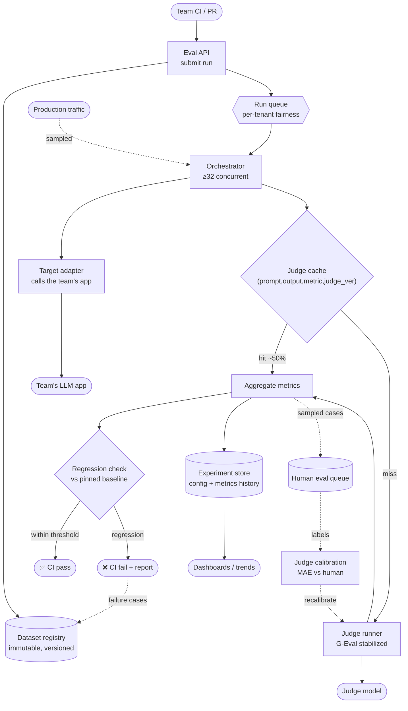

# 07 — LLM Evaluation Platform

> **Prompt:** Design an LLM evaluation platform — dataset management, offline evaluation, LLM-as-a-judge, human evaluation, metrics, regression detection, experiment tracking.

> **Overlaps** [`21_ai-system-design-deep-dives/04_agent_eval_guardrail_platform.md`](../../21_ai-system-design-deep-dives/04_agent_eval_guardrail_platform.md) (eval + guardrails combined, single fintech agent) and builds on the concepts in [`16_evals/`](../../16_evals/README.md). **This file is the multi-tenant platform** — the system 20 other teams' CI pipelines call.

---

## The three-sentence compression

*Rehearse this before opening any other file. It is the opening answer.*

1. **The choice that matters most:** **tiered suites** — a 50-case smoke suite on every PR and a 200-case full suite nightly — because the platform sits *in the release path*, and the requirements as stated are mutually unsatisfiable: a 200-case run costs ~$6.78 against a $2.00 ceiling and can't reliably finish inside a CI gate. Tiering decouples "fast and cheap enough for every PR" from "thorough enough to trust," which are genuinely different requirements.
2. **The alternative I rejected:** one comprehensive suite on every PR. It's simpler and it's what teams ask for, but at ~$102k/month and 10+ minute runtimes, teams disable the gate — and a bypassed gate is worth less than no gate, because it creates false confidence.
3. **The failure mode I'd volunteer:** **an uncalibrated judge silently invalidating every gate.** A naive "score this 0–10" judge swings several points across identical reruns, so a 3-point regression threshold fires on noise. Teams then either disable the gate or learn to ignore it. Judge determinism (G-Eval-style: fixed CoT steps plus probability-weighted scoring) is therefore load-bearing infrastructure, not a refinement.

---

## Architecture at a glance



**The judge cache sits before the judge runner deliberately** — on iterative PRs most cases are unchanged,
and re-judging identical (prompt, output) pairs is the largest avoidable cost in the system.

---

## Key numbers

| Dimension | Value |
|---|---|
| **Tenants** | 20 product teams · isolated datasets |
| Volume | 500 suite runs/day (~25/team) |
| **Suite runtime** | p95 < 10 min for 200 cases — **must fit a CI gate** |
| Parallelism | ≥ 32 concurrent judge calls |
| **Judge determinism** | score σ < 0.05 across reruns |
| **Judge–human agreement** | MAE ≤ 1.0 on a 0–10 scale |
| Regression threshold | > 3-point drop blocks the deploy |
| Availability | 99.5% — internal; a retry is acceptable |
| **Cost** | ⚠️ $6.78/run vs a $2.00 ceiling → **~$0.90 (PR) / $2.30 (nightly)** after tiering |
| Retention | Runs + traces 1 year |

---

## The findings that matter

**1. The stated requirements are mutually unsatisfiable, and tiering is the structural fix.**

```
200 cases × 3 metrics = 600 judge calls @ frontier tier ≈ $4.50
              + the target app's own 200 calls          ≈ $2.28
                                                          ──────
                                                          $6.78/run   vs a $2.00 ceiling
500 runs/day ⇒ ≈ $102k/month
```

Three levers get there: **small-tier judges for cheap metrics** (−60%), a **judge verdict cache**
(−50% on iterative PRs), and **tiered suites** (−75% of PR-path volume). Tiering is the one that changes
the architecture rather than tuning it. Full arithmetic in [§1.6](01_requirements.md#16-capacity--cost-estimation).

**2. If the platform is slow or flaky, teams route around it.** That makes CI runtime and judge
determinism *product* requirements rather than engineering preferences — and a bypassed gate is worse than
no gate, because it manufactures false confidence.

**3. A naive LLM judge makes regression detection statistically meaningless.** Asking a model to "score
this 0–10" produces multi-point swings on identical inputs, so a 3-point threshold fires on noise. The fix
is **G-Eval-style stabilization** — chain-of-thought evaluation steps generated once and reused, plus
probability-weighted scoring over candidate score tokens — bringing variance under 0.05. See
[`16_evals/15`](../../16_evals/15-mastering-g-eval-deterministic-judge.md).

---

## Files

| File | Contents |
|---|---|
| **[01_requirements.md](01_requirements.md)** | Problem & users · functional requirements · NFRs · non-goals · runtime budget · **cost arithmetic + tiering** · assumptions |
| **[02_hld.md](02_hld.md)** | Architecture · judge stabilization · dataset versioning · caching · regression detection · failure modes · scale plan |
| **[03_lld.md](03_lld.md)** | Schemas · APIs · G-Eval scoring, caching & regression algorithms · sequence diagrams · run/dataset state machines · edge cases |
| **[04_production_and_interview.md](04_production_and_interview.md)** | AI-specific concerns · runbook · common mistakes · interview follow-ups · glossary |

**Shared front-matter:** [`../00_requirements_all_systems.md#7-llm-evaluation-platform`](../00_requirements_all_systems.md#7-llm-evaluation-platform)

---

## Relationship to the other designs

| Relates to | How |
|---|---|
| **[`16_evals/`](../../16_evals/README.md)** | The **conceptual foundation** — metric definitions, G-Eval, RAG triad. This design is that material built as a multi-tenant service |
| [01 — RAG](../01_production_rag_system/README.md) | A **tenant**: its CI gate ([FR-8](../01_production_rag_system/01_requirements.md#evaluation--feedback)) calls this platform |
| [02 — Support agent](../02_customer_support_agent/README.md) | A tenant with unusual needs — asymmetric gating on escalation recall |
| [09 — Gateway](../00_requirements_all_systems.md#9-multi-provider-llm-platform) | Judge calls route through it; **log-prob availability is a hard dependency** ([A1](01_requirements.md#assumptions)) |
