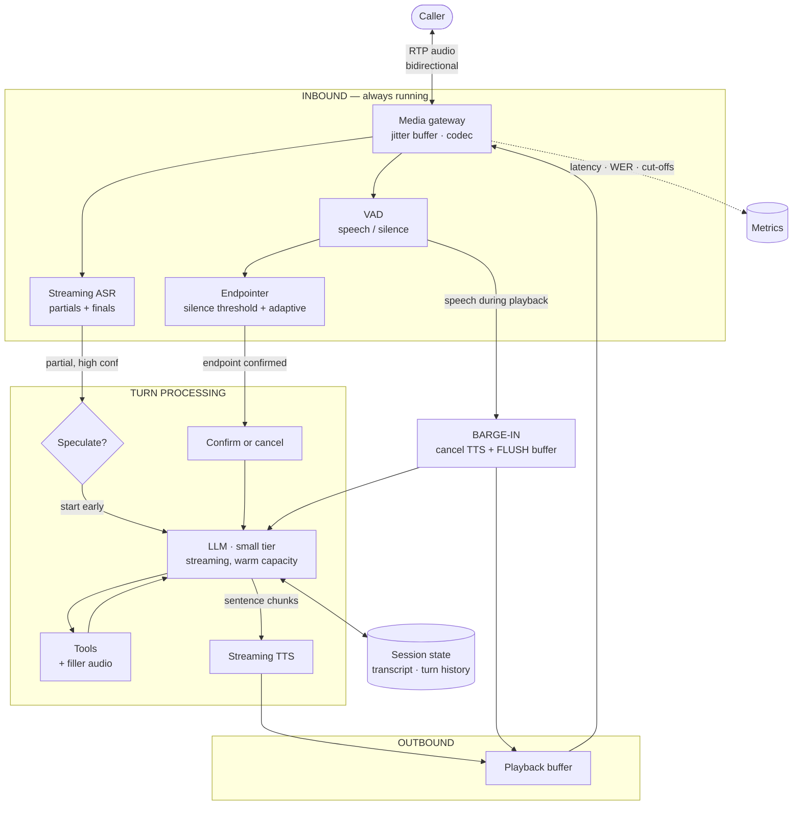

# 02 · High-Level Design — Real-Time Voice Assistant

> **Phase 2 of 4** · [← Requirements](01_requirements.md) · [LLD →](03_lld.md)

---

## 2.1 Architecture

The distinguishing structural property: **audio flows in both directions simultaneously and continuously**,
so this is a duplex pipeline with two independent control loops rather than a request/response path.

| Loop | Trigger | Deadline | What it does |
|---|---|---|---|
| **Turn loop** | Caller stops speaking | **800 ms** | ASR → endpoint → LLM → TTS → audio out |
| **Barge-in loop** | Caller speaks *during* playback | **150 ms** | Halt TTS, flush buffer, return to listening |
| Session loop | Call start/end | seconds | State, transcript, escalation, teardown |

**`BI --> PB` is the arrow that matters most.** Barge-in must flush the *playback buffer*, not merely cancel
TTS generation — otherwise seconds of already-synthesized audio keep playing and the caller experiences the
system talking over them ([§3.3](03_lld.md#barge-in)).

---

## 2.2 Component choices

### Endpointing — the most-tuned parameter

| Concern | Choice | Why | Rejected alternative (and why not) | Revisit when |
|---|---|---|---|---|
| **Endpoint detection** | **VAD + adaptive silence threshold**, with **speculative LLM start** | The budget doesn't close otherwise ([§1.5](01_requirements.md#15-the-latency-budget--the-hardest-in-this-set)). Speculation buys ~150 ms by doing work earlier | **Fixed 700 ms silence threshold** (a common default) — safe against cut-offs, and blows the budget by ~500 ms. **Waiting for confirmed endpoint** — simpler, hard-fails the SLO | Never fixed; the *adaptation policy* is tunable |
| Silence threshold | ~250 ms baseline, **adapted per speaker** | No single value is correct for all speakers — fast talkers tolerate 180 ms, slow/elderly speakers need 500 ms+ | One global value — optimizes the average and fails the tails in **both** directions | Continuously; it's a monitored parameter |
| Semantic endpointing | Use ASR partial + a lightweight completeness check | *"I'd like to change my…"* is clearly unfinished regardless of silence length | **Silence only** — cuts off mid-sentence pauses, which are common in natural speech | — |

**Why endpointing fails in two directions, and why that's the crux.** Too aggressive: the system responds
to *"I'd like to book an appointment for…"* (pause) and cuts the caller off — a correctness failure that
directly damages the interaction. Too conservative: every turn feels laggy and the caller starts talking
over the system anyway. **There is no globally correct setting**, which is why both `cut_off_rate` and
response latency are monitored NFRs and why adaptation is per-session rather than a config constant.

> **Mental model:** endpointing is a **turn-taking referee** deciding when the caller has yielded the floor.
>
> *Where the analogy breaks:* a human referee understands *meaning* and knows a sentence is unfinished. A
> silence-based endpointer only measures gaps — which is precisely why semantic completeness checking on
> the ASR partial is worth its small cost.

### Speculative endpointing — the design's central mechanism

| Aspect | Decision |
|---|---|
| **Trigger** | ASR partial is semantically complete **and** ASR confidence is high **and** silence has exceeded ~120 ms |
| **On confirmed endpoint** | Continue the in-flight LLM call — the ~150 ms saving is realized |
| **On continued speech** | **Cancel** the LLM call, discard the partial response, restart on the extended transcript |
| **Cost of a false trigger** | One wasted small-tier LLM call ≈ $0.0002 |
| **Expected false-trigger rate** | ~10–15% ([A4](01_requirements.md#assumptions)) |
| **Worst case** | Speculative response *starts playing* before the caller finished ⇒ treated as barge-in |

**The economics are what make this viable, and they depend on the small-tier constraint.** A wasted
frontier-tier call would be ~$0.015 and 900 ms of capacity; a wasted small-tier call is ~$0.0002. **The
constraint that forced a small model (latency) is what makes the mitigation for that same constraint
affordable** — a genuinely nice property, and worth stating in an interview.

**The guard that keeps it safe:** a speculative response must not begin *playing* until the endpoint is
confirmed. Generation starts early; playback does not. That converts the worst case from "talked over the
caller" into "wasted a cheap call."

### Barge-in

| Concern | Choice | Why | Rejected alternative | Revisit when |
|---|---|---|---|---|
| **Detection** | VAD on the inbound stream **during** playback | Must run continuously — the system is talking, and the caller may too | Half-duplex (mute input while speaking) — **makes barge-in impossible**; the caller shouts into a void | Never |
| **Halt mechanism** | Cancel TTS **and flush the playback buffer** | Cancelling generation alone leaves buffered audio playing for seconds | Drain the buffer — the caller keeps hearing the system | Never |
| Echo handling | Acoustic echo cancellation before VAD | Without it, the system's own audio triggers barge-in against itself | Naive VAD — the system interrupts itself constantly | — |
| **Resume policy** | Discard the interrupted response; re-plan from the new input | The caller interrupted *because* the answer was wrong or they had more to say | Resume where it left off — answers a question that's been superseded | — |

**Echo cancellation is the failure that looks like a mystery bug.** Without AEC, the system's own TTS audio
loops back through the caller's handset, VAD detects "speech," barge-in fires, and the system interrupts
itself mid-sentence — repeatedly, and apparently at random.

### The model tier

| Concern | Choice | Why | Rejected alternative | Revisit when |
|---|---|---|---|---|
| **LLM tier** | **Small, warm, pinned capacity** | 250 ms TTFT is only achievable on a small model with no cold start. **Physics, not cost** | **Frontier tier** — ~900 ms TTFT alone exceeds the whole 800 ms budget | [Q1](01_requirements.md#open-questions) — if the SLO relaxes to ~1,200 ms, a frontier model fits and quality rises materially |
| Capacity | Reserved/pre-warmed via [04](../04_llm_inference_platform/README.md) | A cold start blows the budget outright | On-demand — first-call latency is unbounded | — |
| Prompt | Short system prompt; **conciseness instructed** | Long prompts raise TTFT; long answers raise TTS cost (57% of spend) | Verbose prompt/answers — worse on latency **and** cost | — |
| ASR | Streaming, telephony-tuned | 8 kHz narrowband is materially harder than wideband | Batch ASR — no partials ⇒ no speculation ⇒ budget fails | — |
| TTS | Streaming, sentence-chunked | First audio at 120 ms rather than after full synthesis | Batch TTS — adds full synthesis time to every turn | — |

**Conciseness is a triple win here** and worth calling out: shorter answers reduce TTS cost (the largest
line item), reduce time-to-complete-response, and reduce the window in which a caller might barge in out of
impatience.

---

## 2.3 Data flow

### A normal turn, with speculation

1. **Audio arrives** continuously; the media gateway maintains a jitter buffer and decodes the codec.
2. **VAD and ASR run in parallel and continuously** — VAD produces speech/silence, ASR produces partial
   hypotheses < 200 ms behind speech.
3. **At ~120 ms of silence**, the speculation check runs: is the ASR partial semantically complete, and is
   confidence high? If yes → **start the LLM call now** on the partial transcript.
4. **At ~250 ms of silence** (adapted per speaker), the endpointer confirms end-of-turn.
   - **Speculation was correct** → the in-flight LLM call continues; ~150 ms already saved.
   - **Caller resumed speaking** → cancel the LLM call, discard, restart on the extended transcript.
5. **LLM streams a response**; the orchestrator emits **complete sentences** to TTS rather than tokens, so
   TTS has prosodically-sensible units.
6. **TTS streams audio frames** into the playback buffer; the first chunk targets 120 ms.
7. **Playback begins** — only now, and only if the endpoint is confirmed.
8. **Throughout playback, VAD keeps listening.** Caller speech → barge-in: cancel TTS, **flush the playback
   buffer**, discard the response, return to listening.
9. **Turn completes**; transcript and metrics are written **asynchronously** — never on the audio path.

**Step 5 emitting sentences rather than tokens is a small decision with audible consequences.** TTS given
token fragments produces choppy, mis-stressed prosody; given complete sentences it produces natural
intonation. The cost is waiting for a sentence boundary before the first chunk — which is already in the
budget.

### A tool-calling turn

Steps 1–5, then:

6. **LLM emits a tool call.** The orchestrator immediately begins **filler audio** ("let me pull that up")
   while the tool executes.
7. **Tool returns**; a second LLM call phrases the result.
8. **Response streams** as normal.

**Filler audio makes an otherwise-fatal latency acceptable.** A 1.5 s billing-API call inside an 800 ms
budget is impossible to hide — but conversationally normal if the system says something first. Same
side-effect gating as [02](../02_customer_support_agent/03_lld.md#the-policy-engine) applies to any
write action.

---

## 2.4 NFR mapping

| NFR | Target | Delivered by |
|---|---|---|
| **Response p95 < 800 ms** | 800 ms | **Speculative endpointing (−150 ms)** · co-location (−40 ms) · small-tier warm LLM · streaming ASR + TTS ⇒ ~680 ms |
| **Barge-in < 150 ms** | 150 ms | Continuous VAD during playback · cancel TTS **and flush buffer** · AEC |
| Endpointing p95 < 300 ms | 300 ms | VAD + adaptive threshold + semantic completeness |
| First TTS audio < 250 ms | 250 ms | Sentence-chunked streaming TTS |
| ASR WER < 8% | — | Telephony-tuned streaming model; per-cohort WER monitoring |
| **Cut-off rate < 2%** | 2% | Per-speaker threshold adaptation · semantic completeness check |
| Containment ≥ 40% | — | Tool integration · KB answers · escalation on low confidence |
| Escalation recall ≥ 0.98 | — | Hard rules + classifier, per [02](../02_customer_support_agent/03_lld.md#escalation-rules--the-floor-beneath-the-classifier) |
| 1,000 concurrent calls | — | Stateless turn processing · external session state · provider stream quotas ([Q3](01_requirements.md#open-questions)) |
| Availability 99.95% | — | Multi-AZ media gateways · provider fallback · **graceful in-call degradation** |
| Cost ≤ $0.08/min | ~$0.0157 | Small-tier LLM · concise responses (TTS is 57% of cost) |

---

## 2.5 Failure modes & blast radius

| # | Failure | Detection | Blast radius | Mitigation & degraded mode |
|---|---|---|---|---|
| **F1** | **Endpointing too aggressive** | **Cut-off rate** > 2%; callers repeating themselves | Every call, worst for slow speakers | Per-speaker adaptation · semantic completeness · **monitor cut-off rate alongside latency**. *The failure I'd volunteer* |
| **F2** | Endpointing too conservative | Response latency p95 | Every call feels laggy | Same adaptation, opposite direction — **the two failures share one parameter** |
| **F3** | **Barge-in doesn't flush the buffer** | Caller reports being talked over | Every interruption | **Flush, don't drain** ([§3.3](03_lld.md#barge-in)) |
| **F4** | **No echo cancellation** | System interrupts itself mid-sentence | Every call — looks random | AEC before VAD; validate per codec |
| **F5** | LLM cold start | TTFT p99 spike | Calls hitting a cold instance | Pre-warmed pinned capacity ([04](../04_llm_inference_platform/README.md)) · never scale from zero |
| **F6** | ASR degrades on an accent or noisy line | **WER by cohort** | That cohort | Cohort-segmented WER monitoring · ask for clarification rather than guessing ([FR-9](01_requirements.md#conversation-quality)) · escalate on repeated low confidence |
| **F7** | Speculation false-trigger rate spikes | Speculation cancel rate | Wasted cost (small) + risk of premature playback | Tighten the confidence threshold · **playback still gated on confirmed endpoint** |
| **F8** | TTS provider outage | Error rate | **All calls — the system goes mute** | Fallback TTS voice (worse quality, still speech) · **pre-recorded escalation message** as the last resort |
| **F9** | ASR provider outage | Error rate | All calls — system deaf | Fallback provider · **immediate transfer to a human with an explanation** |
| **F10** | Tool call exceeds filler audio | Turn duration | That turn | Second filler ("still checking") · timeout → escalate |
| **F11** | **Concurrent-stream quota exhausted** | Provider 429s / rejected streams | **New calls dropped** | Pre-verified quotas ([Q3](01_requirements.md#open-questions)) · queue with a hold message · overflow to human queue |
| **F12** | Session state lost mid-call | Redis health | That call | Degrade to single-turn with an honest "sorry, could you repeat that" · far better than incoherence |
| **F13** | Barge-in during a compliance disclosure | Policy audit | Compliance exposure | **Disclosures marked non-interruptible** ([Q5](01_requirements.md#open-questions)) |

**On F1/F2 together, because they are one parameter with two failure directions.** Optimizing response
latency pushes the silence threshold down, which cuts off slow speakers; optimizing against cut-offs pushes
it up, which makes every turn laggy. **Neither metric alone can be trusted** — a dashboard showing improving
latency may be showing a system that increasingly interrupts its callers. That's why both are NFRs and why
they're reviewed together.

**On F8, because "the system goes mute" is a uniquely bad failure.** In a text product a provider outage
produces an error message. On a phone call it produces *silence* — the caller says "hello? hello?" and hangs
up. The degraded path has to be **pre-recorded audio** that doesn't depend on the failing provider, which
means it must be generated and cached in advance.

---

## 2.6 Scale plan

### 10× (10,000 concurrent calls)

| # | Bottleneck | Why | Change |
|---|---|---|---|
| 1 | **ASR/TTS concurrent-stream quotas** | 10,000 simultaneous streams each way — already the binding constraint at 1× | **Self-host ASR** (steady high volume — the [05](../05_document_intelligence/01_requirements.md#ocr--where-self-hosting-wins-100) profile) · multi-provider TTS · negotiated quotas |
| 2 | Media gateway capacity | 10,000 RTP sessions | Horizontal gateways; consistent-hash by call ID |
| 3 | **LLM warm capacity** | 650 QPS needing sub-250 ms TTFT with no cold starts | Reserved capacity on [04](../04_llm_inference_platform/README.md); at this volume self-hosting the small model becomes viable |
| 4 | Regional latency | Co-location was worth ~40 ms | Per-region full stacks; route calls to the nearest region |
| 5 | Cost | ~$283k/month | Still ~15× ROI; **self-hosted ASR/TTS is the lever**, since they're 96% of cost |

**Bottleneck 1 is the same conclusion [05](../05_document_intelligence/02_hld.md#ocr--the-build-vs-buy-that-goes-the-other-way)
reached about OCR**, and for the same three reasons: steady near-saturated utilization, a small
fixed-size model, and per-unit API pricing that's expensive relative to the underlying compute. At 10×,
self-hosting ASR flips from unjustifiable to obvious.

### 100× (100,000 concurrent calls)

| Concern | Change |
|---|---|
| Speech | Fully self-hosted ASR + TTS fleets; distilled models tuned for telephony |
| LLM | Self-hosted small model with speculative decoding; possibly a **speech-to-speech** model that collapses the pipeline |
| Pipeline | **Speech-to-speech end-to-end** removes ASR→LLM→TTS staging entirely — the biggest available latency win, at the cost of transcript-level control and auditability |
| Media | Edge termination; regional media gateways |
| Org | Media, speech, and conversation become separately-owned services |

**Speech-to-speech is the structural bet at 100×.** Collapsing three stages into one removes most of the
budget — but it also removes the transcript boundary where escalation classification, PII redaction, and
audit logging currently live. **That's a real trade, not a free win**, and it's worth naming as such.

### What does *not* change

- **Endpointing is monitored in both directions** — latency *and* cut-off rate.
- **Playback is gated on confirmed endpoint**, even when generation starts early.
- **Barge-in flushes the buffer**, never drains it.
- **AEC before VAD.**
- **Pre-recorded fallback audio** that doesn't depend on the TTS provider.
- **Warm LLM capacity** — never scale from zero.

---

## 2.7 Tech stack

> Shared substrate and the reasoning behind it: [`../00_tech_stack.md`](../00_tech_stack.md). This section
> carries only what is **specific to this system**.

| Layer | Choice | Rejected | Why | Revisit when |
|---|---|---|---|---|
| **Media plane** | **LiveKit** (WebRTC SFU) + **FreeSWITCH** for SIP/PSTN | Building on raw RTP | Jitter buffering, codec negotiation, and NAT traversal are years of work each | — |
| **Media-plane language** | **Go**, with **Rust** for frame-level DSP glue | Python | A 150 ms barge-in budget and 20 ms frame cadence do not survive GC pauses or the GIL | Never |
| **VAD** | **Silero VAD via ONNX Runtime, in-process** | A VAD service call | Endpointing decisions happen every 20 ms; a network hop per frame is absurd | — |
| **AEC** | **WebRTC AEC3 / speexdsp**, applied **before** VAD | AEC after VAD, or none | Without it the system's own TTS triggers barge-in and it interrupts itself | Never |
| **ASR** | **Streaming hosted** (Deepgram / AssemblyAI) with partial hypotheses | Batch ASR, or self-hosting at day one | Partial hypotheses are what make speculative endpointing possible at all | **At ~10× concurrency, self-host Whisper/Parakeet on Triton** — same verdict as [05](../05_document_intelligence/README.md)'s OCR |
| **TTS** | **Streaming** (ElevenLabs / Cartesia), sentence-chunked input | Full-response synthesis | Waiting for the last token before speaking adds seconds. **And TTS is ~57% of cost — the top optimization target** | Self-hosting once volume justifies a steady GPU |
| **LLM tier** | **Small tier, warm and pinned**, via [09](../09_multi_provider_llm_platform/README.md) | Frontier model | **~900 ms frontier TTFT exceeds the entire 800 ms budget.** A quality ceiling from physics, not cost | Only if the SLO is renegotiated |
| Session state | **Redis 7**, per-session adaptive endpointing thresholds | Postgres per turn | Read and written every turn on a millisecond budget | — |
| Turn / metrics store | **PostgreSQL** partitioned, per-stage latency columns | Aggregate latency | A six-stage budget with ~120 ms margin must be attributable per stage during an incident | — |
| Pre-rendered fallback audio | **S3 + local cache**, generated in advance | Synthesize on failure | The failure being covered *is* the synthesizer being down | Never |
| Co-location | ASR, LLM, TTS in **one region** | Cheapest region per component | Cross-region hops are ~40 ms each — a third of the remaining margin | — |
| Observability | Prometheus + **cut-off rate and speculation waste on one panel** | Latency alone | Endpointing fails in both directions; either metric alone invites optimizing into the other | Never |

**Go and in-process ONNX are not preferences here — they're what the budget permits.** Every other system
in this set can afford Python and a service call; a 150 ms barge-in requirement with 20 ms audio frames
cannot. **This is the one design where the language and the process boundary are load-bearing.**

**The ASR self-hosting threshold is the interesting forward-looking row.** At 1,000 concurrent calls,
hosted streaming ASR is the right call. At 10× it inverts, for exactly the reason
[05's OCR](../05_document_intelligence/README.md) inverted and
[04's LLM serving](../04_llm_inference_platform/README.md) did not: **a small fixed-shape model on a steady
stream keeps a GPU genuinely busy.**

---

**Next:** [03_lld.md →](03_lld.md) — session schemas, streaming protocols, the endpointing/speculation/barge-in algorithms, sequence diagrams, the turn state machine, and edge cases.
