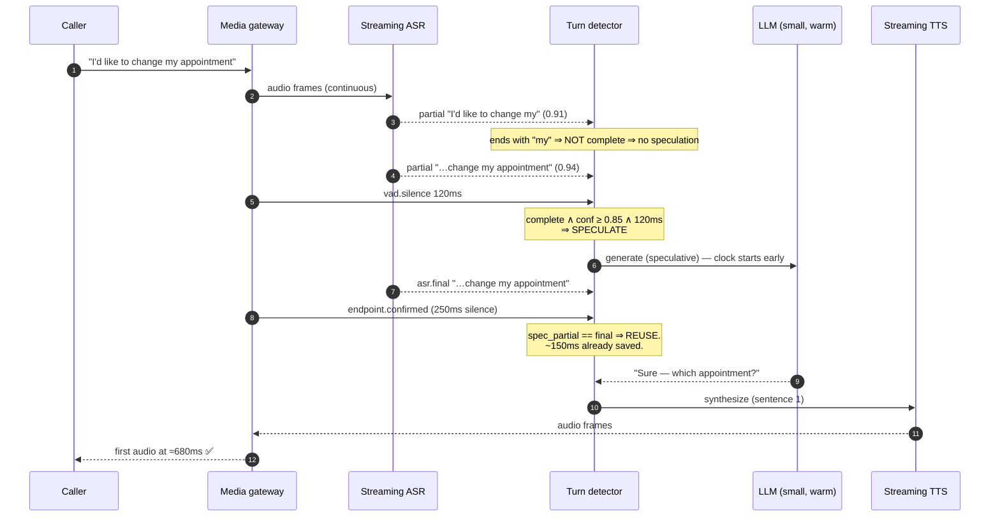
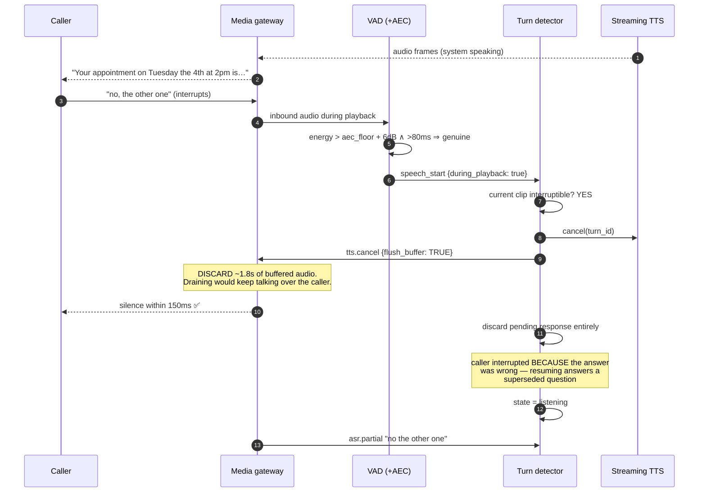
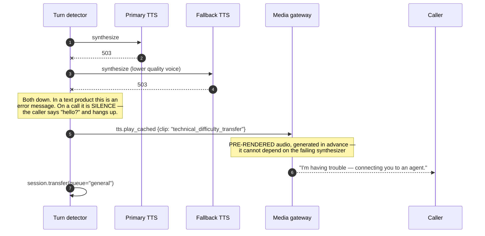
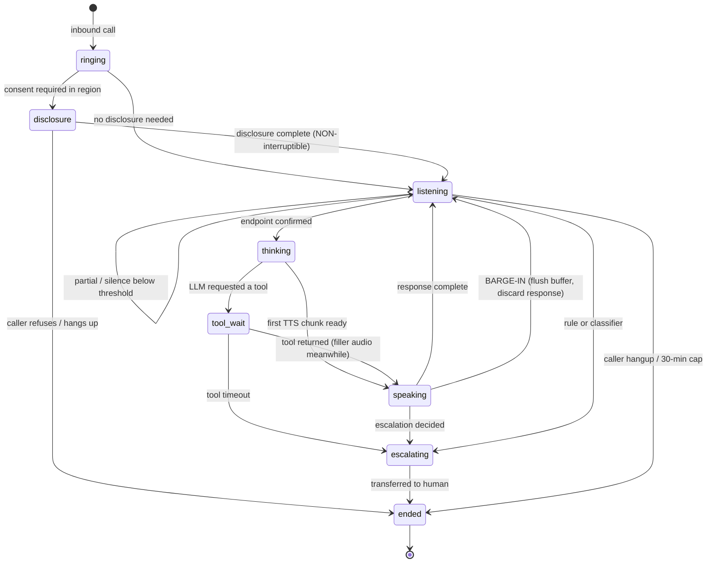
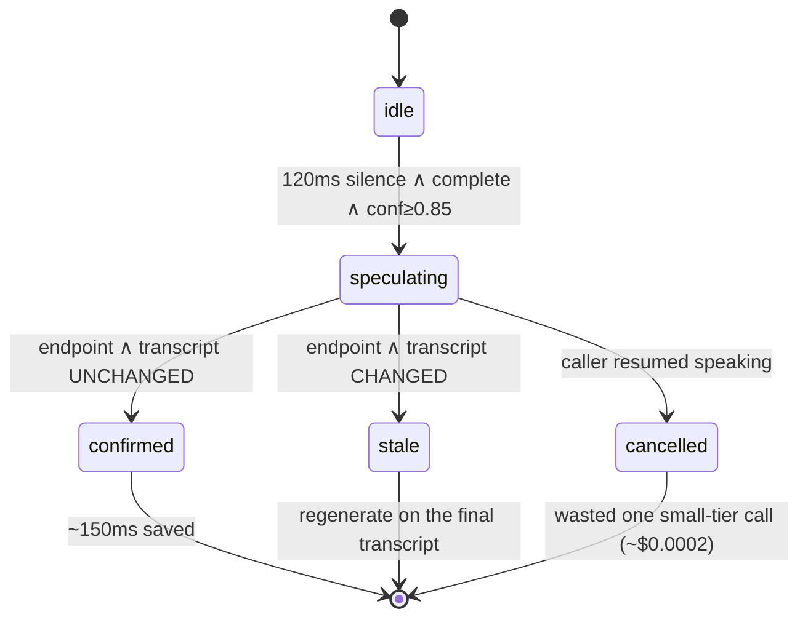

# 03 · Low-Level Design — Real-Time Voice Assistant

> **Phase 3 of 4** · [← HLD](02_hld.md) · [Production & interview →](04_production_and_interview.md)

---

## 3.1 Data models

Most state here is **in-memory and per-call** — a voice pipeline is a streaming system, so the durable
schemas are session records, transcripts, and metrics rather than a working dataset.

### Sessions

```sql
CREATE TABLE call_sessions (
    session_id      UUID PRIMARY KEY,
    tenant_id       UUID NOT NULL,
    caller_ref      TEXT,                        -- hashed/tokenized phone number, never raw
    channel         TEXT NOT NULL,               -- 'pstn' | 'webrtc' | 'app'
    codec           TEXT NOT NULL,               -- affects AEC config and WER
    sample_rate_hz  INT  NOT NULL,               -- 8000 (telephony) or 16000

    state           TEXT NOT NULL DEFAULT 'ringing',
    consent_state   TEXT NOT NULL,               -- 'not_required'|'announced'|'granted'|'refused'
    region          TEXT NOT NULL,               -- for co-location + data residency

    -- Per-session adaptive endpointing (§3.3) — the parameter that has no global value
    silence_threshold_ms INT NOT NULL DEFAULT 250,
    speech_rate_wpm      REAL,

    escalated_at    TIMESTAMPTZ,
    escalation_reason TEXT,
    containment     BOOLEAN,                     -- resolved without a human?

    started_at      TIMESTAMPTZ NOT NULL DEFAULT now(),
    ended_at        TIMESTAMPTZ,
    end_reason      TEXT,                        -- 'caller_hangup'|'escalated'|'error'|'timeout'

    CONSTRAINT cs_state_chk CHECK (state IN
        ('ringing','disclosure','listening','thinking','speaking','tool_wait','escalating','ended'))
);

CREATE INDEX idx_cs_active ON call_sessions (state, started_at)
    WHERE state <> 'ended';
CREATE INDEX idx_cs_tenant_time ON call_sessions (tenant_id, started_at DESC);
```

**`silence_threshold_ms` living on the session rather than in config is the schema expression of
[F1/F2](02_hld.md#25-failure-modes--blast-radius).** There is no globally correct endpointing threshold — fast
talkers tolerate 180 ms, slow speakers need 500 ms+ — so it adapts per call and is recorded for later
analysis of cut-offs.

**`codec` and `sample_rate_hz` are stored because they predict quality.** 8 kHz narrowband has materially
worse WER than 16 kHz, and AEC tuning is codec-dependent. When WER regresses for a cohort
([F6](02_hld.md#25-failure-modes--blast-radius)), the first question is which codec those calls used.

### Turns — with the latency breakdown that makes the budget auditable

```sql
CREATE TABLE turns (
    turn_id         UUID PRIMARY KEY,
    session_id      UUID NOT NULL REFERENCES call_sessions(session_id) ON DELETE CASCADE,
    ordinal         INT  NOT NULL,

    -- Caller side
    transcript      TEXT,
    asr_confidence  REAL,
    asr_engine      TEXT NOT NULL,
    speech_ms       INT,                         -- duration of caller speech

    -- Endpointing outcome — the tuning evidence
    endpoint_ms     INT,                         -- silence before endpoint confirmed
    was_cut_off     BOOLEAN NOT NULL DEFAULT FALSE,   -- caller resumed after we responded
    speculated      BOOLEAN NOT NULL DEFAULT FALSE,
    speculation_wasted BOOLEAN NOT NULL DEFAULT FALSE,

    -- System side
    response_text   TEXT,
    model_version   TEXT,
    tokens_in       INT,
    tokens_out      INT,
    tts_chars       INT,                         -- TTS is 57% of cost — track it per turn

    -- THE LATENCY BREAKDOWN. Per-stage, because the budget is 6 stages deep (§1.5)
    lat_asr_final_ms  INT,
    lat_endpoint_ms   INT,
    lat_llm_ttft_ms   INT,
    lat_tts_first_ms  INT,
    lat_total_ms      INT,                       -- caller stopped → first audio out

    barged_in       BOOLEAN NOT NULL DEFAULT FALSE,
    barge_in_ms     INT,                         -- detection → silence at the caller
    tool_calls      JSONB,

    created_at      TIMESTAMPTZ NOT NULL DEFAULT now(),
    CONSTRAINT turns_uniq UNIQUE (session_id, ordinal)
) PARTITION BY RANGE (created_at);

CREATE INDEX idx_turns_latency ON turns (created_at, lat_total_ms);
CREATE INDEX idx_turns_cutoff ON turns (created_at) WHERE was_cut_off = TRUE;
CREATE INDEX idx_turns_spec ON turns (created_at) WHERE speculated = TRUE;
```

> **The per-stage latency columns are not diagnostics-for-later — they're the only way to manage a
> six-stage budget with ~120 ms of margin.** A p95 breach must be attributable to a stage immediately;
> an aggregate `lat_total_ms` alone would require bisection during an incident.

**`was_cut_off` and `speculation_wasted` are the two columns that keep the design honest.** They measure
the *costs* of the latency optimizations: `was_cut_off` catches endpointing that got too aggressive
([F1](02_hld.md#25-failure-modes--blast-radius)), and `speculation_wasted` tracks the false-trigger rate
that [A4](01_requirements.md#assumptions) assumes is 10–15%. Both are partial-indexed because they're rare
and queried often.

**`was_cut_off` is inferred, not directly observed:** if the caller resumes speaking within ~1 s of the
system starting to respond, we almost certainly cut them off.

### Transcripts and audio

```sql
CREATE TABLE transcript_segments (
    segment_id   UUID PRIMARY KEY,
    session_id   UUID NOT NULL REFERENCES call_sessions(session_id) ON DELETE CASCADE,
    turn_id      UUID REFERENCES turns(turn_id),
    speaker      TEXT NOT NULL,                  -- 'caller' | 'assistant'
    text         TEXT NOT NULL,                  -- PII-redacted
    text_raw_ref TEXT,                           -- pointer to encrypted original
    start_ms     INT NOT NULL,                   -- offset from call start
    end_ms       INT NOT NULL,
    confidence   REAL
);

CREATE INDEX idx_ts_session ON transcript_segments (session_id, start_ms);
```

**Audio recordings are stored only when consent state permits**, referenced from the session rather than
inlined, with retention driven by `consent_state` and region ([Q2](01_requirements.md#open-questions)).
Redacted transcript text is the default read path; the raw form is a pointer, same pattern as
[02](../02_customer_support_agent/03_lld.md#conversations-and-turns).

---

## 3.2 API contracts

Voice has no request/response API in the usual sense — the contract is a **bidirectional stream**.

### Media session (WebRTC / SIP)

```
SIP INVITE / WebRTC offer
  ↓
Media gateway allocates a session, negotiates codec (Opus 16 kHz preferred; G.711 8 kHz fallback)
  ↓
RTP audio flows bidirectionally for the call duration
```

### Internal control stream (WebSocket, gateway ⇄ orchestrator)

The orchestrator never touches raw RTP; it consumes events and emits directives.

**Gateway → orchestrator:**

```jsonc
{ "type": "session.start", "session_id": "s-91", "codec": "opus",
  "sample_rate_hz": 16000, "region": "eu-west-1", "consent_state": "announced" }

{ "type": "vad.speech_start", "t_ms": 1204 }

{ "type": "asr.partial", "t_ms": 1620, "text": "I'd like to change my",
  "confidence": 0.91, "stable_prefix_len": 18 }

{ "type": "vad.silence", "t_ms": 2010, "duration_ms": 120 }   // ← speculation trigger point

{ "type": "asr.final", "t_ms": 2160, "text": "I'd like to change my appointment",
  "confidence": 0.94 }

{ "type": "endpoint.confirmed", "t_ms": 2260, "silence_ms": 250 }

{ "type": "vad.speech_start", "t_ms": 4820, "during_playback": true }  // ← BARGE-IN
```

**Orchestrator → gateway:**

```jsonc
{ "type": "tts.stream", "turn_id": "t-7", "text": "Sure — which appointment?",
  "voice": "neutral-en-gb", "interruptible": true }

{ "type": "tts.cancel", "turn_id": "t-7", "flush_buffer": true }   // ← MUST flush, not drain

{ "type": "tts.play_cached", "clip": "escalating_to_agent" }        // pre-recorded (F8)

{ "type": "session.transfer", "target_queue": "billing", "context_packet_id": "h-12" }
```

> **`flush_buffer: true` is the single most important field in this protocol.** Cancelling TTS *generation*
> while seconds of synthesized audio sit in the playback buffer means the caller keeps hearing the system —
> the [F3](02_hld.md#25-failure-modes--blast-radius) failure. The flag makes flush-vs-drain an explicit,
> reviewable decision rather than an implementation accident.

**`interruptible: false`** is how [Q5](01_requirements.md#open-questions) gets resolved in the protocol:
compliance disclosures are marked non-interruptible, and barge-in is suppressed for their duration.

**`tts.play_cached`** exists because a TTS outage makes the system *mute*
([F8](02_hld.md#25-failure-modes--blast-radius)). Pre-rendered clips must be generated and cached in advance,
since by definition they can't be synthesized when the synthesizer is down.

### Supporting endpoints

```http
GET  /internal/v1/sessions/{id}                 # live state, turn history, latency breakdown
GET  /internal/v1/sessions/{id}/transcript      # redacted; raw requires elevated scope
POST /internal/v1/sessions/{id}:transfer        # to a human queue + context packet
GET  /internal/v1/metrics/latency?window=1h     # per-stage percentiles
GET  /internal/v1/metrics/endpointing?window=1h # cut-off rate + speculation waste TOGETHER
```

**The endpointing metrics endpoint deliberately returns both numbers in one payload.** They are two failure
directions of one parameter ([F1/F2](02_hld.md#25-failure-modes--blast-radius)), and looking at either alone
invites optimizing one into the other.

---

## 3.3 Core algorithms

### Endpointing with speculation

```python
SPECULATION_SILENCE_MS = 120      # start LLM early at this point
BASE_ENDPOINT_MS       = 250      # confirm end-of-turn (adapted per session)
MIN_ENDPOINT_MS        = 180
MAX_ENDPOINT_MS        = 600
SPEC_CONFIDENCE_MIN    = 0.85

class TurnDetector:
    """The mechanism that closes the 70ms budget gap (§1.5).
    Two thresholds: an early SPECULATIVE one and a confirming one."""

    def __init__(self, session: Session):
        self.session = session
        self.spec_task: asyncio.Task | None = None
        self.spec_partial: str | None = None

    async def on_silence(self, silence_ms: int, partial: AsrPartial) -> None:
        threshold = self.session.silence_threshold_ms      # adaptive, per speaker

        # ---- Speculative start: do the work early, DON'T play it yet ----
        if (self.spec_task is None
                and silence_ms >= SPECULATION_SILENCE_MS
                and partial.confidence >= SPEC_CONFIDENCE_MIN
                and looks_semantically_complete(partial.text)):
            self.spec_partial = partial.text
            self.spec_task = asyncio.create_task(
                generate_response(self.session, partial.text, speculative=True)
            )

        # ---- Confirmed endpoint ----
        if silence_ms >= threshold:
            await self._confirm(partial)

    async def on_speech_resumed(self) -> None:
        """Caller kept talking — the speculation was wrong. Cancel and discard."""
        if self.spec_task is not None:
            self.spec_task.cancel()
            metrics.incr("speculation.wasted")
            self.spec_task = None
            self.spec_partial = None

    async def _confirm(self, final: AsrPartial) -> None:
        if self.spec_task is not None and self.spec_partial == final.text:
            # Speculation was correct: the response is already in flight.
            # THIS is where the ~150ms is realized.
            response = await self.spec_task
            metrics.incr("speculation.hit")
        else:
            if self.spec_task is not None:
                self.spec_task.cancel()           # transcript changed after speculating
                metrics.incr("speculation.stale")
            response = await generate_response(self.session, final.text, speculative=False)

        # Playback ONLY after confirmation — never during speculation.
        await self.session.play(response)


def looks_semantically_complete(text: str) -> bool:
    """Silence alone cuts off mid-sentence pauses, which are common in natural
    speech. A cheap completeness check avoids the worst false triggers."""
    t = text.strip().lower()
    if not t:
        return False
    if t.endswith(TRAILING_CONNECTIVES):   # 'my', 'the', 'and', 'to', 'for', 'because'
        return False
    if t.split()[-1] in FILLER_WORDS:      # 'um', 'uh', 'like'
        return False
    return len(t.split()) >= 2
```

**Three decisions worth defending:**

1. **Generation starts early; playback does not.** This converts the worst case from *"talked over the
   caller"* into *"wasted a cheap call"* — and it's what makes speculation safe rather than reckless.
2. **`spec_partial == final.text` is checked before reusing the speculation.** If the caller added even one
   word, the in-flight response answers a different question and must be discarded.
3. **`looks_semantically_complete` is deliberately crude.** A trailing "my" or "and" is an unmistakable
   signal of an unfinished sentence, and catching those cheaply avoids most false triggers without an
   extra model call in the hot path.

### Per-speaker threshold adaptation

```python
def adapt_threshold(session: Session, turn: Turn) -> None:
    """No global value is correct (§2.2). Adapt to the speaker, and use the
    CUT-OFF signal — the metric that catches over-aggressive endpointing (F1)."""
    if turn.was_cut_off:
        # We responded and they kept talking ⇒ we cut them off. Back off hard.
        session.silence_threshold_ms = min(
            MAX_ENDPOINT_MS, int(session.silence_threshold_ms * 1.4)
        )
        metrics.incr("endpoint.cut_off")
        return

    # Fast, fluent speakers tolerate a shorter window — tighten cautiously.
    if turn.speech_rate_wpm and turn.speech_rate_wpm > 160 and turn.endpoint_ms:
        session.silence_threshold_ms = max(
            MIN_ENDPOINT_MS, int(session.silence_threshold_ms * 0.95)
        )
```

**Asymmetric adaptation is intentional: back off fast (×1.4), tighten slowly (×0.95).** Cutting off a
caller is a *correctness* failure; being 40 ms slower is a mild latency cost. The asymmetry in the
multipliers encodes the asymmetry in the consequences.

### Barge-in

```python
BARGE_IN_MIN_SPEECH_MS = 80        # ignore coughs/clicks
BARGE_IN_ENERGY_MARGIN = 6         # dB above the AEC residual floor

async def on_speech_during_playback(session: Session, ev: VadEvent) -> None:
    """< 150ms from detection to silence at the caller (FR-4).
    The buffer must be FLUSHED, not drained (F3)."""

    if session.current_clip and not session.current_clip.interruptible:
        return                                  # compliance disclosure (Q5)

    # AEC residual can look like speech — require a real margin above the floor
    if ev.duration_ms < BARGE_IN_MIN_SPEECH_MS or ev.energy_db < (
            session.aec_floor_db + BARGE_IN_ENERGY_MARGIN):
        return                                  # not a genuine interruption (F4)

    t0 = now_ms()

    # 1. Stop producing
    await session.tts.cancel(session.current_turn_id)
    # 2. DISCARD buffered audio — draining means the caller keeps hearing us
    await session.gateway.send({"type": "tts.cancel",
                                "turn_id": session.current_turn_id,
                                "flush_buffer": True})
    # 3. Abandon the in-flight response entirely.
    #    The caller interrupted BECAUSE the answer was wrong or incomplete —
    #    resuming would answer a superseded question.
    session.discard_pending_response()
    session.state = "listening"

    metrics.observe("barge_in_ms", now_ms() - t0)
```

**The AEC energy-margin check is what stops the system interrupting itself.** Acoustic echo cancellation
leaves a residual; without requiring speech to exceed that floor by a real margin, the system's own TTS
triggers barge-in and it cuts itself off mid-sentence, apparently at random
([F4](02_hld.md#25-failure-modes--blast-radius)).

### Sentence-chunked TTS

```python
async def stream_response_to_tts(session: Session, llm_stream) -> None:
    """Emit COMPLETE SENTENCES to TTS, not tokens. Token fragments produce
    choppy, mis-stressed prosody; sentences produce natural intonation (§2.3)."""
    buf = ""
    first_chunk_sent = False

    async for token in llm_stream:
        buf += token
        sentence, remainder = split_first_sentence(buf)
        if sentence is None:
            continue

        await session.tts.synthesize(sentence, first=not first_chunk_sent)
        if not first_chunk_sent:
            metrics.observe("lat_tts_first_ms", session.turn_elapsed_ms())
            first_chunk_sent = True
        buf = remainder

    if buf.strip():                              # trailing fragment
        await session.tts.synthesize(buf, first=not first_chunk_sent)
```

---

## 3.4 Sequence diagrams

### A turn where speculation pays off



### Barge-in mid-response



### TTS provider outage — the system must not go mute



---

## 3.5 State machines

### Call session



**Two transitions carry the design's character:**

- **`disclosure → listening` is non-interruptible**, resolving [Q5](01_requirements.md#open-questions) as a
  state-machine property rather than a runtime condition.
- **`speaking → listening` via barge-in discards the response.** The caller interrupted because the answer
  was wrong or they had more to say; resuming would answer a superseded question.

### Speculation



**`stale` and `cancelled` are distinct because they measure different things.** `cancelled` means the
speculation *trigger* was wrong (the caller wasn't finished) and drives threshold adaptation. `stale` means
the trigger was reasonable but ASR revised the transcript, which points at ASR stability instead.

---

## 3.6 Edge cases & correctness

| # | Edge case | Handling | Why |
|---|---|---|---|
| E1 | **Caller pauses mid-sentence** ("I'd like to change my…") | Semantic completeness check blocks speculation and endpointing | Silence alone cuts off natural mid-sentence pauses |
| E2 | **Slow speaker consistently cut off** | Threshold backs off ×1.4 on each detected cut-off | Asymmetric adaptation: cut-offs are correctness failures |
| E3 | Very fast speaker | Threshold tightens ×0.95, floored at 180 ms | Cautious tightening; the downside is worse than the upside |
| E4 | **Speculation fires, caller continues** | Cancel the LLM call, discard, restart on the extended transcript | Costs ~$0.0002 — the whole reason a small tier makes speculation viable |
| E5 | **Speculative response would play before the endpoint** | **Playback gated on confirmation** | Converts "talked over the caller" into "wasted a cheap call" |
| E6 | **AEC residual triggers barge-in** | Require energy > `aec_floor + 6 dB` and > 80 ms | Otherwise the system interrupts itself, apparently at random |
| E7 | Cough / line click during playback | Same energy + duration gate | A cough is not an interruption |
| E8 | **Barge-in with audio already buffered** | **Flush**, don't drain | Draining keeps the system talking over the caller |
| E9 | **Barge-in during a compliance disclosure** | `interruptible: false` suppresses barge-in | Legal requirement conflicts with [FR-4](01_requirements.md#core-pipeline); policy wins |
| E10 | **TTS provider down** | Fallback voice → **pre-rendered cached clip** → transfer | Silence on a phone call is the worst failure available |
| E11 | ASR provider down | Fallback provider → cached clip → immediate human transfer | The system is deaf; don't pretend otherwise |
| E12 | Low ASR confidence | **Ask for clarification; never guess** | A wrong action from a misheard request is worse than a re-ask |
| E13 | Tool call exceeds filler audio | Second filler clip → timeout → escalate | Dead air reads as a dropped call |
| E14 | Caller silent for 15 s | Prompt once ("are you still there?"), then end gracefully | Distinguish thinking from an abandoned call |
| E15 | **30-minute session cap reached** | Warn, offer transfer, then end | Bounds context growth and cost |
| E16 | Session state lost mid-call | Honest "sorry, could you repeat that" | Far better than incoherent responses |
| E17 | **Concurrent-stream quota exhausted** | Hold message → overflow to human queue; **never drop silently** | A dropped call is invisible to us and infuriating to the caller |
| E18 | Two people on speakerphone | Diarization deferred ([FR-11](01_requirements.md#conversation-quality)); ASR takes the dominant speaker | v1 limitation, stated rather than hidden |
| E19 | **DTMF tones during speech** | Route to the IVR handler, not ASR | Keypad input is a separate channel |

**E5 is the invariant that makes the whole latency strategy defensible.** Speculation is an optimization
that starts *work* early, never *output*. Without the playback gate, an incorrect speculation produces the
worst possible voice-UX failure — the system talking over a caller mid-sentence — and the ~150 ms saving
would not be worth that risk.

---

**Next:** [04_production_and_interview.md →](04_production_and_interview.md)
