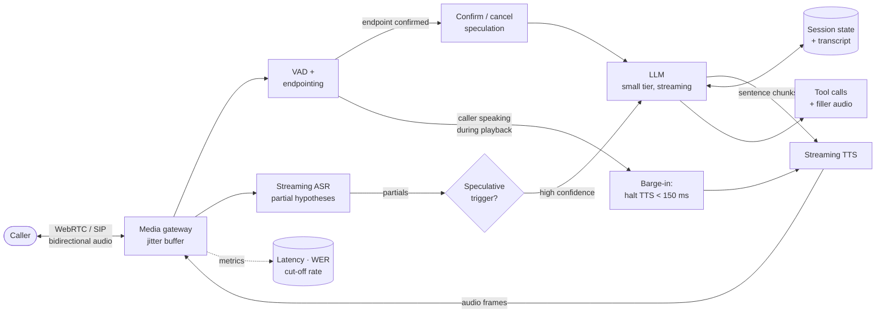

# 08 — Real-Time AI Voice Assistant

> **Prompt:** Design a real-time AI/voice assistant — audio streaming, ASR, interruption handling, LLM streaming, TTS, latency optimization, session management.

---

## The three-sentence compression

*Rehearse this before opening any other file. It is the opening answer.*

1. **The choice that matters most:** **speculative endpointing** — starting the LLM call on a high-confidence partial transcript *before* end-of-turn is confirmed — because the naive four-stage pipeline lands at ~870 ms against an 800 ms SLO, and **the budget does not close** without it. Combined with co-locating ASR, LLM, and TTS in one region, it brings p95 to ~680 ms.
2. **The alternative I rejected:** waiting for confirmed endpointing before invoking the LLM. It's simpler and wastes no tokens, but it hard-fails the latency requirement — and above ~800 ms callers start talking over the system, which breaks the interaction rather than merely slowing it.
3. **The failure mode I'd volunteer:** **endpointing is the single most-tuned parameter and it fails in both directions.** Too aggressive and the system cuts off slow speakers mid-sentence; too conservative and every turn feels laggy. There is no setting that is correct for all speakers, so it needs per-session adaptation and continuous monitoring of both cut-off rate and response latency.

---

## Architecture at a glance



**Note the two feedback paths from VAD.** One confirms or cancels speculation; the other triggers barge-in.
Voice is the only system in this set where the *user interrupting the machine* is a first-class control flow.

---

## Key numbers

| Dimension | Value |
|---|---|
| **Response latency** | **p95 < 800 ms** · target p50 < 500 ms |
| Naive budget | **≈ 870 ms** — ⚠️ **over by 70 ms** |
| After mitigations | ≈ 680 ms ✅ |
| **Barge-in stop** | < 150 ms |
| Endpointing decision | ~250 ms (the most-tuned parameter) |
| ASR WER | < 8% on telephony audio |
| Concurrency | 1,000 concurrent calls |
| Availability | 99.95% — phone calls fail loudly |
| **Cost** | ≈ $0.0157/min vs a $0.08 ceiling ✅ |
| **Cost split** | **ASR + TTS ≈ 96%; LLM ≈ 4%** |

---

## The findings that matter

**1. The budget doesn't close, and that's the design's central problem.**

```
60 (audio in) + 150 (ASR final) + 250 (endpointing) + 250 (LLM TTFT)
   + 120 (first TTS chunk) + 40 (audio out)  =  870 ms   vs an 800 ms SLO
```

Naming this rather than presenting a tidy sum is the point. **Speculative endpointing** (−150 ms) plus
**co-location** (−40 ms) reaches ~680 ms. Full derivation in
[§1.5](01_requirements.md#15-the-latency-budget--the-hardest-in-this-set).

**2. A frontier-tier LLM is impossible here.** Its ~900 ms TTFT alone exceeds the entire budget, so the
generator must be small-tier. **That's a quality ceiling imposed by physics, not by cost** — and if the
answers aren't good enough, the correct response is to renegotiate the SLO rather than the model
([Q1](01_requirements.md#open-questions)).

**3. Cost is inverted relative to every other system here.** ASR and TTS are ~96% of spend; the LLM is ~4%.
Optimization effort belongs in speech, not tokens — the opposite of
[01](../01_production_rag_system/README.md).

---

## Files

| File | Contents |
|---|---|
| **[01_requirements.md](01_requirements.md)** | Problem & users · functional requirements · NFRs · non-goals · **the budget that doesn't close** · cost arithmetic · assumptions |
| **[02_hld.md](02_hld.md)** | Architecture · speculative endpointing · barge-in · component choices · failure modes · scale plan |
| **[03_lld.md](03_lld.md)** | Session schemas · streaming protocols · endpointing/barge-in/speculation algorithms · sequence diagrams · turn state machine · edge cases |
| **[04_production_and_interview.md](04_production_and_interview.md)** | AI-specific concerns · runbook · common mistakes · interview follow-ups · glossary |

**Shared front-matter:** [`../00_requirements_all_systems.md#8-real-time-ai-voice-assistant`](../00_requirements_all_systems.md#8-real-time-ai-voice-assistant)

---

## Relationship to the other designs

| Relates to | How |
|---|---|
| [02 — Support agent](../02_customer_support_agent/README.md) | **The text counterpart.** Same intent/tool/handoff needs, but a 2 s budget instead of 800 ms for four stages. Its policy engine and handoff design apply directly |
| [04 — Inference platform](../04_llm_inference_platform/README.md) | The most latency-sensitive consumer: a 250 ms TTFT requirement that only a small model on warm, pinned capacity can meet |
| [01 — RAG](../01_production_rag_system/README.md) | **The latency contrast:** 1.5 s for TTFT *alone* there, vs 800 ms for the whole pipeline here |
