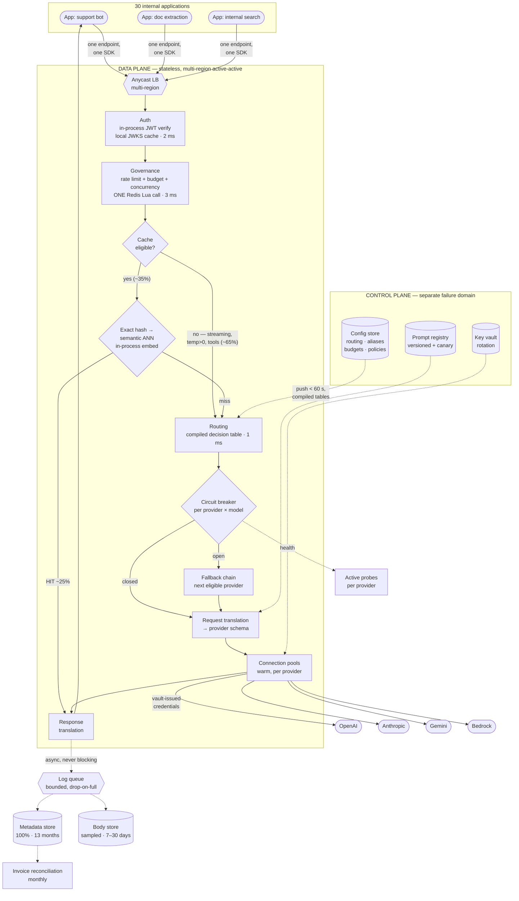
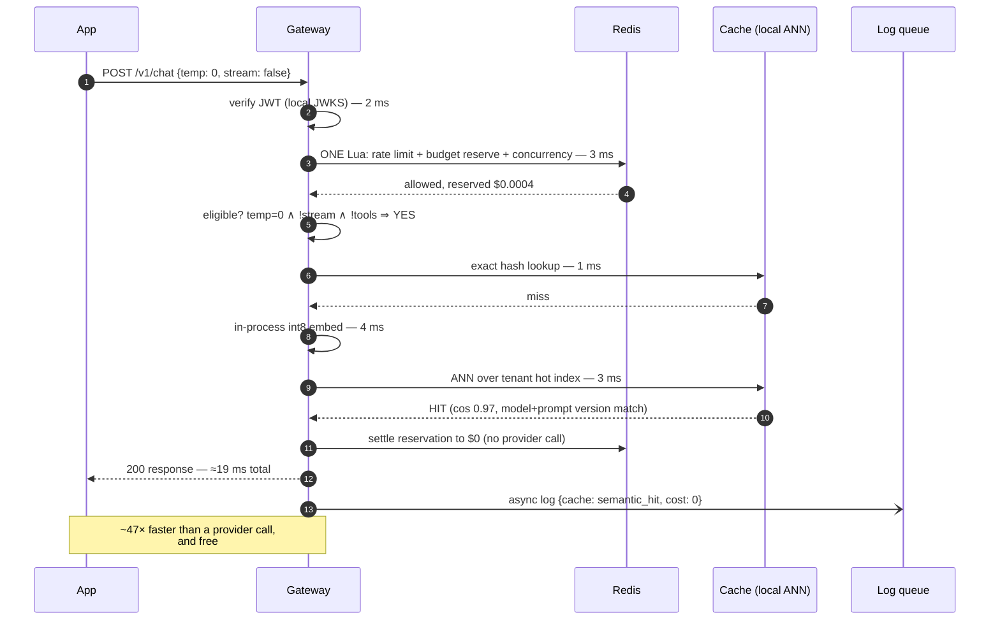
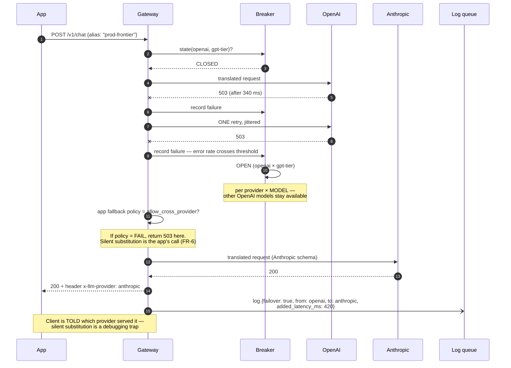
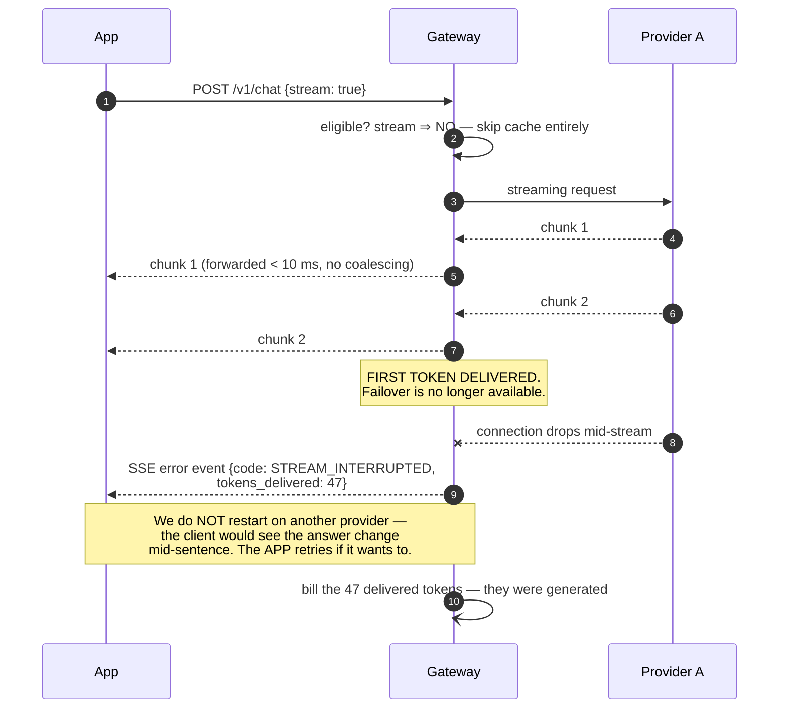

# 02 · High-Level Design — Multi-Provider LLM Platform

> **Phase 2 of 4** · [← Requirements](01_requirements.md) · [LLD →](03_lld.md)

---

## 2.1 Architecture

**Three structural properties carry the design:**

1. **The control plane is a separate failure domain, and config reaches the data plane as *compiled* state.**
   A config-store outage must not affect in-flight requests, and routing decisions must not require a
   lookup. Instances hold the last-known-good compiled table and keep serving.
2. **Eligibility is checked before the cache, not inside it.** The `ELIG` diamond sits ahead of `CACHE`
   because ~65% of traffic cannot be cached at all, and paying lookup cost on it is what breaks the 30 ms
   budget ([§1.6](01_requirements.md#16-the-latency-budget--zero-margin-by-construction)).
3. **Every logging edge is dashed and every logging queue is bounded with drop-on-full.** Logging is the
   platform's largest infrastructure cost and its most tempting availability bug: a synchronous log write
   turns a storage incident into a request-path outage.

---

## 2.2 Component choices

Each row names the rejected alternative **and** the threshold at which the decision should be revisited.

### The gateway data plane

| Decision | Chosen | Rejected | Why | Revisit when |
|---|---|---|---|---|
| Deployment | **Stateless multi-region active-active** | Single region with DR failover | 99.995% is ~2.2 min/month — a failover event costs more than that ([§1.5](01_requirements.md#15-the-availability-arithmetic--the-central-claim)) | Never for this SLO |
| Runtime | **Async, connection-pooled service in Go** (Rust equally valid) | Thread-per-request; async Python | Requests are I/O-bound and long-lived (streaming), so thread-per-request caps concurrency on memory. **Python is excluded here specifically** — a 30 ms p95 of pure overhead does not absorb GC tails ([§2.7](#27-tech-stack)) | — |
| Deploys | **Blue/green with connection draining** | Rolling in-place | In-place restarts drop streaming connections; a dropped stream is a user-visible failure | — |
| Config delivery | **Push compiled tables, hold last-known-good** | Per-request config lookup | 2 ms/request × 173M/day ≈ 96 CPU-hours/day to re-derive a table that changes weekly | Config needs sub-second propagation |
| State | **All request state in Redis; gateway holds none** | Sticky sessions | Statelessness is what makes any instance able to serve any request, which is what makes active-active work | — |

**"Hold last-known-good" is the availability-critical detail.** A gateway that refuses to serve when the
config store is unreachable has converted a control-plane incident into a data-plane outage — and control
planes are less reliable than data planes because they change more often.

### Governance enforcement

| Decision | Chosen | Rejected | Why | Revisit when |
|---|---|---|---|---|
| Rate limit + budget + concurrency | **One Redis Lua script, atomic** | Three separate round trips | 3 ms vs 6–9 ms, and atomicity removes a real race: two concurrent requests both passing the last dollar of budget | — |
| Redis failure behaviour | **Fail open** — serve with local approximate limits | Fail closed (reject) | Rejecting on a Redis blip spends the entire monthly availability budget in one incident | Never — but see below |
| Budget accounting | **Reserve on request, settle on response** | Charge on completion only | Charge-on-completion lets thousands of in-flight requests blow past a hard cap | — |
| Rate-limit algorithm | **Sliding-window counters per tenant** | Token bucket | Bucket refill semantics are hard to explain to 30 teams; a window is auditable against their own dashboards | Burst shaping becomes a real need |

> **Fail-open on Redis is a deliberate trade of governance for availability, and it has a cost worth
> stating: during a Redis outage, budget caps become advisory.** The mitigation is that each instance keeps
> a local approximate counter and an aggressive local ceiling, so a runaway app is still bounded — just less
> precisely. **The alternative is worse:** a fail-closed gateway makes Redis a 99.995% dependency, which
> Redis is not.

### Reliability

| Decision | Chosen | Rejected | Why | Revisit when |
|---|---|---|---|---|
| Circuit breaker granularity | **Per provider × per model** | Per provider | Single-model degradation is the common case; opening the whole provider throws away healthy capacity | — |
| Health detection | **Passive error-rate + active probes** | Passive only | Passive detection needs live traffic to fail first; probes detect recovery without sacrificing user requests | — |
| Failover trigger | **Timeout, 5xx, 429-with-no-Retry-After, or open breaker** | Timeout only | 429 without `Retry-After` is an overload signal; retrying the same provider amplifies it | — |
| Retry policy | **One retry same provider (jittered), then failover** | Retry until success | Unbounded retry against a struggling provider is a self-inflicted DDoS | — |
| Streaming failover | **Only before the first token; after that, fail the request** | Restart the stream on a new provider | Tokens already delivered cannot be unsent. Restarting produces a response that contradicts itself mid-sentence | — |

**The streaming rule is the most important reliability boundary in the design.** Once a byte has reached the
client, the request is no longer idempotent from the *user's* perspective, regardless of what the API
semantics say. Failing over mid-stream produces output that visibly changes voice, repeats content, or
contradicts what the user already read — worse than an error, because the user may not notice.

### Routing

| Decision | Chosen | Rejected | Why | Revisit when |
|---|---|---|---|---|
| Policy form | **Declarative rules compiled to a decision table** | An LLM-based router | An LLM in the request path costs more latency than the entire budget and more money than it saves | — |
| Routing inputs | tenant, alias, prompt length, declared task class, provider health | Response-quality prediction | Predicting quality requires the eval platform's judgment; the gateway is not that system | Shadow traffic ([FR-17](01_requirements.md#optimization)) provides real comparison data |
| Model naming | **Aliases** (`prod-fast`) resolved at the gateway | Concrete model IDs in app code | An alias makes a deprecation a config change instead of 30 migrations — the platform's clearest win | — |
| Task-class source | **App declares it**; gateway does not infer | Classify the request | Classification is a model call in the hot path. The app already knows | Apps consistently mis-declare to get cheaper routing |
| Quality tier fallback direction | **Never silently route *down* a tier** | Cost-driven downgrade under budget pressure | Silent downgrade is [Q5](01_requirements.md#open-questions), and it's the same hazard as cross-provider substitution | Per-app opt-in exists |

**"The app declares its task class" is the design accepting a small trust problem to avoid a large latency
one.** A gateway that infers task class needs a classifier in the request path; a gateway that trusts the
app needs monitoring for misuse. The second is cheaper and its failure mode — an app declaring everything
`complex` to get the frontier model — shows up immediately in cost attribution, which is already built.

### Caching

| Decision | Chosen | Rejected | Why | Revisit when |
|---|---|---|---|---|
| Eligibility | **Checked before lookup**: temp = 0, non-streaming, no tools | Cache everything, discard on mismatch | Removes cache cost from ~65% of traffic — the move that closes the budget | — |
| Exact layer | **Hash of (tenant, model, normalized prompt, params)** | Prompt-text keys | Params change output; omitting them serves wrong responses | — |
| Semantic layer | **In-process int8 MiniLM (~4 ms) + local ANN over a tenant hot index** | Hosted embedding API | A hosted embed call is 20–40 ms — more than the whole gateway budget ([FR-15](01_requirements.md#optimization)) | An embedding call under 5 ms becomes available at the edge |
| Similarity threshold | **0.95, per-tenant overridable** | One global threshold | 0.90 returns confidently wrong answers to differently-scoped questions | Measured false-hit rate justifies moving it |
| **Cache key includes tenant** | **Always** | Global cache for better hit rates | **Cross-tenant hits leak data** — the same failure as [01's permission-leak-through-cache](../01_production_rag_system/03_lld.md#31-data-models) | Never |
| Invalidation | **TTL + prompt-version + model-version in the key** | Manual invalidation | A prompt-registry rollout must not serve pre-rollout responses. Version-in-key makes invalidation automatic | — |

> **The tenant-in-key rule is non-negotiable and appears in three systems in this set.** A global semantic
> cache has better hit rates and is a data-leak generator: tenant A asks about their contract, tenant B asks
> a similar question, and B receives A's answer with a 200 OK and no audit trail. **The hit-rate gain is
> real and irrelevant.**

### Key custody and logging

| Decision | Chosen | Rejected | Why | Revisit when |
|---|---|---|---|---|
| Provider credentials | **Vault-issued, short-lived, cached in memory only** | Env vars per instance | Rotation without redeploy; no credential on disk or in an image | — |
| App authentication | **JWT verified in-process against cached JWKS** | Introspection call per request | A network call per request costs 2× the entire auth budget | — |
| Log write path | **Async, bounded queue, drop-on-full** | Synchronous write | Synchronous logging makes the log store a request-path dependency at 99.995% | Never |
| Retention split | **Metadata 100%/13 mo · bodies sampled 7–30 d** | Full bodies for 13 months | ~270 TB and the platform's largest cost, for data almost nobody reads after a week ([§1.7](01_requirements.md#17-capacity--cost--the-costs-are-not-where-you-expect)) | Regulatory requirement mandates it — then price it explicitly |
| PII redaction | **Before the provider call, on the outbound payload** | Redact at log write | Redacting only at logging still sent raw PII to a third party. **The redaction boundary is egress, not storage** | — |
| Cost attribution | **Provider-reported tokens, reconciled monthly to invoices** | Local tokenization | Local counts miss cached-input pricing, batch discounts, and reasoning tokens — the 2% target needs the invoice | Providers stop reporting usage |

**"Drop-on-full" is stated explicitly because the default is worse.** An unbounded queue under a log-store
outage grows until the process OOMs, converting a logging incident into a gateway outage — the exact
coupling the async design was meant to prevent. **Bounded-with-drop makes the failure mode "we lost some
logs," which is what [NFR logging availability](01_requirements.md#availability) already permits.**

---

## 2.3 Data flow

### A cache-eligible request that hits

### Failover on a degraded provider

**Returning `x-llm-provider` on every response is a small decision with outsized value.** Without it, an app
team debugging an output-quality change has no way to know a failover happened, and will spend a day
bisecting their own prompt.

### Streaming, where failover stops being available

---

## 2.4 NFR mapping

| NFR | Target | Mechanism | Confidence |
|---|---|---|---|
| Gateway overhead | p95 < 30 ms | Single Lua round trip · in-process JWT · eligibility-before-cache · compiled routing ⇒ ~17 ms common path | **High** — every element is measurable in isolation |
| Streaming overhead | < 10 ms/chunk | Direct forwarding, no coalescing, no per-chunk policy evaluation | High |
| Cache-hit latency | < 20 ms | Provider call skipped; ~19 ms measured path | High |
| Failover added latency | < 500 ms | One jittered retry + breaker short-circuit ⇒ ~420 ms observed | Medium — depends on provider timeout behaviour |
| **End-to-end availability** | **99.99%** | Multi-region active-active · fail-open dependencies · multi-provider fallback | **Low — conditional on [A4](01_requirements.md#assumptions)** |
| Gateway availability | ≥ 99.995% | Stateless, blue/green, no synchronous hard dependency | Medium |
| Throughput | 2k RPS | Async I/O-bound service; compute is ~96 CPU-hr/day total | High |
| Config propagation | < 60 s | Push + compile, last-known-good on failure | High |
| Cost attribution | within 2% | Provider-reported tokens + **monthly invoice reconciliation** | Medium — the 2% needs the reconciliation loop, not the arithmetic |
| Tenant isolation | No cross-tenant starvation | Per-tenant **concurrency** ceiling, not just RPS | High |
| Logging availability | 99.9% async | Bounded queue, drop-on-full | High |

**The availability row is deliberately marked low confidence**, and that is the honest reading of
[§1.5](01_requirements.md#15-the-availability-arithmetic--the-central-claim). Every mechanism listed is
sound; the target still depends on an unverified assumption about provider independence. **Marking the
mechanism strong and the assumption weak is more useful than averaging them into "medium."**

---

## 2.5 Failure modes & blast radius

| # | Failure | Blast radius | Detection | Degraded behaviour |
|---|---|---|---|---|
| **F1** | **Gateway region down** | All traffic to that region | Health checks, anycast withdrawal | Traffic shifts to other regions. **Stateless design is what makes this a non-event** |
| **F2** | **Redis unavailable** | Governance precision, org-wide | Connection errors | **Fail open** — serve with local approximate limits. Budget caps become advisory; a runaway app is bounded loosely, not exactly |
| **F3** | **One provider down** | Apps whose policy allows fallback: none. Apps with `fail` policy: full outage | Breaker + active probes | Failover, or 503 per [FR-6](01_requirements.md#reliability). Response header names the provider |
| **F4** | **Two providers down simultaneously (correlated)** | **Everything** | Multiple breakers open at once | **This is the failure the 99.99% claim rests on not happening.** Third provider on independent infrastructure is the only mitigation. Alert on *simultaneous* breaker opens — it's the signal that A4 is false |
| **F5** | Config store down | New config changes only | Push failures | Data plane serves last-known-good indefinitely. **In-flight requests unaffected** |
| **F6** | **Vault unavailable** | New credential leases | Lease refresh failures | Cached credentials serve until expiry. **Lease TTL must exceed plausible vault downtime** — a 5-minute TTL turns a 10-minute vault incident into a total outage |
| **F7** | **Log store down / slow** | Log completeness only | Queue depth | Bounded queue drops oldest. **Never blocks a request** |
| **F8** | Log queue unbounded (design bug) | **Gateway OOM** | Memory growth | Prevented by construction: bounded + drop-on-full |
| **F9** | **Cache poisoning via a bad prompt version** | All requests hitting those entries | Quality complaints, no error signal | Prompt version in the cache key means a rollback invalidates automatically. **Without version-in-key this is a silent, long-lived incident** |
| **F10** | **Semantic cache false hit** | One tenant, wrong answers, 200 OK | Sampled human review; no automatic signal | Threshold 0.95; log similarity score on every hit so the distribution is auditable |
| **F11** | **Cross-tenant cache hit** | **Data leak** | Should be impossible — tenant in key | Assertion on read: hit's tenant must equal request's tenant. **Fail the request, don't serve it** |
| **F12** | Provider changes response schema | Apps using that provider | Translation errors | Per-provider adapter versioning; fall back to passthrough shape and alert |
| **F13** | **Provider silently changes model behaviour behind an alias** | Every app on that alias | **No error signal at all** | Pin concrete versions behind aliases; shadow traffic detects drift ([FR-17](01_requirements.md#optimization)) |
| **F14** | Retry storm during provider degradation | Amplifies provider outage | Request-rate spike to a failing provider | One jittered retry maximum, then breaker. **Never retry-until-success** |
| **F15** | Tenant exhausts shared connection pool | Other tenants queue | Pool wait time | Per-tenant concurrency ceiling below pool size |
| **F16** | Budget-cap race at the boundary | Small overspend | Reconciliation | Atomic reserve-then-settle in one Lua call |
| **F17** | **Streaming interrupted after first token** | One request | Connection error | Fail with `tokens_delivered`. **Do not restart on another provider** |

> **F4 and F13 are the two that deserve unprompted mention.**
>
> **F4** is the failure the entire value proposition assumes away. The mitigation is architectural
> (infrastructure diversity, not vendor diversity) and the detection is specific: *simultaneous* breaker
> opens across providers is the empirical test of [A4](01_requirements.md#assumptions), and it should page.
>
> **F13** has no error signal whatsoever. A provider updating the model behind `gpt-4o` changes behaviour
> for every app on that alias with a 200 OK and unchanged latency. Version pinning plus periodic shadow
> comparison is the only detection — and it's a case where the gateway's central position is a genuine
> advantage: **it can detect provider drift that no individual app could see.**

---

## 2.6 Scale plan

### 10× (20,000 RPS, ~1.7B requests/day)

| Component | What changes | What breaks first |
|---|---|---|
| Gateway compute | Linear — ~960 CPU-hr/day, ~$30k/month all-in. Still noise vs. token spend | Nothing |
| **Logging** | **6.9 TB/day of bodies.** Sampling stops being an optimization and becomes mandatory | ⚠️ **This is the first thing to break** |
| Redis | 20k RPS × 1 Lua call — needs clustering by tenant hash | Hot-tenant key contention |
| Semantic cache | Per-tenant hot indexes grow; move to a shared tier with tenant-partitioned namespaces | In-process memory footprint |
| **Provider rate limits** | ⚠️ **20k RPS likely exceeds contracted TPM/RPM on any single provider** | ⚠️ **Routing stops being a cost optimization and becomes a capacity necessity** |

> **The qualitative change at 10× is that routing changes purpose.** At 2k RPS routing is a cost lever —
> optional, worth 30%. At 20k RPS a single provider's contracted throughput can't absorb the traffic, so
> **spreading across providers becomes the only way to serve it at all.** The same mechanism, promoted from
> optimization to requirement.
>
> **The second-order effect is that F4 gets worse.** If routing is load-shedding across providers by
> necessity, losing one provider isn't a failover — it's a capacity shortfall, and the remaining providers
> are already at their contracted ceilings.

### 100× (200,000 RPS)

At this scale the org is spending on the order of $50M/month on tokens, and the arithmetic from
[04](../04_llm_inference_platform/README.md) inverts:

| Change | Reasoning |
|---|---|
| **Self-hosting becomes correct for the small tier** | [04](../04_llm_inference_platform/README.md) found self-hosting ~10× worse at moderate utilization. That verdict was utilization-dependent — at 200k RPS the small tier runs GPUs near saturation, which is exactly the condition under which self-hosting wins |
| The gateway becomes the **router between build and buy** | Small-tier traffic to internal serving, frontier traffic to providers. **This is the point where systems 04 and 09 merge into one platform** |
| Metadata-only logging | Bodies sampled at ~0.1%, errors still 100% |
| Regional gateway autonomy | Cross-region config propagation becomes a bottleneck; regions run independently with eventual convergence |
| Provider contracts become capacity planning | Committed-throughput agreements per provider, and the routing table encodes contractual ceilings |

### What does *not* change

- **The 30 ms budget.** It's per-request and scale-invariant — and it stays the discipline that keeps
  features out of the hot path.
- **Tenant-in-cache-key.** A leak at 200k RPS is the same leak.
- **Fail-open dependencies.** More scale makes availability harder, never the fail-open reasoning weaker.
- **No mid-stream failover.** A property of the client contract, not of throughput.
- **The control/data plane split.** More instances make a shared failure domain worse, not better.

---

## 2.7 Tech stack

> Shared substrate and the reasoning behind it: [`../00_tech_stack.md`](../00_tech_stack.md). This section
> carries only what is **specific to this system**.

| Layer | Choice | Rejected | Why | Revisit when |
|---|---|---|---|---|
| **Gateway runtime** | **Go**, stateless, multi-region active-active | Python / FastAPI | p95 < 30 ms of *pure overhead* does not absorb GC tails or GIL contention at 2k RPS | Never at this budget |
| **Governance state** | **Redis 7 Cluster**, one **Lua** script per admission | Three round trips, or Postgres | Atomicity is the correctness property — separate calls let two requests pass the same last dollar. The 3 ms is a bonus | — |
| Redis failure mode | **Fail open** to per-instance approximate limits | Fail closed | One Redis blip would spend the entire monthly availability budget | Never |
| **Semantic-cache embedder** | **ONNX Runtime int8 MiniLM, in-process (~4 ms)** | Hosted embedding API | **A hosted embed call is 20–40 ms — more than the whole gateway budget.** The feature is only viable in-process | An edge embedding call under 5 ms exists |
| Cache tiers | **Redis** exact-match → local ANN (HNSW) per tenant | One semantic tier | Exact-match is ~1 ms and risk-free; semantic is the expensive fallback | — |
| **Request metadata** | **ClickHouse** — 100%, 13 months | Postgres | 173M rows/day is the wrong shape for Postgres and the right shape for a columnar store | Below ~10M rows/day |
| Request/response bodies | **S3**, sampled, lifecycle-expired 7–30 days | Full bodies for 13 months | ~270 TB and the platform's largest cost, for data almost nobody reads after a week | Regulation mandates it — then price it explicitly |
| Log transport | **In-process bounded queue → Kafka → sinks** | Synchronous writes; unbounded queue | Synchronous makes the log store a 99.995% dependency; unbounded turns a log outage into an OOM | Never |
| **Key custody** | **Vault**, short-lived leases cached in memory | Env vars per instance | Rotation with zero app changes; no credential on disk. **Lease TTL must exceed plausible vault downtime** | — |
| App authentication | **In-process JWT verify** against cached JWKS | Token introspection per request | A network call per request is 2× the entire auth budget | — |
| Config delivery | **Compiled decision tables pushed**, last-known-good retained | Per-request config lookup | 2 ms × 173M/day to re-derive a weekly-changing table | Sub-second propagation becomes a requirement |
| Provider SDKs | **Thin hand-written adapters** | Official SDKs per provider | Streaming and error semantics need uniform control; SDK abstractions get in the way | — |
| Observability | OpenTelemetry + **gateway-overhead separated from provider latency** | Aggregate latency | Provider variance of hundreds of ms would swamp a 30 ms SLO | Never |

**Go plus a single Redis Lua call plus an in-process embedder are three answers to the same constraint.**
The 30 ms budget has no margin as stated, and each of those choices buys back a few milliseconds: no GC
tail, one round trip instead of three, no network hop for the embedding. **Any one of them reverting puts
the budget back over.**

**ClickHouse is the row people skip and shouldn't.** The gateway's compute is ~$120/month of CPU; its
*logging* is 692 GB/day. **The store you choose for metadata is a bigger cost decision than the language
you write the proxy in** — and keeping metadata at 100% while sampling bodies is what makes 13-month
retention affordable.

---

**Next:** [03_lld.md →](03_lld.md) — schemas, the unified API contract and error taxonomy, the Lua governance script, breaker and routing algorithms, sequence diagrams, state machines, and edge cases.
