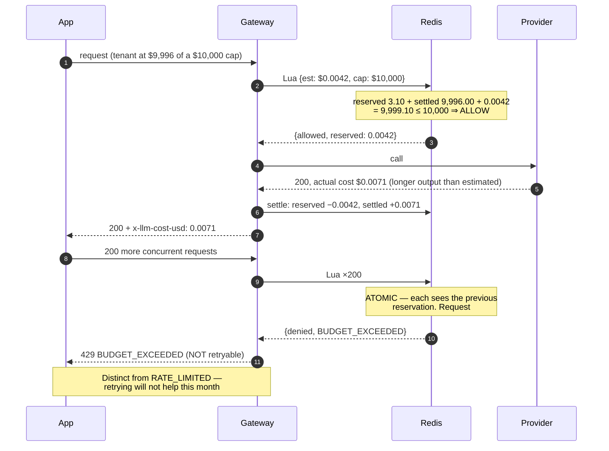
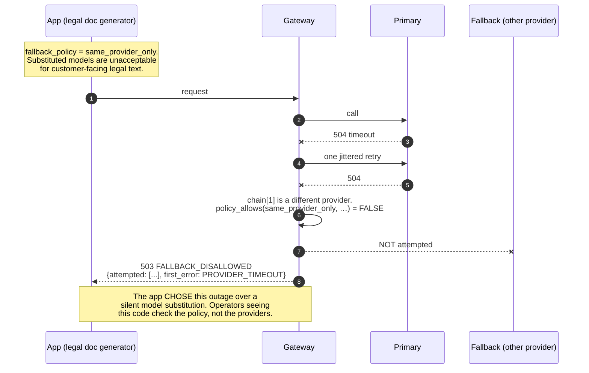
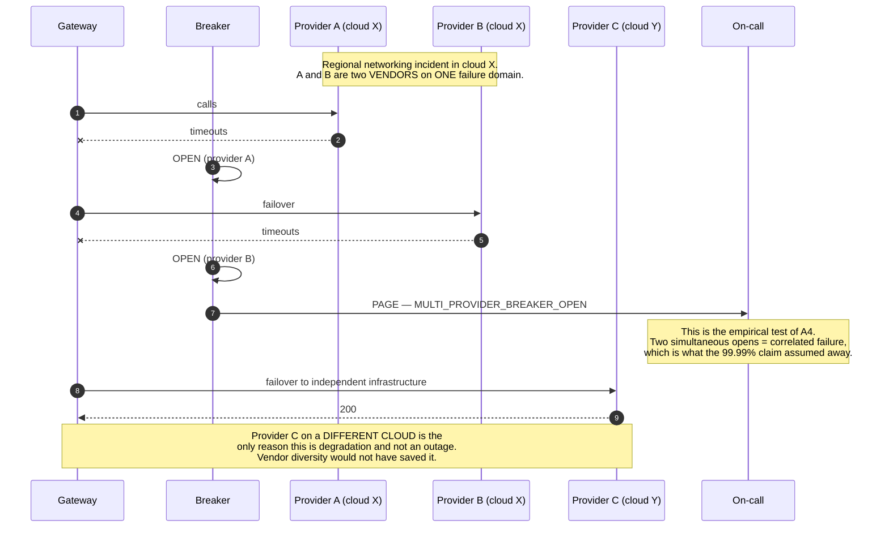
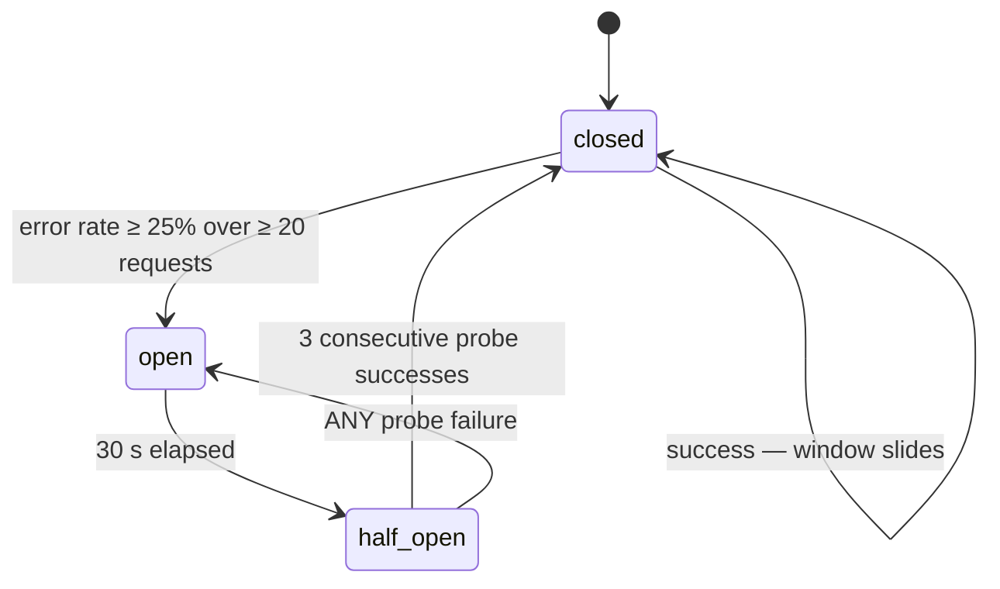
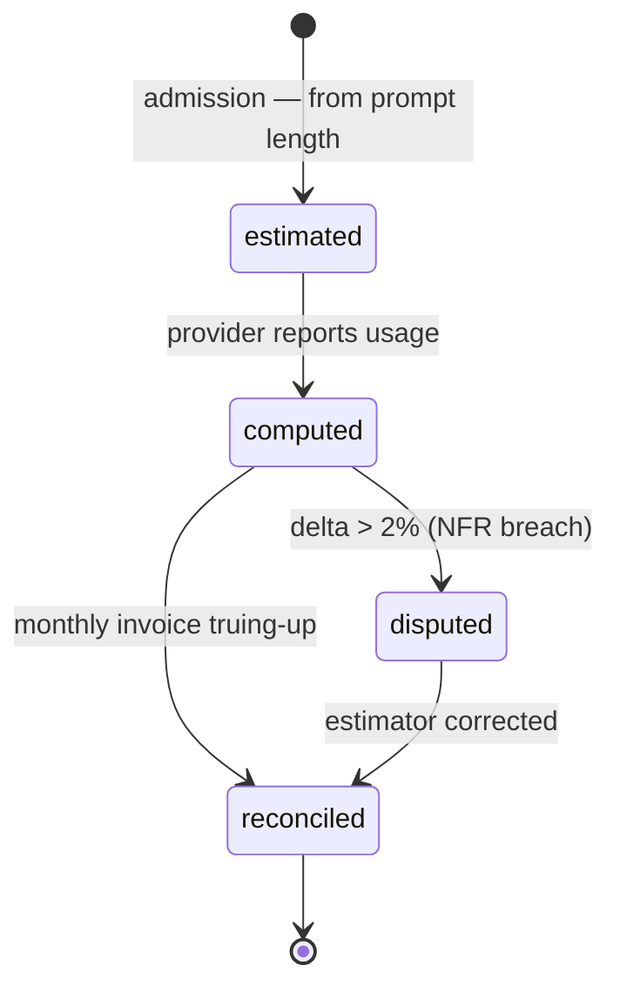
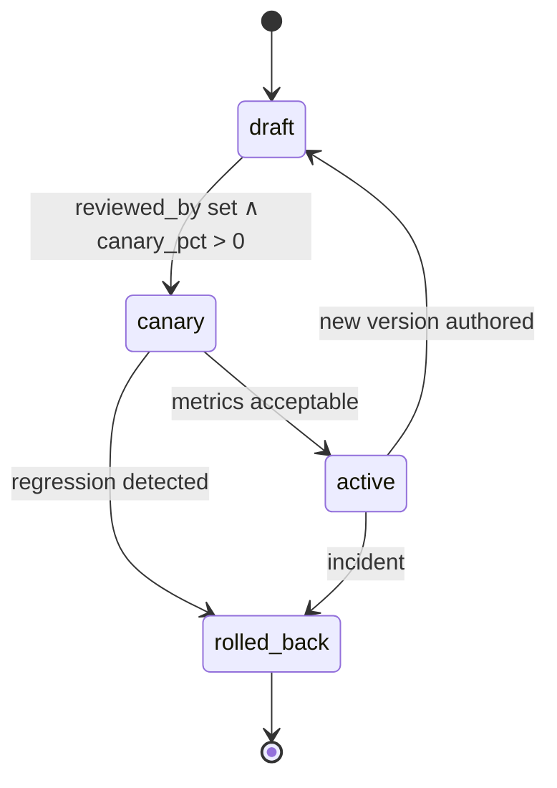

# 03 · Low-Level Design — Multi-Provider LLM Platform

> **Phase 3 of 4** · [← HLD](02_hld.md) · [Production & interview →](04_production_and_interview.md)

---

## 3.1 Data models

The gateway is stateless per request, so its persistent schemas fall into three groups: **control-plane
config** (small, read constantly, changed rarely), **request metadata** (enormous, append-only), and
**governance counters** (in Redis, not SQL).

### Request metadata — 100% retention, and the reason the platform exists

```sql
CREATE TABLE request_log (
    request_id      UUID NOT NULL,
    ts              TIMESTAMPTZ NOT NULL,

    -- Attribution: the columns finance and capacity planning actually query
    tenant_id       UUID NOT NULL,
    app_id          TEXT NOT NULL,
    feature         TEXT,                        -- app-declared, free-form
    principal       TEXT,                        -- calling user/service, for audit

    -- What was asked for vs. what happened
    alias           TEXT NOT NULL,               -- 'prod-fast' — what the app requested
    model_resolved  TEXT NOT NULL,               -- 'claude-x-y-20260401' — what actually ran
    provider        TEXT NOT NULL,
    task_class      TEXT,                        -- app-declared (§2.2)

    -- Cost: provider-reported, never locally estimated
    tokens_in       INT,
    tokens_out      INT,
    tokens_cached_in INT,                        -- priced differently — omitting this breaks the 2%
    tokens_reasoning INT,
    cost_usd        NUMERIC(12,8),               -- OUR computation
    cost_reconciled NUMERIC(12,8),               -- after monthly invoice truing-up

    -- Outcome
    status          INT NOT NULL,
    error_code      TEXT,
    cache_outcome   TEXT NOT NULL,               -- 'ineligible'|'miss'|'exact_hit'|'semantic_hit'
    cache_similarity REAL,                       -- populated on semantic_hit ONLY
    failover_from   TEXT,                        -- non-null ⇒ a failover happened
    retry_count     SMALLINT NOT NULL DEFAULT 0,
    stream          BOOLEAN NOT NULL,
    tokens_delivered INT,                        -- for interrupted streams (F17)

    -- Latency, split so overhead is separable from provider time
    lat_gateway_ms  REAL NOT NULL,               -- OUR overhead — the NFR
    lat_provider_ms REAL,                        -- theirs
    lat_total_ms    REAL NOT NULL,

    prompt_version  TEXT,                        -- from the registry, if used
    body_ref        TEXT                         -- pointer into the sampled body store, or NULL
) PARTITION BY RANGE (ts);

CREATE INDEX idx_rl_attribution ON request_log (tenant_id, app_id, ts DESC);
CREATE INDEX idx_rl_model_cost  ON request_log (model_resolved, ts DESC) INCLUDE (cost_usd);
CREATE INDEX idx_rl_overhead    ON request_log (ts, lat_gateway_ms);
CREATE INDEX idx_rl_failover    ON request_log (ts, provider) WHERE failover_from IS NOT NULL;
CREATE INDEX idx_rl_errors      ON request_log (ts, error_code) WHERE status >= 400;
```

**Three schema decisions are doing real work:**

**`alias` and `model_resolved` are separate columns**, and that separation is what makes provider drift
([F13](02_hld.md#25-failure-modes--blast-radius)) detectable. An app always asks for `prod-fast`; when the
alias is repointed, the request log shows exactly when behaviour could have changed — which is the one
question nobody can answer when apps hold concrete model IDs.

**`tokens_cached_in` and `tokens_reasoning` exist because the 2% attribution target depends on them.**
Cached input tokens are priced at a fraction of fresh ones, and reasoning tokens are billed but not always
itemized in the obvious place. A schema that stores only `tokens_in`/`tokens_out` **cannot** reconcile to
within 2%, and the gap will be blamed on the provider rather than on the schema.

**`cost_usd` and `cost_reconciled` are both stored, and keeping both is the honest design.** Our computation
is available immediately and drives budget enforcement; the reconciled figure arrives with the invoice weeks
later. Overwriting the first with the second would destroy the evidence needed to fix the estimator — the
delta between the two columns *is* the attribution-accuracy metric.

**`lat_gateway_ms` is separate from `lat_provider_ms`** because the NFR is about our overhead alone. An
aggregate latency column would make the platform's core SLO unmeasurable — provider variance of hundreds of
milliseconds would swamp a 30 ms budget.

**`cache_similarity` is populated only on semantic hits** so the distribution is auditable. It's the only
observable that can catch [F10](02_hld.md#25-failure-modes--blast-radius) — false hits produce no error, so
the defence is watching where the similarity scores cluster relative to the threshold.

### Control plane

```sql
CREATE TABLE model_aliases (
    tenant_id      UUID,                         -- NULL ⇒ org-wide default
    alias          TEXT NOT NULL,                -- 'prod-fast', 'prod-frontier'
    priority       SMALLINT NOT NULL,            -- 0 = primary, 1 = first fallback, …
    provider       TEXT NOT NULL,
    model          TEXT NOT NULL,                -- CONCRETE version, never a provider alias
    max_tokens     INT,
    enabled        BOOLEAN NOT NULL DEFAULT TRUE,
    PRIMARY KEY (tenant_id, alias, priority)
);

CREATE TABLE tenant_policy (
    tenant_id           UUID PRIMARY KEY,
    monthly_budget_usd  NUMERIC(12,2) NOT NULL,
    budget_action       TEXT NOT NULL DEFAULT 'reject',   -- 'reject' | 'degrade' (Q5)
    rps_limit           INT NOT NULL,
    concurrency_limit   INT NOT NULL,            -- the isolation control that actually works
    fallback_policy     TEXT NOT NULL DEFAULT 'same_provider_only',
    cache_enabled       BOOLEAN NOT NULL DEFAULT TRUE,
    cache_similarity_min REAL NOT NULL DEFAULT 0.95,
    pii_redaction       TEXT NOT NULL DEFAULT 'standard',
    allowed_providers   TEXT[] NOT NULL,         -- data residency (Q2)
    body_log_sample_pct REAL NOT NULL DEFAULT 1.0,
    CONSTRAINT tp_fallback_chk CHECK (fallback_policy IN
        ('none','same_provider_only','cross_provider','cross_provider_same_tier'))
);

CREATE TABLE prompt_versions (
    prompt_id    TEXT NOT NULL,
    version      INT  NOT NULL,
    template     TEXT NOT NULL,
    status       TEXT NOT NULL,                  -- 'draft'|'canary'|'active'|'rolled_back'
    canary_pct   REAL NOT NULL DEFAULT 0,
    author       TEXT NOT NULL,
    reviewed_by  TEXT,                           -- NULL blocks promotion to 'active'
    created_at   TIMESTAMPTZ NOT NULL DEFAULT now(),
    PRIMARY KEY (prompt_id, version)
);
```

> **`fallback_policy` defaults to `same_provider_only`, and the default is the design decision.** Defaulting
> to `cross_provider` would silently opt every app into substituted models — the
> [FR-6](01_requirements.md#reliability) hazard — for apps that never considered it. **The safe default is
> the less available one**, and cross-provider fallback becomes something a team opts into having thought
> about output differences.

**`concurrency_limit` is listed alongside `rps_limit` because RPS limits alone don't isolate tenants.** A
tenant sending 10 RPS of 60-second streaming requests holds 600 concurrent connections while staying far
under any reasonable RPS cap — and starves the shared pool
([F15](02_hld.md#25-failure-modes--blast-radius)). **Concurrency is the control that maps to the actual
scarce resource.**

**`reviewed_by` being NULL blocks promotion to `active`.** Without it the prompt registry is application
code with extra steps ([Q3](01_requirements.md#open-questions)) — versioned, but no more reviewed than a
string literal in a repo nobody watches.

### Governance state — Redis, not SQL

```
# One hash per tenant per month — the authoritative budget position
budget:{tenant}:{yyyymm}    → { reserved: 412.88, settled: 408.10 }

# Sliding-window rate limit
rate:{tenant}:{window}      → counter, TTL 2× window

# Concurrency — a set, so stale entries can be reaped
conc:{tenant}               → sorted set of in-flight request_ids scored by start_ms

# Breaker state, replicated to every instance
breaker:{provider}:{model}  → { state, failures, opened_at, probe_at }
```

**`reserved` and `settled` are tracked separately because a hard cap has to hold against in-flight
requests.** Charging only on completion lets thousands of concurrent requests pass a cap that has already
been exhausted by work not yet billed. Reserve an estimate at admission, settle the true cost on response —
detailed in [§3.3](#33-core-algorithms).

**Concurrency is a sorted set rather than a counter** so that entries orphaned by a crashed instance can be
reaped by score. A bare counter leaks: every instance crash permanently reduces a tenant's effective
concurrency ceiling, and the leak is invisible until the tenant is throttled at nothing.

---

## 3.2 API contracts

### The unified request

```http
POST /v1/chat/completions
Authorization: Bearer <app JWT>
X-App-Id: doc-extraction
X-Feature: invoice-parse                # attribution granularity, app-declared
X-Task-Class: extraction                # routing hint (§2.2)
Idempotency-Key: 7f3a-…                 # required for non-streaming
```

```jsonc
{
  "model": "prod-fast",                 // an ALIAS, not a provider model id
  "messages": [ { "role": "user", "content": "…" } ],
  "temperature": 0,
  "max_tokens": 512,
  "stream": false,

  "gateway": {                          // gateway-specific, stripped before the provider call
    "fallback": "cross_provider_same_tier",  // overrides tenant default, narrowing only
    "cache": "allow",                        // "allow" | "bypass" | "write_only"
    "prompt_id": "invoice-v3",               // resolve from the registry
    "budget_ceiling_usd": 0.05               // per-request cap
  }
}
```

**The `gateway` block is namespaced so that provider-native fields never collide with ours.** Providers add
top-level fields continuously; a flat namespace means the next provider feature named `cache` silently
changes gateway behaviour.

**`gateway.fallback` can only *narrow* the tenant policy, never widen it.** An app may opt out of
cross-provider fallback for one request; it may not opt *into* a policy its tenant configuration forbids —
otherwise a per-request field bypasses the governance the tenant policy exists to express.

### The unified response

```jsonc
{
  "id": "req_9f2…",
  "content": [ { "type": "text", "text": "…" } ],
  "usage": {
    "tokens_in": 412, "tokens_out": 88,
    "tokens_cached_in": 380, "tokens_reasoning": 0,
    "cost_usd": 0.000174
  },
  "gateway": {
    "provider": "anthropic",
    "model_resolved": "claude-x-y-20260401",
    "cache": "miss",
    "failover_from": "openai",
    "retry_count": 1,
    "latency_ms": { "gateway": 16.4, "provider": 883.0 }
  }
}
```

Also returned as headers, so they're visible without parsing the body:

```
x-llm-provider: anthropic
x-llm-model-resolved: claude-x-y-20260401
x-llm-cache: miss
x-llm-failover: openai
x-llm-cost-usd: 0.000174
x-llm-gateway-ms: 16.4
```

> **Returning `cost_usd` in-band changes team behaviour more than any dashboard.** A team that sees the cost
> of each call while developing writes different code than one that discovers it in a monthly report — and
> it costs nothing to include, because the number is already computed for budget settlement.

### Error taxonomy

The error codes are the contract. Ambiguous errors are what make apps build their own retry logic — the
problem the platform exists to remove.

| HTTP | `code` | Retryable | Meaning |
|---|---|---|---|
| 400 | `INVALID_REQUEST` | No | Malformed |
| 400 | `UNSUPPORTED_FEATURE` | No | Requested a provider-specific feature the unified shape can't express. **Use passthrough** |
| 401 | `AUTH_FAILED` | No | JWT invalid or expired |
| 403 | `PROVIDER_NOT_ALLOWED` | No | Data-residency policy forbids the route ([Q2](01_requirements.md#open-questions)) |
| 404 | `ALIAS_NOT_FOUND` | No | No alias mapping for this tenant |
| 409 | `IDEMPOTENCY_CONFLICT` | No | Same key, different body |
| 413 | `CONTEXT_TOO_LARGE` | No | Exceeds every model in the alias chain |
| 429 | `RATE_LIMITED` | **Yes** — honour `Retry-After` | Tenant RPS or concurrency ceiling |
| 429 | `BUDGET_EXCEEDED` | **No** | Hard cap. **Retrying will not help — this is why it's a distinct code** |
| 499 | `CLIENT_CLOSED` | — | Caller disconnected; in-flight cost still billed |
| 500 | `GATEWAY_ERROR` | Yes | Our bug |
| 502 | `PROVIDER_ERROR` | Yes | Provider returned an unrecoverable error; fallback exhausted or disallowed |
| 503 | `ALL_PROVIDERS_UNAVAILABLE` | Yes | Every provider in the chain has an open breaker — **the [F4](02_hld.md#25-failure-modes--blast-radius) signal** |
| 503 | `FALLBACK_DISALLOWED` | Yes | Primary failed and policy is `none`/`same_provider_only`. **The app asked for this** |
| 504 | `PROVIDER_TIMEOUT` | Yes | Exceeded the deadline |
| 500 | `STREAM_INTERRUPTED` | **App decides** | Stream died after `tokens_delivered` tokens; **no automatic failover** ([F17](02_hld.md#25-failure-modes--blast-radius)) |

**Separating `RATE_LIMITED` from `BUDGET_EXCEEDED` matters despite the shared status code.** Both are 429
by convention, but one clears in seconds and the other clears next month. Collapsing them means every app's
retry logic hammers a hard budget cap — which is precisely the amplification the platform was built to
prevent.

**`FALLBACK_DISALLOWED` is a distinct code because it is not a platform failure.** It's the platform
honouring a policy the app chose, and an operator seeing it should check the policy, not the providers.

### Passthrough

```http
POST /v1/passthrough/anthropic/v1/messages
```

Body forwarded verbatim. **Auth, rate limits, budget, cost attribution, PII redaction, and logging all still
apply** — only schema translation and cross-provider fallback are given up. This is what stops sophisticated
teams from bypassing the gateway entirely ([FR-3](01_requirements.md#unified-surface)).

---

## 3.3 Core algorithms

### Governance in one atomic Redis round trip

```lua
-- KEYS: budget_hash, rate_key, conc_zset
-- ARGV: cost_estimate, budget_cap, rps_limit, conc_limit, now_ms, window_ms, request_id
-- Returns: {allowed, reason, reserved_amount}

local now = tonumber(ARGV[5])

-- 1. Reap orphaned concurrency entries (crashed instances leak these)
redis.call('ZREMRANGEBYSCORE', KEYS[3], '-inf', now - 300000)   -- 5 min

-- 2. Concurrency — the control that maps to the scarce resource
local inflight = redis.call('ZCARD', KEYS[3])
if inflight >= tonumber(ARGV[4]) then
  return {0, 'CONCURRENCY', 0}
end

-- 3. Sliding-window rate limit
local rate = tonumber(redis.call('GET', KEYS[2]) or '0')
if rate >= tonumber(ARGV[3]) then
  return {0, 'RATE_LIMITED', 0}
end

-- 4. Budget: check RESERVED + SETTLED, not settled alone.
--    Settled-only lets in-flight requests blow through a hard cap.
local reserved = tonumber(redis.call('HGET', KEYS[1], 'reserved') or '0')
local settled  = tonumber(redis.call('HGET', KEYS[1], 'settled')  or '0')
local est      = tonumber(ARGV[1])
if (reserved + settled + est) > tonumber(ARGV[2]) then
  return {0, 'BUDGET_EXCEEDED', 0}
end

-- 5. All three pass — commit atomically. No window for a concurrent request
--    to pass the same last dollar.
redis.call('HINCRBYFLOAT', KEYS[1], 'reserved', est)
redis.call('INCR', KEYS[2])
redis.call('PEXPIRE', KEYS[2], tonumber(ARGV[6]) * 2)
redis.call('ZADD', KEYS[3], now, ARGV[7])

return {1, 'OK', est}
```

**Atomicity is the correctness property, not the 3 ms.** Three separate round trips leave a window in which
two concurrent requests each read the same remaining budget and both proceed — and a "hard cap"
([FR-8](01_requirements.md#governance)) that can be exceeded by concurrency isn't a hard cap. The latency
saving is a welcome side effect of doing it correctly.

**Settlement, on response:**

```python
async def settle(tenant: str, reserved: float, actual: float, request_id: str) -> None:
    """Reserved was an estimate from prompt length; actual comes from the
    provider. Always release the reservation, even on error paths — a leaked
    reservation silently shrinks the tenant's budget until month end."""
    await redis.eval(SETTLE_LUA, keys=[budget_key(tenant), conc_key(tenant)],
                     args=[reserved, actual, request_id])
    # SETTLE_LUA: HINCRBYFLOAT reserved -reserved
    #             HINCRBYFLOAT settled  +actual
    #             ZREM conc_zset request_id
```

**The reap step in the admission script is what makes leaked reservations survivable.** Every failure path
must reach `settle`, and some won't — an instance can be SIGKILLed mid-request. The 5-minute reap bounds the
damage from "permanent" to "five minutes."

### Fail-open when Redis is unavailable

```python
async def check_governance(req: Request) -> Decision:
    try:
        return await redis_governance(req, timeout_ms=8)
    except (RedisError, TimeoutError):
        metrics.incr("governance.degraded")
        # FAIL OPEN (F2). Rejecting on a Redis blip spends the whole
        # monthly availability budget in one incident.
        return local_approximate_check(req)


def local_approximate_check(req: Request) -> Decision:
    """Per-instance ceiling: tenant_limit / expected_instance_count, ×1.5 slack.
    Loose, but a runaway app stays bounded. Budget caps become advisory —
    which is the trade we chose explicitly in §2.2."""
    ceiling = req.tenant.rps_limit / INSTANCE_COUNT_ESTIMATE * 1.5
    return local_counter.check(req.tenant_id, ceiling)
```

> **Naming what fail-open gives up is the part that makes it defensible.** During a Redis outage, budget
> enforcement degrades from exact to approximate. That is a real governance regression, accepted because the
> alternative — Redis as a 99.995% dependency — fails the availability requirement outright.

### Circuit breaker, per provider × model

```python
FAILURE_THRESHOLD  = 0.25       # error rate over the window
MIN_REQUESTS       = 20         # don't trip on 2 of 3
OPEN_DURATION_MS   = 30_000
HALF_OPEN_PROBES   = 3

class Breaker:
    def state(self, provider: str, model: str) -> str:
        b = self.load(provider, model)
        if b.state == "open" and now_ms() >= b.opened_at + OPEN_DURATION_MS:
            b.state = "half_open"; b.probes_sent = 0
        return b.state

    def record(self, provider: str, model: str, ok: bool) -> None:
        b = self.load(provider, model)
        b.window.append(ok)

        if b.state == "half_open":
            if ok:
                b.successes += 1
                if b.successes >= HALF_OPEN_PROBES:
                    b.state = "closed"; b.window.clear()
            else:
                b.state = "open"; b.opened_at = now_ms()     # straight back to open
            return

        if len(b.window) >= MIN_REQUESTS and b.error_rate() >= FAILURE_THRESHOLD:
            b.state = "open"; b.opened_at = now_ms()
            alert("breaker_open", provider=provider, model=model)
            # THE F4 SIGNAL: multiple providers open at once means the
            # independence assumption (A4) is false. This pages.
            if self.open_provider_count() >= 2:
                page("MULTI_PROVIDER_BREAKER_OPEN")
```

**Per-model granularity, not per-provider**, because single-model degradation is the common case — a
provider rolls out a change to one model tier and the others stay healthy. Opening the whole provider throws
away capacity that is working, and at [10× scale](02_hld.md#10-20000-rps-17b-requestsday) that discarded
capacity is capacity the platform needs.

**Half-open failures go straight back to open** rather than decrementing a counter. A provider recovering
from overload will serve a few requests successfully before failing again; a lenient half-open state
oscillates and produces a stream of user-visible errors.

**The multi-provider page is the empirical test of [A4](01_requirements.md#assumptions).** One breaker
opening is normal operations. Two at once is evidence that provider failures are correlated — the assumption
the 99.99% claim rests on — and it should wake someone precisely because it invalidates the platform's
headline promise.

### Fallback chain

```python
async def execute_with_fallback(req: Request) -> Response:
    chain = resolve_alias(req.tenant_id, req.model)        # ordered by priority
    policy = narrow(req.tenant.fallback_policy, req.gateway.fallback)
    attempted, first_error = [], None

    for i, candidate in enumerate(chain):
        if candidate.provider not in req.tenant.allowed_providers:
            continue                                       # data residency (Q2)

        # Policy gate: is switching to THIS candidate permitted?
        if i > 0 and not policy_allows(policy, chain[0], candidate):
            return error("FALLBACK_DISALLOWED", first_error=first_error,
                         attempted=attempted)

        if breaker.state(candidate.provider, candidate.model) == "open":
            attempted.append((candidate, "breaker_open")); continue

        try:
            return await call_provider(candidate, req, attempt=i)
        except StreamAlreadyStarted:
            # F17: tokens are out. Failover is off the table, full stop.
            raise
        except RetryableError as e:
            first_error = first_error or e
            breaker.record(candidate.provider, candidate.model, ok=False)
            attempted.append((candidate, e.code))

            if i == 0:                                     # ONE retry, same provider
                try:
                    await jittered_sleep(120, 260)
                    return await call_provider(candidate, req, attempt="retry")
                except RetryableError as e2:
                    breaker.record(candidate.provider, candidate.model, ok=False)
                    first_error = first_error or e2
            continue
        except NonRetryableError:
            raise                                          # 400s don't get a second provider

    return error("ALL_PROVIDERS_UNAVAILABLE", attempted=attempted)


def policy_allows(policy: str, primary: Candidate, cand: Candidate) -> bool:
    if policy == "none":                return False
    if policy == "same_provider_only":  return cand.provider == primary.provider
    if policy == "cross_provider_same_tier": return cand.tier == primary.tier
    return True                                            # 'cross_provider'
```

**Non-retryable errors are re-raised immediately rather than tried on the next provider.** A 400 from
provider A will be a 400 from provider B, and walking the chain to prove it costs three round trips and
delivers a worse error message — pointing at the last provider instead of the actual malformed field.

**`cross_provider_same_tier` exists as a middle policy** because most teams' real position isn't binary.
They'll accept a different frontier model but not a downgrade to a small one — a distinction a boolean can't
express, which is why [FR-6](01_requirements.md#reliability)'s policy has four values.

### Caching, eligibility first

```python
NON_CACHEABLE_PARAMS = ("temperature", "top_p", "seed", "logit_bias")

def cache_eligible(req: Request) -> bool:
    """Checked BEFORE any lookup. Three field comparisons, < 0.1 ms.
    This ordering is what closes the latency budget (§1.6)."""
    if req.stream:                       return False   # can't cache a stream
    if req.temperature and req.temperature > 0: return False   # output is not a function of input
    if req.tools:                        return False   # tool calls have side effects
    if req.gateway.cache == "bypass":    return False
    if not req.tenant.cache_enabled:     return False
    return True


def cache_key(req: Request) -> str:
    """TENANT FIRST and always. A cross-tenant hit is a data leak (F11)."""
    return sha256("|".join([
        str(req.tenant_id),                    # ← non-negotiable
        req.model_resolved,
        req.prompt_version or "-",             # rollback invalidates automatically (F9)
        normalize(req.messages),
        canonical_params(req),
    ])).hexdigest()


async def cache_lookup(req: Request) -> CacheResult | None:
    if not cache_eligible(req):
        return None                                        # ~65% of traffic exits here

    hit = await exact_store.get(cache_key(req))            # ~1 ms
    if hit:
        assert_tenant(hit, req)
        return CacheResult(hit, kind="exact_hit")

    if not req.tenant.semantic_cache_enabled:
        return None

    vec = local_embedder.encode(req.messages)              # in-process int8, ~4 ms
    cands = await tenant_ann_index(req.tenant_id).search(vec, k=3)   # ~3 ms

    for c in cands:
        if (c.similarity >= req.tenant.cache_similarity_min
                and c.model_resolved == req.model_resolved
                and c.prompt_version == req.prompt_version):
            assert_tenant(c, req)
            metrics.observe("cache.similarity", c.similarity)   # the F10 audit trail
            return CacheResult(c, kind="semantic_hit", similarity=c.similarity)
    return None


def assert_tenant(entry, req) -> None:
    """Defence in depth. Tenant is already in the key, so this should be
    impossible — which is exactly why it's asserted rather than assumed."""
    if entry.tenant_id != req.tenant_id:
        alert("CROSS_TENANT_CACHE_HIT", severity="critical")
        raise CacheIntegrityError()          # FAIL the request. Never serve it.
```

**The in-process embedder is the entire reason semantic caching is viable here.** A hosted embedding call at
20–40 ms exceeds the whole gateway budget; a quantized MiniLM running on the request thread costs ~4 ms.
**The feature isn't "semantic caching" — it's "semantic caching that fits in 30 ms," and those are different
engineering problems.**

**`model_resolved` and `prompt_version` are checked on the candidate, not only baked into the key**, because
the ANN index is queried by vector rather than by key. Similarity alone would happily return an entry
generated by a different model under a rolled-back prompt.

### Idempotency

```python
async def with_idempotency(req: Request, handler) -> Response:
    """Prevents double-charging on client retries during failover (FR-7)."""
    if req.stream or not req.idempotency_key:
        return await handler(req)

    k = f"idem:{req.tenant_id}:{req.idempotency_key}"
    body_hash = sha256(canonical(req.body)).hexdigest()

    prior = await redis.hgetall(k)
    if prior:
        if prior["body_hash"] != body_hash:
            return error("IDEMPOTENCY_CONFLICT")
        if prior["state"] == "completed":
            return deserialize(prior["response"])          # no second charge
        if prior["state"] == "in_flight":
            return error("RATE_LIMITED", retry_after=2)    # honest: we don't know yet
        # state == 'uncertain': provider called, outcome unknown.
        # Same pattern as 02's tool calls — do NOT silently retry.
        return error("GATEWAY_ERROR", detail="prior attempt outcome unknown")

    await redis.hset(k, mapping={"state": "in_flight", "body_hash": body_hash})
    await redis.expire(k, 86_400)
    try:
        resp = await handler(req)
        await redis.hset(k, mapping={"state": "completed", "response": serialize(resp)})
        return resp
    except ProviderTimeout:
        # We don't know whether they generated and billed it.
        await redis.hset(k, mapping={"state": "uncertain"})
        raise
```

**The `uncertain` state is the same construct as
[02's tool-call reconciliation](../02_customer_support_agent/03_lld.md#31-data-models), and it appears here
for the same reason:** a timeout is not a failure, it's an unknown. Treating it as a failure and retrying
risks a double charge; treating it as success risks losing a paid-for response. **Recording the ambiguity
and refusing to guess is the only correct move**, and it's why the code has three states rather than two.

---

## 3.4 Sequence diagrams

### Budget cap enforced at the boundary



### Failover blocked by app policy



### Correlated provider failure — the F4 scenario



---

## 3.5 State machines

### Circuit breaker



**`half_open → open` on any single failure** is deliberately strict. A provider recovering from overload
serves a few requests before failing again, and a lenient half-open oscillates — producing a steady trickle
of user-visible errors that looks like a gateway bug.

### Budget reservation

```mermaid
stateDiagram-v2
    [*] --> reserved : admission (estimate)
    reserved --> settled : response received (actual cost)
    reserved --> released : request failed before any provider call
    reserved --> settled_partial : stream interrupted — bill tokens delivered
    reserved --> reaped : instance died; 5-min sweep
    settled --> [*]
    released --> [*]
    settled_partial --> [*]
    reaped --> [*]
```

**`reaped` exists because `settle` is not guaranteed to run.** Without the sweep, every instance crash
permanently shrinks a tenant's usable budget — an error that accumulates silently over a month and shows up
as inexplicable throttling.

### Cost attribution lifecycle



> **The `disputed` state is what makes the 2% target real rather than aspirational.** A design that computes
> cost and stops has no mechanism to discover it's wrong. Storing both `cost_usd` and `cost_reconciled` and
> alerting on the delta turns attribution accuracy into a monitored metric with an owner — which is the only
> form in which finance can rely on it.

### Prompt version



**`draft → canary` requires `reviewed_by`**, and the transition is where [Q3](01_requirements.md#open-questions)
gets answered structurally: an unowned review gate means prompt changes ship unreviewed regardless of what
the registry stores.

---

## 3.6 Edge cases & correctness

| # | Edge case | Handling | Why |
|---|---|---|---|
| E1 | **Provider deprecates a model** | Alias repointed at the gateway | The platform's clearest win: one config change, not 30 migrations |
| E2 | **Provider silently changes a model behind its own alias** | Pin concrete versions; shadow-compare periodically | [F13](02_hld.md#25-failure-modes--blast-radius) — no error signal exists, so detection must be active |
| E3 | Provider adds a field we don't model | Passthrough mode; adapter updated later | Never block a team on our translation layer |
| E4 | **Request exceeds every model's context** | 413 `CONTEXT_TOO_LARGE`, listing the largest available | Walking the chain to fail four times wastes 3 round trips |
| E5 | **Client disconnects mid-request** | Cancel the provider call; **still bill generated tokens** | The provider bills us regardless. Absorbing it hides the cost from the team causing it |
| E6 | **Stream interrupted after N tokens** | `STREAM_INTERRUPTED` with `tokens_delivered`; **no failover** | Restarting produces output that contradicts what the user already read |
| E7 | Idempotent retry after a timeout | `uncertain` state; **refuse to guess** | A timeout is an unknown, not a failure |
| E8 | Same idempotency key, different body | 409 `IDEMPOTENCY_CONFLICT` | Almost always an app bug; surfacing it beats guessing |
| E9 | **Budget cap crossed by concurrent requests** | Atomic reserve in one Lua call | A cap that concurrency can exceed isn't a cap |
| E10 | Reservation leaked by a crashed instance | 5-minute reap by score | Otherwise the loss is permanent until month end |
| E11 | **Redis unavailable** | **Fail open** with local approximate limits | Fail-closed spends the whole availability budget on one blip |
| E12 | **Cross-tenant cache hit** | Assert on read; **fail the request** | Should be impossible; asserted because the consequence is a data leak |
| E13 | **Semantic false hit** | Threshold 0.95; log similarity on every hit | No error signal — the distribution is the only defence |
| E14 | Prompt rolled back, cache holds old responses | `prompt_version` in the key | Invalidation happens automatically or it doesn't happen |
| E15 | **Two providers fail simultaneously** | Third on independent infrastructure; **page** | The [A4](01_requirements.md#assumptions) test |
| E16 | Tenant holds 600 long streams at 10 RPS | **Concurrency** ceiling, not RPS | RPS limits don't bound the scarce resource |
| E17 | **PII in a request under a strict policy** | Redact **before egress**, not at log write | Redacting only at logging already sent it to a third party |
| E18 | Provider omits token counts | Fall back to local tokenization; **flag the record as estimated** | Better an admitted estimate than a silent one |
| E19 | Config push ships a broken routing table | Validate then swap; keep last-known-good | A bad push must not take the data plane with it |
| E20 | **Vault down at lease renewal** | Serve on cached credentials until expiry | Lease TTL must exceed plausible vault downtime ([F6](02_hld.md#25-failure-modes--blast-radius)) |
| E21 | App declares everything as `complex` to get the frontier model | Cost attribution surfaces it immediately | The monitoring already exists — no extra mechanism needed |
| E22 | Log queue full | **Drop oldest**; never block | Bounded-with-drop, or an unbounded queue OOMs the gateway |

**E5 is the one teams argue about and the arithmetic settles.** A cancelled request has already consumed
provider compute, and the provider bills for it. Not charging the tenant means the platform absorbs the
cost — which removes the only signal that would tell the team their client-side timeouts are too aggressive.
**Billing it is both correct accounting and the more useful feedback.**

**E17 states the redaction boundary precisely because getting it wrong is a compliance failure that looks
like a compliance control.** Redaction at log write produces clean logs and has already transmitted raw PII
to a third party. **The boundary is egress.**

---

**Next:** [04_production_and_interview.md →](04_production_and_interview.md)
