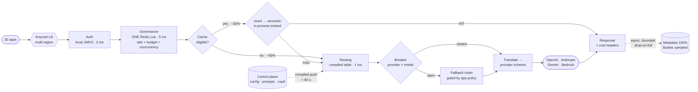

# 09 — Multi-Provider LLM Platform (Gateway)

> **Prompt:** Design a multi-provider LLM platform — unified API, provider routing, fallback, prompt management, rate limiting, cost optimization.

> The **buy-side** counterpart to [04 — LLM inference platform](../04_llm_inference_platform/README.md). That one builds serving capacity; this one brokers access to other people's.

---

## The three-sentence compression

*Rehearse this before opening any other file. It is the opening answer.*

1. **The choice that matters most:** **per-app fallback policy over multi-provider chains, on infrastructure that is diverse rather than merely multi-vendor** — because the platform's entire promise is availability *higher* than any single provider, and a gateway is a *serial* component that normally makes availability worse. The arithmetic forces the rest: total = gateway × fallback-set, so the gateway itself needs **≥ 99.995%** (~2.2 min/month, deploys included), which is what mandates stateless multi-region active-active, fail-open dependencies, and blue/green deploys.
2. **The alternative I rejected:** default cross-provider fallback, silently. It maximizes measured uptime and it substitutes models behind a 200 OK — an app tuned for one provider gets materially different output with no signal. For ticket classification that's the right trade; for customer-facing legal text an error is far better. **Only the app knows**, so the default is the safer, less available one.
3. **The failure mode I'd volunteer:** **correlated provider failure.** At just 5% correlation the fallback set alone misses 99.99%; at 20% it lands near 99.94%. Concretely — Azure-hosted OpenAI and Bedrock-hosted Anthropic in one cloud region are two *vendors* on one *failure domain*. Simultaneous breaker opens across providers therefore pages, because that event is the platform's headline assumption being falsified.

---

## Architecture at a glance



**The `ELIG` diamond sitting *before* the cache is the move that closes the latency budget.** ~65% of
traffic — streaming, temperature > 0, tool calls — can never hit, and paying lookup cost on it is what
pushes a zero-margin 30 ms budget over.

---

## Key numbers

| Dimension | Value |
|---|---|
| **Gateway overhead** | **p95 < 30 ms** · stated budget lands at *exactly* 30 ms ⚠️ |
| After four fixes | ~**17 ms** common path ✅ · ~24 ms cache-eligible |
| Cache hit | ~19 ms total — **~47× faster** than a provider call |
| **End-to-end availability** | **99.99%** — *conditional on provider independence* |
| **Derived gateway availability** | **≥ 99.995%** ≈ 2.2 min/month, deploys included |
| Single provider baseline | ~99.7% ≈ 2.2 **hours**/month |
| Correlation sensitivity | c=0 → 99.9991% · **c=0.05 → 99.984%** ⚠️ · c=0.20 → 99.94% ⚠️ |
| Throughput | 2,000 RPS ≈ **173M requests/day** |
| **Gateway compute** | ~$120/month CPU, ~$3k all-in — **0.6% of the bill** |
| **Logging** | **692 GB/day** — the real infrastructure cost |
| Value | ~**$200k/month** saved on ~$500k of token spend |

---

## The findings that matter

**1. A serial component cannot claim availability it doesn't have.**

```
A_total = A_gateway × A_fallback_set
0.9999 ÷ 0.999991 ≈ 0.999909   ⇒  gateway needs ~99.995%
```

That single division is the source of four architectural constraints — multi-region active-active, no
synchronous hard dependencies, fail-open on Redis, blue/green deploys. **They're derived, not preferred.**
Full derivation in [§1.5](01_requirements.md#15-the-availability-arithmetic--the-central-claim).

**2. The pitch dies to one question, so answer it first.**

```
effective unavailability ≈ c·p + (1−c)·p²        p = 0.003
c = 0.05  →  99.984%   ⚠️ already below target
```

**Vendor diversity is not infrastructure diversity.** The requirement is at least one provider on a
different cloud, reached over a different network path.

**3. The budget as stated has zero margin — and semantic caching doesn't fit in it at all.**
A hosted embedding call is 20–40 ms, more than the entire 30 ms budget. The fix is an in-process quantized
embedder (~4 ms) plus eligibility-before-lookup, reaching ~17 ms on the common path
([§1.6](01_requirements.md#16-the-latency-budget--zero-margin-by-construction)).

**4. Costs are not where anyone looks.** Compute is 0.6% of spend; **logging is 692 GB/day**; the real cost
is engineering time. **Never justify a gateway on compute efficiency** — justify it on cost control
(~$200k/month), availability, and not spending a quarter on the next model deprecation.

**5. The gateway can see what no app can.** Holding 100% of traffic against pinned concrete versions makes
**provider drift** detectable — a provider changing the model behind its own alias, which reaches every app
as a 200 OK with different output. That's an argument for centralization with nothing to do with cost.

---

## Files

| File | Contents |
|---|---|
| **[01_requirements.md](01_requirements.md)** | Problem & users · FRs incl. the passthrough escape hatch · NFRs · non-goals · **the availability arithmetic** · **the zero-margin latency budget** · capacity & cost · assumptions |
| **[02_hld.md](02_hld.md)** | Architecture · component choices with rejected alternatives · fallback & breakers · caching · data flow · 17 failure modes · scale plan |
| **[03_lld.md](03_lld.md)** | Schemas · unified API + error taxonomy · the atomic governance Lua script · breaker, fallback, cache, idempotency algorithms · sequence diagrams · state machines · 22 edge cases |
| **[04_production_and_interview.md](04_production_and_interview.md)** | Provider drift detection · attribution as a closing process · runbook · 20 common mistakes · interview follow-ups · glossary |

**Shared front-matter:** [`../00_requirements_all_systems.md#9-multi-provider-llm-platform`](../00_requirements_all_systems.md#9-multi-provider-llm-platform)

---

## Relationship to the other designs

| Relates to | How |
|---|---|
| [04 — Inference platform](../04_llm_inference_platform/README.md) | **Buy vs. build, same problem.** They merge at ~100×: the small tier moves in-house and the gateway routes between internal serving and providers |
| [10 — Enterprise agent platform](../10_enterprise_agent_platform/README.md) | Uses this as its model-access layer — every agent LLM call goes through it |
| [01 — RAG](../01_production_rag_system/README.md) | **Same cache leak, different system:** tenant must be in the cache key, or one tenant is served another's answer |
| [02 — Support agent](../02_customer_support_agent/README.md) | Shares the `uncertain` state for timed-out calls — a timeout is an unknown, not a failure |
| [07 — Eval platform](../07_llm_evaluation_platform/README.md) | Judges the shadow-traffic comparisons this platform produces. **The gateway routes; it does not judge quality** |
