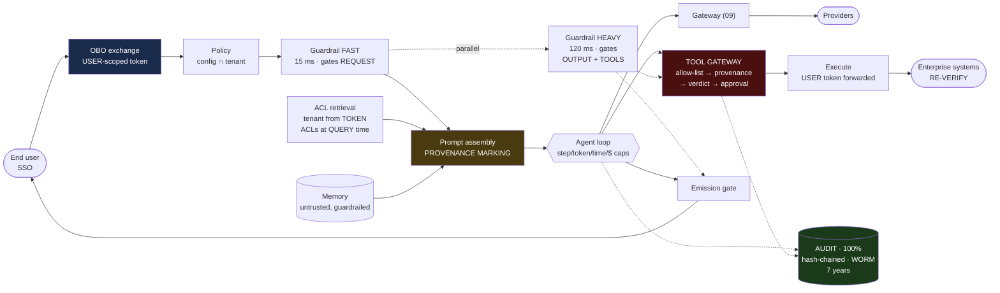

# 10 — Enterprise AI Agent Platform · **THE CAPSTONE**

> **Prompt:** Design an enterprise AI agent platform — authentication/authorization, MCP/tools, RAG, agent memory, workflows, multi-tenancy, guardrails, audit logs, observability, security.

> **Overlaps** [`21_ai-system-design-deep-dives/01_agentic_ai_platform.md`](../../21_ai-system-design-deep-dives/01_agentic_ai_platform.md) — that one is fintech-domain-scoped; this is the generic multi-tenant platform.
>
> **Read [01](../01_production_rag_system/README.md), [03](../03_multi_agent_system/README.md), [07](../07_llm_evaluation_platform/README.md), and [09](../09_multi_provider_llm_platform/README.md) first.** This design *composes* them — and knowing what **not** to rebuild here is half the answer.

---

## The three-sentence compression

*Rehearse this before opening any other file. It is the opening answer.*

1. **The choice that matters most:** **the agent's identity is the user's identity.** The agent runs on an on-behalf-of, user-scoped token — never a platform service account — and every tool re-verifies authorization server-side. This doesn't prevent prompt injection; it **collapses the blast radius** from "any user's data in the tenant" to "what this one user could already do," which is the achievable goal.
2. **The alternative I rejected:** a service account with the union of its users' permissions. It's dramatically easier to build, it's what naive designs land on, and it makes a single injected document a tenant-wide breach that no amount of prompt hardening can fix — because the token is *genuinely* privileged.
3. **The failure mode I'd volunteer:** **stored injection in long-term memory.** It survives service restarts, prompt patches, and classifier upgrades, because it is persistent state in a system everyone mentally models as stateless inference. The controls are guardrailing memory *writes*, marking memory as untrusted data even when the agent wrote it, and recording `source` + `write_interaction_id` so cleanup is surgical rather than "drop all memory."

---

## Architecture at a glance



**The user's token flows unbroken from `OBO` to `EXT`** — there is no point where a service account replaces
it. And **the tool gateway is outside the agent loop**: the loop *requests*, `TG` *decides*, which is what
makes the allow-list, the provenance check, and the approval gate unbypassable by an agent definition.

---

## Key numbers

| Dimension | Value |
|---|---|
| **Platform overhead** | **< 150 ms** target · naive assembly **214 ms** ⚠️ · **~49 ms** after overlapping |
| Side-effecting turn | +~130 ms — a deliberate, bounded exception |
| Agent TTFT | ~1.35 s vs a 2.5 s SLO ✅ |
| Scale | 200 tenants · 2k agents · 50k users · 200k interactions/day |
| LLM calls | 1.2M/day |
| **Cost/interaction** | **~$0.0475** vs a $0.10 ceiling ✅ |
| LLM spend | ~$220k/month |
| **Guardrails** | **~$29k/month ≈ 13% of the LLM bill** (→ ~$12k two-tier) |
| **Audit, 100%, 7 years** | **~$250/month ≈ 0.1%** — no cost argument for sampling |
| Audit volume | 9.6 GB/day → ~6 TB over 7 years |

---

## The findings that matter

**1. The security model *is* the design; everything else is assembly.**
Model hosting comes from [04](../04_llm_inference_platform/README.md), provider abstraction from
[09](../09_multi_provider_llm_platform/README.md), evals from [07](../07_llm_evaluation_platform/README.md),
retrieval from [01](../01_production_rag_system/README.md). **What this platform uniquely owns is four
things:** identity propagation, the trust boundary in prompt assembly, the audit chain, and the authority
split. **The capstone's discipline is subtraction.**

**2. Injection is stopped by provenance, not by the model.**
```
A tool call is admissible only if it traces to the USER's turn
(or a plan step that turn produced).

A call whose only justification appears in retrieved text is REFUSED.
```
"Ignore instructions in documents" is a request to the model, not a control — and it fails silently. The
allow-list and provenance are two *independent* barriers, which matters because the allow-list alone is
defeated the moment an agent legitimately needs `send_email`.

**3. The overhead budget doesn't close, and moving the gate closes it.**
```
5 + 5 + 30 + 150(guardrail) + 5 + 2 + 17 = 214 ms   vs a 150 ms budget ⚠️
```
The heavy guardrail gates **output and tool execution**, not request admission — so it runs during prefill.
Inline overhead ⇒ **~49 ms**. The exception is deliberate: **output can be halted mid-stream; a tool call
cannot be un-executed**, so side effects wait for the full verdict
([§1.6](01_requirements.md#16-the-overhead-budget--and-the-trick-that-closes-it)).

**4. The builder/admin conflict resolves by asymmetry, not compromise.**
Admins own ceilings and floors; builders choose within them; **builders can only narrow, never widen** —
checked in CI, not at runtime. So narrowing is self-service and only widening touches a queue. **Adoption is
a security property:** a platform teams route around produces shadow agents with service accounts and no
audit.

**5. 100% audit costs 0.1% of the bill.**
~$250/month against $220k. **This is the only design in the set where the arithmetic *validated* a strict
requirement instead of breaking it** — a useful reminder that the discipline exists to find out, not to find
problems.

**6. The whole thing rests on a prerequisite the platform doesn't control.**
If enterprise tools accept only service-account credentials ([A1](01_requirements.md#assumptions)),
on-behalf-of is unachievable as stated. The authorization-proxy fallback is **genuinely weaker** —
downstream audit names the service account, and a shim bug is a full escalation. **Verifying A1 across the
top 20 tools is week one's work**, before any architecture is committed.

---

## Files

| File | Contents |
|---|---|
| **[01_requirements.md](01_requirements.md)** | Problem & four conflicting users · FRs · **the authority split** · **the security model** · **the overhead budget that doesn't close** · cost arithmetic · assumptions |
| **[02_hld.md](02_hld.md)** | Architecture with the trust boundary drawn · component choices with rejected alternatives · injection-attempt flow · 20 failure modes · scale plan |
| **[03_lld.md](03_lld.md)** | Schemas incl. the audit hash chain · agent-definition contract · token exchange · prompt assembly · four-barrier tool admission · sequence diagrams · state machines · 30 edge cases |
| **[04_production_and_interview.md](04_production_and_interview.md)** | The model is not the control · poisoned memory · governance as the scaling limit · runbook · 24 common mistakes · interview follow-ups · glossary |

**Shared front-matter:** [`../00_requirements_all_systems.md#10-enterprise-ai-agent-platform`](../00_requirements_all_systems.md#10-enterprise-ai-agent-platform)

---

## What it composes, and what it adds

| Consumed from | What this platform adds on top |
|---|---|
| [01 — RAG](../01_production_rag_system/README.md) | **The ACL predicate from the token**, evaluated at query time, enforced at the data layer |
| [02 — Support agent](../02_customer_support_agent/README.md) | Approval gates enforced across 200 tenants' definitions, not one team's code |
| [03 — Multi-agent](../03_multi_agent_system/README.md) | Per-tenant ceilings above its five per-run budget caps |
| [04 — Inference platform](../04_llm_inference_platform/README.md) | Nothing — consumed via 09 |
| [07 — Eval platform](../07_llm_evaluation_platform/README.md) | Promotion blocking; agent-definition versions as eval subjects |
| [09 — Gateway](../09_multi_provider_llm_platform/README.md) | Per-agent model allow-lists; per-agent cost attribution. **Monotonic narrowing appears in both** |

**Where the composition needs genuine new work: retrieval.** [01](../01_production_rag_system/README.md)'s
chunking, embedding, and cache discipline carry over directly, but its ACL model was single-tenant-shaped.
Here the tenant predicate must come from the token and be **non-optional at the data layer** — which changes
the query path rather than adding a filter to it.
