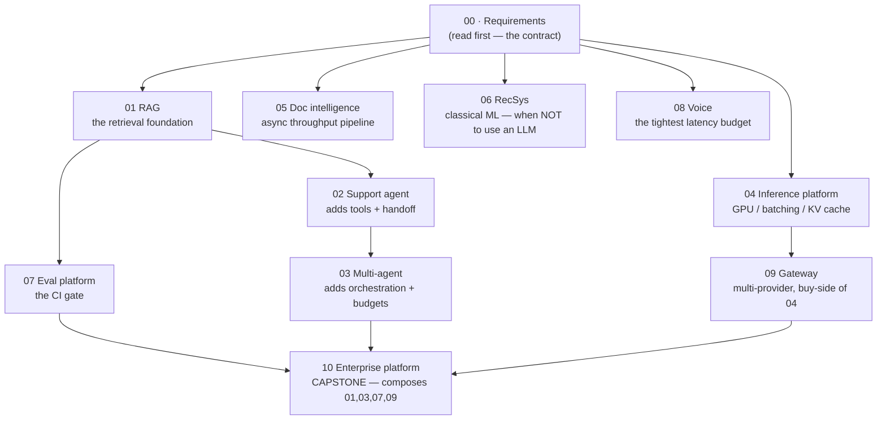

# 🏗️ AI Platform System Design — 10 Designs (Requirements → HLD → LLD)

> Ten **generic AI platform/infrastructure** system designs — RAG, agents, inference, document intelligence, recsys, evals, voice, gateway, enterprise platform. Each one carries full **Requirements** (quantified NFRs, latency budget, capacity arithmetic), **HLD** (architecture, component choices *with rejected alternatives*, failure modes, scale plan), and **LLD** (schemas, API contracts, algorithms, sequence diagrams, state machines, edge cases).
>
> **Read [`00_requirements_all_systems.md`](00_requirements_all_systems.md) first.** It is the contract every design must satisfy — and the discipline it enforces (numbers before boxes) is the whole point of the set.
>
> **Then [`00_tech_stack.md`](00_tech_stack.md)** — the shared substrate, the places the ten systems genuinely disagree on technology, and the utilization test that decides build-vs-buy. Each system's own concrete stack lives in its **§2.7**.

**Relationship to [`21_ai-system-design-deep-dives/`](../21_ai-system-design-deep-dives/README.md):** that folder is **fintech/debt-markets domain** (collections, credit risk, KYC, fraud, prompt-injection defense). This folder is **product-agnostic AI platform work**. Three pairs partially overlap and are cross-linked in place — read both sides, they go deep in different directions:

| This folder | Existing folder | How they differ |
|---|---|---|
| `05` Document intelligence | [`02_document_intelligence_agent`](../21_ai-system-design-deep-dives/02_document_intelligence_agent.md) | Generic OCR-first throughput pipeline vs. loan/bond term extraction with domain validation |
| `07` LLM evaluation platform | [`04_agent_eval_guardrail_platform`](../21_ai-system-design-deep-dives/04_agent_eval_guardrail_platform.md) | Multi-tenant eval *platform* other teams' CI calls vs. eval + guardrails for one agent |
| `10` Enterprise agent platform | [`01_agentic_ai_platform`](../21_ai-system-design-deep-dives/01_agentic_ai_platform.md) | Generic multi-tenant enterprise platform vs. fintech-scoped |

---

## 📋 The ten problems

| # | File | Prompt | Defining constraint |
|---|---|---|---|
| 00 | **[Requirements — all systems](00_requirements_all_systems.md)** | — | ✅ **Done** |
| 00 | **[Tech stack](00_tech_stack.md)** | — | ✅ Shared substrate + the self-hosting flip test |
| 01 | **[Production RAG system](01_production_rag_system/README.md)** ✅ | Ingestion, chunking, embeddings, vector DB, retrieval, reranking, citations, eval, caching, scaling | Token cost — naive design is 185× over budget |
| 02 | **[Customer support agent](02_customer_support_agent/README.md)** ✅ | Intent, tool calling, memory, RAG, human handoff, guardrails, observability | The agent *acts* — wrong action = financial incident |
| 03 | **[Multi-agent system](03_multi_agent_system/README.md)** ✅ | Orchestration, planner/executor, communication, shared state, tools, failure handling, cost | Cost is **multiplicative**; unbounded loops are unbounded spend |
| 04 | **[LLM inference platform](04_llm_inference_platform/README.md)** ✅ | Routing, GPU management, batching, streaming, autoscaling, rate limits, fallback | **KV cache**, not weights, caps concurrency |
| 05 | **[Document intelligence](05_document_intelligence/README.md)** ✅ | PDF/image ingestion, OCR, parsing, extraction, validation, async, retries, storage | **Human review cost is 45× compute cost** |
| 06 | **[Recommendation system](06_recommendation_system/README.md)** ✅ | Candidate generation, ranking, embeddings, feature store, online/offline, feedback | 216B scorings/day — arithmetically forces two-stage |
| 07 | **[LLM evaluation platform](07_llm_evaluation_platform/README.md)** ✅ | Datasets, offline eval, LLM-as-judge, human eval, metrics, regression detection, tracking | Must fit a **CI gate** or teams bypass it |
| 08 | **[Real-time voice assistant](08_realtime_voice_assistant/README.md)** ✅ | Audio streaming, ASR, interruption, LLM streaming, TTS, latency, sessions | ~800 ms across six stages — **the budget doesn't close** |
| 09 | **[Multi-provider LLM platform](09_multi_provider_llm_platform/README.md)** ✅ | Unified API, routing, fallback, prompt management, rate limits, cost optimization | Availability **above** any single provider — from a *serial* component |
| 10 | **[Enterprise AI agent platform](10_enterprise_agent_platform/README.md)** ✅ **CAPSTONE** | Auth/authz, MCP/tools, RAG, memory, workflows, multi-tenancy, guardrails, audit, security | *The agent's identity is the user's identity* |

---

## 🎯 What makes these interview-grade

The set is built on four rules, enforced by the [`ai-system-design` skill](../../.claude/skills/ai-system-design/SKILL.md):

1. **Requirements before architecture.** No box gets drawn before scope, scale, and SLOs are written. Jumping to boxes is the most common interview failure.
2. **Every component choice names its rejected alternative** *and* a **revisit-when threshold**. "pgvector" is not a decision; "pgvector until ~50M vectors, then reconsider for namespace isolation" is.
3. **Quantify or admit you're guessing.** Arithmetic is shown; assumptions are labelled as assumptions.
4. **AI systems fail differently.** Token cost, TTFT-vs-total latency, eval regression, hallucination, prompt injection, drift, provider deprecation — a design ignoring these is a generic backend design.

---

## 🔍 The most useful thing in the requirements doc

**The arithmetic invalidated the stated requirements in four of the ten systems** — and reporting that is a *stronger* answer than a design that quietly ignores it:

| System | What the numbers revealed |
|---|---|
| **01 RAG** | $8k/month at 130M queries/month is **not achievable** with a hosted frontier model — naive cost is $1.48M/month, 185× over. Five optimization levers get to ~$95k. Three options go back to the business. |
| **04 Inference** | Self-hosting an 8B model costs **~10× more** than a small hosted API at the assumed utilization. Self-hosting must be justified on residency/latency/privacy — **not cost** — unless utilization > 80% with reserved pricing. |
| **07 Eval platform** | A 200-case suite costs $6.78/run against a $2.00 ceiling. **Tiered suites** (50-case smoke on PR, 200-case nightly) is the structural fix, not a micro-optimization. |
| **08 Voice** | The six-stage pipeline sums to **~870 ms against an 800 ms SLO** — the budget does not close. Speculative endpointing (−150 ms) plus co-location (−40 ms) reaches ~680 ms. A design showing a tidy sum has padded or dropped a stage. |
| **09 Gateway** | "99.99% via multi-provider fallback" fails to arithmetic twice: the gateway is *serial*, so it needs **99.995%** itself, and at just **5% correlated** provider failure the fallback set alone misses the target. |

Two further patterns the [cross-system matrix](00_requirements_all_systems.md#cross-system-requirement-matrix) surfaces:

**And once, it validated one.** §10 requires 100% audit retention with no sampling — the arithmetic puts it at ~$250/month against ~$220k of LLM spend, **0.1%**. There is no cost argument for sampling, which matters because that is the standard justification. *The discipline exists to find out, not to find problems.*

- **The binding constraint is rarely the LLM.** §5 is bound by human review, §6 by scoring volume, §8 by ASR/TTS, §9 by logging volume. Only §1, §4, §9 are genuinely token-cost-bound.
- **"Latency-critical" means three different architectures.** §6 needs 150 ms *total*; §8 needs 800 ms for four stages; §1 gets 1.5 s for TTFT alone.

---

## 🗺️ Suggested order



**Route:** `00` → `01` → `02` → `03` for the agentic line. `04` → `09` for the infra line. `06` standalone (classical ML). `08` for the latency masterclass. **`10` last** — it composes the others.

---

## 🎤 How to rehearse

For each file, before opening it, produce the **three-sentence compression**:

1. The one architectural choice that matters most.
2. The alternative you rejected, and the threshold at which you'd revisit.
3. The failure mode you'd volunteer unprompted.

Then open the file and check yourself against §2.2 (the *why* table) and §2.5 (failure modes). If you can defend every row against *"but why not X?"*, move to the LLD and do the same for the data model and core algorithm.

**Two habits worth drilling:**

- **Answer "why not X" with a threshold, not an opinion.** "pgvector until ~50M vectors" beats "Pinecone is overkill."
- **When asked what you'd build it with, give the threshold and the ops cost.** "pgvector until ~50M vectors, then Qdrant — and self-hosting adds a GPU pool plus an inference server, roughly two engineers of standing cost." See [`00_tech_stack.md`](00_tech_stack.md#how-to-use-this-in-an-interview).
- **When challenged on a number, point at the assumption, not the number.** *"That rests on SA-2 — 65% small-tier routing. If your traffic is harder, cost roughly triples and that lever mostly disappears."* See the [shared assumptions register](00_requirements_all_systems.md#shared-assumptions-register).

---

## 📁 File anatomy

Each design file follows the same shape:

| Section | Contents |
|---|---|
| **Three-sentence compression** | The opening answer, before any diagram |
| **1. Requirements** | Problem/users · FRs (numbered, prioritized) · NFRs (quantified) · non-goals · latency budget · capacity arithmetic · assumptions |
| **2. HLD** | Architecture (Mermaid, ingestion/serving separated) · component choices with rejected alternatives · data flow · NFR mapping · failure modes + degraded behaviour · 10×/100× scale plan · **§2.7 tech stack** (concrete tech, rejected alternative, revisit-when, ops cost) |
| **3. LLD** | Schemas with index justifications · API contracts with error codes + idempotency · core algorithms with budget caps · sequence diagrams (happy **and** failure path) · state machines · edge cases |
| **4. AI-specific concerns** | Token cost · eval + CI gate · groundedness · prompt injection as untrusted data · observability with per-call cost tracing |
| **5. Common mistakes** | Mistake → why it's wrong → do instead |
| **6. Interview follow-ups** | Real questions with real answers |
| **7. Glossary** | Every term, three columns |

---

## 📐 Structure

Each system is a **folder** of four phase files plus an index, because a complete design at this depth runs 1,500+ lines and the split mirrors the order the work is actually done in:

```text
NN_<system_name>/
├── README.md                        # three-sentence compression · diagram · key numbers · nav
├── 01_requirements.md               # FRs · quantified NFRs · latency budget · capacity arithmetic
├── 02_hld.md                        # architecture · component choices + rejected alternatives · failure modes · tech stack
├── 03_lld.md                        # schemas · API contracts · algorithms · sequence diagrams · edge cases
└── 04_production_and_interview.md   # AI-specific concerns · runbook · mistakes · follow-ups · glossary
```

**Cross-file discipline:** `00_requirements_all_systems.md` fixes the headline numbers; per-system requirements files add depth rather than restating them, so a changed assumption propagates from one place.

---

_**All ten designs complete** — 5 files each (index + requirements + HLD + LLD + production/interview), plus the shared requirements contract and tech stack in `00`. Read `00` first, then follow the suggested order above; `10` last._
