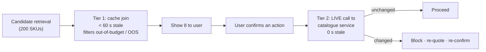

# 01 · Requirements — E-commerce AI Shopping Agent

> **Shared block:** [`../00_requirements_all_systems.md#1-e-commerce--ai-shopping-agent`](../00_requirements_all_systems.md#1-e-commerce--ai-shopping-agent) carries the problem statement, FR-1…FR-10, the NFR table, non-goals, the latency budget, and the capacity arithmetic. **Those numbers are not repeated here.**
>
> This file adds the three system-specific decisions the shared block only gestures at.
>
> **Next:** [`02_hld.md`](02_hld.md) →

---

## A. The gating decision (the consequence of the cost arithmetic)

The shared block establishes that a naive design costs ~$4.34M/month against a ceiling of ₹1.5/conversation, and that five stacked levers only reach ~$648k. The residual gap is closed by **not running the agent on every session.**

### The triggering rule

| Trigger | Rationale |
|---|---|
| **Explicit entry** — user taps "Ask" / the assistant surface | Highest intent; user has opted in |
| **Search-with-no-click** — ≥ 2 searches, 0 product clicks in the session | The keyword path has visibly failed this user |
| **Deep-filter thrash** — ≥ 4 filter changes without a click | The user has a constraint set the filter UI can't express |
| **High-value category** + ≥ 90 s dwell | Margin justifies the spend |
| ❌ **Not** on: bounce sessions, direct-to-PDP arrivals, repeat purchases | The agent adds nothing where intent is already resolved |

**Assumed qualification rate: ~8% of sessions** *(assumption — must be measured; the entire unit economics rests on it)*.

> **Why this belongs in requirements, not the HLD.** It changes what the product *is*. An "AI shopping assistant on every session" and "an assistant that appears when search fails" are different products with different success metrics. Discovering that in requirements is cheap; discovering it after building the serving tier is not.

### The measurement that validates or kills it

| Metric | Test |
|---|---|
| Qualified-session rate | Is it ~8%? At 20% the cost is 2.5× and the ceiling breaks again |
| Incremental conversion on qualified sessions | Must exceed the non-agent arm by enough to fund $52k/month |
| Return rate on agent-assisted orders | **Must not rise** — a cheaper conversion that returns is worse than no conversion |

---

## B. Confirmation semantics (FR-5, made precise)

FR-5 says "explicit confirmation before any side-effecting action." That sentence is doing a lot of work, so here is what it means operationally — because this is the requirement most likely to be implemented wrongly.

### What counts as confirmation

| ✅ Valid confirmation | ❌ **Not** confirmation |
|---|---|
| A distinct UI event (button tap) bound to a specific, server-issued `action_id` | The user typing "yes" / "ok" / "sure" in the chat |
| The action's full parameters rendered to the user *before* the event | The LLM asserting in its output that the user agreed |
| A confirmation token that is single-use and expires | Inferred assent from conversational context |

> **Why conversational assent is rejected.** Two reasons, and both are load-bearing:
>
> 1. **Ambiguity.** "Yes" may answer a different question than the one the system thinks it asked, especially after a multi-turn exchange.
> 2. **Injection.** Product descriptions are seller-controlled (§D). If assent could be inferred from text in the model's context, injected text becomes an attack on the user's wallet. **A UI event cannot be forged by content in the context window.**

### The action classes

| Class | Examples | Gate |
|---|---|---|
| **Read** | Search, compare, check stock | None — no side effect |
| **Reversible write** | Add to cart, save for later, apply filter | Single confirmation, undoable in UI |
| **Financial** | Checkout, apply payment method | Confirmation **+ live re-validation** of price and stock (§C) |
| **Account** | Change delivery address, change payment instrument | Confirmation + re-authentication |
| **Prohibited in v1** | Cancel an existing order, request a refund, change account email | Out of scope — no tool exists |

**Requirement:** the tool registry is an **allow-list**. A tool the agent has no entry for cannot be called, and the prohibited class simply has no implementation. *Capability is removed, not merely discouraged.*

---

## C. The catalogue-freshness contract

The shared NFR says "price/stock < 60 s stale." That single row implies an architectural rule worth stating explicitly, because getting it wrong is the most damaging failure this system can have.

### The rule

> **Price and stock are never read from the vector index.**

The vector index stores embeddings and *slow-moving* attributes (title, category, material, dimensions). Price and stock live in a separate cache fed by change-data-capture, and are **joined at query time** for the candidate set only.

| Attribute class | Where it lives | Staleness tolerance | Why |
|---|---|---|---|
| Embedding + descriptive text | Vector index | Hours | Re-embedding on every price change is wasteful and would thrash the index |
| Category, brand, size, material | Vector index (payload) | Hours | Rarely change; usable as ANN filters |
| **Price** | Price/stock cache | **< 60 s** | Changes constantly (promotions, dynamic pricing) |
| **Stock / availability** | Price/stock cache | **< 60 s** | Changes on every purchase |
| **Live validation at confirmation** | Source of truth (catalogue service) | **0 s** | The financial gate — see below |

### Two-tier validation

**Tier 1** keeps the 1.2 s TTFT budget achievable (a live call per candidate would cost hundreds of milliseconds × 200). **Tier 2** makes the financial path correct. The 60 s window is acceptable for *browsing* and unacceptable for *buying*, and the design reflects exactly that distinction.

**Acceptance criterion:** in an eval where price changes are injected between quote and confirmation, 100% of changed items are caught at Tier 2 and re-quoted — **0% silently transacted at the stale price.**

---

## D. Untrusted-content classification

This system ingests text controlled by third parties. Classifying it up front determines the guardrail design.

| Content | Author | Trust | Handling |
|---|---|---|---|
| System prompt | Us | Trusted | Versioned artifact |
| User message | The shopper | Semi-trusted | Injection-screened; cannot escalate privilege |
| **Product title / description / attributes** | **Marketplace sellers** | **Untrusted** | Wrapped as data, never instructions; stripped of instruction-like patterns; never granted tool authority |
| Product reviews | Other shoppers | Untrusted | Same as above; excluded from v1 context |
| Tool results (cart, stock) | Our services | Trusted | Structured, schema-validated |

> **The threat that makes this non-theoretical:** a seller writes into a product description something shaped like an instruction to the assistant — to recommend their item, disparage a competitor, or trigger a cart action. At 50M SKUs there is no manual review path. Defence is structural (§`04_production_and_interview.md`), not a prompt asking the model to be careful.

---

## E. Additional non-goals (beyond the shared block)

- **Not** re-ranking by seller-paid promotion in v1 — mixing ad incentives into an assistant that claims to serve the shopper is a trust decision the business must make explicitly, not a feature to slip in.
- **Not** negotiating or applying discount codes the user didn't supply.
- **Not** persisting conversation transcripts beyond 30 days *(assumption — verify against the privacy policy)*.
- **Not** cross-marketplace price comparison.

---

## F. Open questions carried into the HLD

Beyond the shared block's list:

1. **Does the catalogue service expose a bulk live price/stock endpoint?** Tier 2 validation needs one call for a handful of SKUs at < 150 ms. If only per-SKU calls exist, confirmation latency degrades and may need an async confirm-then-notify flow.
2. **Is the 8% qualification rate stable across categories and seasons?** Festival traffic may qualify at a much higher rate, exactly when volume peaks — a cost spike concurrent with a traffic spike.
3. **Who owns the tool allow-list?** §B makes it a security boundary; it needs a named owner and a change process, or it will accrete tools.
4. **What is the fallback when the agent is *not* triggered?** The keyword search path must remain fully functional — the agent is additive, and 92% of sessions never see it.

---

**Next:** [`02_hld.md`](02_hld.md) →
