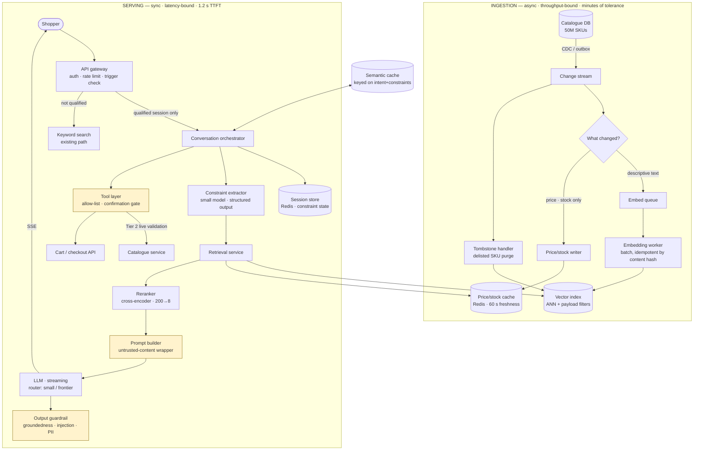

# 01 · HLD — E-commerce AI Shopping Agent

> ← [`01_requirements.md`](01_requirements.md) · **Next:** [`03_lld.md`](03_lld.md) →
>
> **Three-sentence compression:** hard constraints are filters pushed into retrieval and re-validated live at confirmation, never soft instructions to the LLM · I rejected the single-stage "hand 20 products to the model" design because it puts price correctness inside a probabilistic component and blows the cost ceiling · the failure mode I'd volunteer is seller-controlled product text as a marketplace-scale prompt-injection surface.

---

## 2.1 Architecture

Ingestion and serving are separated because they have nothing in common operationally: ingestion is throughput-bound and tolerant of minutes of delay; serving is latency-bound with a 1.2 s TTFT budget.

Highlighted boxes are **trust boundaries** — where untrusted content is contained (`PB`), where output is verified (`GR`), and where privilege is gated (`TL`).

---

## 2.2 Component choices

**The most important table in this document.** Every row names what I rejected and the threshold at which I'd revisit.

| Concern | Choice | Why | Rejected alternative (and why not) | Revisit when |
|---|---|---|---|---|
| **Vector store** | **Vespa** (or Qdrant) — ANN with native filter pushdown | 50M SKUs with *mandatory* hard filters (budget/size/stock). Filter must be evaluated **during** graph traversal, not after, or top-k semantics break | **pgvector** — comfortable to ~5–10M vectors; at 50M the HNSW index exceeds sensible single-instance RAM and filtered recall degrades. **Pinecone** — good ANN, weaker at complex multi-attribute filter pushdown, and adds vendor cost we don't need at this scale | Below ~10M SKUs (pgvector becomes correct); or if filters become simple single-tenant equality (Pinecone fine) |
| **Filter strategy** | **Pre-filter pushed into the ANN query** | Post-filtering returns fewer than *k* results and silently biases toward whatever the index ranked highly — a shopper asking for "under ₹2,000" would get 3 results because 197 were filtered out after retrieval | **Post-filter** — simpler, but breaks the 100%-constraint-compliance NFR and produces empty-looking result sets | Never for hard constraints. Post-filtering is acceptable only for soft preferences |
| **Price / stock** | **Separate Redis cache, CDC-fed, joined at query time** | Price changes constantly; re-embedding on price change would thrash the index. See [`01_requirements.md#c-the-catalogue-freshness-contract`](01_requirements.md#c-the-catalogue-freshness-contract) | **Store price in the vector payload** — attractive (single lookup) but makes every price change an index write, and 60 s freshness across 50M SKUs becomes impossible | If price volatility drops to daily (then payload storage is fine) |
| **Financial correctness** | **Tier 2 live re-validation at confirmation** | The 60 s cache is fine for browsing, unacceptable for buying | **Trust the cache at checkout** — 60 s is long enough for a stock-out; transacting at a stale price is the worst failure this system has | Never. This is the financial gate |
| **Reranker** | **Cross-encoder** (bge-reranker class), 200 → 8 | ANN recall is good, precision@8 is not. Cross-encoder is the cheapest large precision gain; 150 ms for 200 docs fits the budget | **LLM-as-reranker** — better quality, but ~4× cost and ~3× latency for a marginal gain over a cross-encoder, and this budget has 60 ms of headroom. **No reranker** — measurably worse shortlists, which is the whole product | TTFT budget tightens below 1 s (drop to 100 candidates), or if a distilled reranker matches quality at half the latency |
| **Constraint extraction** | **Small model with enforced structured output** (JSON schema) | Deterministic, cheap (~$0.0002), and the output feeds a *filter* — so it must be machine-parseable, not prose | **Frontier model** — 20× cost for a task a small model does reliably with schema enforcement. **Regex/NER** — brittle on "something warm for a toddler under two thousand" | Extraction F1 drops below ~0.95 on a held-out intent set |
| **LLM routing** | **Small for refinements, frontier for initial + comparison** | ~70% of turns are simple modifications ("cheaper", "in blue"); routing is the single largest cost lever (−60% blended) | **Frontier for everything** — 2.5× cost for no measurable quality gain on refinements. **Small for everything** — visibly worse comparison and explanation quality | Router misclassification rate exceeds ~5%, or a small model closes the comparison-quality gap |
| **Semantic cache** | **Yes, keyed on (normalised intent + constraint set + category)** | Head intents repeat heavily; ~25% hit rate removes retrieval + rerank + LLM entirely | **No cache** — 25% more cost. **Cache on raw query string** — near-zero hit rate; paraphrases dominate | Hit rate measured below ~10% (not worth the invalidation complexity) |
| **Session state** | **Redis, constraint set as structured state** | Constraints must survive turns and be *machine-readable* for filtering — not re-derived from transcript each turn | **Re-extract from full transcript every turn** — token cost grows quadratically and drifts. **Postgres** — unnecessary durability for a 30-min TTL object | Conversations need to resume across days (then durable store) |
| **Tool layer** | **Explicit allow-list + server-issued single-use confirmation tokens** | Capability is *removed* for prohibited actions, not discouraged. A token bound to a rendered action can't be forged by injected text | **Let the LLM call any cart API** — an injection in a product description becomes an attack on the user's wallet. **Confirm via conversational "yes"** — ambiguous and forgeable | Never loosen. Add tools only through the owned change process |
| **Streaming** | **SSE, token-level, with citation events** | TTFT is the perceived-latency metric; a 4 s non-streamed response feels broken | **Non-streaming** — simpler, but p95 full-response is 4 s and the UI would sit blank | Never for the conversational surface |
| **Output guardrail** | **Overlapped with the stream; retractable** | Groundedness and injection checks can't cost 200 ms of TTFT. Overlap them, and support stream retraction if a check fails | **Blocking pre-stream check** — adds ~180 ms to TTFT, breaking the budget. **No check** — hallucinated product attributes are a returns and liability problem | If the UI cannot support retraction, the check must block and the budget must be renegotiated |

---

## 2.3 Data flow, narrated

**The primary path** (a qualified session's first substantive turn):

1. **Gateway** authenticates, applies the per-user rate limit, and evaluates the **trigger rule** ([`01_requirements.md#a`](01_requirements.md#a-the-gating-decision-the-consequence-of-the-cost-arithmetic)). An unqualified session is routed to keyword search and never reaches the orchestrator — *this hop is what keeps the system inside its cost ceiling.*
2. **Orchestrator** loads session state (accumulated constraints from prior turns) from Redis. Existing constraints matter: turn 4's "cheaper" is meaningless without turn 1's budget.
3. **Semantic cache** is consulted on `(normalised intent + constraint set + category)`. A hit returns a rendered shortlist and skips steps 4–8 entirely. This exists purely for cost, not latency.
4. **Constraint extractor** (small model, JSON schema) converts the utterance + prior state into a structured constraint set: hard filters (`price ≤ 2000`, `size = 2T`, `in_stock = true`) and soft preferences (`warm`, `durable`). *The hard/soft split happens here* — everything downstream depends on it.
5. **Retrieval service** embeds the soft-preference text, then issues a **single ANN query with hard filters pushed into it**, requesting 200 candidates. Filters are evaluated during traversal so the 200 returned are 200 *eligible* items.
6. **Price/stock join** against the Redis cache for those 200 SKUs, dropping anything now out-of-budget or out-of-stock. Two-stage filtering (index payload + live-ish cache) exists because the index can't hold 60-second-fresh prices.
7. **Reranker** scores the surviving candidates against the full intent and returns the top 8. *8, not 20* — a deliberate cost decision worth ~30% of input tokens at negligible quality loss.
8. **Prompt builder** assembles the context, wrapping catalogue text in explicit untrusted-data delimiters and stripping instruction-shaped patterns. The system prompt is a versioned artifact; it is identical every turn, which is what makes prompt caching work.
9. **Router** picks small vs frontier based on turn type (initial/comparison → frontier; refinement → small).
10. **LLM streams** the response over SSE. The shortlist itself is rendered by the **UI from structured data** — the model's output is the explanatory and comparative text only. *This is the single biggest cost lever after routing: never ask a model to emit a table you already have.*
11. **Output guardrail** runs concurrently with the stream, checking attribute groundedness against the retrieved records, injection markers, and PII. A failure retracts the stream and substitutes a safe response.
12. **On a side-effecting action:** the orchestrator issues a server-side `action_id` with the fully-rendered parameters, the UI displays them, and only a **distinct UI confirmation event** bound to that id proceeds — at which point **Tier 2 live validation** hits the catalogue service before the cart/checkout call.

**The ingestion path**, briefly: catalogue CDC is classified by *what changed*. Descriptive changes enter the embedding queue (batched, idempotent by content hash, so redundant re-embeds are free). Price/stock changes go straight to the Redis writer, bypassing embedding entirely. Delistings produce tombstones that purge the vector index — *without this, the agent recommends products that no longer exist,* which is a distinct failure from recommending out-of-stock ones.

---

## 2.4 NFR mapping

Which mechanism actually delivers each requirement. Without this table the NFR list is decoration.

| NFR (from shared block) | Delivered by |
|---|---|
| TTFT p95 < 1.2 s | Latency budget §1.5 · SSE streaming · 8-candidate context · overlapped guardrail · semantic cache on hits |
| Throughput 200 QPS / 1,200 peak | Stateless orchestrator behind HPA · Redis session store · reranker as an independently-scaled pool |
| Availability 99.9% | Multi-AZ stateless services · **keyword search as the degraded path** (the agent is additive, so its failure isn't a site outage) |
| **100% constraint compliance** | Hard constraints as **pre-filters pushed into the ANN query** + price/stock cache join + **Tier 2 live re-validation** at confirmation |
| Groundedness ≥ 0.98 (attributes) | UI renders attributes from structured records (not model output) · output guardrail cross-checks any attribute the model does assert · CI eval gate |
| Cost ≤ ₹1.5/conversation | **Trigger gating (~8% of sessions)** · prompt caching · model routing · semantic cache · 8-candidate context · 150-token output cap |
| Freshness < 60 s (price/stock) | CDC → Redis writer path that bypasses embedding · TTL enforcement · Tier 2 for the financial path |
| Scale 50M SKUs | int8-quantised vectors (~51 GB) · category sharding · hot-category residency, tail on disk-backed IVF |
| FR-5 confirmation | Server-issued single-use `action_id` + UI event binding + tool allow-list |

---

## 2.5 Failure modes and blast radius

**Volunteer at least one of these unprompted.** Graceful degradation beats hard failure in every row.

| Failure | Detection | Blast radius | Mitigation / degraded mode |
|---|---|---|---|
| **LLM provider 5xx / timeout** | Error rate, TTFT p99 | All qualified sessions | Retry with jitter (1 attempt, budget permitting) → fallback provider → **render the reranked shortlist with no narration** and an honest banner. The shortlist is the value; the prose is garnish |
| **Price/stock cache stale or down** | Cache age metric, miss rate | All shortlists | Fail **closed** on the financial path (block confirmation, surface "re-checking availability"); fail **open** on browsing with a "prices updating" notice. Never transact on unknown price |
| **Tier 2 validation unavailable** | Catalogue-service error rate | All confirmations | **Block the action.** Offer "add to cart on the normal flow." An unvalidated purchase is worse than a blocked one |
| **Vector index hot shard** | p99 retrieval latency by shard | One category's shoppers | Read replicas per hot category · per-session rate limit · shed to keyword search for that category |
| **Injected instruction in product text succeeds** | Guardrail injection detector; anomalous tool-call attempts | Potentially one user's cart | Tool allow-list means no unconfirmed write is possible · confirmation token can't be forged · quarantine the SKU, alert trust-and-safety |
| **Embedding model version skew** | Retrieval eval score drop; version mismatch counter | All new ingests | Version stamped per vector; **never mix versions in one search** · blue/green reindex with shadow evaluation before cutover |
| **Constraint extractor emits malformed JSON** | Schema validation failure rate | That turn | Schema-enforced decoding + one repair retry → fall back to keyword search for that turn (better than filtering on garbage) |
| **Semantic cache serves a wrong-user result** | Cache-key audit | Potentially many users | Key includes constraint set and category but **no user identity** — so cached content must be user-agnostic by construction; personalised results are marked non-cacheable |
| **Trigger rule misfires broadly** (e.g. a bug qualifies 100% of sessions) | Qualified-session-rate alarm with a hard ceiling | Cost blowout | **Hard budget circuit breaker**: a daily spend cap that disables the agent surface and reverts to keyword search when tripped |

> The last row is the one most designs omit. A cost regression is a **production incident** in an LLM system, and it needs a breaker, not a dashboard.

---

## 2.6 Scale plan

| | What breaks first | Why | What I'd change |
|---|---|---|---|
| **10×** (2,000 QPS, 80M DAU) | **The reranker pool** | Cross-encoder is the most compute-dense hop; 200 candidates × 2,000 QPS saturates GPU capacity before retrieval or the LLM does | Distil the reranker to a smaller cross-encoder; cut candidates 200 → 120 (measure recall loss); add a cheap pre-filter stage (bi-encoder score threshold) to shrink what the cross-encoder sees |
| **10×** (secondary) | LLM provider rate limits | Provider quotas, not our infrastructure | Multi-provider routing with per-provider quota accounting; raise the semantic-cache target |
| **100×** (20,000 QPS, 500M SKUs) | **The vector index's filtered-ANN latency** | Filter pushdown cost grows with both corpus size and filter selectivity; a narrow filter over 500M vectors degrades badly | Shard by category **and** price band so the common filters become shard selection rather than in-traversal predicates; consider a learned two-stage retriever (cheap recall model → ANN on a reduced set) |
| **100×** (secondary) | Price/stock cache write throughput | 500M SKUs × price churn exceeds a single Redis cluster's write path | Partition the cache by SKU hash; move to a write-optimised store; accept per-category freshness tiers (fast-moving categories at 60 s, long-tail at 10 min) |

**What does *not* break:** the orchestrator and constraint extractor are stateless and scale horizontally; session state is naturally partitioned by user. **Naming what doesn't break matters** — it stops a scale discussion sprawling into "add replicas everywhere."

---

> ← [`01_requirements.md`](01_requirements.md) · **Next:** [`03_lld.md`](03_lld.md) →
