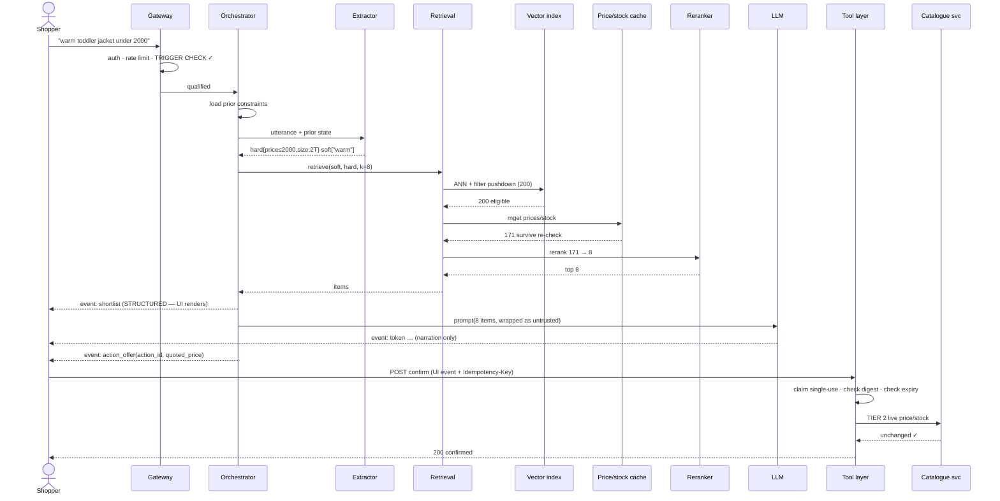
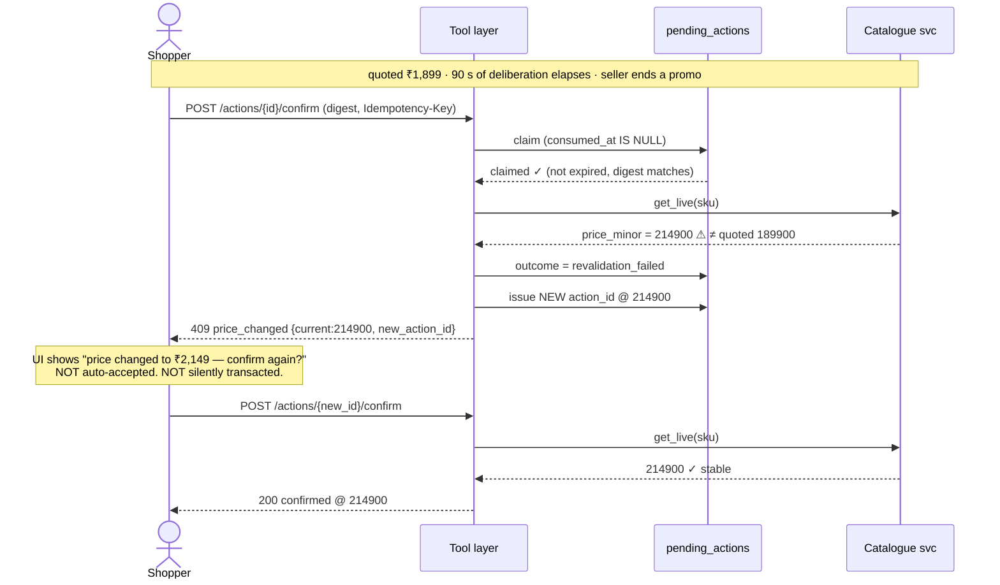
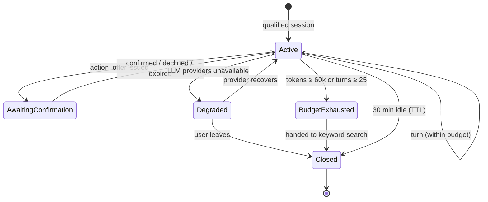
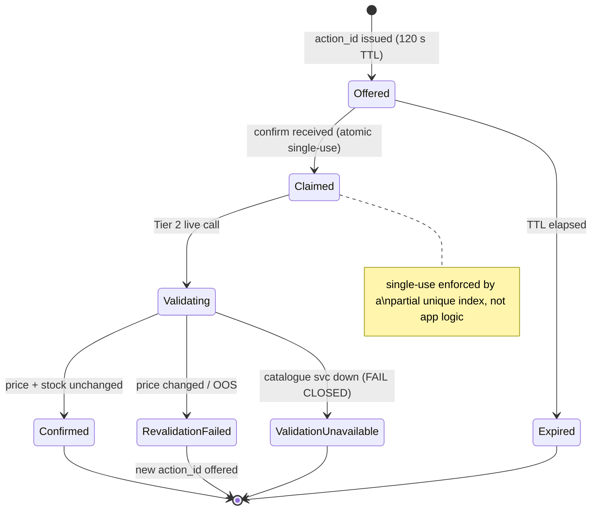

# 01 · LLD — E-commerce AI Shopping Agent

> ← [`02_hld.md`](02_hld.md) · **Next:** [`04_production_and_interview.md`](04_production_and_interview.md) →
>
> The HLD says *what*. This file proves it could actually be built.

---

## 3.1 Data models

### Catalogue (source of truth — read-only to this system)

```sql
-- Owned by the catalogue team. We consume it via CDC; we never write it.
-- Shown because our indexes and joins depend on its shape.
CREATE TABLE products (
    sku_id          BIGINT PRIMARY KEY,
    seller_id       BIGINT      NOT NULL,
    category_id     INT         NOT NULL,
    title           TEXT        NOT NULL,        -- UNTRUSTED: seller-controlled
    description     TEXT,                        -- UNTRUSTED: seller-controlled
    attributes      JSONB       NOT NULL,        -- size, colour, material, ...
    content_hash    BYTEA       NOT NULL,        -- sha256(title||description||attributes)
    status          TEXT        NOT NULL,        -- active | delisted | suppressed
    updated_at      TIMESTAMPTZ NOT NULL
);
CREATE INDEX idx_products_cdc ON products (updated_at)
    WHERE status = 'active';   -- partial: the CDC reader only cares about live SKUs
```

`content_hash` is what makes embedding **idempotent**: a price-only update changes `updated_at` but not the hash, so the embedding worker skips it. Without this column, every price change would trigger a redundant re-embed — the difference between an affordable and an unaffordable ingestion tier.

### Vector index (Vespa/Qdrant — logical schema)

```yaml
collection: products_v2            # v2 == embed_version; never mixed in one search
vector:
  name: content
  dims: 1024
  metric: cosine
  quantization: int8               # 205 GB float32 -> ~51 GB
payload:                           # ALL of these are filterable at traversal time
  sku_id:        int64   indexed
  category_id:   int32   indexed   # shard key
  seller_id:     int64   indexed
  size_norm:     keyword indexed   # normalised: "2T", "M", "42"
  colour_norm:   keyword indexed
  brand_id:      int32  indexed
  price_band:    int8   indexed    # coarse band ONLY, for shard pruning — not the price
  embed_version: int8   indexed
  status:        keyword indexed
sharding:
  key: category_id
  hot_categories_resident: true    # top 20% in RAM, tail on disk-backed IVF
```

> **`price_band` is a coarse bucket, not the price.** It exists so a "under ₹2,000" query can prune whole shards cheaply. The *actual* price comes from the cache (§ below). Storing the real price here would make every price change an index write — the mistake [`02_hld.md`](02_hld.md#22-component-choices) rejects.

### Price / stock cache (Redis)

```
KEY   ps:{sku_id}
TYPE  hash
FIELDS
  price_minor    int      # integer minor units — NEVER float for money
  currency       string
  stock          int
  promo_id       int|null
  updated_at     int      # unix seconds, for staleness assertion
TTL   180s                # 3× the 60 s freshness target: survives a brief writer outage
                          # while still expiring rather than serving unbounded-stale data
```

**Why a 180 s TTL against a 60 s freshness NFR:** the TTL is a *safety net*, not the freshness mechanism. CDC keeps entries ~60 s fresh; the TTL guarantees that if the writer dies, entries vanish rather than lingering forever. A missing entry is handled (drop the candidate); an unboundedly stale one is not.

### Conversation state

```sql
CREATE TABLE conversations (
    conversation_id  UUID PRIMARY KEY,
    user_id          BIGINT      NOT NULL,
    session_id       UUID        NOT NULL,
    trigger_reason   TEXT        NOT NULL,   -- which rule qualified this session (§01_req A)
    created_at       TIMESTAMPTZ NOT NULL DEFAULT now(),
    last_turn_at     TIMESTAMPTZ NOT NULL DEFAULT now(),
    turn_count       INT         NOT NULL DEFAULT 0,
    token_spend      INT         NOT NULL DEFAULT 0,   -- budget cap enforcement
    status           TEXT        NOT NULL DEFAULT 'active'
);
CREATE INDEX idx_conv_user_recent ON conversations (user_id, last_turn_at DESC);
-- Supports "resume my last conversation" and per-user abuse detection.

CREATE TABLE messages (
    message_id       UUID PRIMARY KEY,
    conversation_id  UUID        NOT NULL REFERENCES conversations ON DELETE CASCADE,
    turn_index       INT         NOT NULL,
    role             TEXT        NOT NULL,    -- user | assistant | tool
    content          TEXT        NOT NULL,
    model_version    TEXT,                    -- null for user turns
    prompt_version   TEXT,                    -- versioned artifact id
    tokens_in        INT,
    tokens_out       INT,
    cost_usd         NUMERIC(10,6),
    shortlist        JSONB,                   -- the sku_ids actually shown, for eval + attribution
    UNIQUE (conversation_id, turn_index)
);
CREATE INDEX idx_msg_conv ON messages (conversation_id, turn_index);
```

`shortlist` is retained deliberately: without recording *what was shown*, you cannot compute groundedness offline, attribute a conversion, or investigate a complaint.

### Constraint state (Redis, the live working set)

```
KEY   conv:{conversation_id}:constraints
TYPE  json
{
  "hard": {                       // these become ANN filters — machine-readable by design
    "price_minor_max": 200000,
    "size_norm": ["2T"],
    "in_stock": true,
    "category_id": 4412
  },
  "soft": ["warm", "machine washable", "durable"],
  "excluded_skus":   [88123, 90244],      // "not that one"
  "excluded_brands": [551],
  "turn_added": { "price_minor_max": 1, "size_norm": 2 }   // provenance, for "why?"
}
TTL 1800s
```

> **The hard/soft split is the core data-modelling decision in this system.** `hard` compiles to a filter expression; `soft` compiles to embedding text. Collapsing them into one blob would force the LLM to enforce budgets, which is exactly the failure mode the design exists to prevent.

### Confirmation tokens (the financial gate)

```sql
CREATE TABLE pending_actions (
    action_id        UUID PRIMARY KEY,
    conversation_id  UUID        NOT NULL REFERENCES conversations,
    user_id          BIGINT      NOT NULL,
    action_type      TEXT        NOT NULL,   -- add_to_cart | checkout | change_address
    params           JSONB       NOT NULL,   -- EXACTLY what was rendered to the user
    params_digest    BYTEA       NOT NULL,   -- sha256(params) — detects any mutation
    quoted_price     BIGINT,                 -- minor units, as shown
    created_at       TIMESTAMPTZ NOT NULL DEFAULT now(),
    expires_at       TIMESTAMPTZ NOT NULL,   -- created_at + 120s
    consumed_at      TIMESTAMPTZ,            -- single-use enforcement
    outcome          TEXT                    -- confirmed | expired | revalidation_failed
);
CREATE UNIQUE INDEX idx_pending_unconsumed ON pending_actions (action_id)
    WHERE consumed_at IS NULL;   -- partial unique index: enforces single-use at the DB layer
CREATE INDEX idx_pending_expiry ON pending_actions (expires_at) WHERE consumed_at IS NULL;
```

Three properties this schema guarantees, none of which depend on application correctness:

1. **Single-use** — the partial unique index means a second consume attempt fails at the database.
2. **Tamper-evident** — `params_digest` is computed server-side from what was *rendered*; a mutated confirmation payload won't match.
3. **Expiring** — a 120 s window bounds how stale a quote can be at confirmation time.

---

## 3.2 API contracts

### Conversational turn (streaming)

```http
POST /v1/agent/chat
Authorization: Bearer <jwt>              # user_id derived from the token, NEVER the body
X-Session-Id: <uuid>
Content-Type: application/json

{
  "conversation_id": "…",                 // omit to create
  "message": "something warm for a toddler, machine washable, under 2000",
  "stream": true
}

200 text/event-stream
  event: shortlist                        # STRUCTURED — the UI renders this, not the model
  data: {"items":[{"sku_id":88123,"title":"…","price_minor":189900,"currency":"INR",
                   "in_stock":true,"image":"…","match_reasons":["fleece-lined","machine washable"]}],
         "constraints_applied":{"price_minor_max":200000,"size_norm":["2T"]}}

  event: token                            # narration only
  data: {"delta":"These three all "}

  event: action_offer                     # a side-effecting action becomes AVAILABLE
  data: {"action_id":"…","action_type":"add_to_cart",
         "params":{"sku_id":88123,"qty":1},"quoted_price":189900,
         "expires_at":"2026-09-01T10:32:00Z"}

  event: done
  data: {"usage":{"in":1402,"out":148},"cost_usd":0.0051,
         "model":"frontier-v3","prompt_version":"shop-agent@2026-08-14"}

  event: retract                          # guardrail failed mid-stream
  data: {"reason":"groundedness_check_failed","replacement":"Let me re-check those details."}

400 malformed request
401 invalid token
403 session not qualified for the agent surface   # the trigger gate
409 conversation in a terminal state
422 constraint extraction failed after retry     # body includes a keyword-search fallback URL
429 rate limited (Retry-After)
503 all LLM providers unavailable                # body includes the shortlist, no narration
```

> **`event: shortlist` carrying structured data is the single most important line in this contract.** The products are rendered by the client from typed fields. The model never emits a price, and therefore can never emit a *wrong* price. This is how the 0.98 attribute-groundedness NFR is met architecturally rather than statistically.

### Confirming a side-effecting action

```http
POST /v1/agent/actions/{action_id}/confirm
Authorization: Bearer <jwt>
Idempotency-Key: <uuid>                  # REQUIRED — retry safety on a billable path
Content-Type: application/json

{ "params_digest": "sha256:…" }          # client echoes what it rendered; must match server-side

200 {"status":"confirmed","cart_id":"…","final_price":189900}

409 {"status":"revalidation_failed",     # Tier 2 caught a change
     "reason":"price_changed",
     "quoted_price":189900,"current_price":214900,
     "new_action_id":"…"}                # a fresh offer the user must confirm again
409 {"status":"revalidation_failed","reason":"out_of_stock"}
410 {"status":"expired"}                 # past expires_at — re-quote required
409 {"status":"already_consumed"}        # single-use violation (or a duplicate without Idempotency-Key)
422 {"status":"digest_mismatch"}         # rendered params ≠ server params: tamper or client bug
503 {"status":"validation_unavailable"}  # catalogue service down — FAIL CLOSED, never assume
```

**Design notes worth defending:**

- `Idempotency-Key` is **required**, not optional. A network retry on a checkout must not double-charge; the key makes the operation safely repeatable.
- A price change returns **409 with a new `action_id`**, not a silent re-price. The user must confirm the *new* price. Auto-accepting a higher price would be the worst possible resolution.
- Validation unavailability **fails closed** (503, action blocked). This is the opposite of the browsing path, which fails open with a notice — and the asymmetry is deliberate.

### Internal: retrieval service

```http
POST /internal/v1/retrieve
{
  "soft_text": "warm machine washable toddler outerwear durable",
  "hard": {"price_minor_max":200000,"size_norm":["2T"],"category_id":4412,"in_stock":true},
  "exclude_skus":[88999], "exclude_brands":[551],
  "candidates": 200, "return_k": 8
}

200 {
  "items":[{"sku_id":…, "ann_score":0.81, "rerank_score":0.94,
            "price_minor":189900, "stock":14, "price_age_s":23}],
  "diagnostics":{"ann_returned":200,"after_ps_join":171,"after_rerank":8,
                 "filter_pushdown":true,"cache_miss_skus":3}
}
```

`diagnostics` is not decoration — `after_ps_join` dropping sharply is the signal that the cache is stale or the price band is misaligned, and `cache_miss_skus` is what you alert on.

---

## 3.3 Core algorithms

### Retrieval with hard-constraint enforcement

```python
def retrieve(soft_text: str, hard: HardConstraints, k: int = 8,
             candidates: int = 200) -> list[Candidate]:
    """Hard constraints are enforced in TWO places, deliberately:
       (1) pushed into the ANN traversal  -> correct top-k semantics
       (2) re-checked after the live-ish price/stock join -> catches index staleness
    """
    qvec = embed(soft_text)                       # ~40 ms

    # (1) Filter INSIDE the traversal. Post-filtering would return < k eligible items.
    flt = build_filter(
        category_id=hard.category_id,
        size_norm=hard.size_norm,
        status="active",
        embed_version=CURRENT_EMBED_VERSION,      # never mix versions in one search
        price_band__lte=band_of(hard.price_minor_max),   # COARSE prune only
        sku_id__not_in=hard.exclude_skus,
        brand_id__not_in=hard.exclude_brands,
    )
    hits = vector_index.search(qvec, filter=flt, limit=candidates)   # ~90 ms

    # (2) Authoritative price/stock, then re-assert the hard constraints.
    ps = price_stock_cache.mget([h.sku_id for h in hits])            # ~110 ms
    eligible = []
    for h in hits:
        p = ps.get(h.sku_id)
        if p is None:                     continue   # unknown price -> DROP, never guess
        if p.updated_at < now() - 180:    continue   # beyond safety TTL -> DROP
        if p.stock <= 0 and hard.in_stock: continue
        if p.price_minor > hard.price_minor_max: continue   # the real check
        eligible.append(Candidate(h, p))

    if not eligible:
        return []                          # caller MUST handle: never fabricate products

    ranked = reranker.score(soft_text, eligible)[:k]                 # ~150 ms
    return ranked
```

**Three properties to point at in a review:** the coarse `price_band` prune is *not* trusted as the budget check; a missing or stale cache entry causes a **drop**, not a guess; and an empty result is returned as empty rather than backfilled by relaxing a hard constraint silently.

### Confirmation with Tier 2 validation

```python
MAX_QUOTE_AGE_S = 120

def confirm_action(action_id: UUID, user_id: int,
                   client_digest: str, idem_key: UUID) -> Result:
    # Idempotency first: a retry returns the ORIGINAL outcome, never re-executes.
    if prior := idempotency_store.get(idem_key):
        return prior

    # Atomic single-use claim. The partial unique index makes this race-free.
    action = db.claim_pending_action(action_id, user_id)   # UPDATE … WHERE consumed_at IS NULL
    if action is None:
        return Result(409, "already_consumed")
    if action.expires_at < now():
        return finish(idem_key, Result(410, "expired"))
    if not constant_time_eq(client_digest, action.params_digest):
        audit.security_event("digest_mismatch", action_id, user_id)   # possible tampering
        return finish(idem_key, Result(422, "digest_mismatch"))

    # TIER 2 — live, authoritative. This is the financial gate.
    try:
        live = catalogue_service.get_live(action.params["sku_id"], timeout_ms=150)
    except (Timeout, ServiceError):
        # FAIL CLOSED. An unvalidated purchase is worse than a blocked one.
        return finish(idem_key, Result(503, "validation_unavailable"))

    if live.stock < action.params["qty"]:
        return finish(idem_key, Result(409, "out_of_stock"))
    if live.price_minor != action.quoted_price:
        new_id = issue_action(action, quoted_price=live.price_minor)   # user must re-confirm
        return finish(idem_key, Result(409, "price_changed",
                                       current_price=live.price_minor,
                                       new_action_id=new_id))

    cart = cart_api.add(user_id, action.params, idempotency_key=idem_key)
    return finish(idem_key, Result(200, "confirmed", cart_id=cart.id))
```

### Agent loop with budget caps

```python
MAX_TURNS_PER_CONVERSATION = 25
MAX_TOKENS_PER_CONVERSATION = 60_000
MAX_TOOL_CALLS_PER_TURN     = 3

def handle_turn(conv: Conversation, utterance: str) -> Response:
    # Termination conditions checked BEFORE any spend. Unbounded loops are a real
    # production failure mode, not a theoretical one.
    if conv.turn_count >= MAX_TURNS_PER_CONVERSATION:
        return graceful_close("Let's start a fresh search.")
    if conv.token_spend >= MAX_TOKENS_PER_CONVERSATION:
        metrics.incr("conv.budget_exhausted")
        return graceful_close("Handing you to search to keep things quick.")
    if global_breaker.is_open():          # daily spend circuit breaker
        return fallback_to_keyword_search()

    constraints = merge(load_constraints(conv), extract_constraints(utterance))  # small model
    save_constraints(conv, constraints)

    if hit := semantic_cache.get(cache_key(constraints)):
        return hit                        # skips retrieval + rerank + LLM entirely

    items = retrieve(soft_text=" ".join(constraints.soft), hard=constraints.hard)
    if not items:
        # FR-8: relax exactly ONE named constraint, and say which.
        return no_results_response(constraints, relaxable=pick_relaxable(constraints))

    model = route(turn_type=classify_turn(utterance))     # small | frontier
    stream = model.stream(build_prompt(constraints, items[:8]),   # 8, not 20 — cost lever
                          max_output_tokens=150)
    return stream_with_overlapped_guardrail(stream, items)
```

---

## 3.4 Sequence diagrams

### Happy path



### Failure path — price changed between quote and confirmation

**This is the path that matters.** It's the most likely real-world failure and the one that decides whether users trust the agent.



> Note the price is now **above the user's stated ₹2,000 budget**. The correct behaviour is to surface that explicitly ("this is now above your ₹2,000 limit") rather than transact — the hard constraint outlives the shortlist that satisfied it.

---

## 3.5 State machines

### Conversation lifecycle



### Pending action lifecycle



---

## 3.6 Edge cases and correctness

| Edge case | Handling | Why this way |
|---|---|---|
| **Zero eligible results** | Return empty; relax exactly **one named** constraint and say which ("no 2T in stock under ₹2,000 — shall I look up to ₹2,500?") | FR-8. **Never** fabricate a product or silently drop a hard constraint |
| **Price changes mid-conversation** | Shortlist re-priced on the next turn's cache join; a stale `action_offer` fails Tier 2 | The cache is for browsing, Tier 2 for buying |
| **Out of stock at confirmation** | 409, offer the next-best from the existing shortlist (already retrieved, no extra cost) | Cheapest possible recovery |
| **Constraint conflict** ("under ₹500" + "cashmere") | Detect empty-set-by-construction *before* retrieving; explain the conflict | Saves a pointless retrieval and gives a better message |
| **Context overflow** on long conversations | Drop oldest turns; **never** drop the constraint state (it's separate, structured, and small) | The constraint set is the thing that must survive |
| **Currency / locale** | `price_minor` + `currency` everywhere; integer minor units only | Float money is a correctness bug waiting to happen |
| **Duplicate SKUs** (same product, many sellers) | Group by `content_hash` cluster; show cheapest in-stock, offer "other sellers" | Otherwise the shortlist is 8 copies of one item |
| **Delisted SKU still in the index** | CDC tombstone purges it; retrieval also drops anything whose cache entry is absent | Two independent defences, because recommending a nonexistent product is worse than recommending an OOS one |
| **Retry on confirm** | `Idempotency-Key` returns the original outcome | No double-charge, no double-add |
| **Concurrent confirms of the same action** | Partial unique index → one wins, other gets 409 | Race handled in the database, not hopefully in code |
| **Reindex while serving** | New `embed_version` built in a shadow collection; searches pin the current version; atomic alias flip after eval passes | Mixing embedding versions in one ANN search silently destroys recall |
| **Injected instruction in a product description** | Wrapped as untrusted data; instruction patterns stripped; **no tool authority derivable from context**; confirmation needs a UI event | Structural, not a plea to the model |
| **Guardrail fails mid-stream** | `event: retract` + safe replacement | Requires UI support; noted as a requirement, not assumed |
| **User asks to cancel an order** | No such tool exists → agent says it can't and links to order management | Capability removed, per the allow-list |
| **Personalised result caching** | Marked non-cacheable; the semantic cache key has no user identity, so cached entries are user-agnostic by construction | Prevents cross-user leakage structurally |
| **Session qualified erroneously at scale** | Daily spend circuit breaker disables the surface | A cost regression is an incident |

---

> ← [`02_hld.md`](02_hld.md) · **Next:** [`04_production_and_interview.md`](04_production_and_interview.md) →
