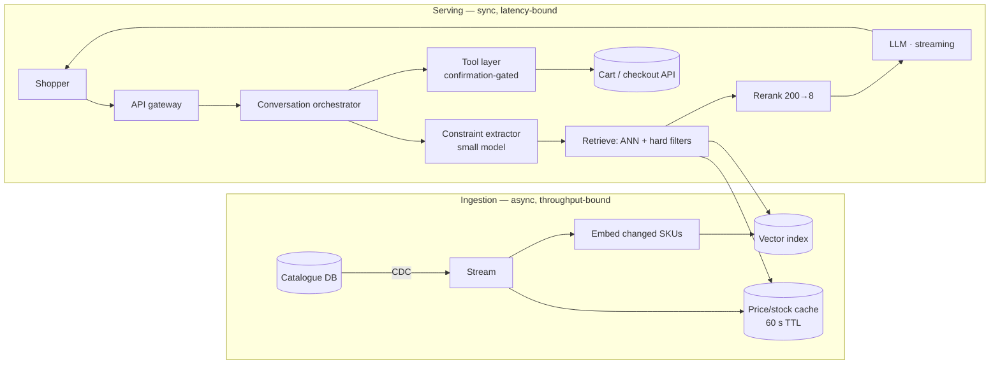

# 01 — E-commerce AI Shopping Agent

> **Archetype C · Transactional agent.** The system that can spend the user's money.

---

## The three-sentence compression

*Rehearse this before opening any other file.*

1. **The choice that matters most:** hard constraints (budget, size, stock, price) are applied as **filters pushed into the retrieval query and re-validated live at confirmation** — never as soft preferences the LLM is asked to respect, because an LLM asked to "stay under ₹2,000" will occasionally not.
2. **The alternative I rejected:** a single-stage "retrieve 20 products, hand everything to the LLM, let it decide" design. Rejected because it puts price/stock correctness inside a probabilistic component, and because feeding 20 full product records into every turn is what takes the cost 50× over budget.
3. **The failure mode I'd volunteer:** product descriptions are **seller-controlled text** flowing into the model's context — a marketplace-scale prompt-injection surface. Retrieved catalogue content is treated as untrusted data, never instructions, and the tool layer requires a separate user confirmation event that no amount of injected text can forge.

---

## Architecture at a glance

---

## Key numbers

| | |
|---|---|
| TTFT SLO | **p95 < 1.2 s** (budget sums to ~1,140 ms — 60 ms headroom) |
| Throughput | 200 QPS sustained · 1,200 QPS peak |
| Scale | 50M SKUs · 8M DAU |
| Cost ceiling | ≤ ₹1.5 (~$0.018) per conversation |
| **Cost finding** | Naive design = **$4.34M/month (≈50× over)**. After 5 levers → $648k. **Still over ⇒ gate to ~8% high-intent sessions ⇒ ~$52k/month** |
| Hard requirement | 100% constraint compliance · 0.98 attribute groundedness |
| Freshness | Price/stock < 60 s stale |

---

## Files

| File | Contents |
|---|---|
| [`01_requirements.md`](01_requirements.md) | System-specific depth beyond the shared block: the gating decision, confirmation semantics, catalogue-freshness contract |
| [`02_hld.md`](02_hld.md) | Architecture, component choices with rejected alternatives, data flow, NFR mapping, failure modes, scale plan |
| [`03_lld.md`](03_lld.md) | Schemas, API contracts, retrieval + confirmation algorithms, sequence diagrams, state machines, edge cases |
| [`04_production_and_interview.md`](04_production_and_interview.md) | AI-specific concerns, runbook, common mistakes, interview follow-ups, glossary |

**Shared requirements block:** [`../00_requirements_all_systems.md#1-e-commerce--ai-shopping-agent`](../00_requirements_all_systems.md#1-e-commerce--ai-shopping-agent) — numbers live there, not duplicated here.

---

## The two findings to leave with

1. **The cost ceiling changed the product, not the implementation.** No amount of prompt caching, routing, or context trimming brings an every-session agent inside budget at this scale. The design conclusion is a **triggering rule** — the agent runs on high-intent sessions only. Requirements work is supposed to produce conclusions like this.
2. **Correctness lives outside the model.** Price, stock, and budget compliance are enforced by filters and a live re-validation at confirmation. The LLM's job is *explanation and comparison*, not arithmetic or truth about inventory.
