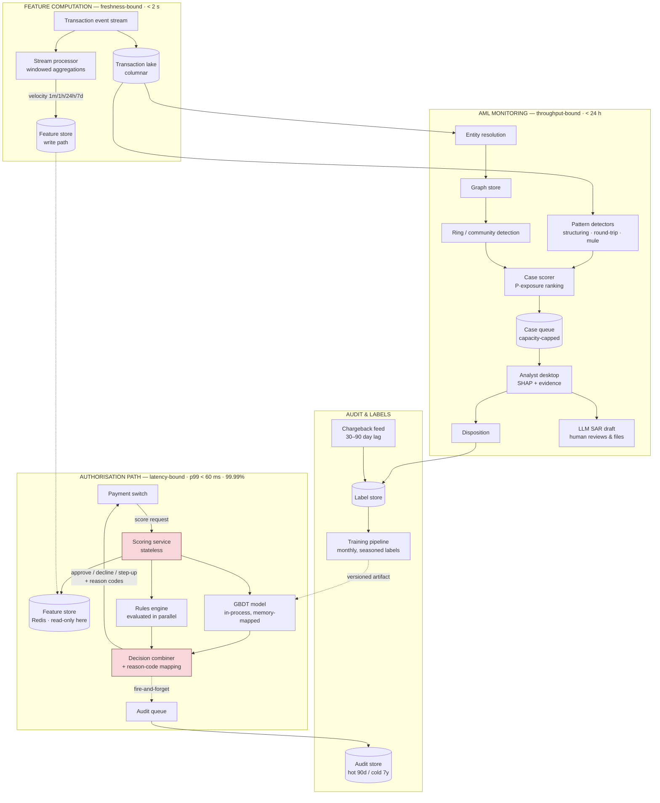

# 02 · HLD — Banking Fraud Detection & Transaction Monitoring

> ← [`01_requirements.md`](01_requirements.md) · **Next:** [`03_lld.md`](03_lld.md) →
>
> **Three-sentence compression:** this is two systems sharing a feature store — a 60 ms in-path scorer and a 24 h AML pattern detector · I rejected an LLM in the authorisation path because 60 ms, tabular features, and mandated explainability make a GBDT correct rather than compromise · the failure mode I'd volunteer is that analyst capacity (1,200/day against 259M transactions) sets the operating threshold, not model quality.

---

## 2.1 Architecture

Three planes, deliberately separated by their binding constraint: **latency** (scoring), **freshness** (streaming features), **throughput** (AML).

Red boxes are on the **payment critical path** — anything added there must be justified against 60 ms and 99.99%.

---

## 2.2 Component choices

| Concern | Choice | Why | Rejected alternative (and why not) | Revisit when |
|---|---|---|---|---|
| **Model family** | **GBDT** (XGBoost/LightGBM class), ~500 trees, depth 6 | 6 ms inference on tabular features; **exact per-prediction SHAP from tree structure** inside budget; strong on ~0.1%-positive tabular data. See [`../../24_xgboost/`](../../24_xgboost/README.md) | **Deep model / transformer on sequences** — better at long behavioural sequences, but attribution is approximate and slower, and regulatory explainability (FR-2) is non-negotiable. **LLM** — wrong tool entirely: 60 ms budget, 259M/day, tabular input. **Logistic regression** — trivially explainable but materially worse recall on interactions | Sequence models close the explainability gap (e.g. exact attribution methods mature), or a segment emerges where interaction depth genuinely beats trees |
| **Model hosting** | **In-process, memory-mapped, inside the scoring service** | A network hop to a model server costs 3–8 ms of the 33 ms budget and adds a failure domain on the payment path | **Dedicated inference server** (Triton/KServe) — better GPU utilisation and independent scaling, neither of which matters for a 6 ms CPU tree model | Model grows beyond memory-map practicality, or multiple model families need independent lifecycle |
| **Feature store (read)** | **Redis, hash-per-entity** | 8 ms p99 for a multi-key fetch; the only realistic option inside 60 ms | **Postgres** — 20–40 ms under load, blows the budget. **In-process cache only** — can't see other nodes' writes; velocity features would be wrong | Latency budget loosens, or a managed low-latency store offers materially better cost |
| **Feature computation** | **Stream processor with windowed aggregation** (Flink/Kafka-Streams class) | Velocity features must be < 2 s stale; a fraudster's second transaction arrives seconds after the first | **Batch recomputation** — minutes of staleness makes velocity features useless for the exact attack they exist to catch. **Compute on read** — scanning history per request is impossible in 12 ms | Never for velocity. Slow-moving aggregates (90-day merchant risk) legitimately come from batch |
| **Rules engine** | **Retained, evaluated in parallel with the model** | Deterministic coverage for known-fraud, sanctions hits, and hard policy. Also the **fail-open target** when the model is unavailable | **ML-only** — loses the deterministic floor and the degraded path; a model outage would mean no fraud control at all | Never remove. Rules and model are complementary, not competing |
| **Decision combination** | **Rules can override; model score consumed by two thresholds** | `T_decline` (friction) and `T_review` (scarce human) have different economics — see [`01_requirements.md#b`](01_requirements.md#b-the-capacity-arithmetic-that-sets-the-threshold) | **Single threshold** — conflates a 1.3M/day friction decision with a 1,200/day headcount decision. **Model overrides rules** — a sanctions hit is not a probability | Never collapse the thresholds |
| **Audit write** | **Asynchronous, off the critical path** | A synchronous durable write costs 10–20 ms and adds a failure domain that could block payments | **Synchronous write** — correctness-appealing, but it puts the audit store's availability in the payment path. Mitigation: durable queue with at-least-once delivery and a reconciliation job that alarms on gaps | If a regulator requires write-before-decide (contrast [`../07_insurance_claims_automation/`](../07_insurance_claims_automation/), where the write **is** on-path) |
| **Audit storage** | **Hot 90 days (columnar OLAP) → cold object storage, compressed** | 1.32 PB raw over 7 years; columnar + compression ≈ 8× reduction takes ~$31k/mo to ~$4k/mo — **the dominant cost line** | **All-hot** — ~8× the cost for data queried a handful of times a year. **Cold-only** — investigations on recent activity become unusably slow | Query patterns shift, or retention statute changes |
| **Entity resolution** | **Dedicated service, shared by both planes** | "Same customer / device / beneficiary" must mean one thing, or the graph and the velocity features disagree | **Per-consumer ad-hoc joins** — divergent definitions produce contradictory decisions, and the discrepancy surfaces during an audit | — |
| **Graph store** | **Purpose-built graph DB for ring detection** | Multi-hop traversal over shared device/IP/beneficiary edges; recursive SQL is impractical past 2–3 hops | **Recursive CTEs in Postgres** — workable at 2 hops, degrades badly beyond. **In-memory graph rebuild per run** — fine at current scale, revisit at 10× | Graph exceeds single-instance memory, or traversal becomes the AML bottleneck |
| **SAR drafting** | **Frontier LLM drafts from structured case evidence; human files** | ~200/month at ~$8 total. Genuine time saving on narrative writing | **Template-only** — rigid, and narrative quality matters to the regulator. **Autonomous filing** — legally impermissible; a human must attest | Volume grows enough to justify a fine-tuned smaller model |
| **Threshold configuration** | **Audited config service, no redeploy** | Ops must retune per segment as fraud shifts; a deploy cycle is too slow | **Hard-coded thresholds** — every tuning change becomes a release. **Unaudited config** — an unlogged threshold change is a compliance gap | — |

---

## 2.3 Data flow, narrated

**The authorisation path** (the 60 ms one):

1. **Payment switch** sends a score request with the transaction primitives (amount, merchant, card token, device, geo) and a correlation id. It has a hard timeout; if we don't answer, it proceeds on rules alone — *our unavailability must never block a payment*.
2. **Scoring service** (stateless, multi-AZ) validates and derives entity keys via the resolution service's cached mapping — resolution itself is not called synchronously, only its cache is read.
3. **Feature fetch** issues one pipelined multi-key read to Redis for ~200 precomputed features across card, device, merchant, and beneficiary entities. Pipelined, not sequential: sequential round-trips would exceed the whole budget alone.
4. **Streaming aggregates** for the very-recent windows (1 min, 1 h) are read from the same store — they were computed by the stream processor within the last 2 s. *This is the hop that catches velocity attacks*, and it's why batch features alone are insufficient.
5. **Model inference** runs in-process on the assembled vector: ~500 trees, depth 6, ~6 ms. **In parallel**, the rules engine evaluates deterministic policy — parallel, not sequential, because their 5 ms would otherwise be additive.
6. **Decision combiner** applies precedence: a hard rule (sanctions, confirmed-compromise card) wins outright; otherwise the score is compared against `T_decline` for the automated action, and separately against `T_review` to decide whether a case is created. **Reason codes** are mapped from the top SHAP contributors plus any rule hits, using the governed lookup table.
7. **Response** returns approve / decline / step-up with reason codes. The **audit record is queued fire-and-forget** — durable queue, at-least-once, reconciled asynchronously.

**The AML path** (the 24 h one), briefly: transactions land in the columnar lake. Pattern detectors run scheduled windowed queries for structuring (many just-under-threshold deposits), round-tripping, and mule-account signatures. Entity resolution feeds a graph where shared devices, IPs, and beneficiaries form edges; community detection surfaces connected clusters no per-transaction model could see. Detections are scored by **`P(suspicious) × exposure`** and inserted into a **capacity-capped queue** — the cap is the point, per [`01_requirements.md#b`](01_requirements.md#b-the-capacity-arithmetic-that-sets-the-threshold). Analysts work the queue with SHAP explanations and linked evidence; dispositions flow to the label store. For cases warranting a report, the LLM drafts a narrative from the structured evidence and **a human reviews, edits, and files it**.

**The label loop:** analyst dispositions arrive in hours; chargebacks in 30–90 days. Both write to the label store with maturity flags. The training pipeline retrains **monthly on labels seasoned ≥ 90 days**, evaluates **out-of-time**, and promotes only if it beats the incumbent on the champion/challenger comparison.

---

## 2.4 NFR mapping

| NFR (from shared block) | Delivered by |
|---|---|
| Scoring p99 < 60 ms | Latency budget §2.5 (~33 ms) · in-process model · pipelined Redis fetch · rules evaluated in parallel · **audit write off-path** |
| Availability 99.99% (in-path) | Stateless multi-AZ service · **fail-open to rules engine** on model or feature-store failure · no synchronous dependency on audit or AML planes |
| Throughput 3,000 / 15,000 TPS | Horizontally scaled stateless scorers · Redis cluster sharded by entity key · stream processor partitioned by card |
| Fraud recall ≥ 0.85 @ ≤ 0.5% FPR | GBDT on ~200 features incl. sub-2-second velocity · monthly retrain on seasoned labels · out-of-time validation gate |
| **Analyst capacity ≤ 1,200 cases/day** | **`T_review` sized to capacity** · queue ranked by `P × exposure` (FR-12) · queue-depth feedback auto-tightens the threshold (FR-13) |
| Feature freshness < 2 s | Stream processor with windowed aggregation writing directly to the read store |
| Explainability 100% of declines | Exact tree-path SHAP in-budget · governed feature→reason-code lookup · rule hits recorded |
| Audit 7 years, replayable | Full feature vector + model version + threshold version persisted · hot/cold tiering with compression |
| AML detection < 24 h | Scheduled detectors over the columnar lake · graph traversal on a purpose-built store · priority lane for tight-clock jurisdictions |

---

## 2.5 Latency budget (in-path scoring, p99)

Reproduced from the shared block with the *reason* for each allocation, since defending the shape is the point.

| Stage | Budget | Why this much |
|---|---|---|
| Deserialise + validate | 3 ms | Schema validation; reject malformed early |
| **Feature fetch (Redis, pipelined)** | **8 ms** | One round trip for ~200 features. Sequential fetches would cost 10× |
| Streaming aggregate read | 12 ms | Very-recent windows; separate keys, same pipeline |
| **Model inference** | **6 ms** | ~500 trees × depth 6, in-process, memory-mapped |
| Rules evaluation | 5 ms *(overlapped)* | Parallel with inference — additive would push the total to 38 ms |
| Decision + reason codes | 4 ms | Threshold comparison + SHAP top-5 + governed lookup |
| Audit write | **0 ms** | **Off-path** — fire-and-forget to a durable queue |
| **Total** | **~33 ms** | SLO 60 ms ✅ **27 ms headroom** |

> **The headroom is the design decision.** A p99 in a payment path must survive GC pauses, a Redis slow key, a cold branch predictor, and a noisy neighbour. Budgeting to 55 ms would be "correct" on paper and page weekly in production. **Budget for the bad case, not the median.**

---

## 2.6 Failure modes and blast radius

| Failure | Detection | Blast radius | Mitigation / degraded mode |
|---|---|---|---|
| **Model unavailable / slow** | Inference latency p99, error rate | All transactions | **Fail open to rules engine.** Approve-with-rules rather than decline-all; alert immediately. Declining every transaction because *our* component broke is far worse than the fraud we'd miss in the window |
| **Feature store down** | Fetch error rate, timeout count | All transactions | Score on the subset of features available from the request payload plus in-process cache; **flag the decision as degraded** in the audit record so it's excludable from later analysis |
| **Feature staleness** (stream processor lag) | Feature age p99, consumer lag | Velocity-dependent detections | Age is a *feature* fed to the model, so it can discount stale inputs; beyond a threshold, fall back to rules for velocity-driven decisions |
| **Audit queue backed up** | Queue depth, reconciliation gap count | Compliance, not payments | Payments continue (off-path by design). Reconciliation job alarms on gaps; a sustained gap is a **compliance incident** requiring backfill from the transaction lake |
| **Analyst queue overflow** | Queue depth vs capacity | Undetected fraud | FR-13 auto-tightens `T_review`; overflow cases are retained and re-ranked rather than dropped. **Never silently discard** — an unreviewed case must be visible |
| **Threshold misconfiguration** | Decline-rate anomaly detector | Potentially all customers | Config changes require two-person approval and are canaried on 1% of traffic for 30 min; automatic revert on a decline-rate deviation beyond band |
| **Concept drift** (new fraud typology) | Recall on the random-holdout sample (FR-14); score-distribution shift | Growing fraud losses | The unbiased holdout is the *only* detector for a typology the ranked queue never surfaces. Triggers off-cycle retrain and a rules patch as the fast mitigation |
| **Label feed interrupted** (chargeback file missing) | Label arrival monitor | Future model quality | Training blocked rather than run on partial labels; incumbent model retained. **A stale good model beats a fresh model trained on truncated labels** |
| **Graph store blowup** on a dense entity | Traversal timeout | AML detection lag | Degree-capped traversal with a hop budget; hub entities (shared payment processors) explicitly excluded from edge construction |
| **SHAP computation slow** | Decision-stage latency | All declines | Precomputed background values; if SHAP exceeds its slice, emit rule-based reason codes and mark the record for asynchronous attribution backfill |

---

## 2.7 Scale plan

| | What breaks first | Why | What I'd change |
|---|---|---|---|
| **10×** (30,000 TPS) | **Redis feature-store read throughput** | 30k TPS × ~200 keys = 6M key-reads/s; a single cluster's network and CPU saturate before the scorers do | Shard by entity key across multiple clusters with client-side routing; co-locate scorer and shard by AZ to cut network hops; pack features into fewer keys (one hash per entity rather than per-feature keys) |
| **10×** (secondary) | Stream processor state size | Windowed aggregates for 10× the cards exceed per-task state | Repartition by card hash, increase parallelism, move 7-day windows to a batch-computed tier and keep only ≤ 1 h in streaming state |
| **100×** (300,000 TPS) | **The authorisation path's economics and the audit store** | Compute stays affordable (trees are cheap), but audit volume becomes 132 PB and the feature store becomes the dominant cost | Feature *selection* becomes a cost decision, not just an accuracy one — drop features whose marginal recall doesn't justify their read cost. Audit: sample-with-guarantees for approved-and-undisputed transactions (retain 100% of declines, step-ups, and disputes; sample the rest) **if the regulator permits** — which is a legal question, not a technical one |
| **100×** (secondary) | Analyst capacity is unchanged | Human review does not scale with volume | The queue becomes ever more selective; investment shifts to **automated disposition** for high-confidence cases and to better ranking, because reviewing 1,200 of 26 billion is a fundamentally different problem than 1,200 of 259 million |

**What does not break:** the model itself (tree inference is trivially parallel and stateless), the scoring service (horizontal), and the rules engine. Naming this keeps the discussion on the real bottleneck rather than sprawling into "add replicas."

---

> ← [`01_requirements.md`](01_requirements.md) · **Next:** [`03_lld.md`](03_lld.md) →
