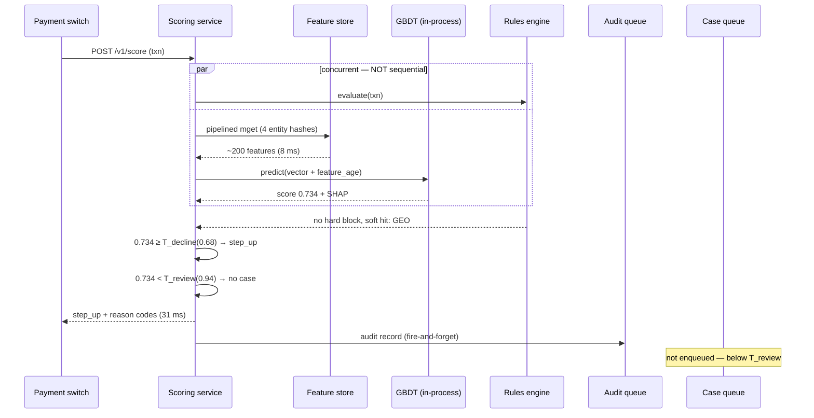
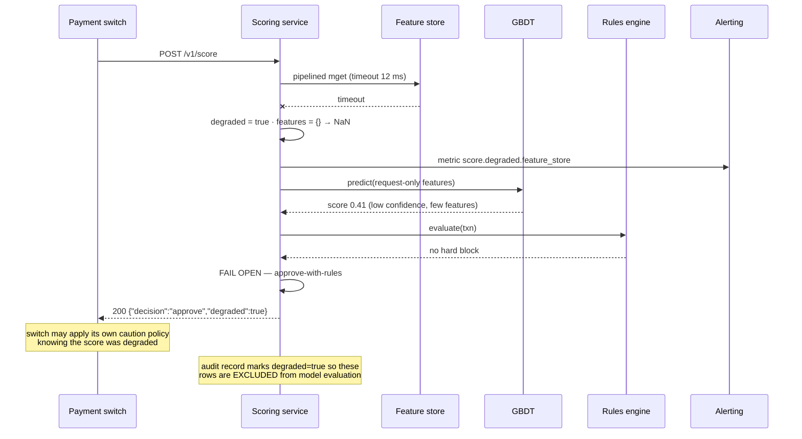
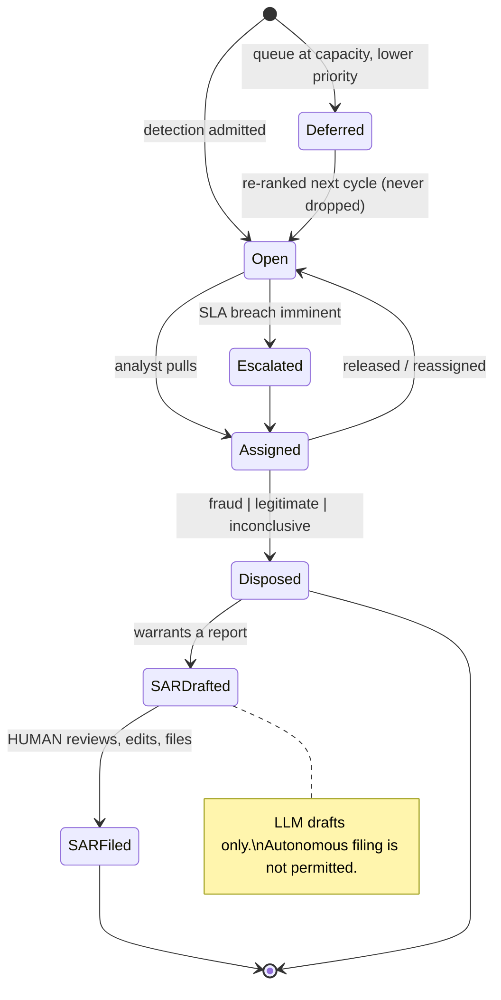
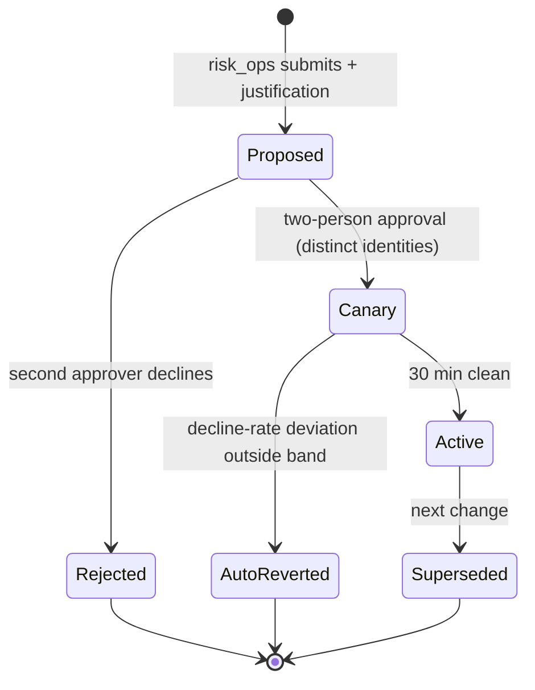

# 02 · LLD — Banking Fraud Detection & Transaction Monitoring

> ← [`02_hld.md`](02_hld.md) · **Next:** [`04_production_and_interview.md`](04_production_and_interview.md) →

---

## 3.1 Data models

### Feature store (Redis — the 8 ms read path)

```
KEY    f:card:{card_token}
TYPE   hash          # ONE hash per entity, not one key per feature.
                     # 200 features as 200 keys = 200 round trips in the worst case;
                     # as 4 hashes it is one pipelined fetch. This is why the 8ms budget holds.
FIELDS
  txn_cnt_1m       int      txn_amt_1m       int      # minor units, integer only
  txn_cnt_1h       int      txn_amt_1h       int
  txn_cnt_24h      int      txn_amt_24h      int
  txn_cnt_7d       int      txn_amt_7d       int
  distinct_mcc_24h int      distinct_geo_1h  int
  last_txn_ts      int      last_geo_h3      string    # H3 cell, for geo-velocity
  decline_cnt_24h  int
  computed_at      int      # feature AGE is itself a model input
TTL    691200        # 8 days — covers the widest window plus slack

KEY    f:device:{device_id}     # cards seen, accounts seen, first_seen_ts, ...
KEY    f:merchant:{merchant_id} # chargeback_rate_90d, fraud_rate_90d (BATCH-computed)
KEY    f:benef:{beneficiary_id} # inbound_distinct_senders_7d, ...
```

Two decisions worth defending: **one hash per entity** (four pipelined reads, not two hundred), and **`computed_at` exposed as a feature** so the model can learn to discount stale inputs rather than trusting them blindly.

### Transaction lake (columnar — AML + training)

```sql
CREATE TABLE transactions (
    txn_id           UUID        NOT NULL,
    occurred_at      TIMESTAMPTZ NOT NULL,
    card_token       TEXT        NOT NULL,
    account_id       BIGINT      NOT NULL,
    device_id        TEXT,
    merchant_id      BIGINT      NOT NULL,
    mcc              INT         NOT NULL,
    amount_minor     BIGINT      NOT NULL,     -- integer minor units
    currency         CHAR(3)     NOT NULL,
    geo_h3           TEXT,
    beneficiary_id   BIGINT,
    channel          TEXT        NOT NULL,     -- pos | ecom | atm | transfer
    PRIMARY KEY (occurred_at, txn_id)
) PARTITION BY RANGE (occurred_at);
-- Partitioned daily: AML detectors scan windows, so partition pruning is the
-- difference between a 3-minute and a 3-hour query.

CREATE INDEX idx_txn_card_time  ON transactions (card_token, occurred_at DESC);
CREATE INDEX idx_txn_benef_time ON transactions (beneficiary_id, occurred_at DESC)
    WHERE beneficiary_id IS NOT NULL;   -- partial: only transfers have beneficiaries
CREATE INDEX idx_txn_struct     ON transactions (account_id, occurred_at)
    INCLUDE (amount_minor);              -- covering index for structuring detection
```

`idx_txn_struct` is a covering index specifically for the structuring detector, which repeatedly asks *"all amounts for this account in this window"* — including `amount_minor` in the index avoids a heap fetch per row on a query that touches millions.

### Audit store (the dominant cost line)

```sql
CREATE TABLE decisions (
    decision_id      UUID        NOT NULL,
    txn_id           UUID        NOT NULL,
    decided_at       TIMESTAMPTZ NOT NULL,
    score            REAL        NOT NULL,
    decision         TEXT        NOT NULL,     -- approve | decline | step_up
    reason_codes     TEXT[]      NOT NULL,     -- governed enum values
    shap_top5        JSONB       NOT NULL,     -- [{feature, value, contribution}]
    rule_hits        TEXT[]      NOT NULL,
    feature_vector   JSONB       NOT NULL,     -- EXACT input, for replay
    feature_age_ms   INT         NOT NULL,
    model_version    TEXT        NOT NULL,
    threshold_version TEXT       NOT NULL,     -- which T_decline / T_review applied
    degraded         BOOLEAN     NOT NULL DEFAULT false,  -- scored without full features
    PRIMARY KEY (decided_at, decision_id)
) PARTITION BY RANGE (decided_at);
CREATE INDEX idx_dec_txn ON decisions (txn_id);
```

> **`feature_vector` is why replay works and why storage dominates.** Persisting the exact input means a decision from three years ago can be re-scored against any model version — which is what a regulator asking *"why was this declined"* actually requires. It is also ~2 KB × 259M/day, i.e. the 1.32 PB. **`threshold_version` matters as much as `model_version`**: the same score produces different decisions under different thresholds, and audits ask about decisions.

**Tiering:** hot 90 days in columnar OLAP; older partitions exported to compressed Parquet in object storage (~8× reduction) with an external-table mapping so cold queries still work, slowly.

### Case queue (capacity-capped)

```sql
CREATE TABLE cases (
    case_id          UUID PRIMARY KEY,
    created_at       TIMESTAMPTZ NOT NULL DEFAULT now(),
    entity_type      TEXT        NOT NULL,     -- account | card | beneficiary | ring
    entity_id        TEXT        NOT NULL,
    source           TEXT        NOT NULL,     -- rt_score | structuring | ring | holdout
    p_suspicious     REAL        NOT NULL,
    exposure_minor   BIGINT      NOT NULL,     -- money at risk
    priority         REAL        NOT NULL,     -- p_suspicious * exposure  (FR-12)
    status           TEXT        NOT NULL DEFAULT 'open',
    assigned_to      TEXT,
    sla_due_at       TIMESTAMPTZ NOT NULL,
    disposition      TEXT,                     -- fraud | legitimate | inconclusive
    disposed_at      TIMESTAMPTZ,
    is_holdout       BOOLEAN     NOT NULL DEFAULT false   -- FR-14 unbiased sample
);
CREATE INDEX idx_cases_work ON cases (status, priority DESC) WHERE status = 'open';
CREATE INDEX idx_cases_sla  ON cases (sla_due_at) WHERE status = 'open';
CREATE INDEX idx_cases_entity ON cases (entity_type, entity_id, created_at DESC);
```

`idx_cases_work` is partial on `status='open'` — the analyst desktop only ever queries open cases ranked by priority, and a partial index keeps that hot regardless of years of closed history.

### Label store

```sql
CREATE TABLE labels (
    txn_id           UUID        NOT NULL,
    label            BOOLEAN     NOT NULL,     -- true = fraud
    source           TEXT        NOT NULL,     -- chargeback | customer_report | analyst | holdout
    observed_at      TIMESTAMPTZ NOT NULL,
    txn_occurred_at  TIMESTAMPTZ NOT NULL,
    maturity_days    INT GENERATED ALWAYS AS
                     (EXTRACT(DAY FROM observed_at - txn_occurred_at)::INT) STORED,
    is_biased_sample BOOLEAN     NOT NULL,     -- true if it came from the RANKED queue
    PRIMARY KEY (txn_id, source)
);
CREATE INDEX idx_labels_training ON labels (txn_occurred_at)
    WHERE maturity_days >= 90;   -- partial: the training query only wants seasoned labels
```

`is_biased_sample` is the column that makes honest evaluation possible: analyst labels from the ranked queue are selection-biased, holdout labels are not, and mixing them without distinction produces optimistic metrics.

---

## 3.2 API contracts

### Scoring (the 60 ms path)

```http
POST /v1/score
Authorization: mTLS client cert          # service-to-service; no bearer tokens on this path
X-Correlation-Id: <uuid>
Content-Type: application/json

{
  "txn_id": "…", "card_token": "…", "account_id": 991,
  "merchant_id": 4471, "mcc": 5812,
  "amount_minor": 249900, "currency": "INR",
  "device_id": "…", "geo_h3": "8928308280fffff", "channel": "ecom",
  "beneficiary_id": null
}

200 application/json                     # p99 < 60 ms
{
  "decision": "step_up",
  "score": 0.734,
  "reason_codes": ["VELOCITY_1H_ANOMALY","GEO_IMPOSSIBLE"],
  "shap_top5": [{"f":"txn_cnt_1h","v":7,"c":0.21},{"f":"geo_velocity_kmh","v":940,"c":0.18}],
  "rule_hits": [],
  "model_version": "fraud-gbdt@2026-08-01",
  "threshold_version": "thr@2026-08-20",
  "degraded": false,
  "latency_ms": 31
}

200 + "degraded": true                   # scored WITHOUT full features — still a 200,
                                         # because the switch needs an answer, not an error
400 malformed payload
401 client cert rejected
422 unknown currency / unsupported channel
503 model AND rules both unavailable     # switch proceeds on its own policy
504 upstream timeout (we did not answer in time)
```

**Design notes:**
- **mTLS, not bearer tokens** — this is a service-to-service call on the payment rail; certificate-based identity avoids a token-introspection hop inside a 60 ms budget.
- **No `Idempotency-Key`** — scoring is a *pure read*. It has no side effects (the audit write is fire-and-forget and deduplicated on `txn_id`), so a retry is inherently safe. Contrast [`../01_ecommerce_shopping_agent/03_lld.md`](../01_ecommerce_shopping_agent/03_lld.md), where confirmation is billable and idempotency is mandatory. **Knowing which endpoints need it is the point.**
- **`degraded: true` returns 200**, not an error. The switch must get a decision; signalling degradation in-band lets it apply its own caution policy and lets us exclude those rows from model evaluation.

### Threshold configuration (audited, no redeploy)

```http
PUT /v1/config/thresholds
Authorization: Bearer <jwt>              # requires role: risk_ops
X-Approval-Token: <second-approver>      # TWO-PERSON approval — enforced server-side
Content-Type: application/json

{
  "segment": "ecom_high_value",
  "t_decline": 0.82, "t_review": 0.94,
  "canary_pct": 1, "canary_minutes": 30,
  "justification": "Q3 ecom fraud uplift; recovers ~₹4.2L/wk at +0.03% friction"
}

202 {"threshold_version":"thr@2026-09-01-01","state":"canary",
     "auto_revert_at":"2026-09-01T10:30:00Z"}
403 second approver missing / same identity as requester
409 another canary already active for this segment
422 t_review < t_decline                 # invariant: review threshold is always stricter
```

The `justification` field is required and persisted — a threshold change without a recorded rationale is a finding at audit time.

### Case queue (analyst desktop)

```http
GET /v1/cases/next?analyst_id=…
200 {"case_id":"…","entity_type":"account","entity_id":"991",
     "priority":184320.5,"p_suspicious":0.72,"exposure_minor":256000,
     "evidence":{"transactions":[…],"shap":[…],"graph_neighbours":[…],
                 "similar_past_cases":[…]},
     "sla_due_at":"…","is_holdout":false}
204 no cases available

POST /v1/cases/{case_id}/disposition
{ "disposition":"fraud", "notes":"…", "actions_taken":["card_blocked"] }
200 {"status":"closed","label_emitted":true}
409 already disposed
```

`is_holdout` is deliberately **visible** to the analyst — hiding it would be tempting (to avoid biasing their judgement) but they need to know a case may be routine, and the label's value comes from honest review either way.

---

## 3.3 Core algorithms

### Scoring with fail-open

```python
FEATURE_TIMEOUT_MS = 12
TOTAL_BUDGET_MS    = 45          # internal cap, below the 60 ms SLO

def score(req: ScoreRequest) -> ScoreResponse:
    t0 = now_ms()
    degraded = False

    # Rules run CONCURRENTLY with feature fetch + inference. Sequential would be additive.
    rules_future = executor.submit(rules_engine.evaluate, req)

    try:
        feats = feature_store.mget_pipelined(          # ONE round trip, 4 entity hashes
            [f"f:card:{req.card_token}", f"f:device:{req.device_id}",
             f"f:merchant:{req.merchant_id}", f"f:benef:{req.beneficiary_id}"],
            timeout_ms=FEATURE_TIMEOUT_MS)
    except (Timeout, StoreError):
        feats = {}                                     # FAIL OPEN, not closed
        degraded = True
        metrics.incr("score.degraded.feature_store")

    vec = assemble_vector(req, feats)                   # missing -> NaN; XGBoost handles it
                                                        # natively (see ../../24_xgboost/)
    vec["feature_age_ms"] = feature_age(feats)          # staleness as a model input

    try:
        raw = model.predict(vec)                        # ~6 ms, in-process
    except Exception:
        raw = None                                      # FAIL OPEN to rules only
        degraded = True
        metrics.incr("score.degraded.model")

    rules = rules_future.result(timeout_ms=8)

    # Precedence: a hard rule is not a probability. It wins outright.
    if rules.hard_block:
        decision, codes = "decline", rules.reason_codes
    elif raw is None:
        decision, codes = rules.fallback_decision, rules.reason_codes
    else:
        thr = thresholds.for_segment(req.segment)       # canary-aware
        decision = ("decline" if raw >= thr.t_decline_hard
                    else "step_up" if raw >= thr.t_decline
                    else "approve")
        codes = map_reason_codes(shap_top5(model, vec), rules.soft_hits)   # governed lookup

        # T_review is a SEPARATE decision with different economics (see 01_requirements §B)
        if raw >= thr.t_review:
            case_queue.enqueue_async(req, raw, exposure=req.amount_minor)

    audit_queue.put_nowait(build_audit(req, raw, decision, codes, vec, degraded))  # off-path

    assert now_ms() - t0 < TOTAL_BUDGET_MS or metrics.incr("score.budget_exceeded")
    return ScoreResponse(decision, raw, codes, degraded=degraded)
```

**The property to point at:** every failure path *approves-with-rules* rather than declining. Declining every transaction because our component broke would cause more damage in ten minutes than the fraud we'd miss.

### Structuring detection (AML)

```python
def detect_structuring(account_id: int, window_days: int = 7) -> Detection | None:
    """Structuring = many deposits deliberately just under a reporting threshold.
       Deterministic and explainable — correctly a RULE, not a model. An LLM or
       a neural net here would add opacity to a pattern with a legal definition.
    """
    THRESH = 1_000_000            # reporting threshold, minor units (jurisdiction-specific)
    BAND   = 0.90                 # "just under" = 90-100% of threshold

    txns = lake.query("""
        SELECT occurred_at, amount_minor FROM transactions
        WHERE account_id = %s AND occurred_at >= now() - interval '%s days'
          AND channel = 'transfer' AND amount_minor BETWEEN %s AND %s
        ORDER BY occurred_at
    """, account_id, window_days, int(THRESH * BAND), THRESH - 1)

    if len(txns) < 3:
        return None
    total = sum(t.amount_minor for t in txns)
    if total < THRESH:                          # aggregate below threshold isn't evasion
        return None

    return Detection(
        pattern="structuring",
        confidence=min(0.95, 0.45 + 0.12 * len(txns)),   # monotone in count, capped
        exposure_minor=total,
        evidence={"txn_count": len(txns), "total": total,
                  "threshold": THRESH, "band": f"{BAND:.0%}-100%",
                  "txn_ids": [t.txn_id for t in txns]},
    )
```

### Ring detection with degree capping

```python
MAX_DEGREE = 500       # hub guard: a shared payment processor is not a fraud ring
MAX_HOPS   = 3
MAX_NODES  = 5_000     # traversal budget — unbounded graph walks are a real outage cause

def detect_rings(seed_entity: str) -> list[Ring]:
    visited, frontier, hops = {seed_entity}, [seed_entity], 0

    while frontier and hops < MAX_HOPS and len(visited) < MAX_NODES:
        nxt = []
        for node in frontier:
            deg = graph.degree(node)
            if deg > MAX_DEGREE:
                metrics.incr("ring.hub_skipped")     # exclude, don't traverse
                continue
            for nb in graph.neighbours(node, edge_types=["shared_device","shared_ip",
                                                         "shared_beneficiary"]):
                if nb not in visited:
                    visited.add(nb); nxt.append(nb)
        frontier, hops = nxt, hops + 1

    if len(visited) < 3:
        return []
    communities = louvain(graph.subgraph(visited))
    return [Ring(members=c,
                 exposure_minor=sum(exposure(m) for m in c),
                 confidence=ring_score(c))
            for c in communities if len(c) >= 3]
```

Without `MAX_DEGREE`, one shared payment-processor node connects millions of accounts and the traversal never terminates — the classic way graph fraud detection takes down its own database.

### Queue admission with capacity feedback (FR-13)

```python
DAILY_CAPACITY = 1_200

def admit_to_queue(det: Detection) -> bool:
    priority = det.confidence * det.exposure_minor          # FR-12: expected loss

    open_count = cases.count_open()
    if open_count >= DAILY_CAPACITY:
        # Do NOT drop. Replace the lowest-priority open case if this one beats it.
        lowest = cases.lowest_priority_open()
        if priority > lowest.priority:
            cases.defer(lowest.case_id)          # retained + re-ranked, never discarded
            cases.insert(det, priority)
            metrics.incr("queue.displaced")
            return True
        cases.defer_new(det, priority)            # parked, visible, re-ranked tomorrow
        metrics.incr("queue.deferred")
        return False

    cases.insert(det, priority)
    if open_count > DAILY_CAPACITY * 0.9:
        alerts.warn("queue_near_capacity", suggest="tighten T_review")   # FR-13
    return True
```

**The invariant:** a detection is never silently discarded. It is admitted, displaced, or deferred — all three states are queryable, because "we detected it and dropped it" is indefensible at audit.

---

## 3.4 Sequence diagrams

### Happy path — step-up decision



### Failure path — feature store unavailable

**The path that matters**, because it decides whether an infrastructure incident becomes a payments incident.



> Declining on degradation would be the intuitive "safe" choice and is wrong: a 10-minute feature-store outage would decline ~1.8M legitimate transactions. **Fail open, signal degradation, let the switch decide.**

---

## 3.5 State machines

### Case lifecycle



### Threshold-change lifecycle



---

## 3.6 Edge cases and correctness

| Edge case | Handling | Why |
|---|---|---|
| **Feature store partially available** | Score on what returned; `feature_age_ms` lets the model discount; mark degraded | Partial features beat no score inside a payment window |
| **First-ever transaction on a card** | All velocity features absent → NaN; model has learned the cold-start pattern; rules carry more weight | Cold start is *normal*, not an error — new cards exist constantly |
| **Duplicate score request** (switch retry) | Idempotent by nature (pure read); audit dedupes on `txn_id` | No side effects, so no idempotency key needed |
| **Clock skew across services** | All timestamps server-assigned at ingest; `feature_age` computed from a single clock | Client-supplied time makes velocity features attackable |
| **Currency mismatch** in velocity sums | Amounts normalised to a base currency at ingest using the *transaction-time* rate | Summing mixed currencies silently corrupts every amount feature |
| **Model and threshold versions mismatched** | Both persisted per decision; promotion pipeline pins a compatible pair | The same score means different things under different thresholds |
| **Hub entity in the graph** | Degree cap excludes it from traversal | Otherwise one processor node connects everything and the walk never ends |
| **Queue at capacity** | Displace-or-defer, never discard; both states queryable | "Detected and dropped" is indefensible at audit |
| **Analyst disagrees with a holdout case** | Recorded normally; `is_holdout` preserved so it's usable as an unbiased label | The value is the unbiasedness, whatever the verdict |
| **Chargeback arrives for an approved-degraded transaction** | Label stored, but the row is flagged `degraded` and excluded from training | Training on decisions made without features teaches the wrong lesson |
| **Reason code not in the governed list** | Hard failure in CI; the mapping table is versioned and reviewed | A customer-facing explanation the bank hasn't approved is a compliance problem |
| **SHAP exceeds its latency slice** | Emit rule-based codes; queue asynchronous attribution backfill | A decision must ship in 60 ms; the explanation can complete slightly later |
| **Same entity in multiple open cases** | Merge on `(entity_type, entity_id)` with combined evidence | Analysts must not investigate the same account three times |
| **Retention boundary crossed** | Partition detach + purge job with a compliance-signed manifest | Retaining beyond the statutory period is its own violation |
| **Backfill after audit-queue gap** | Reconstruct from the transaction lake + re-score with the recorded model version | Replayability is the whole reason `feature_vector` is stored |

---

> ← [`02_hld.md`](02_hld.md) · **Next:** [`04_production_and_interview.md`](04_production_and_interview.md) →
