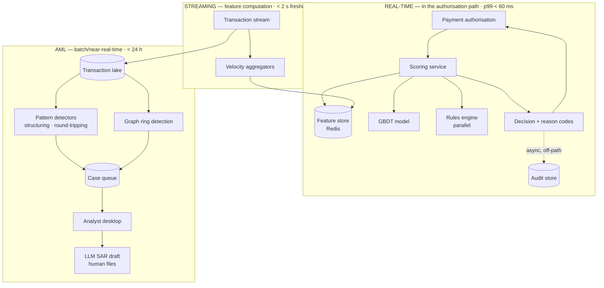

# 02 — Banking Fraud Detection & Transaction Monitoring

> **Archetype A · Real-time scoring.** The system where the latency budget is imposed from outside and the positive class is ~0.1%.
>
> **Related:** [`../../21_ai-system-design-deep-dives/05_fraud_anomaly_detection.md`](../../21_ai-system-design-deep-dives/05_fraud_anomaly_detection.md) covers **loan-application** fraud, explainability-driven. This design is **transaction-stream** fraud, bounded by an authorisation window and AML reporting duty. Read both.

---

## The three-sentence compression

1. **The choice that matters most:** this is **two systems, not one** — a latency-bound per-transaction authorisation scorer (p99 < 60 ms) and a throughput-bound AML pattern detector operating over multi-day windows. They share a feature store and share nothing else.
2. **The alternative I rejected:** an LLM anywhere in the authorisation path. At 60 ms with mandated per-decision explainability and 259M transactions/day, a gradient-boosted tree over streaming features is not a compromise — it's the correct tool. The LLM appears once, drafting SAR narratives for human filing, at ~$8/month.
3. **The failure mode I'd volunteer:** **analyst capacity, not model quality, sets the operating threshold.** 40 analysts × 30 cases/day = 1,200 reviews against 259M transactions means the queue can absorb 0.0005% of volume. Quoting an FPR target without checking it against review capacity is quoting a number nobody can staff.

---

## Architecture at a glance

---

## Key numbers

| | |
|---|---|
| Scoring latency | **p99 < 60 ms** (budget sums to ~33 ms — 27 ms headroom, deliberately generous) |
| Availability (in-path) | 99.99%, with **fail-open to rules** — never block the payment rail |
| Throughput | 3,000 TPS sustained · 15,000 TPS peak · 259M txn/day |
| Fraud recall | ≥ 0.85 at ≤ 0.5% FPR |
| **The binding constraint** | **1,200 analyst cases/day = 0.0005% of transactions** |
| Explainability | 100% of declines carry reason codes (regulatory) |
| Audit retention | 7 years, replayable → 1.32 PB raw |
| **Dominant cost** | **Audit storage (~$4k/mo compressed), not compute (~$3.5k) and not the LLM (~$8)** |

---

## Files

| File | Contents |
|---|---|
| [`01_requirements.md`](01_requirements.md) | The two-system split, the capacity-caps-the-threshold arithmetic, label-latency reality |
| [`02_hld.md`](02_hld.md) | Architecture, component choices with rejected alternatives, data flow, NFR mapping, failure modes, scale plan |
| [`03_lld.md`](03_lld.md) | Schemas, API contracts, scoring + graph algorithms, sequence diagrams, state machines, edge cases |
| [`04_production_and_interview.md`](04_production_and_interview.md) | AI-specific concerns, runbook, common mistakes, interview follow-ups, glossary |

**Shared requirements block:** [`../00_requirements_all_systems.md#2-banking--fraud-detection--transaction-monitoring`](../00_requirements_all_systems.md#2-banking--fraud-detection--transaction-monitoring)

---

## The two findings to leave with

1. **Review capacity is the real threshold-setter.** The model's job is not "maximise recall" — it's "maximise recall *at fixed queue depth*." That reframing changes the loss function, the threshold policy, and what you report to the business.
2. **Choosing not to use an LLM is the design decision here.** Being able to say *why* — 60 ms, tabular features, mandated explainability, 259M/day — is a stronger signal than reaching for one.
