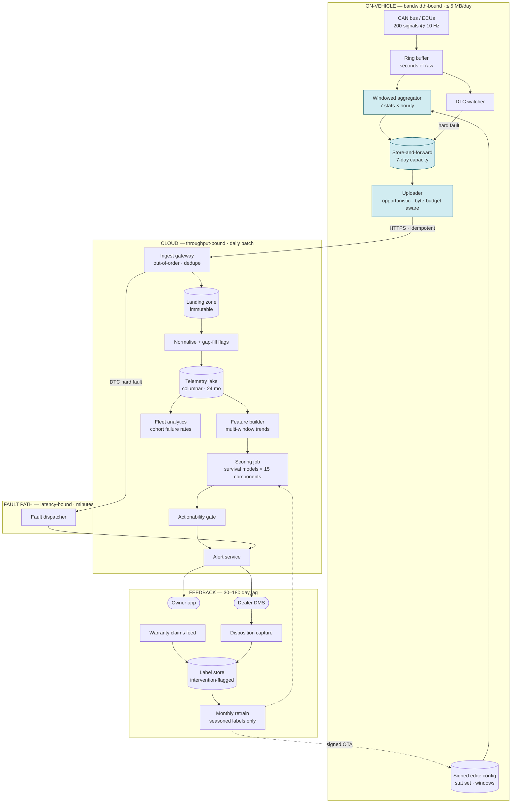

# 03 · HLD — Automotive Predictive Maintenance

> ← [`01_requirements.md`](01_requirements.md) · **Next:** [`03_lld.md`](03_lld.md) →
>
> **Three-sentence compression:** the design decision is what the edge computes — hourly windowed statistics give a ~4,000× reduction that makes the system affordable · I rejected raw-signal upload on arithmetic (1.38 PB/day fleet-wide) and rejected edge inference because it would freeze the model to firmware cadence · the failure mode I'd volunteer is that alert precision is bounded by dealer trust rather than statistics, so the floor is behavioural and must be tunable per component.

---

## 3.1 Architecture

Three planes separated by their binding constraint: **bandwidth** (edge), **throughput** (cloud batch), **latency** (fault dispatch only).

Blue boxes are where the **bandwidth budget** is spent or defended — the only genuinely scarce resource in this system.

---

## 3.2 Component choices

| Concern | Choice | Why | Rejected alternative (and why not) | Revisit when |
|---|---|---|---|---|
| **Where features are computed** | **Edge: windowed statistics. Cloud: everything else** | 691 MB → 165 KB (~4,000×). The model needs distributional summaries, not waveforms | **Raw upload + cloud feature engineering** — 1.38 PB/day fleet-wide; unaffordable on cellular and pointless. **Full edge inference** — saves nothing (aggregates are already tiny) and freezes the model to firmware cadence | A component needs true waveform analysis (e.g. bearing vibration FFT) — then upload a *triggered* raw snapshot, not a continuous stream |
| **Model family** | **Survival / time-to-event models** (Cox-style or GBDT-based survival) | The question is *"probability of failure within 30 days"* — inherently time-to-event with **right-censoring** (most vehicles haven't failed yet). Survival models handle censoring natively | **Binary classifier on a 30-day window** — throws away censoring information and forces an arbitrary label horizon; also can't answer "what about 60 days?" without retraining. **LSTM on raw sequences** — needs raw signals we deliberately don't upload | A component's degradation is genuinely non-monotonic, where a sequence model over aggregates may beat survival |
| **Prediction cadence** | **Daily batch** | Degradation is weeks-long; actionability requires days of lead time regardless. $290/month | **Streaming inference** — continuous cost for zero decision benefit. **Weekly** — loses lead-time resolution near the failure boundary | A component with a days-long degradation curve appears |
| **Fault handling** | **Separate streaming path, bypassing batch** | A DTC hard fault is a *current condition*, not a prediction. Minutes matter | **Route faults through the daily batch** — a 24 h delay on an active fault is indefensible. **Route predictions through streaming** — expensive, no benefit | — |
| **Ingest semantics** | **Idempotent, out-of-order tolerant, dedupe by `(vin, window_start, config_version)`** | Vehicles reconnect after days and replay buffered windows; duplicates and reordering are normal, not exceptional | **Assume ordered exactly-once delivery** — guarantees no vehicle network can provide; would produce silent gaps and double-counted windows | — |
| **Landing zone** | **Immutable raw landing → normalise → lake** | When a feature bug is found (and it will be, given 30–180 day feedback), re-derivation from raw is the only recovery | **Transform-on-ingest only** — a normalisation bug becomes permanent data loss discovered months later | — |
| **Telemetry storage** | **Columnar, partitioned by date, 24 mo** | Feature building scans time windows; partition pruning is decisive. Compression ~5× takes ~$5.5k to ~$1.1k | **Row store** — scan cost for windowed aggregation queries is prohibitive. **Longer retention** — cost scales linearly for diminishing training value | Warranty analysis needs > 24 mo, then tier the tail to cold |
| **Actionability gate** | **Explicit stage between score and alert** | FR-5: an alert with no available part, no dealer capacity, or below the per-component precision floor is *worse than silence* — it burns trust | **Alert on score alone** — generates alerts nobody can act on, which is precisely how dealer trust collapses | — |
| **Edge config delivery** | **Signed, remotely updatable, versioned** (FR-12) | Statistic set must be changeable without a firmware release; every uploaded window carries its `config_version` | **Compile the stat set into firmware** — freezes features for the vehicle's life; a missing predictive signal becomes unfixable, discovered a year later | Never. This is the highest-leverage mitigation in the design |
| **Model deployment to edge** | **N/A — no edge inference.** Only config goes OTA | Keeps model iteration monthly rather than firmware-paced | — | If a real-time on-vehicle decision is ever required |
| **Label store** | **Intervention-flagged, maturity-tracked** | Alerts change the outcome they predict; naive recall on intervened rows is meaningless | **Plain label table** — silently conflates "we prevented it" with "we were wrong" | — |
| **Alert delivery** | **Owner app + dealer DMS, both** | The owner books; the dealer must have parts and a bay. One without the other doesn't convert | **Owner only** — dealer unprepared, poor experience. **Dealer only** — owner not informed | — |

---

## 3.3 Data flow, narrated

**The edge path** (where the design lives):

1. **ECUs publish** ~200 signals onto the CAN bus at ~10 Hz. A small ring buffer holds seconds of raw data — enough for windowing and for a snapshot around a fault, never enough to be worth uploading.
2. **The windowed aggregator** consumes the ring buffer and maintains, per signal per hour, the seven statistics from [`01_requirements.md#a`](01_requirements.md#a-the-edgecloud-split-as-a-contract). This is the ~4,000× reduction, and it happens here because bandwidth — not compute — is the constraint.
3. **The DTC watcher** runs in parallel, looking for hard fault codes. A hard fault is flagged for **priority upload** and, importantly, triggers retention of a raw snapshot around the event — the one case where raw data earns its bytes.
4. **Store-and-forward** buffers up to 7 days. A vehicle parked in a basement for a week loses nothing; on reconnect it replays. This is why ingest must be idempotent and out-of-order tolerant.
5. **The uploader** transmits opportunistically (ignition-off with connectivity, or on a schedule), **tracking a cumulative byte budget** (FR-11). Approaching the monthly cap, it downgrades to essential statistics and logs the downgrade — so a bandwidth-constrained vehicle degrades gracefully and *visibly*, rather than silently going dark.

**The cloud path:**

6. **Ingest** deduplicates on `(vin, window_start, config_version)` and writes to an immutable landing zone. Including `config_version` in the key matters: the same window computed under two different statistic sets is genuinely different data, not a duplicate.
7. **Normalisation** unpacks the wire format, applies unit conversions, and — critically — **marks gaps explicitly** rather than interpolating them. A missing hour is information (vehicle off, no coverage), and imputing it would teach the model that a parked car is degrading.
8. **The feature builder** computes multi-window trends across days and weeks: slope-of-slope, deviation from the vehicle's own baseline, deviation from its build cohort. *Cross-vehicle cohort comparison is only possible in the cloud*, which is the main reason inference isn't on the edge.
9. **Scoring** runs survival models per component — 2M vehicles × 15 components = 30M predictions/day, ~2 ms each, comfortably inside a 2 h batch window on ~10 vCPU.
10. **The actionability gate** is the stage most designs omit. A score above threshold is necessary but not sufficient: the component's per-region precision floor must be met (FR-13), a replacement part must be available, and dealer capacity must exist. Failing any of those, the prediction is **logged but not alerted** — and that log is what feeds the holdout analysis.
11. **Alert service** notifies the owner and pre-positions context in the dealer's system, then tracks the lifecycle (FR-15): viewed → booked → serviced → disposition.

**The feedback loop:** dealer dispositions arrive in 1–8 weeks; warranty claims in 3–12 months. Both write to the label store **with an intervention flag** (FR-16). Monthly retraining uses only seasoned, non-intervention-censored labels, evaluated against the warranty-claim recall signal and the non-alerting holdout cohort.

---

## 3.4 NFR mapping

| NFR (from shared block) | Delivered by |
|---|---|
| **≤ 5 MB/vehicle/day** | Edge windowed aggregation (165 KB) · per-vehicle byte-budget counter with graceful downgrade (FR-11) |
| Daily prediction cadence | Batch scoring job; DTC faults on a separate streaming path |
| Ingestion tolerant of reconnect bursts | Idempotent dedupe key · out-of-order acceptance · 7-day edge buffer absorbing outages |
| **Alert precision ≥ 0.70** | Per-component, per-region thresholds (FR-13) · actionability gate · dealer-trust telemetry (FR-14) |
| Alert lead time ≥ 14 days median | Survival model with a 30-day horizon; alerting threshold set so median lead time clears 14 days |
| Availability (ingest) 99.9% | Edge buffering makes short outages invisible — *the edge buffer is the availability mechanism*, not the cloud's uptime |
| Model staleness ≤ monthly | Monthly retrain on labels seasoned ≥ 90 days; config-only OTA for feature changes |
| Label latency 30–180 days accepted | Intervention flags (FR-16) · warranty-claim recall as the primary signal · non-alerting holdout (FR-17) |
| Retention 24 mo / 7 yr warranty events | Columnar partitioned lake with tiering; warranty-relevant events promoted to long retention |

---

## 3.5 Failure modes and blast radius

| Failure | Detection | Blast radius | Mitigation / degraded mode |
|---|---|---|---|
| **Fleet-wide connectivity outage** (carrier incident) | Upload-rate drop vs baseline | All predictions go stale | Edge buffers 7 days; predictions continue on last-known features **with an explicit staleness flag**; alerts suppressed for components whose signal is now > 3 days old rather than issued on stale data |
| **Edge aggregator bug** (bad statistic) | Distribution monitors per signal per `config_version`; comparison against the raw landing zone | All vehicles on that config | Roll back the signed config (FR-12) — this is why config is remote. Re-derive corrected features from the immutable landing zone |
| **Statistic set is missing the predictive signal** | Persistently poor recall for a component; discovered only after labels season | One component, potentially a whole vehicle generation | **The primary risk in this design.** Mitigated by FR-12 (add the statistic remotely) and by defensively including `drift_slope` and `threshold_crossings`, the two most generally predictive summaries. If config is *not* remotely updatable, this is unrecoverable — hence the open question |
| **Reconnect storm** after an outage | Ingest QPS spike, queue depth | Ingest tier | Rate-limited ingest with backpressure to the uploader; vehicles retry with jitter. Batch window has slack to absorb late arrivals |
| **Alert fatigue in one region** | Dealer found-rate collapse (FR-14) | That region's recall | Auto-suppress alerts for the affected component/region, alert the programme team, investigate whether it's a model problem or a parts/process problem |
| **Intervention censoring pollutes training** | Fraction of labels flagged `intervened` | Model quality, silently | FR-16 flags them; excluded from recall computation and handled as censored observations in the survival fit (which is exactly what survival models are for) |
| **Parts unavailable at scale** (supplier issue) | Actionability-gate rejection rate | Suppressed alerts | Predictions logged and queued; alerts released when parts return. **Never alert without a fulfilment path** |
| **Model predicts a recall-scale issue** | Cohort failure-rate spike in fleet analytics | Potentially a whole build | Escalation path to the safety/quality organisation, not the alert channel. A systemic defect is a recall decision, not 40,000 service prompts |
| **Label feed broken** (warranty file missing) | Label-arrival monitor | Future model quality | Block retraining rather than train on partial labels; retain the incumbent |
| **Clock skew on-vehicle** | Window timestamps outside plausible bounds | That vehicle's features | Server-side timestamp reconciliation using upload time and monotonic counters; windows with implausible times quarantined |

---

## 3.6 Scale plan

| | What breaks first | Why | What I'd change |
|---|---|---|---|
| **10×** (20M vehicles) | **Ingest tier during reconnect storms** | Steady state is trivial (20M × 165 KB = 3.3 TB/day), but a regional outage recovery concentrates days of buffered data into hours | Partition ingest by VIN hash; enforce upload jitter windows assigned per-vehicle so recovery spreads over hours; autoscale ingest on queue depth |
| **10×** (secondary) | Feature-building scan cost | 3.3 TB/day × multi-week windows makes each daily build expensive | Incremental feature materialisation — compute daily deltas and maintain rolling aggregates rather than rescanning windows; partition by `(date, vin_bucket)` |
| **100×** (200M vehicles) | **Storage cost and the batch window** | 33 TB/day; 24-month retention ~24 PB. Scoring 3B predictions/day exceeds a 2 h window on modest compute | Tier aggressively: full resolution 90 days, downsampled (daily rather than hourly statistics) beyond. Score only vehicles whose features **changed materially** — most vehicles are unremarkable on most days, so a change-triggered scoring policy cuts volume by an order of magnitude |
| **100×** (secondary) | Label coverage stays flat | Dealer capacity and warranty volume don't scale with fleet size | Recall estimation leans harder on the holdout cohort and on statistical extrapolation; per-component models for rare failures become infeasible and give way to hierarchical/pooled models across cohorts |

**What does not break:** scoring compute (embarrassingly parallel, ~$290/month at current scale), the edge (per-vehicle, inherently distributed), and the model itself. Naming this keeps the conversation on data movement, which is the real constraint.

---

> ← [`01_requirements.md`](01_requirements.md) · **Next:** [`03_lld.md`](03_lld.md) →
