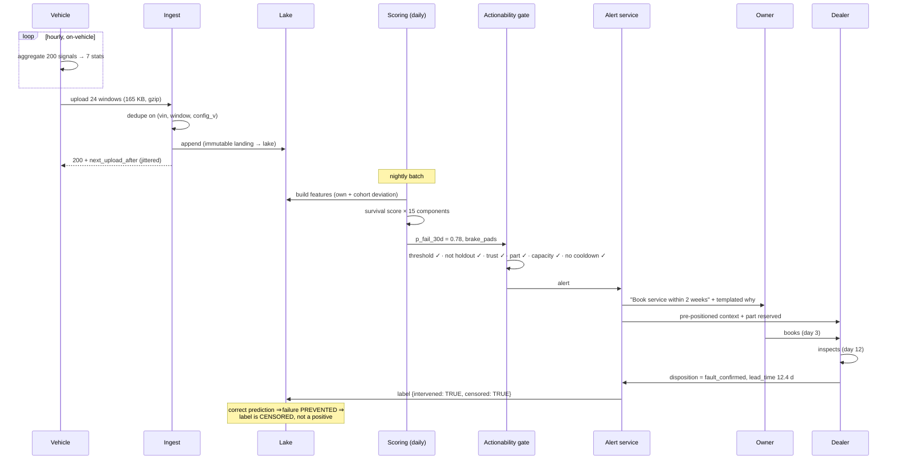
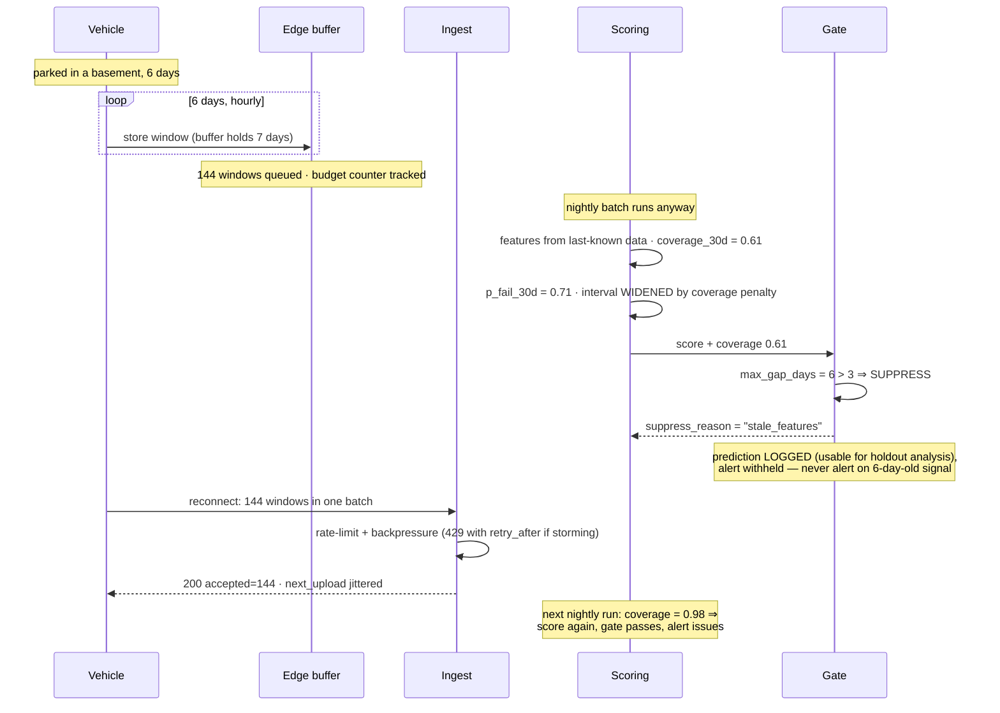
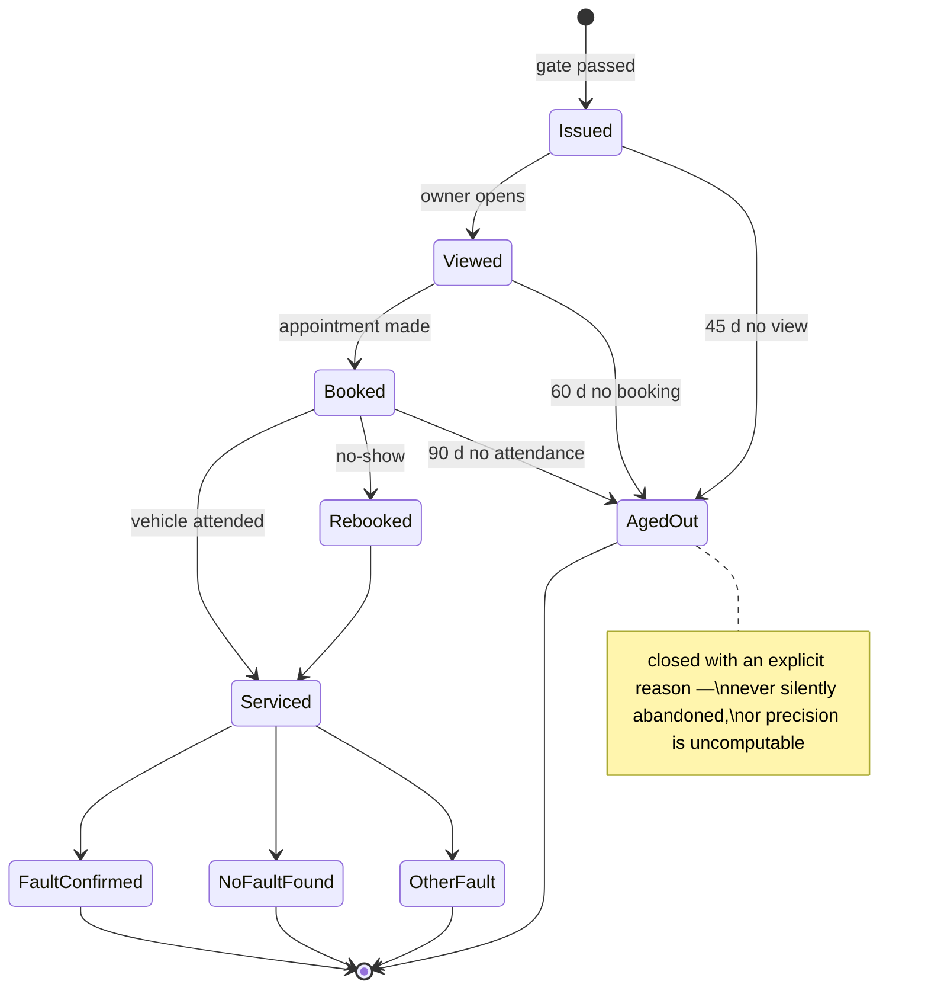
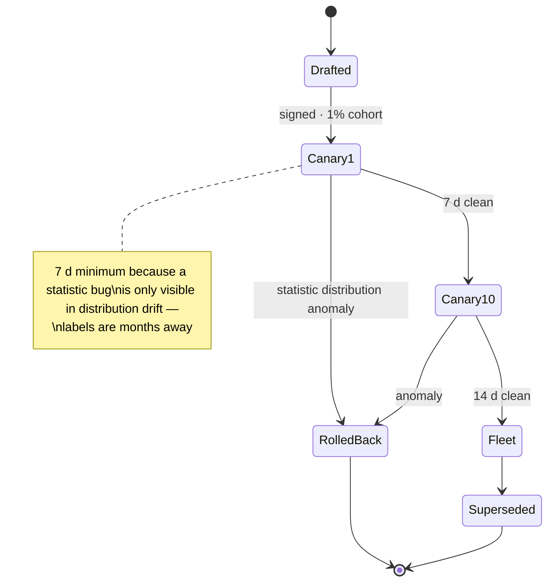

# 03 · LLD — Automotive Predictive Maintenance

> ← [`02_hld.md`](02_hld.md) · **Next:** [`04_production_and_interview.md`](04_production_and_interview.md) →

---

## 3.1 Data models

### Edge upload payload (the wire format — where bytes are earned)

```
struct WindowBatch {                    // one upload = 1..N windows
  uint8   format_version;
  char    vin[17];
  uint16  config_version;               // WHICH statistic set produced this
  uint32  window_start_epoch_h;         // hourly granularity — no need for seconds
  uint8   window_count;
  Window  windows[window_count];
  uint32  crc32;
}

struct Window {                         // ~5.6 KB per hourly window
  uint8   flags;                        // bit0 gap, bit1 degraded (byte-budget), bit2 ign_off
  SigStat stats[200];
  uint8   dtc_count;
  DtcRec  dtcs[dtc_count];
  TripSum trips[/* variable */];
}

struct SigStat {                        // 28 bytes × 200 signals = 5.6 KB
  float32 mean, std, min, max, p95, drift_slope;
  uint32  threshold_crossings;
}
```

**Three decisions in this struct worth defending:**

1. **`float32`, not `float64`** — halves the payload for statistics whose precision is bounded by sensor resolution anyway. On 165 KB/day × 2M vehicles × 365 days, this choice alone is ~60 TB/year of transfer.
2. **`config_version` in the payload, not inferred server-side** — a vehicle may be running an older config than the fleet. Without this field you cannot tell a genuine signal change from a statistic-definition change, and that ambiguity is unresolvable months later.
3. **`flags` distinguishing gap / degraded / ignition-off** — a missing window means something different in each case. Collapsing them to "null" destroys the distinction between *no data* and *no activity*.

### Telemetry lake

```sql
CREATE TABLE vehicle_windows (
    vin              CHAR(17)    NOT NULL,
    window_start     TIMESTAMPTZ NOT NULL,
    config_version   SMALLINT    NOT NULL,
    signal_stats     JSONB       NOT NULL,   -- {sig_id: {mean,std,min,max,p95,slope,cross}}
    has_gap          BOOLEAN     NOT NULL,
    degraded_upload  BOOLEAN     NOT NULL,   -- byte budget forced a reduced stat set
    ignition_off     BOOLEAN     NOT NULL,
    dtc_codes        TEXT[]      NOT NULL DEFAULT '{}',
    trip_distance_m  BIGINT,
    ambient_c        REAL,
    received_at      TIMESTAMPTZ NOT NULL,   -- may be days after window_start
    PRIMARY KEY (window_start, vin, config_version)
) PARTITION BY RANGE (window_start);
-- Daily partitions: every feature query is a time-window scan, so pruning is decisive.

CREATE INDEX idx_vw_vin_time ON vehicle_windows (vin, window_start DESC);
CREATE INDEX idx_vw_dtc ON vehicle_windows USING GIN (dtc_codes)
    WHERE dtc_codes <> '{}';         -- partial GIN: most windows have no DTC
CREATE INDEX idx_vw_late ON vehicle_windows (received_at)
    WHERE received_at > window_start + interval '2 days';   -- late-arrival audit
```

`config_version` is part of the **primary key**, not just a column. The same `(vin, window)` computed under two statistic sets is two legitimate rows, and the dedupe key must reflect that — otherwise a config rollout silently drops data.

### Feature snapshot (what the model actually consumes)

```sql
CREATE TABLE component_features (
    vin              CHAR(17)    NOT NULL,
    component_id     SMALLINT    NOT NULL,   -- 15 monitored components
    as_of_date       DATE        NOT NULL,
    -- own-baseline deviation: how this vehicle differs from ITS OWN history
    dev_own_7d       REAL, dev_own_30d  REAL, dev_own_90d REAL,
    -- cohort deviation: how it differs from same build/model-year/climate peers
    dev_cohort_30d   REAL,
    -- trend of trend: acceleration of degradation, the strongest single signal
    slope_7d         REAL, slope_30d    REAL, slope_accel  REAL,
    crossings_30d    INT,
    dtc_related_90d  INT,
    -- exposure
    odometer_m       BIGINT, age_days   INT, duty_cycle_idx REAL,
    -- data quality, exposed to the model
    coverage_30d     REAL        NOT NULL,   -- fraction of expected windows present
    max_gap_days     REAL        NOT NULL,
    feature_config_v SMALLINT    NOT NULL,
    PRIMARY KEY (as_of_date, vin, component_id)
) PARTITION BY RANGE (as_of_date);
```

> **`coverage_30d` and `max_gap_days` are model inputs, not just metadata.** A vehicle with 40% coverage should produce a less confident prediction, and the model can only learn that if coverage is a feature. Filtering low-coverage vehicles out instead would bias the training set toward well-connected vehicles — a selection bias that shows up as unexplained regional performance differences.

### Predictions and alerts

```sql
CREATE TABLE predictions (
    prediction_id    UUID PRIMARY KEY,
    vin              CHAR(17)    NOT NULL,
    component_id     SMALLINT    NOT NULL,
    scored_at        TIMESTAMPTZ NOT NULL,
    p_fail_30d       REAL        NOT NULL,
    p_fail_90d       REAL        NOT NULL,   -- survival model gives multiple horizons free
    ci_low           REAL        NOT NULL,
    ci_high          REAL        NOT NULL,
    top_factors      JSONB       NOT NULL,   -- SHAP contributions
    model_version    TEXT        NOT NULL,
    feature_coverage REAL        NOT NULL,
    -- actionability gate outcome
    alerted          BOOLEAN     NOT NULL,
    suppress_reason  TEXT,                   -- below_threshold | no_part | no_capacity
                                             -- | region_suppressed | holdout_cohort
    PRIMARY KEY_NOTE                         -- see partitioning note below
);
CREATE INDEX idx_pred_vin ON predictions (vin, component_id, scored_at DESC);
CREATE INDEX idx_pred_suppressed ON predictions (scored_at, component_id)
    WHERE alerted = false;   -- the holdout / suppression analysis set
```

`suppress_reason` is the column that makes evaluation possible. Predictions that *would* have alerted but didn't — because a part was unavailable, or because the vehicle is in the holdout cohort — are the only near-unbiased sample available (FR-17).

```sql
CREATE TABLE alerts (
    alert_id         UUID PRIMARY KEY,
    prediction_id    UUID        NOT NULL REFERENCES predictions,
    vin              CHAR(17)    NOT NULL,
    component_id     SMALLINT    NOT NULL,
    issued_at        TIMESTAMPTZ NOT NULL,
    -- FR-15 lifecycle, each nullable until it happens
    viewed_at        TIMESTAMPTZ,
    booked_at        TIMESTAMPTZ,
    serviced_at      TIMESTAMPTZ,
    disposition      TEXT,        -- fault_confirmed | no_fault_found | other_fault | not_serviced
    disposed_at      TIMESTAMPTZ,
    aged_out_at      TIMESTAMPTZ, -- explicitly closed unresolved, with a reason
    dealer_id        BIGINT,
    lead_time_days   REAL         -- serviced_at - issued_at, for the ≥14 day NFR
);
CREATE INDEX idx_alerts_open ON alerts (issued_at)
    WHERE disposition IS NULL AND aged_out_at IS NULL;
CREATE INDEX idx_alerts_dealer ON alerts (dealer_id, issued_at DESC);  -- FR-14 trust telemetry
```

### Label store

```sql
CREATE TABLE component_labels (
    vin              CHAR(17)    NOT NULL,
    component_id     SMALLINT    NOT NULL,
    event_at         TIMESTAMPTZ NOT NULL,
    event_type       TEXT        NOT NULL,   -- failure | replacement | inspected_ok
    source           TEXT        NOT NULL,   -- warranty | dealer_disposition | roadside | holdout
    -- THE critical column
    intervened       BOOLEAN     NOT NULL,   -- an alert preceded this service
    alert_id         UUID,                   -- which alert, if any
    censored         BOOLEAN     NOT NULL,   -- right-censored observation (no failure yet)
    observed_lag_days INT        NOT NULL,
    PRIMARY KEY (vin, component_id, event_at, source)
);
CREATE INDEX idx_labels_training ON component_labels (event_at)
    WHERE observed_lag_days >= 90 AND intervened = false;
```

> **`intervened` is the most important boolean in this system.** If we alert, the part is replaced, and the failure never occurs — a *correct* prediction produces *no failure*. Counting that as a false positive would train the model to stop predicting successfully. The partial index encodes the training rule: seasoned, non-intervened rows only.

---

## 3.2 API contracts

### Edge upload

```http
POST /v1/telemetry/upload
Authorization: mTLS (per-vehicle client certificate)
Content-Type: application/octet-stream
Content-Encoding: gzip
X-Vin: <vin>
X-Config-Version: 7
X-Idempotency-Window: 2026-08-30T00:00:00Z/24    # window range covered

200 {"accepted":24,"duplicates":3,"rejected":0,
     "next_upload_after":"2026-09-01T04:00:00Z",   # server-assigned jitter
     "config_update_available":true,
     "bytes_used_this_month":4128301,"byte_budget":5242880}

202 {"accepted":24,"queued_for_reprocessing":0}    # accepted, async validation pending
400 malformed payload / CRC mismatch
401 certificate rejected / revoked
409 {"duplicates":24}                              # entire batch already ingested — safe replay
413 payload too large (edge must split)
429 {"retry_after_s":900}                          # backpressure during a reconnect storm
```

**Design notes:**
- **`next_upload_after` is server-assigned**, spreading the fleet's upload schedule. Without it, 2M vehicles waking on a shared trigger produce a synchronised thundering herd — the reconnect-storm failure mode.
- **Byte budget echoed in every response** so the edge can enforce FR-11 locally without a separate call.
- **409 on full duplicate is a success case**, not an error. A vehicle that uploaded and then lost the acknowledgement must be able to replay safely.

### Alert delivery / lifecycle

```http
POST /v1/alerts/{alert_id}/disposition     # from dealer DMS integration
Authorization: Bearer <dealer_token>
{ "disposition":"fault_confirmed", "parts_replaced":["BRK-PAD-FR"],
  "technician_notes":"...", "serviced_at":"2026-09-14T11:02:00Z" }

200 {"status":"recorded","label_emitted":true,"lead_time_days":12.4}
409 already disposed
422 disposition not in the governed enum

GET /v1/vehicles/{vin}/health              # owner app
200 {"components":[{"component":"brake_pads","status":"attention",
                    "p_fail_30d":0.78,"confidence":"medium",
                    "recommended_action":"Book service within 2 weeks",
                    "why":["Wear rate 2.3× your baseline","Consistent over 21 days"]}],
     "data_freshness_days":1.2}
```

`why` is a **templated rendering of SHAP factors**, not LLM-generated prose. The reasoning: alert text must be deterministic, translatable, reviewable by the legal/safety organisation, and identical for identical inputs. An LLM here would add cost, non-determinism, and review burden for no gain — see [`../00_requirements_all_systems.md#cross-system-observations`](../00_requirements_all_systems.md#cross-system-observations).

### Edge config distribution

```http
GET /v1/edge-config/latest?vin=…&current_version=7
200 {"config_version":8,"signature":"...",
     "signals":[{"id":142,"stats":["mean","std","p95","drift_slope","crossings"]}],
     "window_seconds":3600,
     "rollout":{"cohort":"canary_1pct","effective_after":"2026-09-05T00:00:00Z"}}
204 already current
```

Config is **signed** and rolled out by cohort — a bad statistic definition pushed fleet-wide would corrupt features for every vehicle simultaneously, and (given label latency) you would not find out for months.

---

## 3.3 Core algorithms

### Edge windowed aggregation (the 4,000× reduction)

```c
/* Runs on-vehicle. Constant memory per signal — no buffering of the window's
   samples, because an ECU cannot hold 36,000 samples × 200 signals. */
typedef struct {
    uint32_t n;
    float    mean, m2;          /* Welford: online mean + variance */
    float    min, max;
    float    sum_t, sum_tv, sum_tt;   /* streaming linear regression for slope */
    uint32_t crossings;
    float    p95_sketch[P95_SKETCH_SZ];  /* bounded-memory quantile sketch */
} sig_acc_t;

void acc_update(sig_acc_t *a, float v, float t, float thresh) {
    a->n++;
    float d = v - a->mean;
    a->mean += d / a->n;
    a->m2   += d * (v - a->mean);            /* Welford, numerically stable */
    if (v < a->min) a->min = v;
    if (v > a->max) a->max = v;
    a->sum_t += t; a->sum_tv += t * v; a->sum_tt += t * t;
    if (v > thresh) a->crossings++;
    sketch_add(a->p95_sketch, v);
}

void acc_finalize(sig_acc_t *a, SigStat *out) {
    out->mean = a->mean;
    out->std  = (a->n > 1) ? sqrtf(a->m2 / (a->n - 1)) : 0.0f;
    out->min = a->min; out->max = a->max;
    out->p95 = sketch_quantile(a->p95_sketch, 0.95f);
    /* least-squares slope in one pass */
    float denom = a->n * a->sum_tt - a->sum_t * a->sum_t;
    out->drift_slope = (fabsf(denom) > 1e-9f)
                     ? (a->n * a->sum_tv - a->sum_t * a->mean * a->n) / denom : 0.0f;
    out->threshold_crossings = a->crossings;
}
```

**Why Welford and a sketch rather than buffering:** constant memory regardless of window length, and numerically stable (the naive `sum of squares` formula loses precision catastrophically on sensor values with a large mean and small variance — exactly the regime here).

### Survival scoring with censoring

```python
HORIZONS = (30, 90)          # days — survival gives multiple horizons from one fit
MIN_COVERAGE = 0.35          # below this, predict but never alert

def score_component(vin: str, component_id: int, feats: Features) -> Prediction:
    """Survival model, NOT a binary classifier. Most vehicles have not failed
       (right-censored), and discarding censored rows would throw away ~99% of data."""
    if feats.coverage_30d < MIN_COVERAGE:
        return Prediction(vin, component_id, p_fail_30d=None,
                          suppress_reason="insufficient_coverage")

    surv = model[component_id]                    # per-component survival model
    hazard = surv.predict_cumulative_hazard(feats.vector())
    p30 = 1.0 - math.exp(-hazard.at(30))          # S(t) = exp(-H(t))
    p90 = 1.0 - math.exp(-hazard.at(90))

    # Interval from the model's own variance, WIDENED by data-quality penalty.
    # A low-coverage vehicle must produce a wider interval, not a confident guess.
    base_lo, base_hi = surv.predict_interval(feats.vector(), horizon=30, alpha=0.10)
    penalty = (1.0 - feats.coverage_30d) * 0.5
    return Prediction(vin, component_id,
                      p_fail_30d=p30, p_fail_90d=p90,
                      ci_low=max(0.0, base_lo - penalty),
                      ci_high=min(1.0, base_hi + penalty),
                      top_factors=surv.shap(feats.vector())[:5],
                      feature_coverage=feats.coverage_30d)
```

### The actionability gate (FR-5, FR-13)

```python
def gate(pred: Prediction, ctx: Context) -> GateDecision:
    """A score above threshold is NECESSARY, not SUFFICIENT.
       An alert nobody can act on is worse than silence — it burns dealer trust,
       which is the scarce resource (see 01_requirements §B)."""

    # 1. Per-component, per-region precision floor (FR-13)
    thr = thresholds.get(pred.component_id, ctx.region)
    if pred.p_fail_30d < thr.alert_at:
        return GateDecision(False, "below_threshold")

    # 2. Holdout cohort (FR-17) — non-safety components only
    if ctx.vin_in_holdout and not components.is_safety_relevant(pred.component_id):
        return GateDecision(False, "holdout_cohort")

    # 3. Region-level trust suppression (FR-14)
    if dealer_trust.found_rate(ctx.region, pred.component_id, window_days=90) < 0.45:
        alerts.notify_programme("region_trust_collapse", ctx.region, pred.component_id)
        return GateDecision(False, "region_suppressed")

    # 4. Fulfilment: a part and a bay must exist
    if not parts.available(pred.component_id, ctx.region, within_days=14):
        return GateDecision(False, "no_part")
    if not dealer_capacity.has_slot(ctx.region, within_days=14):
        return GateDecision(False, "no_capacity")

    # 5. Do not re-alert the same component within a cooldown
    if alerts.recent(pred.vin, pred.component_id, within_days=30):
        return GateDecision(False, "cooldown")

    return GateDecision(True, None)
```

### Training set construction (where intervention censoring is handled)

```python
def build_training_set(as_of: date) -> Dataset:
    """Three rules, each of which is a correctness requirement rather than a tweak."""
    rows = labels.query("""
        SELECT * FROM component_labels
        WHERE observed_lag_days >= 90            -- (1) seasoned only
          AND event_at < %s - interval '90 days'
    """, as_of)

    out = []
    for r in rows:
        if r.intervened:
            # (2) An alert preceded service, so the natural outcome is UNOBSERVABLE.
            #     Treat as RIGHT-CENSORED at the service date — not as a negative.
            out.append(Row(r, event=False, censor_at=r.event_at, censored=True))
        else:
            out.append(Row(r, event=(r.event_type == "failure"),
                           censor_at=r.event_at, censored=(r.event_type != "failure")))

    # (3) Do NOT drop low-coverage vehicles. Keep them with coverage as a feature,
    #     or the training set becomes biased toward well-connected regions.
    return Dataset(out)
```

---

## 3.4 Sequence diagrams

### Happy path — prediction to confirmed fault



### Failure path — week-long connectivity gap

**The path that matters**, because intermittent connectivity is the normal condition, not an exception.



---

## 3.5 State machines

### Alert lifecycle (FR-15)



### Edge config rollout



---

## 3.6 Edge cases and correctness

| Edge case | Handling | Why |
|---|---|---|
| **Vehicle offline for months** | Buffer holds 7 days, then overwrites oldest; predictions suppressed on staleness; vehicle marked dormant | Better to say nothing than to alert on 90-day-old signal |
| **Buffer overflow** (> 7 days offline) | Retain the **newest** windows, drop oldest, set `has_gap` | Recent behaviour is more predictive than stale history |
| **Byte budget exhausted mid-month** | Degrade to essential statistics; set `degraded_upload`; log it | Graceful and *visible* degradation, not silent darkness |
| **Duplicate upload after lost ack** | 409 with duplicate count — a success case | Vehicles must be able to replay safely |
| **Out-of-order windows** | Accepted; keyed by `window_start`, not arrival order | Reordering is normal on mobile networks |
| **Config change mid-window** | `config_version` in the key; both rows retained | Same window under two statistic sets is two facts, not a duplicate |
| **Statistic definition changed** | New `config_version`; features recomputed per version; models trained per version family | Silently changing a feature's meaning invalidates the model without any error |
| **Clock skew on-vehicle** | Reconciled server-side from upload time + monotonic counter; implausible windows quarantined | Vehicle clocks drift and reset; unreconciled timestamps corrupt every trend feature |
| **Alert issued, part then unavailable** | Alert stands; dealer reschedules; lifecycle records the delay | Retracting an alert is worse than a delay |
| **Correct prediction → part replaced → no failure** | Label recorded as **intervened + censored** | Counting it as a false positive would train the model to stop working |
| **Component replaced outside the network** | Odometer/behaviour discontinuity detected; component baseline reset | Otherwise the model tracks a component that no longer exists |
| **Vehicle sold / VIN transferred** | Baseline retained (component history follows the vehicle); owner-facing history reset | The metal is what degrades, not the owner |
| **Recall-scale cohort signal** | Escalated to the safety/quality organisation, **not** the alert channel | A systemic defect is a recall decision, not 40,000 service prompts |
| **Safety-relevant component in the holdout** | Excluded by construction — `is_safety_relevant()` check precedes holdout suppression | Withholding a safety alert for a metric is not acceptable |
| **Dealer records disposition late/never** | Alert ages out with an explicit reason; excluded from precision denominators | Unresolved ≠ false positive; conflating them understates precision |
| **Feature bug discovered months later** | Re-derive from the immutable landing zone; retrain; version the fix | The only recovery available given 30–180 day feedback — the reason raw landing is immutable |

---

> ← [`02_hld.md`](02_hld.md) · **Next:** [`04_production_and_interview.md`](04_production_and_interview.md) →
