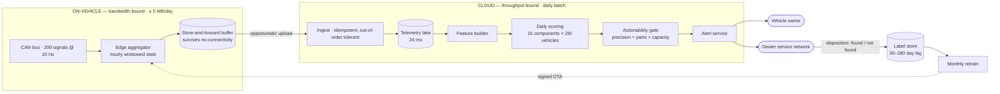

# 03 — Automotive Predictive Maintenance

> **Archetype F · Sensor & edge.** The system where you don't control the network and ground truth arrives months late.

---

## The three-sentence compression

1. **The choice that matters most:** **what the edge computes**, not what the cloud does. Raw telemetry is ~691 MB/vehicle/day; edge pre-aggregation into windowed statistics makes it ~165 KB — a **~4,000× reduction** that is the difference between an impossible system and a $1.5k/month one. Choosing the window and the statistic set *is* the system design.
2. **The alternative I rejected:** streaming raw signals to the cloud and doing feature engineering there. Rejected on arithmetic — 1.38 PB/day across the fleet, unaffordable on cellular and unnecessary, because the model only needs distributional summaries.
3. **The failure mode I'd volunteer:** **alert precision is bounded by dealer trust, not by statistics.** A dealer who investigates three alerts and finds nothing twice stops investigating. That sets a ≥ 0.70 precision floor which is socio-technical, and it means precision must be tunable per component and per region.

---

## Architecture at a glance

---

## Key numbers

| | |
|---|---|
| Fleet | 2M vehicles · 200 signals @ 10 Hz · 15 monitored components |
| **The binding constraint** | **≤ 5 MB/vehicle/day** cellular budget |
| Raw vs aggregated | 691 MB/day → **165 KB/day** (~4,000×), 33× inside budget |
| Prediction cadence | Daily batch — real-time buys nothing for a weeks-long degradation curve |
| **Alert precision floor** | **≥ 0.70** — a dealer-trust limit, not a statistical target |
| Alert lead time | ≥ 14 days median before failure |
| Label latency | **30–180 days**, and only if the vehicle is actually serviced |
| Scoring volume | 30M predictions/day |
| **Total cost** | **~$1.5k/month (~$0.0007/vehicle/month)** — compute is a rounding error |

---

## Files

| File | Contents |
|---|---|
| [`01_requirements.md`](01_requirements.md) | The edge/cloud split contract, the trust-economics precision floor, the label-availability problem |
| [`02_hld.md`](02_hld.md) | Architecture, component choices with rejected alternatives, data flow, NFR mapping, failure modes, scale plan |
| [`03_lld.md`](03_lld.md) | Edge aggregation schema, ingest contract, survival model, sequence diagrams, state machines, edge cases |
| [`04_production_and_interview.md`](04_production_and_interview.md) | AI-specific concerns, runbook, common mistakes, interview follow-ups, glossary |

**Shared requirements block:** [`../00_requirements_all_systems.md#3-automotive--predictive-maintenance`](../00_requirements_all_systems.md#3-automotive--predictive-maintenance)

---

## The two findings to leave with

1. **The design decision is made in requirements, not architecture.** A 4,000× data reduction comes from deciding what the edge computes. Get the statistic set wrong and you either blow the bandwidth budget or silently discard the signal the model needed — and you won't find out for months, because that's how long labels take.
2. **Compute is free; data movement and label latency are the whole problem.** ~$290/month of scoring against ~$1.1k/month of storage, and an evaluation strategy that must function with 30–180 day feedback. This inverts the usual instinct to optimise the model.
