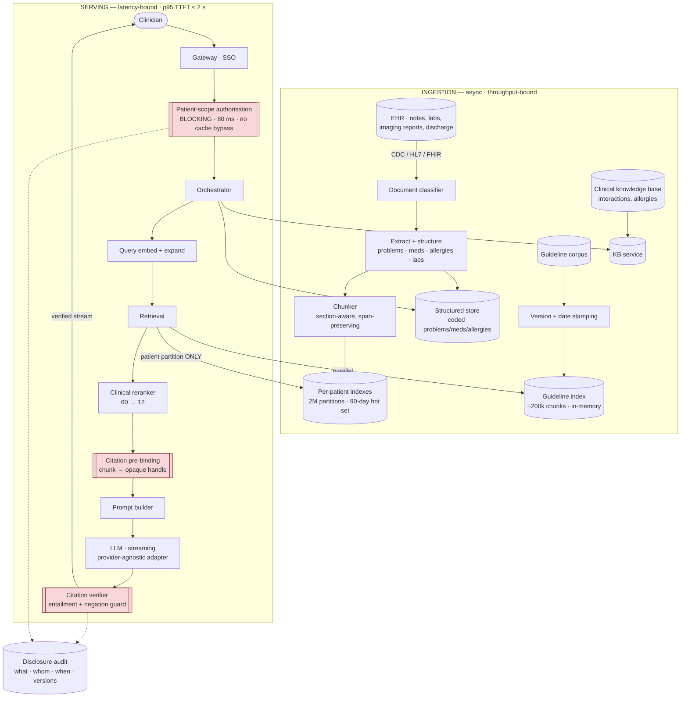

# 04 · HLD — Healthcare Clinical Decision Support & Medical Documents

> ← [`01_requirements.md`](01_requirements.md) · **Next:** [`03_lld.md`](03_lld.md) →
>
> **Three-sentence compression:** the 4.8B-vector problem is really 2M tiny per-patient indexes, because cross-patient retrieval is forbidden · I rejected a global index with a `patient_id` post-filter, because post-filtering leaks through relevance signals and a single leak is a reportable breach · the failure mode I'd volunteer is that a *wrong* citation is worse than a missing one, which is why citation verification is a pipeline stage rather than a prompt instruction.

---

## 2.1 Architecture

Two indexes, deliberately: patient records are **partitioned and never searched globally**; guidelines are **small, shared, and versioned**. They have opposite scaling and opposite trust properties.

Red boxes are the three **non-bypassable gates**: authorisation (no leak), citation binding (no fabricated references), verification (no unsupported claims).

---

## 2.2 Component choices

| Concern | Choice | Why | Rejected alternative (and why not) | Revisit when |
|---|---|---|---|---|
| **Patient-record retrieval** | **Per-patient index partitions** — one small ANN index per patient, hot set of ~384M chunks across ~160k active patients | FR-2 forbids cross-patient retrieval, so we *never* search globally. Each search touches ~2,400 chunks (one patient's 400 docs × 6), which is trivially fast and exact | **One global 4.8B-vector index with a `patient_id` filter** — even with filter pushdown, it's an enormous index built to serve queries that only ever touch one partition. **Post-filtering** — leaks through relevance signals and top-k semantics, and a single leak is reportable | If a legitimate cross-patient use case appears (cohort research), it needs a *separate* system with its own consent basis — not a filter change here |
| **Exact vs approximate search** | **Exact (brute-force) within a patient partition** | 2,400 chunks × 1024 dims is ~10 MB — a full scan is sub-millisecond. ANN approximation buys nothing and introduces recall uncertainty in a clinical setting | **HNSW per patient** — index build cost and memory overhead per partition for zero latency benefit at this size | A single patient's record exceeds ~50k chunks (rare, but happens in long-term complex care) |
| **Guideline retrieval** | **Separate shared index, version- and date-stamped** | Guidelines are shared across all patients, small (~200k chunks), and their *version* is clinically material (FR-4). Outdated guidance is a safety issue, not a staleness annoyance | **Merge into the patient index** — would either duplicate guidelines 2M times or reintroduce cross-partition search. **No versioning** — makes FR-4 unimplementable | — |
| **Authorisation** | **Blocking, on-path, 80 ms, no optimistic caching** | FR-2 admits no failure. An optimistic cache with a TTL means a revoked clinician retains access for the TTL window | **Cache the patient-scope decision** — saves 80 ms and creates a window where a revoked access still works. Not acceptable for PHI | Never. The 80 ms is the cost of the guarantee |
| **Citation mechanism** | **Opaque handles issued per request; the model cites handles** | Eliminates the largest citation-failure class — a model asked to write a document reference will occasionally invent one. It cannot invent a handle it wasn't given (FR-13) | **Model writes `[doc_id, page]` citations** — fabrication is a known failure mode and 0.99 accuracy is unreachable that way | — |
| **Citation verification** | **Post-generation entailment check on every claim/span pair, plus negation-aware span expansion** | Layered defence to reach 0.99. Specifically targets the "cited 'penicillin allergy' from 'no penicillin allergy'" truncation failure (FR-15) | **Trust the model's citation** — the empirically dominant source of critical errors. **Human review of every summary** — defeats the time-saving purpose | Verification model quality improves enough to allow a single-pass approach |
| **Drug interactions / allergies** | **Maintained clinical knowledge base, surfaced with its own citation** | FR-8 must not come from parametric memory — an LLM's recollection of an interaction is not a clinical source, and it drifts silently between model versions | **Ask the LLM about interactions** — unversioned, unauditable, and edges the system toward a clinical determination | — |
| **Structured extraction** | **Separate structured store alongside the text index** | Coded problems/meds/allergies are better served by exact structured query than by semantic retrieval. "Does this patient have a penicillin allergy?" should be a lookup, not a similarity search | **Retrieve everything semantically** — turns a deterministic question into a probabilistic one for no benefit | — |
| **Model access** | **Provider-agnostic adapter** (FR-18) | The BAA question ([`01_requirements.md#d`](01_requirements.md#d-the-phi-egress-decision-the-highest-leverage-open-question)) may force self-hosting; the fallback must be a config change | **Direct provider SDK throughout** — a "no BAA" answer becomes a rewrite | — |
| **Guardrail placement** | **Overlapped with the stream, with retraction support** | 180 ms of checks cannot sit in front of a 2 s TTFT budget | **Blocking pre-stream** — breaks the budget. **No verification** — unreachable NFR | If the UI cannot support retraction, verification must block and the SLO must be renegotiated |
| **Audit** | **On-path, synchronous, before display** | FR-6: liability attaches to *what the clinician was shown*. A disclosure that happened but wasn't recorded is a compliance defect | **Async audit write** — correct for [`../02_banking_fraud_detection/`](../02_banking_fraud_detection/) where a payment must not block, wrong here where the record *is* the legal artifact | — |

> **The on-path/off-path contrast with system 02 is worth stating explicitly in a review.** Same mechanism (audit write), opposite decision, driven entirely by the domain: a payment must never be blocked by the audit store; a clinical disclosure must never happen without one.

---

## 2.3 Data flow, narrated

**The serving path:**

1. **Gateway** authenticates the clinician via institutional SSO and resolves their identity plus the patient context from the calling EHR session — *never* from a request body parameter, which would make patient scope client-controlled.
2. **Patient-scope authorisation** blocks for up to 80 ms verifying that this clinician has a current treatment relationship with this patient. On-path, uncached, no bypass. FR-2 has no acceptable failure rate, so this hop cannot be optimised away.
3. **Query embedding and expansion** — a small model expands clinical abbreviations and synonyms ("EF" → "ejection fraction", "SOB" → "shortness of breath"), because clinical shorthand is dense and retrieval on the raw string underperforms badly.
4. **Retrieval, two parallel legs.** The patient leg searches **only that patient's partition** — exact search over ~2,400 chunks, so no approximation and no possibility of a cross-patient hit. The guideline leg searches the shared versioned index. Running them in parallel is what keeps both inside budget.
5. **Structured lookups** run alongside for coded facts (active problems, current medications, recorded allergies) and, if the question implicates it, the knowledge-base service for interactions. These are exact queries, deliberately not semantic.
6. **Clinical reranker** scores 60 candidates to 12. A general-purpose reranker underperforms here; clinical relevance depends on recency, document type, and section (a discharge summary's "Assessment" section outranks a nursing note's vitals for most questions).
7. **Citation pre-binding** assigns each surviving chunk an **opaque handle** and records `(document_id, version, start_offset, end_offset)` server-side. The model receives handles and text, and is instructed to cite handles. It has no ability to construct a document reference.
8. **Prompt assembly** wraps each chunk with its source type (FR-12) and date. Guidelines carry version and publication date inline, because "per the 2019 guideline" and "per the 2026 guideline" are different clinical statements.
9. **The LLM streams** the summary. Every clinical assertion must carry a handle citation; the prompt structure and output schema enforce this shape.
10. **Citation verification** runs concurrently with the stream: for each emitted claim/handle pair, an entailment check against the bound span; negation tokens trigger widened spans (FR-15). A failure **retracts the stream** and substitutes a safe response.
11. **Disclosure audit** is written **synchronously before final display**, recording the clinician, patient, question, every chunk shown, and the model/prompt/guideline versions.

**The ingestion path**, briefly: EHR documents arrive via CDC/HL7/FHIR and are classified by type. Extraction produces both **structured** codes (problems, meds, allergies, labs with units and reference ranges) and **span-preserving chunks** — span offsets are preserved because citations point at them, so a chunker that normalises whitespace without tracking offsets breaks citations silently. Chunks land in the patient's partition. Guidelines are ingested separately with mandatory version and date stamping; a guideline without a version is rejected rather than ingested, because FR-4 depends on it.

---

## 2.4 NFR mapping

| NFR (from shared block) | Delivered by |
|---|---|
| TTFT p95 < 2 s | Latency budget §2.5 (~1,700 ms) · parallel patient/guideline retrieval · exact search over a small partition · overlapped verification |
| Availability 99.9% | Multi-AZ stateless serving; **degraded mode is direct record access** (the status quo), so this is not life-critical |
| **Citation accuracy ≥ 0.99** | Three layers: opaque-handle binding (no fabrication) · entailment verification (no unsupported pairing) · negation-aware span expansion (no meaning-inverting truncation) |
| Groundedness ≥ 0.98 | Structured facts served from the structured store rather than generated · verification stage · CI eval gate |
| Refuse-path recall ≥ 0.95 (over-refusal ≤ 0.05) | Explicit insufficient-evidence path · **paired** eval sets gated in CI (FR-16) |
| **Cross-patient leakage = 0** | Per-patient index partitions (no global search exists) · blocking uncached authorisation · adversarial test suite in CI |
| PHI handling | Provider-agnostic adapter (FR-18) · BAA + zero-retention required · per-request egress logging (FR-19) |
| Audit retention per statute | Synchronous on-path disclosure record with all version stamps |
| Cost ≤ $0.40/summary | ~$0.030 actual — **headroom deliberately spent on the verification stage** |

---

## 2.5 Latency budget (TTFT, p95)

| Stage | Budget | Why this much |
|---|---|---|
| Auth + clinician/patient context resolution | 60 ms | SSO token validation + EHR session lookup |
| **Patient-scope authorisation** | **80 ms** | Blocking, uncached — the cost of a zero-leak guarantee |
| Query embed + clinical expansion | 50 ms | Small model, abbreviation expansion |
| Retrieval — patient partition (exact) | 140 ms | Full scan of ~2,400 chunks; includes partition load if cold |
| Retrieval — guideline index | 120 ms *(parallel)* | Shared in-memory index |
| Structured + KB lookups | 90 ms *(parallel)* | Exact queries |
| Clinical reranker (60 → 12) | 220 ms | Cross-encoder; the largest non-LLM leg |
| Citation pre-binding | 90 ms | Handle issue + span offset recording |
| Prompt assembly | 40 ms | Source-type wrapping, version stamping |
| **LLM TTFT** | **900 ms** | Frontier, streaming |
| Verification (entailment + negation) | 180 ms *(overlapped)* | Concurrent with stream; retracts on failure |
| **Total** | **~1,700 ms** | SLO 2,000 ms ✅ **300 ms headroom** |

> Two things to defend here. The **80 ms authorisation is not optimisable** — caching it would create a window in which revoked access still works. And verification is **overlapped but retractable**, which imposes a UI requirement: the client must be able to withdraw a partially-streamed response. If it can't, verification has to block and the SLO must be renegotiated — that's a requirement discovered by writing the budget.

---

## 2.6 Failure modes and blast radius

| Failure | Detection | Blast radius | Mitigation / degraded mode |
|---|---|---|---|
| **Authorisation service down** | Error rate on the auth hop | All queries | **Fail closed.** No summary is produced. Clinician falls back to direct record access, which is the pre-existing workflow — so the degraded state is "no worse than before", never "a summary without an authorisation check" |
| **Cross-patient chunk appears in a result** | Adversarial CI suite; runtime assertion that every returned chunk's `patient_id` matches the request | Potentially reportable | Runtime assertion **hard-fails the request** rather than filtering the offender out. A filter would mask a bug that must be found. Page immediately; treat as a security incident |
| **Citation verification fails mid-stream** | Verification failure rate | That response | Retract and substitute a conservative response. Elevated failure rates suggest a prompt or model regression → auto-revert |
| **LLM provider unavailable** | Error rate, TTFT p99 | All queries | Fallback provider → **structured-facts-only view** (active problems, meds, allergies, recent labs, rendered from the structured store with citations, no narrative). Genuinely useful and fully grounded, because it's a rendering rather than a generation |
| **Guideline corpus stale** | Guideline version age monitor | Clinical correctness | Version and date shown inline with every guideline citation, so a clinician can see staleness. Alert if any cited guideline exceeds its review interval |
| **Document amended after a citation was issued** | Version mismatch on citation resolution | Historical audit records | Citations bind to a document **version**; the amended version is a new row. An audit query resolves what was *actually shown*, not the current text |
| **Chunker changes offsets** (whitespace normalisation) | Citation resolution failure rate | All citations for re-ingested docs | Span offsets are part of the chunk contract; a chunker change requires re-ingestion and re-binding. CI test asserts offset stability for a fixed corpus |
| **Patient partition cold** (first access in months) | Partition load latency | One clinician's first query | Accept the latency (budget has 300 ms); pre-warm partitions for patients with scheduled appointments — a cheap, high-hit-rate optimisation |
| **Over-refusal spike** | Refusal rate vs baseline; over-refusal eval | Usability collapse, silently | Alarm on refusal rate outside band. **This failure looks like safety and is actually uselessness** — which is why FR-16 gates both directions |
| **Model asserts an interaction from parametric memory** | Uncited-claim detector; source-type check (FR-12) | Clinical safety | Any clinical assertion without a handle is stripped before display. Interactions must carry a KB citation or they don't ship |
| **PHI egress to a non-BAA endpoint** | Egress log audit (FR-19); network policy | Reportable breach | Network egress allow-list at the infrastructure layer, not just application config — application bugs must not be able to cause this |

---

## 2.7 Scale plan

| | What breaks first | Why | What I'd change |
|---|---|---|---|
| **10×** (50k clinicians, 1.25M summaries/day) | **The clinical reranker** | 220 ms × 1.25M/day of cross-encoder compute is the densest hop; GPU pool saturates before retrieval or the LLM | Distil the reranker; reduce candidates 60 → 40 (measure clinical relevance loss with clinician review, not just nDCG); cache reranker scores per (question-cluster, patient, document-set) since clinicians repeat questions |
| **10×** (secondary) | Partition management overhead | 2M → 20M partitions strains metadata and cold-start | Tier partitions by activity; consolidate inactive patients into cold storage with on-demand rehydration; the hot-set fraction (8%) is what makes this tractable |
| **100×** (500k clinicians) | **The 90-day hot-set assumption** | At 200M patients, even 8% active is 16M partitions × 2,400 chunks = 38B chunks in the hot set | Shift the partition boundary: partition per *encounter* rather than per patient, so a query touches only the relevant care episode plus a summary layer. This is a genuine redesign, not a scaling knob — and the trigger is worth naming |
| **100×** (secondary) | Verification cost | Entailment on every claim at 100× becomes the dominant compute | Tiered verification: cheap lexical/NLI check on all claims, expensive entailment only on high-risk claim classes (allergies, medications, negations) — where "high-risk" is a clinically-reviewed list, not a heuristic |

**What does not break:** exact search within a patient partition (bounded by one patient's record size, not by fleet size — this is the payoff of the reframing), the guideline index (fixed size), and the structured store.

---

> ← [`01_requirements.md`](01_requirements.md) · **Next:** [`03_lld.md`](03_lld.md) →
