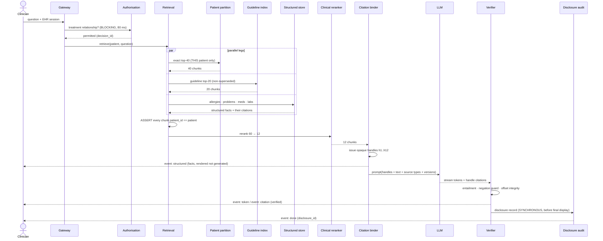
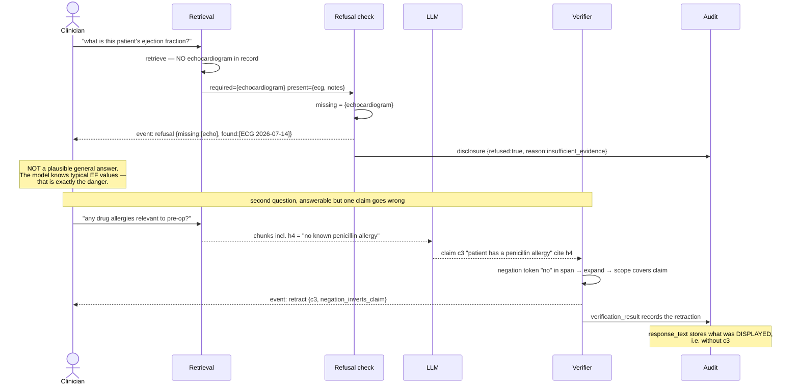
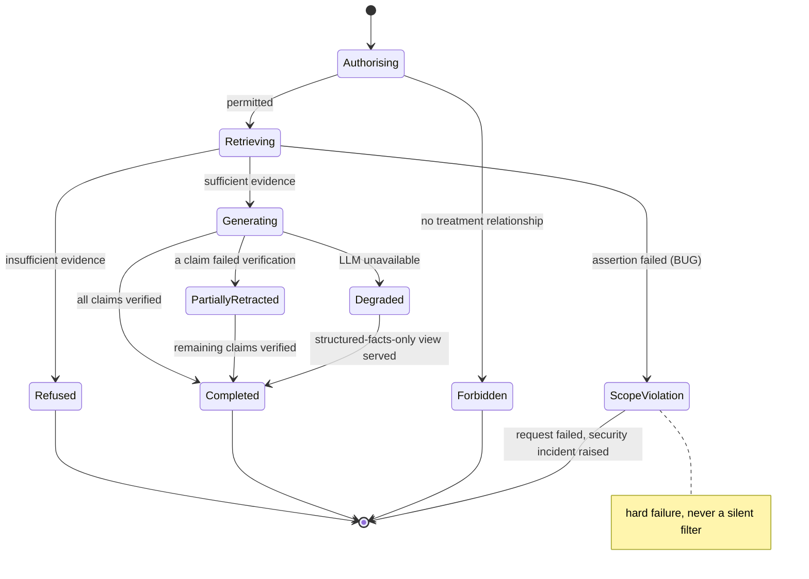
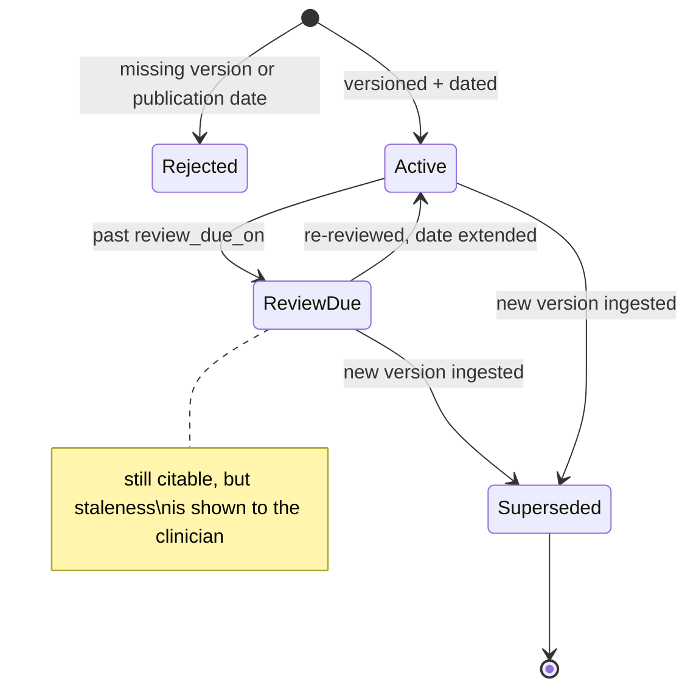

# 04 · LLD — Healthcare Clinical Decision Support & Medical Documents

> ← [`02_hld.md`](02_hld.md) · **Next:** [`04_production_and_interview.md`](04_production_and_interview.md) →

---

## 3.1 Data models

### Documents and versioning

```sql
CREATE TABLE clinical_documents (
    document_id      UUID        NOT NULL,
    version          INT         NOT NULL,      -- amendments create a NEW version
    patient_id       UUID        NOT NULL,
    doc_type         TEXT        NOT NULL,      -- progress_note | discharge_summary | lab
                                                -- | imaging_report | operative_note
    authored_at      TIMESTAMPTZ NOT NULL,      -- CLINICAL date, not ingest date
    authored_by      TEXT,
    body             TEXT        NOT NULL,      -- exact text; offsets index into THIS
    body_sha256      BYTEA       NOT NULL,
    superseded_by    INT,                       -- version that replaced this one
    ingested_at      TIMESTAMPTZ NOT NULL,
    PRIMARY KEY (document_id, version)
);
CREATE INDEX idx_doc_patient ON clinical_documents (patient_id, authored_at DESC);
CREATE INDEX idx_doc_current ON clinical_documents (patient_id, doc_type)
    WHERE superseded_by IS NULL;   -- partial: "current" documents are the common query
```

> **Versioning is not optional here.** Citations bind to `(document_id, version, offsets)`. If amendments overwrote `body` in place, every historical citation would silently start pointing at different text — and an audit record proving "this is what the clinician was shown" would become false. `body_sha256` lets us prove a version's text hasn't changed since a citation was issued.

### Chunks with span offsets

```sql
CREATE TABLE document_chunks (
    chunk_id         UUID PRIMARY KEY,
    document_id      UUID        NOT NULL,
    doc_version      INT         NOT NULL,
    patient_id       UUID        NOT NULL,      -- DENORMALISED for the runtime assertion
    section          TEXT,                      -- Assessment | Plan | HPI | Meds | ...
    start_offset     INT         NOT NULL,      -- into clinical_documents.body
    end_offset       INT         NOT NULL,
    text             TEXT        NOT NULL,      -- exact substring; redundancy is deliberate
    token_count      INT         NOT NULL,
    embed_version    SMALLINT    NOT NULL,
    embedding        VECTOR(1024),
    FOREIGN KEY (document_id, doc_version)
        REFERENCES clinical_documents (document_id, version) ON DELETE CASCADE
);
CREATE INDEX idx_chunk_patient ON document_chunks (patient_id, embed_version);
CREATE INDEX idx_chunk_doc ON document_chunks (document_id, doc_version, start_offset);
```

Three deliberate choices:

- **`patient_id` denormalised onto every chunk** — enables the runtime assertion that every returned chunk belongs to the requested patient. Redundant with the document's patient, and that redundancy is the safety property: a join bug can't defeat it.
- **`text` stored despite being derivable from offsets** — verification and display need it without a document fetch, and it lets us detect offset drift by comparing against `substring(body, start, end)`.
- **No ANN index** — exact scan within a patient partition is sub-millisecond at ~2,400 chunks. An HNSW index per patient would cost build time and memory for no benefit ([`02_hld.md`](02_hld.md#22-component-choices)).

### Structured clinical facts (exact, not semantic)

```sql
CREATE TABLE patient_allergies (
    patient_id       UUID        NOT NULL,
    allergen_code    TEXT        NOT NULL,      -- coded (e.g. RxNorm/SNOMED-style)
    allergen_text    TEXT        NOT NULL,
    severity         TEXT,
    reaction         TEXT,
    status           TEXT        NOT NULL,      -- active | inactive | refuted
    asserted_at      TIMESTAMPTZ NOT NULL,
    source_document  UUID, source_doc_version INT,
    source_start     INT, source_end INT,       -- citation for the structured fact itself
    PRIMARY KEY (patient_id, allergen_code, asserted_at)
);
CREATE INDEX idx_allergy_active ON patient_allergies (patient_id)
    WHERE status = 'active';
```

> **Note `status` includes `refuted`.** "No penicillin allergy" is a clinical statement, not an absence of data, and it must be representable — otherwise the only way to express it is a missing row, which is indistinguishable from "never asked." This is the structured-data counterpart to the negation problem in citations (FR-15).

Analogous tables exist for `patient_problems` and `patient_medications`, each carrying its own source citation so a structured fact is as traceable as a generated sentence.

### Guidelines (shared, versioned)

```sql
CREATE TABLE guideline_chunks (
    chunk_id         UUID PRIMARY KEY,
    guideline_id     TEXT        NOT NULL,
    guideline_version TEXT       NOT NULL,      -- REQUIRED — ingestion rejects null
    published_on     DATE        NOT NULL,      -- REQUIRED
    review_due_on    DATE,                      -- staleness alerting
    society          TEXT,
    section_path     TEXT,
    text             TEXT        NOT NULL,
    start_offset     INT NOT NULL, end_offset INT NOT NULL,
    embedding        VECTOR(1024),
    superseded       BOOLEAN     NOT NULL DEFAULT false
);
CREATE INDEX idx_gl_current ON guideline_chunks (guideline_id) WHERE NOT superseded;
```

Ingestion **rejects** a guideline lacking version or publication date. FR-4 requires provenance and version on every guideline citation; accepting unversioned content would make the requirement unimplementable while appearing to work.

### Citation handles (per-request, ephemeral)

```sql
-- Redis, TTL 300 s. Handles are per-request and opaque to the model.
KEY   cite:{request_id}
TYPE  hash
FIELDS
  h1 -> {"kind":"patient_record","document_id":"…","doc_version":3,
          "start":1420,"end":1587,"patient_id":"…","authored_at":"2026-06-02"}
  h2 -> {"kind":"guideline","guideline_id":"…","guideline_version":"2026.1",
          "published_on":"2026-03-01","start":880,"end":1104}
  h3 -> {"kind":"knowledge_base","kb_entry":"…","kb_version":"…"}
```

> **This is the mechanism behind FR-13.** The model sees `h1`, `h2`, `h3` and the accompanying text. It cannot fabricate `h7`, because resolution fails. Compare a model asked to write `[Progress Note, 2026-06-02, p.3]` — a plausible-looking reference it can generate without any grounding.

### Disclosure audit (on-path, synchronous)

```sql
CREATE TABLE disclosures (
    disclosure_id    UUID PRIMARY KEY,
    request_id       UUID        NOT NULL,
    clinician_id     TEXT        NOT NULL,
    patient_id       UUID        NOT NULL,
    occurred_at      TIMESTAMPTZ NOT NULL DEFAULT now(),
    question         TEXT        NOT NULL,
    response_text    TEXT        NOT NULL,      -- EXACTLY what was displayed
    chunks_shown     JSONB       NOT NULL,      -- resolved handles: doc, version, offsets
    citations_emitted JSONB      NOT NULL,      -- claim → handle pairs, with verdicts
    refused          BOOLEAN     NOT NULL,
    refusal_reason   TEXT,
    model_version    TEXT        NOT NULL,
    prompt_version   TEXT        NOT NULL,
    guideline_versions TEXT[]    NOT NULL,      -- every guideline version relied upon
    verification_result JSONB    NOT NULL,
    phi_egress       JSONB       NOT NULL,      -- FR-19: fields, endpoint, agreement ref
    auth_decision_id UUID        NOT NULL       -- links to the authorisation record
);
CREATE INDEX idx_disc_patient ON disclosures (patient_id, occurred_at DESC);
CREATE INDEX idx_disc_clinician ON disclosures (clinician_id, occurred_at DESC);
```

`response_text` stores what was **displayed**, not what was generated — if verification retracted part of the stream, the record reflects the retraction. The distinction matters because liability attaches to what the clinician saw.

---

## 3.2 API contracts

### Clinical query (streaming)

```http
POST /v1/clinical/query
Authorization: Bearer <sso-jwt>          # clinician identity from token
X-EHR-Session: <opaque>                  # patient context from the EHR session,
                                         # NEVER a patient_id in the body
Content-Type: application/json

{ "question": "summarise cardiac history relevant to pre-op assessment",
  "stream": true }

200 text/event-stream
  event: structured                      # exact facts, rendered not generated
  data: {"allergies":[{"allergen":"penicillin","status":"active","severity":"severe",
                       "cite":"h4"}],
         "active_problems":[…], "current_meds":[…],
         "recent_labs":[{"name":"BNP","value":412,"unit":"pg/mL",
                         "ref_range":"<100","collected":"2026-08-28","cite":"h5"}]}

  event: token
  data: {"delta":"Reduced ejection fraction of 38% was documented "}

  event: citation
  data: {"claim_id":"c1","handle":"h1","kind":"patient_record",
          "document":"Echo report","authored_at":"2026-06-02",
          "span_text":"LVEF 38% by biplane method","verified":true}

  event: guideline
  data: {"handle":"h2","guideline_id":"periop-cv","version":"2026.1",
          "published_on":"2026-03-01","span_text":"…"}

  event: retract
  data: {"claim_id":"c3","reason":"entailment_failed","action":"claim_removed"}

  event: done
  data: {"refused":false,"citations":4,"verified":4,
         "model":"frontier-v3","prompt_version":"cds@2026-08-20",
         "disclosure_id":"…"}

# The refusal case is a normal 200, not an error:
  event: refusal
  data: {"reason":"insufficient_evidence_in_record",
          "missing":["echocardiogram within 12 months","stress test result"],
          "found":["ECG 2026-07-14 — normal sinus rhythm"]}

400 malformed
401 SSO token invalid
403 no current treatment relationship with this patient   # the authorisation gate
409 patient context ambiguous / EHR session expired
422 question outside supported scope (e.g. requests a diagnosis)
503 LLM unavailable → body carries the structured-facts-only view
```

**Design notes:**

- **Patient context comes from the EHR session, never a body field.** A client-supplied `patient_id` would make patient scope client-controlled — the most obvious path to a cross-patient leak.
- **`event: structured` precedes narration**, and is rendered from the structured store. Allergies and current medications are too important to be paraphrased by a model; they are displayed as data with citations. The model narrates *around* them.
- **`event: refusal` is a 200.** Refusal is a correct outcome, not a failure, and modelling it as an error would encourage clients to retry until they get prose.
- **`422` for out-of-scope questions** — a request for a diagnosis is refused at the API layer, reinforcing FR-5 rather than relying on the model to decline.

### Citation resolution (clinician clicks a citation)

```http
GET /v1/clinical/citations/{disclosure_id}/{handle}
Authorization: Bearer <sso-jwt>

200 {"kind":"patient_record",
     "document":{"id":"…","version":3,"type":"imaging_report",
                 "authored_at":"2026-06-02","authored_by":"…"},
     "span":{"start":1420,"end":1587,
             "text":"LVEF 38% by biplane method, moderately reduced",
             "expanded_text":"…full sentence with surrounding context…"},
     "integrity":"verified"}          # body_sha256 matches the version cited

200 {"integrity":"document_amended",  # honest about a changed source
     "current_version":4,
     "note":"This document was amended after this summary was produced.
             The text shown is the version cited at the time."}
403 caller lacks access to this patient   # re-checked, not assumed from the original request
404 handle expired or unknown
```

Re-checking authorisation on citation resolution matters: the original request's authorisation is not a bearer of ongoing access, and a clinician's relationship to a patient can end.

---

## 3.3 Core algorithms

### Retrieval with the leak assertion

```python
def retrieve(patient_id: UUID, question: str, clinician_id: str) -> Retrieved:
    """FR-2 has no acceptable failure rate. The partition makes a leak structurally
       impossible; the assertion makes a BUG loud instead of silent."""

    # 1. Blocking authorisation — no cache, no bypass (see 02_hld §2.2)
    auth = authz.check_treatment_relationship(clinician_id, patient_id, timeout_ms=80)
    if not auth.permitted:
        raise Forbidden(auth.reason)

    qexp = expand_clinical_abbreviations(question)   # "EF" -> "ejection fraction"
    qvec = embed(qexp)

    # 2. Patient leg: EXACT scan of THIS patient's partition only.
    #    There is no code path that searches across patients.
    part = partitions.load(patient_id, embed_version=CURRENT_EMBED_VERSION)
    pat_hits = part.exact_topk(qvec, k=40)

    # 3. The assertion. A filter would MASK a bug; a hard failure surfaces it.
    for h in pat_hits:
        if h.patient_id != patient_id:
            audit.security_event("cross_patient_chunk", patient_id, h.chunk_id)
            raise InternalError("patient scope violation")   # fail the request

    # 4. Guideline leg, in parallel — shared index, no patient scope
    gl_hits = guidelines.search(qvec, k=20, exclude_superseded=True)

    # 5. Exact structured facts — NOT semantic retrieval
    facts = structured.fetch(patient_id, kinds=["allergies", "problems", "medications",
                                                "recent_labs"])

    ranked = clinical_reranker.score(qexp, pat_hits + gl_hits)[:12]
    return Retrieved(chunks=ranked, facts=facts, auth_decision_id=auth.decision_id)
```

### Citation binding and verification

```python
NEGATION_TOKENS = {"no", "not", "denies", "denied", "negative", "without",
                   "ruled out", "absent", "refuted", "resolved"}

def bind_handles(request_id: UUID, chunks: list[Chunk]) -> dict[str, Chunk]:
    """FR-13: the model cites handles it was GIVEN. It cannot fabricate a handle."""
    handles = {f"h{i+1}": c for i, c in enumerate(chunks)}
    cite_store.put(request_id, {h: c.provenance() for h, c in handles.items()}, ttl=300)
    return handles


def verify_claim(claim: str, handle: str, handles: dict[str, Chunk]) -> Verdict:
    chunk = handles.get(handle)
    if chunk is None:
        return Verdict(False, "unknown_handle")          # fabricated citation

    span = chunk.text

    # FR-15: negation guard. The dangerous failure is citing "penicillin allergy"
    # from a span reading "no penicillin allergy" — a truncation that INVERTS meaning.
    if any(t in span.lower() for t in NEGATION_TOKENS):
        span = expand_to_sentence_boundaries(chunk, window_chars=400)
        if negation_scope_covers(span, claim):
            return Verdict(False, "negation_inverts_claim")

    # Entailment: does this span actually support this claim?
    if entailment.score(premise=span, hypothesis=claim) < 0.80:
        return Verdict(False, "entailment_failed")

    # Offset integrity: has the underlying document changed?
    if not documents.verify_span_hash(chunk):
        return Verdict(False, "offset_drift")

    return Verdict(True, None)


def stream_verified(llm_stream, handles) -> Iterator[Event]:
    """Verification runs CONCURRENTLY with streaming (budget has no room for a
       blocking check), so it must be able to retract."""
    buf = []
    for tok in llm_stream:
        buf.append(tok)
        if is_claim_boundary(buf):
            claim, handle = parse_claim(buf)
            v = verify_claim(claim, handle, handles)
            if v.ok:
                yield Event("token", "".join(buf))
                yield Event("citation", handles[handle].for_display(verified=True))
            else:
                metrics.incr(f"verify.fail.{v.reason}")
                yield Event("retract", {"claim_id": claim.id, "reason": v.reason,
                                        "action": "claim_removed"})
            buf = []
```

### The refuse decision

```python
MIN_SUPPORT = 0.55

def should_refuse(question: str, retrieved: Retrieved) -> Refusal | None:
    """The dangerous failure is NOT silence — it is a plausible general answer.
       The model knows typical ejection fractions; asked about THIS patient with no
       echo in context, it will produce a clinically plausible fabrication."""

    required = classify_required_evidence(question)   # e.g. {"echocardiogram", "ecg"}
    present = {c.evidence_type for c in retrieved.chunks} | retrieved.facts.evidence_types()
    missing = required - present

    if missing:
        return Refusal(reason="insufficient_evidence_in_record",
                       missing=sorted(missing),
                       found=sorted(present & required))   # say what WAS found

    if max((c.rerank_score for c in retrieved.chunks), default=0.0) < MIN_SUPPORT:
        return Refusal(reason="no_sufficiently_relevant_evidence", missing=[], found=[])

    return None    # proceed
```

Note the refusal names **both** what's missing and what was found — a bare "insufficient information" is unhelpful, and naming the gap is what lets the clinician decide whether to order the missing test.

---

## 3.4 Sequence diagrams

### Happy path



### Failure path — refusal, and a retraction

**The path that matters**, because it's where the system either protects the clinician or misleads them.



---

## 3.5 State machines

### Request lifecycle



### Guideline lifecycle



---

## 3.6 Edge cases and correctness

| Edge case | Handling | Why |
|---|---|---|
| **Question requires evidence not in the record** | Refuse, naming what's missing and what was found | The alternative is a plausible fabrication — the worst output available |
| **Negated finding cited as positive** | Negation-aware span expansion; claim retracted | Citing "penicillin allergy" from "no penicillin allergy" is a direct safety hazard |
| **Model emits an uncited clinical claim** | Stripped before display | FR-1/FR-12: no unlabelled clinical assertion ships |
| **Model fabricates a handle** | Resolution fails → retract | Structurally prevented by opaque handles |
| **Document amended after citation** | Citation binds to the *version* cited; resolution reports `document_amended` | An audit record must reflect what was shown, not current text |
| **Chunker offsets drift** (whitespace normalisation) | Span-hash verification fails → retract; CI asserts offset stability | Silent offset drift breaks every citation without any error |
| **Empty patient record** (new patient) | Refuse with `no_record_available`; structured view shows nothing rather than fabricating | Common on first encounters |
| **Extremely long record** (decades of care) | Partition remains per-patient; reranker handles volume; recency weighting in the ranker | The partition bound is one patient, not the fleet — this is why the reframing scales |
| **Conflicting information across documents** | Both surfaced with dates and citations; the system does **not** adjudicate | Adjudicating a clinical contradiction would cross the advisory boundary (FR-5) |
| **Allergy recorded as `refuted`** | Represented explicitly, not as a missing row | "No penicillin allergy" is data, not absence of data |
| **Guideline superseded mid-session** | The version cited is recorded; the next query uses the new version | Version pinning per request keeps the audit coherent |
| **Clinician's access revoked mid-session** | Citation resolution re-checks authorisation and returns 403 | The original request is not a bearer of ongoing access |
| **Patient context ambiguous** (multiple EHR contexts) | 409, no retrieval attempted | Guessing the patient is the leak scenario |
| **Request asks for a diagnosis** | 422 at the API layer | Reinforces FR-5 structurally rather than relying on the model to decline |
| **Over-refusal spike** | Alarmed as a *usability* incident | A system that refuses everything looks safe and is useless (FR-16 gates both directions) |
| **LLM provider unavailable** | Structured-facts-only view with citations | Fully grounded and genuinely useful, because it's a rendering rather than a generation |
| **PHI egress to non-BAA endpoint** | Blocked by infrastructure egress allow-list | Application bugs must not be able to cause a reportable breach |

---

> ← [`02_hld.md`](02_hld.md) · **Next:** [`04_production_and_interview.md`](04_production_and_interview.md) →
