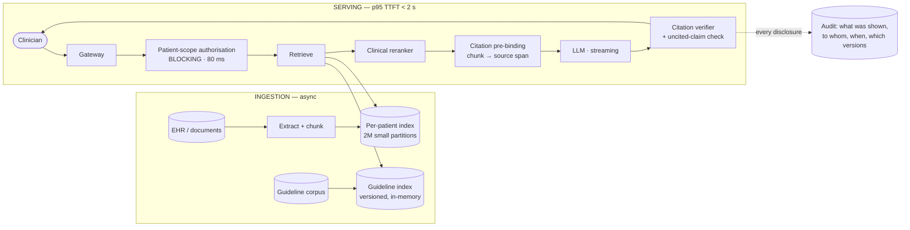

# 04 — Healthcare Clinical Decision Support & Medical Documents

> **Archetype B · Grounded RAG.** The system where a wrong citation is worse than no citation.
>
> **Related:** [`../../21_ai-system-design-deep-dives/02_document_intelligence_agent.md`](../../21_ai-system-design-deep-dives/02_document_intelligence_agent.md) and [`../../27_ai-platform-system-design/05_document_intelligence/README.md`](../../27_ai-platform-system-design/05_document_intelligence/README.md) own the **extraction pipeline** and go deeper on it. This design is about what sits *after* extraction: clinical liability.

---

## The three-sentence compression

1. **The choice that matters most:** the 4.8-billion-vector retrieval problem is **not** a 4.8-billion-vector problem. Because cross-patient retrieval is forbidden, it's **2 million tiny per-patient indexes** — a reframing that collapses the hardest-looking constraint into an easy one, and it comes from reading FR-2 rather than from a better index.
2. **The alternative I rejected:** one global index with a `patient_id` post-filter. Rejected because post-filtering leaks through relevance signals and top-k semantics, and because a single cross-patient leak is a reportable breach — this requirement admits no probabilistic defence.
3. **The failure mode I'd volunteer:** **citation accuracy ≥ 0.99 is the strictest number in this folder**, and deliberately so. A summary asserting "no known allergies" with a citation pointing at a document that says otherwise manufactures false confidence in a clinician's mind. That single NFR forces span-level citation verification as a pipeline stage, not a prompt instruction.

---

## Architecture at a glance

---

## Key numbers

| | |
|---|---|
| TTFT SLO | **p95 < 2 s** (budget sums to ~1,700 ms — 300 ms headroom) |
| **Citation accuracy** | **≥ 0.99** — the strictest NFR in this folder |
| Groundedness | ≥ 0.98 · refuse-path recall ≥ 0.95 |
| **Cross-patient leakage** | **0**, adversarially tested |
| Scale | 2M patients · 400 docs each · 4.8B chunks → **384M in the 90-day hot set** |
| Cost | **~$0.030/summary** against a **$0.40 ceiling** — 13× headroom |
| The recommendation | **Spend the headroom on correctness**, not features |

---

## Files

| File | Contents |
|---|---|
| [`01_requirements.md`](01_requirements.md) | The advisory boundary as architecture, citation semantics, the refuse path, PHI egress decision |
| [`02_hld.md`](02_hld.md) | Architecture, component choices with rejected alternatives, data flow, NFR mapping, failure modes, scale plan |
| [`03_lld.md`](03_lld.md) | Schemas, API contracts, retrieval + verification algorithms, sequence diagrams, state machines, edge cases |
| [`04_production_and_interview.md`](04_production_and_interview.md) | AI-specific concerns, runbook, common mistakes, interview follow-ups, glossary |

**Shared requirements block:** [`../00_requirements_all_systems.md#4-healthcare--clinical-decision-support--medical-documents`](../00_requirements_all_systems.md#4-healthcare--clinical-decision-support--medical-documents)

---

## The two findings to leave with

1. **"Decision support" is an architectural constraint, not a disclaimer.** It produces mandatory citations, a hard refuse path, no write access, no autonomous action, and an audit trail proving what the clinician was shown. Every one of those is traceable to that single framing.
2. **This is the one system in the folder with real cost headroom — so spend it on correctness.** A second-pass citation verifier, a stricter guardrail model, and self-consistency checks on high-risk claims. Recognising when you have budget to spend on being right is as much a design skill as cutting cost.
