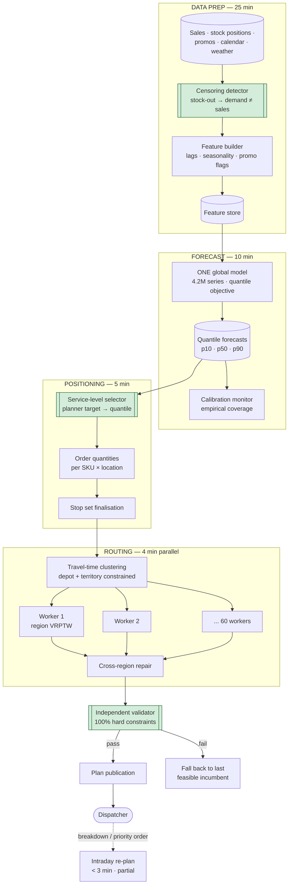

# 05 · HLD — Logistics: Demand Forecasting + Route Optimisation

> ← [`01_requirements.md`](01_requirements.md) · **Next:** [`03_lld.md`](03_lld.md) →
>
> **Three-sentence compression:** the forecast hands the optimiser **quantiles, not a point estimate**, so uncertainty becomes an explicit service-level choice rather than a silent stock-out · I rejected exact VRP (impossible at 25k stops) and per-series forecasting (4.2M fits, no cross-series learning) in favour of geographic decomposition and one global model · the failure mode I'd volunteer is demand censoring, where training on sales teaches the model to forecast the stock-out.

---

## 2.1 Architecture

Two chained stages inside one hard window. They are separated because their compute shapes are opposite: forecasting is **embarrassingly parallel over series**, routing is **combinatorially coupled within a region**.

Green boxes are the three decisions that make this design work: **censoring correction** (or the forecast is self-fulfilling), **service-level selection** (or uncertainty is discarded), **independent validation** (or a solver bug ships an illegal plan).

---

## 2.2 Component choices

| Concern | Choice | Why | Rejected alternative (and why not) | Revisit when |
|---|---|---|---|---|
| **Forecast model** | **ONE global model** over all 4.2M series (GBDT with quantile objective, or a global deep forecaster) | Cross-series learning is the whole win: a new SKU borrows seasonality from similar SKUs, a quiet location borrows from its cohort. One training run instead of 4.2M | **Per-series models** (ARIMA/ETS per series) — 4.2M fits is operationally absurd *and* worse, because each model sees only its own thin history. **One model per SKU** — better, still discards location structure | A series is genuinely idiosyncratic and high-value enough to warrant bespoke treatment (a handful, not thousands) |
| **Forecast output** | **Quantiles (p10/p50/p90)** via quantile/pinball loss | The optimiser needs the distribution to make a service-level trade-off. See [`01_requirements.md#a`](01_requirements.md#a-the-quantile-contract-between-the-two-stages) | **Point forecast + a global safety-stock multiplier** — the common approach, and wrong: it applies one uncertainty assumption to series with wildly different variances | Never. The quantile interface is the design |
| **Censoring handling** | **Right-censored likelihood**, with exclude-censored as a validation cross-check | Uses all data while modelling "demand ≥ observed sales". Censoring concentrates on high-demand days, so dropping them loses the most informative observations | **Train on raw sales** — self-fulfilling under-forecast with excellent measured accuracy, the silent killer. **Impute from peers** — model-on-model error | The two methods disagree materially, which would indicate the correction itself is wrong |
| **Routing formulation** | **VRPTW** (capacity + time windows + driver hours), solved per region | Matches the real constraint set. Feasibility is non-negotiable (FR-3) | **TSP per vehicle** — ignores assignment, which is the hard half. **Pure heuristic with no constraint model** — produces infeasible plans dispatchers reject | — |
| **Solve strategy** | **Geographic decomposition → 60 parallel regional solves → repair pass** | 25k stops × 800 vehicles is NP-hard and hopeless monolithically. Parallel decomposition takes ~90 min sequential down to ~4 min. **This is what makes the deadline** | **Monolithic exact solve** — computationally impossible at this size. **Monolithic metaheuristic** — ~90 min, misses the window. **Finer decomposition** (200 regions) — more parallelism but more boundary loss and a heavier repair pass | Regions become too small to route efficiently (< ~150 stops), or a solver advance makes larger regions tractable |
| **Solver type** | **Metaheuristic — LNS / guided local search — anytime-interruptible** | Reaches within ~8% of bound in ~90 s and can be stopped at any moment with a feasible incumbent (FR-17) | **Exact MIP** — optimal but unbounded runtime; the deadline is hard. **Greedy only** — fast, feasible, but 25–40% worse cost, which is real money daily | Instance sizes shrink enough for exact solving, or a commercial solver demonstrably beats it inside the window |
| **Clustering** | **Travel-time-based, depot- and territory-constrained** | Euclidean clustering produces plans dispatchers reject: clusters spanning depots, crossing rivers, or breaching territory agreements (FR-19) | **k-means on lat/lon** — the obvious choice and operationally naive. **Static territories** — stable but can't adapt to daily demand shifts | Territory agreements change, or the depot network is restructured |
| **Constraint validation** | **Independent validator, separate codebase from the solver** | Defence in depth. A solver bug that silently relaxes driver-hours is a legal exposure, not a cost inefficiency (FR-18) | **Trust the solver's internal feasibility** — the normal choice, and here the duplication is deliberate | Never remove |
| **Intraday re-plan** | **Partial re-solve of affected regions only, executed stops frozen** | A breakdown at 11:00 must not reshuffle deliveries already made. Bounded scope keeps it inside 3 min | **Full re-solve** — 4 min minimum and invalidates completed work. **Manual reassignment** — what happens today, and it's slow and poor | — |
| **LLM usage** | **None in the critical path.** Optional templated dispatcher explanation | Solvers are optimal here; an LLM would add cost, latency, and non-determinism to a solved problem. FR-5's explanation is better templated from solver output — deterministic and auditable | **LLM-generated plan explanations** — plausible-sounding narration of a deterministic artifact, with a hallucination risk for zero benefit. **LLM-assisted routing** — strictly worse than a solver | A genuinely conversational planner interface is required, and even then the LLM would sit *outside* the solve |
| **Compute** | **CPU only** — 16 vCPU forecast, 60 workers routing | Trees and metaheuristics are CPU work. Total ~$90/month | **GPU** — no benefit for this workload; a cost with no return | A deep global forecaster large enough to need GPU training |

---

## 2.3 Data flow, narrated

**Stage 0 — data prep (25 min).** Sales, stock positions, promotions, calendar, and weather land in the feature store. The **censoring detector** runs first and matters more than anything else here: for each SKU × location × day it determines whether stock reached zero and, if intraday positions are available, *when*. Days flagged as censored carry a "demand ≥ observed sales" marker rather than a demand value. Feature building then produces lags, rolling statistics, seasonality encodings, promotion flags, and cohort aggregates.

**Stage 1 — forecast (10 min).** A **single global model** scores all 4.2M series across a 14-day horizon at three quantiles = 12.6M predictions. This is batched and vectorised, so the wall-clock is dominated by data movement rather than arithmetic. The **calibration monitor** then checks empirical coverage: did actuals fall below p90 about 90% of the time historically? A miscalibrated spread is worse than a point estimate because it carries false precision (FR-13).

**Stage 2 — inventory positioning (5 min).** The **service-level selector** converts the planner's fill-rate target into a quantile per SKU class and location tier (FR-12), and that quantile — not the median — becomes the order quantity. This is the hop where the forecast's uncertainty is *spent*, deliberately and visibly. Order quantities aggregate into a stop set: which locations need a delivery, of what volume and weight.

**Stage 3 — routing (4 min).** Stops are **clustered on travel time** with depot and territory constraints as hard boundaries (FR-19), yielding ~60 regions of ~420 stops each. Each region is dispatched to a worker that runs a construction heuristic to a **feasible** plan within seconds, then improves it under a time budget, always retaining the best feasible incumbent (FR-17). The **repair pass** then reconsiders boundary stops that could be served more cheaply by a neighbouring region's vehicle.

**Stage 4 — validation and publication (5 min).** The **independent validator** re-checks every hard constraint from scratch: vehicle capacity, delivery time windows, driver hours-of-service, vehicle-site compatibility. A plan failing validation is rejected and the previous feasible incumbent is published instead — **never a plan that merely looks optimal**. Published plans carry the quantile used, the solver's cost, and the gap to the best-known bound so a dispatcher can see what they're getting.

**Intraday.** A breakdown or a priority order triggers a partial re-plan: executed stops are frozen, only the affected region(s) re-solve, and the result is validated identically. Bounding the scope is what keeps this inside 3 minutes.

---

## 2.4 NFR mapping

| NFR (from shared block) | Delivered by |
|---|---|
| **Optimisation wall-clock < 25 min** | Geographic decomposition into 60 parallel regional solves (~4 min vs ~90 min sequential) · anytime-interruptible solver |
| Forecast wall-clock < 90 min | One global model, batched inference over 4.2M series (~10 min) |
| **Plan feasibility 100%** | Feasible-first construction (FR-17) · **independent validator** (FR-18) · fall back to last feasible incumbent on validation failure |
| Solution quality within 8% of bound | LNS/GLS improvement under a per-region time budget; gap reported with every plan |
| Forecast accuracy WAPE ≤ 22% | Global model with cross-series learning · censoring correction (without which accuracy is illusory) |
| Pinball loss (p90) improves ≥ 15% | Quantile training objective, not point-loss with a bolted-on multiplier |
| Meet the dispatch deadline (FR-4) | 34 min of window headroom held specifically to absorb a non-converging solve, plus the interruptible guarantee |
| Availability 99.5% in-window | Batch with retry capacity; the real failure is *missing the window*, so headroom is the availability mechanism |
| Intraday re-plan < 3 min | Partial re-solve scoped to affected regions, executed stops frozen |
| Scale 4.2M series · 800 vehicles · 25k stops | One global model (series scale) · decomposition (stop scale) |

---

## 2.5 The window budget

Reproduced from the shared block with the reason for each allocation.

| Stage | Budget | Why this much |
|---|---|---|
| Data extraction + feature build | 25 min | Dominated by scanning history; censoring detection needs stock-position joins |
| Forecast inference (12.6M predictions) | 10 min | Batched; data movement bound, not compute bound |
| Inventory positioning / order quantities | 5 min | Quantile selection + aggregation |
| Stop-set finalisation | 5 min | Volume/weight consolidation, delivery-window assignment |
| **Routing (60 regions, parallel)** | **4 min** | ~90 s solve + coordination. **Sequentially this is ~90 min** |
| Cross-region repair | 2 min | Boundary stops only |
| **Independent validation** | 3 min | Full re-check of all hard constraints |
| Plan publication | 2 min | Distribution to dispatch and in-cab systems |
| **Total** | **~56 min** | Window 90 min ✅ **34 min headroom** |

> **The headroom exists for one specific scenario:** a region whose solve fails to converge, where we take the anytime incumbent and still need time to repair, validate, and publish. FR-4's "good-enough on time beats optimal late" is only meaningful if the schedule can actually absorb a bad solve — so the headroom *is* the requirement, not slack.

---

## 2.6 Failure modes and blast radius

| Failure | Detection | Blast radius | Mitigation / degraded mode |
|---|---|---|---|
| **A region's solve doesn't converge** | Per-region gap-to-bound at cut-off | One region's routes | Take the anytime feasible incumbent (FR-17). Plan is worse, not invalid. Log the region for offline tuning |
| **Validation fails on the assembled plan** | Independent validator | Whole plan | **Publish the previous feasible incumbent** (pre-repair). Never publish an unvalidated plan. Page immediately — a validator failure implies a solver bug |
| **Feature pipeline late** | Stage wall-clock vs budget | Whole plan | Fall back to the previous day's forecast with a decay adjustment, flagged as stale. A stale forecast beats no plan at the deadline |
| **Censoring detector unavailable** (stock history missing) | Missing stock-position join rate | Forecast quality, silently | Treat affected series as censored-unknown and **widen their quantile spread**. Do *not* silently train on raw sales — that's the self-fulfilling failure |
| **Travel-time matrix stale** | Matrix age; plan-vs-actual arrival deviation | All routes | Plans feasible on paper, late in reality. Alert on age; fall back to the last known-good matrix; escalate if deviation exceeds a band |
| **Quantiles miscalibrated** | Empirical coverage vs nominal (FR-13) | Service level everywhere | Recalibrate (conformal adjustment) rather than retrain mid-cycle; widen spreads as an interim safety measure |
| **Clustering produces an invalid region** (no compatible depot) | Cluster validation pre-solve | That region | Re-cluster with the constraint enforced; if unresolvable, merge into a neighbour and accept a larger instance |
| **Dispatch deadline missed** | Wall-clock alarm at 75% of window | Whole day's dispatch | Escalate to manual dispatch using yesterday's plan as a base. **This is the actual worst case** and the headroom exists to make it rare |
| **Intraday re-plan invalidates executed stops** | Frozen-stop assertion | Driver confusion, duplicate deliveries | Executed stops are immutable inputs to the re-solve; assertion hard-fails rather than producing a conflicting plan |
| **Demand shock** (weather event, viral demand) | Forecast residual monitor | Under-supply | Quantile spread widens naturally if the model saw similar history; otherwise planner override on service level for affected regions |

---

## 2.7 Scale plan

| | What breaks first | Why | What I'd change |
|---|---|---|---|
| **10×** (250k stops, 8,000 vehicles) | **The repair pass and coordination overhead** | Regional solves stay parallel and fine, but with ~600 regions the boundary-stop count grows and the sequential repair pass becomes the bottleneck | Hierarchical decomposition: cluster regions into super-regions, repair within super-regions in parallel, then a light top-level pass. Also push more boundary handling into the regional solves via overlapping margins |
| **10×** (secondary) | Feature-build scan cost | 42M series × 14 horizons over multi-week windows | Incremental feature materialisation (maintain rolling aggregates rather than rescanning); partition by `(date, location_bucket)` |
| **100×** (2.5M stops) | **The window itself** | Even perfectly parallel, data movement and coordination exceed 90 minutes; and 60 → 6,000 workers is a scheduling problem of its own | Move to **continuous planning**: maintain a rolling plan updated incrementally as orders arrive, rather than a nightly batch. This is a different system, and naming the trigger matters more than pretending the batch scales |
| **100×** (secondary) | Forecast model capacity | One global model over 420M series may underfit the tail | Hierarchical models — a global backbone plus cohort-level heads — and drop to weekly granularity for long-tail SKUs where daily forecasts carry no signal |

**What does not break:** the quantile interface (a contract, not a bottleneck), the independent validator (linear in stops), and per-region solve times (bounded by region size, which we control). **Naming what doesn't break keeps the scale conversation on the real constraint** — here, the fixed window.

---

> ← [`01_requirements.md`](01_requirements.md) · **Next:** [`03_lld.md`](03_lld.md) →
