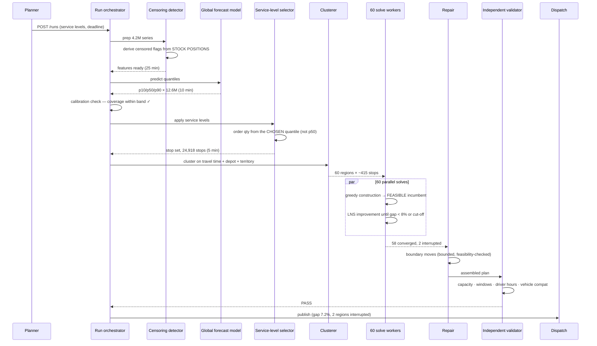
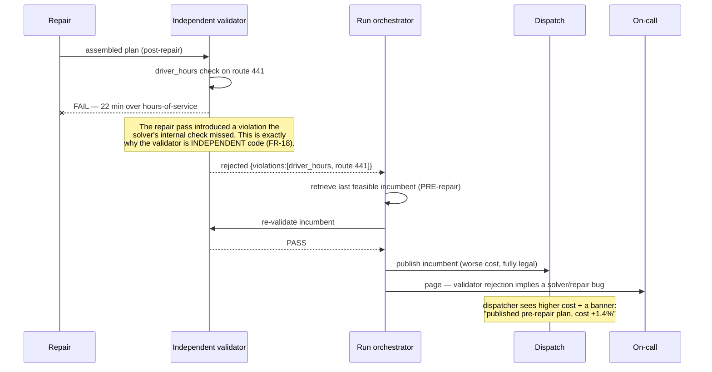
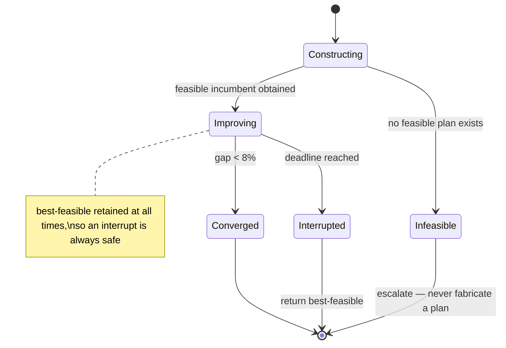

# 05 · LLD — Logistics: Demand Forecasting + Route Optimisation

> ← [`02_hld.md`](02_hld.md) · **Next:** [`04_production_and_interview.md`](04_production_and_interview.md) →

---

## 3.1 Data models

### Demand history with censoring

```sql
CREATE TABLE demand_history (
    sku_id           INT         NOT NULL,
    location_id      INT         NOT NULL,
    business_date    DATE        NOT NULL,
    units_sold       INT         NOT NULL,
    -- CENSORING: the three columns that stop the forecast being self-fulfilling
    stockout_flag    BOOLEAN     NOT NULL,      -- stock reached zero at any point
    stockout_from    TIME,                      -- when, if intraday positions exist
    censored         BOOLEAN     NOT NULL,      -- treat target as "demand >= units_sold"
    opening_stock    INT         NOT NULL,
    closing_stock    INT         NOT NULL,
    replenished      INT         NOT NULL,
    promo_id         INT,
    price_minor      BIGINT      NOT NULL,
    PRIMARY KEY (business_date, location_id, sku_id)
) PARTITION BY RANGE (business_date);

CREATE INDEX idx_dh_series ON demand_history (sku_id, location_id, business_date DESC);
CREATE INDEX idx_dh_censored ON demand_history (sku_id, location_id)
    WHERE censored = true;   -- partial: censoring-rate reporting per series (FR-16)
```

> **`censored` is derived from stock positions, never inferred from the shape of sales.** Inferring it ("sales look flat, probably a stock-out") produces both false positives on genuinely flat demand and false negatives when a stock-out coincides with low demand. The stock-position join is the ground truth, which is why intraday stock history is a named open question.

### Quantile forecasts (the interface between stages)

```sql
CREATE TABLE forecasts (
    run_id           UUID        NOT NULL,
    sku_id           INT         NOT NULL,
    location_id      INT         NOT NULL,
    target_date      DATE        NOT NULL,
    horizon_days     SMALLINT    NOT NULL,      -- 1..14
    -- The DISTRIBUTION. A row without these is rejected at the boundary (FR-11).
    p10              REAL        NOT NULL,
    p50              REAL        NOT NULL,
    p90              REAL        NOT NULL,
    -- confidence qualifiers the optimiser and planner both need
    censoring_rate   REAL        NOT NULL,      -- fraction of this series' history censored
    history_days     INT         NOT NULL,      -- how much history backed this forecast
    low_confidence   BOOLEAN     NOT NULL,      -- censoring_rate > 0.3 OR history < 90 d
    model_version    TEXT        NOT NULL,
    PRIMARY KEY (run_id, target_date, location_id, sku_id),
    CONSTRAINT quantiles_ordered CHECK (p10 <= p50 AND p50 <= p90)
);
CREATE INDEX idx_fc_lookup ON forecasts (run_id, location_id, target_date);
```

The `CHECK` constraint is not decoration — **quantile crossing** (p10 > p50) is a real and common failure of independently-fitted quantile models, and it produces nonsense downstream. Catching it at the database is cheaper than debugging a router that loaded a negative safety stock.

### Calibration tracking (FR-13)

```sql
CREATE TABLE calibration_observations (
    target_date      DATE        NOT NULL,
    sku_class        TEXT        NOT NULL,
    location_tier    TEXT        NOT NULL,
    horizon_days     SMALLINT    NOT NULL,
    n_observations   INT         NOT NULL,
    -- empirical coverage: how often did actual fall below each nominal quantile?
    below_p10_rate   REAL        NOT NULL,      -- should be ≈ 0.10
    below_p50_rate   REAL        NOT NULL,      -- should be ≈ 0.50
    below_p90_rate   REAL        NOT NULL,      -- should be ≈ 0.90
    pinball_p90      REAL        NOT NULL,
    PRIMARY KEY (target_date, sku_class, location_tier, horizon_days)
);
```

> A p90 whose empirical coverage is 0.70 is **worse than a point forecast**, because the planner believes they bought 90% service and bought 70%. Tracking coverage by class and horizon (not globally) matters, because calibration typically degrades at longer horizons and on low-volume series.

### Stops, vehicles, plans

```sql
CREATE TABLE stops (
    run_id           UUID        NOT NULL,
    stop_id          UUID        NOT NULL,
    location_id      INT         NOT NULL,
    volume_cm3       BIGINT      NOT NULL,
    weight_g         BIGINT      NOT NULL,
    window_start     TIMESTAMPTZ NOT NULL,      -- hard time window
    window_end       TIMESTAMPTZ NOT NULL,
    service_time_s   INT         NOT NULL,      -- unload duration at this stop
    depot_id         INT         NOT NULL,      -- constrains clustering (FR-19)
    territory_id     INT         NOT NULL,
    vehicle_class_req TEXT,                     -- access restrictions
    quantile_used    REAL        NOT NULL,      -- WHICH service level produced this volume
    priority         SMALLINT    NOT NULL DEFAULT 0,
    PRIMARY KEY (run_id, stop_id)
);
CREATE INDEX idx_stops_cluster ON stops (run_id, depot_id, territory_id);

CREATE TABLE plans (
    plan_id          UUID PRIMARY KEY,
    run_id           UUID        NOT NULL,
    created_at       TIMESTAMPTZ NOT NULL DEFAULT now(),
    status           TEXT        NOT NULL,      -- solving | validated | published
                                                -- | rejected | superseded
    total_cost       NUMERIC(14,2) NOT NULL,
    gap_to_bound     REAL,                      -- solution quality, shown to dispatchers
    regions_solved   INT         NOT NULL,
    regions_interrupted INT      NOT NULL,      -- how many took the anytime incumbent
    validation_result JSONB      NOT NULL,
    solver_version   TEXT        NOT NULL,
    forecast_run_id  UUID        NOT NULL       -- full lineage: plan → forecast → data
);

CREATE TABLE routes (
    plan_id          UUID        NOT NULL,
    route_id         UUID        NOT NULL,
    vehicle_id       INT         NOT NULL,
    driver_id        INT,
    region_id        INT         NOT NULL,
    sequence         JSONB       NOT NULL,      -- ordered [{stop_id, eta, load_after}]
    total_distance_m BIGINT      NOT NULL,
    total_duration_s INT         NOT NULL,
    capacity_used_pct REAL       NOT NULL,
    slack_s          INT         NOT NULL,      -- buffer against time-window breach
    PRIMARY KEY (plan_id, route_id)
);
```

`regions_interrupted` is operationally important: it says how much of today's plan is a best-effort incumbent rather than a converged solve. A dispatcher seeing 18 of 60 regions interrupted knows to expect a rougher day, and a persistent rise is the signal to retune region size.

---

## 3.2 API contracts

### Trigger a planning run

```http
POST /v1/planning/runs
Authorization: Bearer <jwt>            # role: planner
Content-Type: application/json

{
  "business_date": "2026-09-02",
  "service_levels": {                  # FR-12: quantile per class/tier
    "default": 0.95,
    "by_sku_class": {"perishable": 0.90, "critical_pharma": 0.99},
    "by_location_tier": {"tier_1": 0.97}
  },
  "deadline_at": "2026-09-01T22:30:00Z",
  "allow_stale_forecast": false
}

202 {"run_id":"…","stages":["prep","forecast","positioning","routing","validation"],
     "deadline_at":"…","estimated_completion":"2026-09-01T21:56:00Z"}
409 a run for this business_date is already in progress
422 service level outside [0.50, 0.999]
```

### Run status (what a dispatcher actually watches)

```http
GET /v1/planning/runs/{run_id}
200 {
  "status":"routing",
  "deadline_at":"2026-09-01T22:30:00Z",
  "time_remaining_s": 1580,
  "stages":{
    "prep":{"status":"done","duration_s":1402},
    "forecast":{"status":"done","duration_s":588,
                "calibration_warning":null},
    "positioning":{"status":"done","duration_s":271},
    "routing":{"status":"running","regions_total":60,"regions_done":47,
               "regions_interrupted":2,"current_gap_pct":6.8}
  },
  "will_meet_deadline": true            # projection, not a guess after the fact
}
```

`will_meet_deadline` is a live projection from observed per-stage durations. Surfacing it *during* the run is what lets a planner intervene (lower the quality target, accept a stale forecast) **before** the deadline passes rather than discovering the miss afterwards.

### Publish / retrieve a plan

```http
POST /v1/planning/runs/{run_id}/publish
Idempotency-Key: <uuid>

200 {"plan_id":"…","routes":812,"stops":24_918,
     "total_cost":1_284_400.50,"gap_to_bound_pct":7.2,
     "regions_interrupted":2,
     "validation":{"capacity":"pass","time_windows":"pass",
                   "driver_hours":"pass","vehicle_compat":"pass"}}

409 {"error":"validation_failed",
     "violations":[{"type":"driver_hours","route_id":"…","excess_minutes":22}],
     "action":"previous_incumbent_published","published_plan_id":"…"}
       # NEVER publishes an invalid plan; falls back and says so

422 {"error":"no_feasible_plan"}       # even construction failed — escalate to manual
```

### Intraday re-plan

```http
POST /v1/planning/plans/{plan_id}/replan
{
  "reason": "vehicle_breakdown",
  "affected": {"vehicle_ids":[4471]},
  "frozen_stops": ["stop-uuid-1","stop-uuid-2"],   # already delivered — IMMUTABLE
  "new_stops": [],
  "deadline_s": 180
}

200 {"plan_id":"…","regions_resolved":[12,13],
     "stops_reassigned":37,"frozen_respected":true,
     "cost_delta":18_400.00}
409 frozen stop appears in a reassignment  # assertion tripped — hard failure, not a warning
422 no feasible reassignment within the deadline → manual dispatch required
```

---

## 3.3 Core algorithms

### Censoring-aware training target

```python
def build_training_rows(series: list[DemandRow]) -> list[TrainRow]:
    """The single most important function in the forecast pipeline.
       Training on raw `units_sold` produces a SELF-FULFILLING under-forecast:
       forecast low -> supply low -> stock out -> observe low -> confirmed."""
    out = []
    for r in series:
        if r.censored:
            # We know demand was AT LEAST units_sold. Right-censored observation.
            out.append(TrainRow(target=r.units_sold, censored=True,
                                lower_bound=r.units_sold, upper_bound=None))
        else:
            out.append(TrainRow(target=r.units_sold, censored=False,
                                lower_bound=r.units_sold, upper_bound=r.units_sold))
    return out


def detect_censoring(day: DemandRow, intraday: list[StockObs] | None) -> tuple[bool, time | None]:
    """Derived from STOCK POSITIONS, never inferred from the shape of sales."""
    if day.closing_stock > 0 and not any(o.qty == 0 for o in (intraday or [])):
        return (False, None)                       # never ran out
    if intraday:
        first_zero = next((o.at for o in intraday if o.qty == 0), None)
        if first_zero is None:
            return (False, None)
        # Censored only if the stock-out happened while demand was still arriving.
        return (first_zero < day.close_time, first_zero)
    # No intraday data: closing zero is a WEAKER signal — flag but mark uncertain.
    return (day.closing_stock == 0 and day.replenished == 0, None)
```

### Quantile forecast with confidence qualification

```python
LOW_CONF_CENSOR_RATE = 0.30
LOW_CONF_HISTORY_D   = 90

def forecast_series(sku: int, loc: int, run: RunCtx) -> list[Forecast]:
    feats = features.fetch(sku, loc, run.as_of)
    hist  = feats.history_days
    crate = feats.censoring_rate

    # ONE global model, three quantile heads (or a quantile objective).
    q = global_model.predict_quantiles(feats.vector(), horizons=range(1, 15),
                                       quantiles=(0.10, 0.50, 0.90))

    low_conf = (crate > LOW_CONF_CENSOR_RATE) or (hist < LOW_CONF_HISTORY_D)

    out = []
    for h in range(1, 15):
        p10, p50, p90 = q[h]

        # Repair quantile CROSSING before it reaches the optimiser.
        p10, p50, p90 = sorted((p10, p50, p90))

        if low_conf:
            # Widen the spread rather than hiding uncertainty behind a confident median.
            spread = p90 - p10
            p10 = max(0.0, p10 - 0.25 * spread)
            p90 = p90 + 0.25 * spread

        out.append(Forecast(sku, loc, h, p10, p50, p90,
                            censoring_rate=crate, history_days=hist,
                            low_confidence=low_conf))
    return out
```

### Service-level selection (where uncertainty is spent)

```python
def order_quantity(fc: Forecast, target_fill: float, sku_class: str,
                   location_tier: str) -> int:
    """THE hop where the forecast's distribution becomes a decision.
       Using fc.p50 here would discard the entire point of the quantile interface."""
    level = service_levels.resolve(target_fill, sku_class, location_tier)

    # Interpolate the requested quantile from the three we carry.
    if level <= 0.50:
        q = interp(level, (0.10, fc.p10), (0.50, fc.p50))
    else:
        q = interp(level, (0.50, fc.p50), (0.90, fc.p90))
        if level > 0.90:
            # Extrapolate beyond p90 using the upper spread, conservatively.
            q = fc.p90 + (fc.p90 - fc.p50) * ((level - 0.90) / 0.10)

    return max(0, ceil(q))
```

### Anytime VRPTW solve (FR-17)

```python
def solve_region(region: Region, deadline_ms: int) -> Solution:
    """Two invariants:
       1. A FEASIBLE solution exists within seconds (the availability mechanism).
       2. The best-feasible incumbent is retained at all times, so an interrupt
          at ANY moment yields a valid plan."""
    t0 = now_ms()

    # PHASE 1 — construction. Must produce FEASIBLE, not good.
    incumbent = greedy_insertion(region)          # ~5-10 s
    if incumbent is None:
        return Solution.infeasible(region)        # escalate; do not fake a plan
    assert validator.check(incumbent).ok          # feasibility is the contract

    best = incumbent
    # PHASE 2 — improvement, monotone on the best-feasible.
    while now_ms() - t0 < deadline_ms:
        cand = large_neighbourhood_search_step(best, region)
        if cand is None:
            continue
        if not validator.check(cand).ok:
            continue                              # never accept an infeasible candidate
        if cand.cost < best.cost:
            best = cand
        if best.gap_to_bound() < 0.08:            # quality target met — stop early
            break

    return best   # interrupt-safe by construction
```

### Cross-region repair (bounded)

```python
MAX_REPAIR_MOVES = 500          # bounded work: the repair pass is on the critical path

def repair_boundaries(sols: dict[int, Solution], adj: RegionAdjacency) -> dict[int, Solution]:
    """Only boundary stops, only if BOTH affected regions stay feasible."""
    moves = 0
    for a, b in adj.pairs():
        for stop in boundary_stops(sols[a], sols[b]):
            if moves >= MAX_REPAIR_MOVES:
                return sols
            cand_a, cand_b = try_move(stop, sols[a], sols[b])
            if cand_a is None or cand_b is None:
                continue
            if not (validator.check(cand_a).ok and validator.check(cand_b).ok):
                continue                                   # feasibility first, always
            if cand_a.cost + cand_b.cost < sols[a].cost + sols[b].cost:
                sols[a], sols[b] = cand_a, cand_b
                moves += 1
    return sols
```

---

## 3.4 Sequence diagrams

### Happy path — nightly run



### Failure path — validation rejects the plan

**The path that matters**, because it's the one that decides whether an illegal plan reaches drivers.



---

## 3.5 State machines

### Planning run

```mermaid
stateDiagram-v2
    [*] --> Prep
    Prep --> Forecast
    Prep --> StaleFallback: prep overran budget
    Forecast --> Positioning
    Forecast --> StaleFallback: forecast overran
    StaleFallback --> Positioning: previous forecast + decay, flagged
    Positioning --> Routing
    Routing --> Repair: all regions returned (converged or interrupted)
    Repair --> Validating
    Validating --> Published: pass
    Validating --> IncumbentPublished: fail → fall back pre-repair
    Validating --> ManualEscalation: incumbent also invalid
    Routing --> DeadlineMissed: wall-clock alarm
    DeadlineMissed --> ManualEscalation
    Published --> Superseded: intraday re-plan
    IncumbentPublished --> Superseded
    ManualEscalation --> [*]
    Published --> [*]
    note right of ManualEscalation: yesterday's plan as a base;\nthe genuine worst case
```



### Region solve



---

## 3.6 Edge cases and correctness

| Edge case | Handling | Why |
|---|---|---|
| **Quantile crossing** (p10 > p50) | Sorted before persistence; `CHECK` constraint as a backstop | Independently-fitted quantiles cross routinely and produce nonsense downstream |
| **New SKU, no history** | Cohort-based forecast from similar SKUs; `low_confidence` set; spread widened | Cold start is normal in retail; a confident median from no history is the failure |
| **Series with > 30% censored history** | Flagged low-confidence, spread widened (FR-16) | Its history systematically understates demand, so the model's certainty is unjustified |
| **No intraday stock data** | Closing-zero used as a weaker censoring signal, marked uncertain | Better than ignoring censoring; honest about being weaker |
| **Zero demand vs zero stock** | Distinguished via `opening_stock`; zero demand with stock is a real zero, zero sales with no stock is censored | Conflating them is the core censoring error |
| **Stop volume exceeds any vehicle** | Split into multiple stops at positioning time, before clustering | The solver cannot fix an infeasible stop; it must never see one |
| **Time window narrower than service time** | Rejected at stop-set finalisation with an explicit error | Guaranteed infeasible; failing early beats a solver spinning on it |
| **Region with no compatible depot** | Re-cluster with the constraint enforced; merge into a neighbour if unresolvable | FR-19; a cluster with no valid vehicle assignment is not a routing problem |
| **All regions interrupted** | Publish the assembled incumbents; alarm loudly; retune region size | Plan is valid but poor — visible, not silent |
| **Construction infeasible for a region** | Escalate; **never** publish a partial plan silently | An unserved region must be a human decision |
| **Repair introduces a violation** | Independent validator catches it; fall back to pre-repair plan | The scenario in §3.4; the reason validation is independent |
| **Executed stop appears in an intraday reassignment** | Assertion hard-fails the re-plan | A driver being sent to an already-delivered stop is worse than no re-plan |
| **Stale travel-time matrix** | Age monitored; last-known-good used; deviation alarm | Plans feasible on paper and late in reality are the insidious version |
| **Deadline missed** | Escalate to manual dispatch with yesterday's plan as a base | The genuine worst case; headroom exists to make it rare |
| **Forecast run and plan lineage** | `plans.forecast_run_id` links plan → forecast → data version | "Why did we under-supply on the 2nd?" must be answerable |
| **Planner sets service level to 0.999** | Accepted, extrapolated beyond p90 conservatively, cost impact surfaced | Their call, but the inventory consequence must be visible before they commit |

---

> ← [`02_hld.md`](02_hld.md) · **Next:** [`04_production_and_interview.md`](04_production_and_interview.md) →
