# 05 — Logistics: Demand Forecasting + Route Optimisation

> **Archetype E · Forecast + optimise.** Two hard problems chained, where the first one's *uncertainty* must survive into the second.

---

## The three-sentence compression

1. **The choice that matters most:** the forecast passes **quantiles** to the optimiser, not a point estimate. A point forecast tells the router the expected demand and nothing about the risk, so the router optimises confidently against a number that is wrong. Quantiles let the optimiser make an explicit service-level-versus-cost trade-off.
2. **The alternative I rejected:** solving the Vehicle Routing Problem exactly, and separately, per-series forecasting. Exact VRP at 25,000 stops is computationally impossible; per-series models mean 4.2M fits with no cross-series learning. Both replaced by **geographic decomposition** (60 parallel regional solves) and **one global forecasting model**.
3. **The failure mode I'd volunteer:** **demand censoring.** Observed sales are not demand when stock-outs occurred, so training on sales teaches the model to forecast the stock-out. It is the most common silent error in retail forecasting and it looks like good accuracy right up until you act on it.

---

## Architecture at a glance

```mermaid
flowchart LR
    subgraph F["FORECAST — 90 min window"]
        H[(History · sales, stock,<br/>promos, calendar)] --> UNC[Uncensoring<br/>stock-out correction]
        UNC --> GM[ONE global model<br/>4.2M series]
        GM --> Q[(Quantiles p10/p50/p90<br/>NOT a point estimate)]
    end
    subgraph O["OPTIMISE — 25 min hard deadline"]
        Q --> SL[Service-level selection<br/>planner picks the quantile]
        SL --> STOPS[Stop set]
        STOPS --> CLU[Geographic clustering<br/>≈60 regions]
        CLU --> SOLVE[60 parallel VRPTW solves<br/>anytime · interruptible]
        SOLVE --> REP[Cross-region repair]
        REP --> VAL[[Hard-constraint validation<br/>100% feasible or reject]]
    end
    VAL --> DISP([Dispatcher])
    DISP -.->|disruption| RE[Intraday re-plan < 3 min]
```

---

## Key numbers

| | |
|---|---|
| Scale | 2,000 SKUs × 150 locations × 14 days = **4.2M series** · 800 vehicles · 25k stops/day |
| **The binding constraint** | **The dispatch deadline** — 90 min total window, not latency |
| Window arithmetic | Forecast 10 min · **routing 4 min (parallel)** · total ~56 min ✅ 34 min headroom |
| Routing, if sequential | **90 min** ❌ — parallel decomposition *is* what makes the deadline |
| Plan feasibility | **100%** — an infeasible plan is worse than no plan |
| Solution quality | Within 8% of best-known bound |
| **Total cost** | **~$90/month** — the cheapest system in the folder and the hardest design |
| LLM in critical path | **None**, deliberately |

---

## Files

| File | Contents |
|---|---|
| [`01_requirements.md`](01_requirements.md) | The quantile contract, demand censoring, the anytime-interruptible requirement, clustering realism |
| [`02_hld.md`](02_hld.md) | Architecture, component choices with rejected alternatives, data flow, NFR mapping, failure modes, scale plan |
| [`03_lld.md`](03_lld.md) | Schemas, API contracts, forecasting + VRPTW algorithms, sequence diagrams, state machines, edge cases |
| [`04_production_and_interview.md`](04_production_and_interview.md) | AI-specific concerns, runbook, common mistakes, interview follow-ups, glossary |

**Shared requirements block:** [`../00_requirements_all_systems.md#5-logistics--demand-forecasting--route-optimisation`](../00_requirements_all_systems.md#5-logistics--demand-forecasting--route-optimisation)

---

## The two findings to leave with

1. **Cost and engineering difficulty are uncorrelated.** This system costs ~$90/month and is the hardest design in the folder. Reaching for an LLM here would add expense, latency, and non-determinism to a problem that solvers handle optimally — being able to say *why not* is the signal.
2. **Uncertainty must survive the handoff between models.** Flattening a distribution to its mean at a system boundary is the quiet mistake, and it's invisible in both components' own metrics — the forecast looks accurate and the router looks optimal, while the combined system systematically under-serves.
