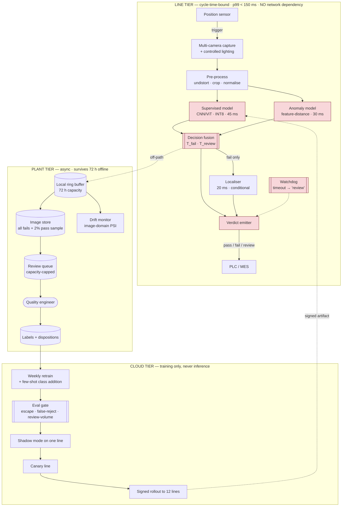

# 06 · HLD — Manufacturing: CV Quality Inspection

> ← [`01_requirements.md`](01_requirements.md) · **Next:** [`03_lld.md`](03_lld.md) →
>
> **Three-sentence compression:** inference is on-prem per line because duty cycle inverts the build-vs-rent decision (~$2.7k/month owned vs ~$210k/month rented) and FR-4 forbids network dependence · I rejected a purely supervised classifier because defects are rare and open-ended, running an anomaly model **in parallel** so it costs nothing · the failure mode I'd volunteer is that escape rate and false-reject rate are in direct tension, and the `review` class resolves it at the cost of a 3% human-capacity ceiling.

---

## 2.1 Architecture

Three tiers, separated by their binding constraint: **cycle time** (line), **durability** (plant), **training** (cloud). Note that the line tier has *no* runtime dependency on the other two.

Red boxes are inside the **cycle-time budget**. Everything else is explicitly off-path, which is what lets the line keep running through a plant-network outage.

---

## 2.2 Component choices

| Concern | Choice | Why | Rejected alternative (and why not) | Revisit when |
|---|---|---|---|---|
| **Inference location** | **On-premises edge box, one per line** | FR-4 forbids network dependence; FR-17 keeps inference in-plant. And the duty-cycle arithmetic makes owning ~75× cheaper than renting ([`01_requirements.md#c`](01_requirements.md#c-the-build-versus-rent-arithmetic)) | **Cloud inference** — ~$210k/month *and* violates FR-4; a WAN blip would stop 12 production lines. **Shared plant-level box** — one failure stops all lines, and network hops eat the budget | Cycle time relaxes to seconds *and* the plant network becomes carrier-grade redundant — i.e. essentially never |
| **Model pair** | **Supervised classifier + anomaly detector, run in parallel** | Defects are rare *and* open-ended. Supervised gives class labels for root-cause work; anomaly catches unseen modes. Parallel ⇒ the anomaly model is latency-free | **Supervised only** — cannot detect a defect class it has never seen, which is the common case on tooling change. **Anomaly only** — detects *that* something is odd but not *what*, so root-cause work stalls. **Series execution** — adds 30 ms to every unit and threatens the budget | A defect taxonomy genuinely closes (rare in manufacturing) |
| **Anomaly method** | **Feature-space distance to the normal manifold** (embedding + kNN/Mahalanobis) | Good units are abundant and consistent, so the normal distribution is well characterised. Fast, and its score is interpretable as a distance | **Autoencoder reconstruction error** — viable, but blurs fine texture defects and is slower to tune. **GAN-based** — heavier, unstable to train, no benefit here | Defects appear as *structural* rather than appearance anomalies |
| **Supervised backbone** | **Compact CNN/ViT, INT8 quantised** | 45 ms on an edge GPU with margin; quantisation is the difference between fitting and not fitting the budget | **Large backbone at FP16** — better accuracy, exceeds the budget, which stops the line. **Classical CV (thresholds, blob analysis)** — fast and brittle; fails on lighting/texture variation | A faster accelerator or a distilled model buys headroom for a larger backbone |
| **Localisation** | **Conditional — only on `fail`** (~2% of units) | Paying 20 ms on 2% of units rather than 100% is the difference between a 100 ms and a 120 ms typical path | **Always localise** — 20 ms × every unit, wasted on passes. **Never localise** — engineers can't do root-cause work from a bare verdict | Localisation gets cheap enough to run unconditionally |
| **Decision output** | **Three-way: pass / fail / review** | The only way to satisfy two conflicting NFRs (escape ≤ 0.2%, false reject ≤ 1.5%) — see [`01_requirements.md#a`](01_requirements.md#a-why-the-output-is-three-way-not-binary) | **Binary** — forces one threshold to serve two irreconcilable targets; either escapes or scrap goes out of budget | Never. This is the structural resolution |
| **Timeout behaviour** | **Watchdog emits `review`** | The line must keep moving (FR-19). `review` preserves both quality targets; `pass` risks an escape; `fail` turns a timeout storm into a scrap storm | **Stall until inference completes** — stops production, the one outcome worse than a wrong verdict | If review capacity is the binding scarcity and timeouts become common — but then fix the timeouts |
| **Image retention** | **All fails + 2% random pass sample** | 100% retention is ~$18k/month of storage for data almost never read. Fails are needed for review and retraining; a pass sample anchors drift monitoring and gives negatives | **Retain everything** — unaffordable at 3.46M units/day. **Fails only** — no negatives for retraining, and no drift baseline | Storage cost falls materially, or a regulator requires full retention |
| **Model rollout** | **Shadow → canary line → fleet, signed artifacts** | A bad model deployed to 12 lines simultaneously scraps good product at line rate. Shadow mode scores without acting, which is free validation on live data | **Direct fleet deploy** — the blast radius is 12 lines × 5 units/s. **Manual per-line updates** — drifts out of sync, and version skew makes escapes untraceable | — |
| **Drift detection** | **Image-domain statistics vs a per-line baseline** | Lens contamination, lighting ageing, and fixture drift degrade accuracy before any label reveals it. This is the **fast** signal | **Wait for escape reports** — a feedback loop measured in weeks of shipped product | — |
| **Traceability store** | **Verdict + score + model version per unit serial, all units** | Warranty and recall obligations require answering "what did inspection say about this serial" (FR-6). Verdict rows are tiny even at 3.46M/day | **Store verdicts only for fails** — makes a recall investigation impossible for units that passed | — |

---

## 2.3 Data flow, narrated

**The line path** (everything inside 150 ms):

1. **A position sensor triggers** capture as the unit reaches the inspection station. Multi-camera with controlled lighting — *controlled* matters, because uncontrolled ambient light is the largest source of the domain drift this system suffers from.
2. **Pre-processing** undistorts, crops to the region of interest using fixture geometry, and normalises. Fixed-shape tensors throughout: dynamic shapes would introduce allocation variance into a p99-bounded path.
3. **The supervised model and the anomaly model run in parallel.** This is the design decision that makes open-ended defect detection free — in series the anomaly model would cost 30 ms on every unit.
4. **Decision fusion** combines both scores against `T_fail` and `T_review`. Either model can escalate: a high supervised class score, *or* a high anomaly distance with no matching class, both route to `fail` or `review`. The fusion rule is deliberately asymmetric — the anomaly model can send a unit to `review` but never to `fail`, because "unfamiliar" is not the same as "defective".
5. **Localisation runs only on `fail`** (~2% of units), producing a mask or box for the engineer's root-cause work.
6. **The verdict is emitted to the PLC/MES**, which decides what physically happens. We advise; the line controls — keeping this system out of machine-safety scope.
7. **A watchdog** guarantees a verdict inside budget. On timeout it emits `review` (FR-19), so the line never stalls waiting for us.
8. **Everything durable is off-path**: image and telemetry writes go to a local ring buffer, fire-and-forget. The line tier has no runtime dependency on the plant or cloud tiers, which is how FR-4's 72-hour offline requirement is met.

**The plant path:** the ring buffer drains to the image store (all fails, 2% of passes). Fails and reviews enter a **capacity-capped queue** for the quality engineer, whose dispositions become labels. The drift monitor computes image-domain statistics per line against that line's own baseline — per-line, because each station has its own lighting and lens history.

**The cloud path:** weekly retraining consumes accumulated dispositions, including **few-shot addition of new defect classes** (FR-15). The eval gate blocks promotion on any regression in escape rate, false-reject rate, *or* review volume — all three, because improving one at the expense of another is not an improvement. Passing models go to shadow mode on one line (scoring without acting), then a canary line, then the fleet, as signed artifacts.

---

## 2.4 NFR mapping

| NFR (from shared block) | Delivered by |
|---|---|
| **Inference p99 < 150 ms** | Latency budget §2.5 (~100 ms typical) · INT8 quantisation · parallel anomaly model · conditional localisation · fixed tensor shapes · watchdog |
| Throughput 5 units/s × 12 lines | One dedicated edge box per line; no shared bottleneck |
| **Escape rate ≤ 0.2%** | Two-model fusion (anomaly catches unseen modes) · `T_review` tuned against escape feedback (FR-16) |
| **False reject ≤ 1.5%** | `T_fail` set conservatively; ambiguous units go to `review` rather than scrap |
| **Review queue ≤ 3%** | `T_review` sized to capacity · auto-tightening when volume exceeds it (FR-12) |
| Availability 99.9% per line | Independent per-line boxes · on-site spare with documented swap (FR-18) · watchdog prevents stalls |
| **Offline ≥ 72 h** | Line tier has no runtime dependency on plant/cloud · 72 h local ring buffer · models resident locally |
| Model update ≤ weekly, staged | Signed artifacts · shadow → canary → fleet |
| Image retention | All fails + 2% pass sample, 2 years |
| Traceability 100% | Verdict + score + model version persisted per unit serial |

---

## 2.5 Latency budget (per unit, p99)

| Stage | Budget | Why this much |
|---|---|---|
| Trigger + multi-camera capture | 25 ms | Sensor latency + exposure + transfer |
| Pre-processing | 15 ms | Undistort, crop, normalise; fixed shapes |
| **Supervised model** | **45 ms** | Compact backbone, INT8, edge GPU |
| Anomaly model | 30 ms *(overlapped)* | Parallel with supervised — **costs nothing** |
| Decision fusion | 5 ms | Threshold comparison |
| Localisation | 20 ms *(conditional, ~2%)* | Only on `fail` |
| Verdict emit to PLC | 10 ms | Fieldbus write |
| Image/telemetry write | **0 ms** | **Off-path**, fire-and-forget to ring buffer |
| **Typical total** | **~100 ms** | Cycle 200 ms, SLO 150 ms ✅ **50 ms headroom** |
| **Failing unit total** | **~120 ms** | ✅ still inside |

> **The headroom is for thermal throttling and camera retries**, not slack. An edge box in a plant runs hot; sustained throttling can cost 20–30% of inference throughput, and FR-20 requires that this degrades *accuracy* (switch to a smaller model) rather than latency — because slower inference stops the line while a slightly worse model does not.

---

## 2.6 Failure modes and blast radius

| Failure | Detection | Blast radius | Mitigation / degraded mode |
|---|---|---|---|
| **Inference exceeds budget** | Watchdog timer | One unit | Emit `review` (FR-19). Line keeps moving. Sustained timeouts → switch to the smaller model tier |
| **Edge box hardware failure** | Heartbeat loss from that line | **One line** | On-site spare, documented swap (FR-18). Meanwhile that line either stops inspecting (with a manual sampling fallback) or stops — a plant decision, pre-agreed, not improvised during the incident |
| **Plant network outage** | Upload failure rate | Nothing on the line | Line tier is independent by design; ring buffer holds 72 h. **The system's most important non-failure** |
| **Camera fouling / lens contamination** | Image-domain drift monitor | That line's accuracy, silently | This is the classic silent degradation: accuracy falls with no error and no alarm from the model itself. Drift monitor catches it days before escapes surface; triggers a cleaning work order |
| **Lighting degradation** (LED ageing) | Same drift monitor, brightness/contrast statistics | That line's accuracy | Scheduled recalibration; per-line baselines make gradual drift visible |
| **New defect mode appears** (supplier change) | Anomaly-score distribution shift; review-queue composition | Potential escapes of that mode | The anomaly model flags them as `review` even with zero labelled examples — **this is exactly what FR-14 exists for**. Few-shot class addition (FR-15) follows |
| **Review queue overflow** | Queue depth vs capacity | Held units accumulating on the floor | `T_review` auto-tightens (FR-12); the trade-off is explicit and logged rather than silently accepting escapes |
| **Bad model reaches the fleet** | Shadow/canary eval; live false-reject spike | Up to 12 lines × 5 units/s | Staged rollout is the primary defence; automatic rollback on a false-reject rate deviation beyond band. **Scrapping good product at line rate is the most expensive failure available** |
| **Model version skew across lines** | Version heartbeat per line | Untraceable escapes | Fleet version reconciliation; escapes traced to a line's *actual* deployed version via the traceability store |
| **Fixture drift** (part sits differently) | Crop-region confidence; localisation offsets | That line | Detected as a systematic offset in localisation; triggers mechanical maintenance, not model retraining — **the right fix is upstream** |
| **Escape found downstream** | Customer return / final QA, traced back | Product already shipped | FR-16 classifies it as known-class miss (retune/retrain) vs unknown-mode miss (anomaly threshold/feature work). Applying the wrong fix is the common error |

---

## 2.7 Scale plan

| | What breaks first | Why | What I'd change |
|---|---|---|---|
| **10×** (120 lines, 34.6M units/day) | **Fleet management, not inference** | Inference scales linearly with boxes — that's the point of per-line hardware. What breaks is version control, drift monitoring, and label logistics across 120 stations | Central fleet controller with per-line version attestation; automated per-line drift baselines; federated label aggregation. **Also: review capacity becomes the hard ceiling** — 120 quality engineers is a staffing programme, so investment shifts to automated disposition of high-confidence reviews |
| **10×** (secondary) | Image storage | 34.6M units/day × (2% fail + 2% sample) × 400 KB ≈ 550 GB/day | Tier aggressively: full resolution for fails and 90 days of samples, thumbnails beyond; drop the pass-sample rate to 0.5% once drift baselines are stable |
| **100×** (1,200 lines) | **Label supply and taxonomy governance** | Inference is still fine (1,200 boxes). But 1,200 lines produce thousands of defect-class variants, and no central team can maintain that taxonomy | Hierarchical taxonomy with plant-local classes rolling up to global families; per-plant models fine-tuned from a shared backbone; **anomaly-first operation** becomes the default, with supervised classes added only where volume justifies |
| **100×** (secondary) | Rollout risk | A bad global model touches 1,200 lines | Mandatory per-plant canary; blast-radius caps (no more than N lines updated per hour); automated rollback on plant-level false-reject deviation |

**What does not break:** per-unit inference latency (bounded by one unit's work, independent of fleet size), the line tier's offline independence, and the cost per unit. **The scaling story here is organisational — taxonomy, labels, and human review — not computational**, and saying so is more useful than claiming it all scales.

---

> ← [`01_requirements.md`](01_requirements.md) · **Next:** [`03_lld.md`](03_lld.md) →
