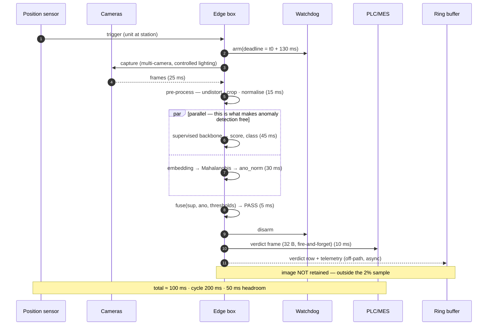
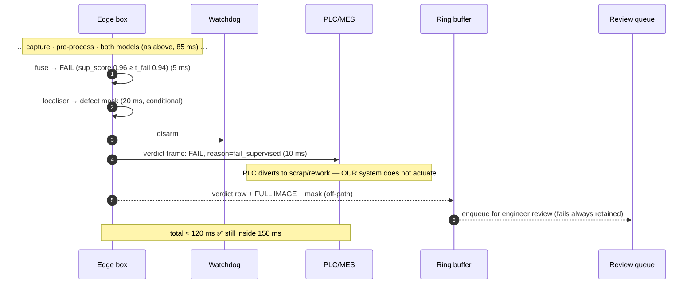
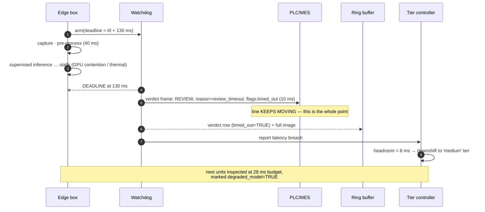
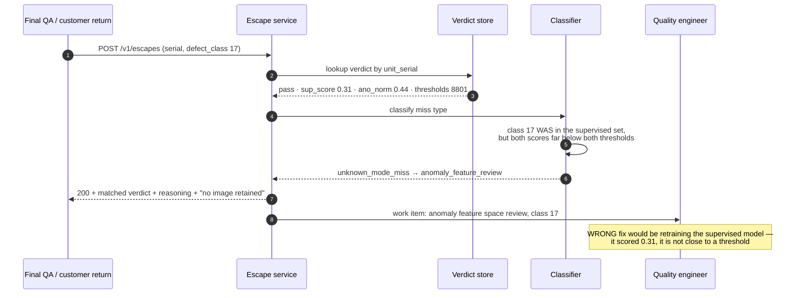

# 06 · LLD — Manufacturing: CV Quality Inspection

> ← [`02_hld.md`](02_hld.md) · **Next:** [`04_production_and_interview.md`](04_production_and_interview.md) →
>
> Every number here traces to the shared block or to [`02_hld.md`](02_hld.md). The design constraint that shapes almost every decision below is that **the line tier must be bounded** — no unbounded loop, no dynamic allocation, no network call on the inference path.

---

## 3.1 Data models

### Inspection verdict — the row that exists for every unit, forever

This is the traceability record (FR-6). It is written for **all** 3.46M units/day, so its size matters.

```sql
CREATE TABLE inspection_verdict (
    -- identity
    unit_serial        TEXT        NOT NULL,          -- from the PLC/MES, not generated here
    line_id            SMALLINT    NOT NULL,
    station_id         SMALLINT    NOT NULL,
    inspected_at       TIMESTAMPTZ NOT NULL,

    -- the verdict
    verdict            SMALLINT    NOT NULL,          -- 0=pass 1=fail 2=review
    verdict_reason     SMALLINT    NOT NULL,          -- see enum below

    -- the evidence, as scores (not images — those are conditional)
    sup_class_id       SMALLINT,                      -- NULL when no class fired
    sup_score          REAL,                          -- [0,1]
    ano_score          REAL        NOT NULL,          -- distance, unbounded above
    ano_score_norm     REAL        NOT NULL,          -- [0,1], normalised per line

    -- reproducibility: what produced this verdict
    sup_model_version  TEXT        NOT NULL,
    ano_model_version  TEXT        NOT NULL,
    threshold_set_id   INTEGER     NOT NULL,          -- FK -> threshold_set
    calib_version      TEXT        NOT NULL,          -- lighting/lens calibration in force

    -- operational
    infer_ms           SMALLINT    NOT NULL,
    timed_out          BOOLEAN     NOT NULL DEFAULT FALSE,
    degraded_model     BOOLEAN     NOT NULL DEFAULT FALSE,  -- FR-20 thermal fallback fired
    image_ref          TEXT,                          -- NULL unless retained

    PRIMARY KEY (line_id, inspected_at, unit_serial)
) PARTITION BY RANGE (inspected_at);
```

```
verdict_reason:
  0  pass_clean            both models below T_review
  1  fail_supervised       sup_score >= T_fail for a known class
  2  review_supervised     T_review <= sup_score < T_fail
  3  review_anomaly        ano_score_norm >= T_review_ano, no matching class
  4  review_both           both escalated
  5  review_timeout        watchdog fired (FR-19)
  6  review_capacity_shed  T_review auto-tightened, this unit fell the other side (FR-12)
  7  review_degraded       running the fallback model, confidence band widened
```

Three deliberate choices:

**`verdict_reason` is a first-class column, not a derived field.** FR-16 requires distinguishing a *known-class miss* from an *unknown-mode miss* when an escape surfaces downstream, because the two demand different fixes. Reconstructing the reason months later from three float columns and a threshold history is exactly the kind of archaeology that fails during a recall. Store the answer.

**Both the raw and normalised anomaly score.** `ano_score` is a distance and its scale depends on the line's own normal manifold; `ano_score_norm` is what the thresholds compare against. Keeping both means a re-normalisation (new baseline after a lens change) does not destroy the ability to compare old scores.

**`threshold_set_id` and `calib_version`, not just model versions.** A verdict is a function of *model × thresholds × calibration*. Two units with identical scores can get different verdicts a week apart because someone retuned a threshold — which is legitimate (FR-11) and must be reconstructable.

#### Size arithmetic, because 3.46M rows/day is where storage decisions get made

```
Row width ≈ 8(serial) + 2 + 2 + 8(ts) + 2 + 2          = 24 B
          + 2 + 4 + 4 + 4                              = 14 B   (scores)
          + 3 × ~12(version strings, dictionary-encoded) = 36 B
          + 4 + 12(calib) + 2 + 1 + 1 + ~40(image_ref)  = 60 B
          ≈ 134 B raw

3.46M/day × 134 B         ≈ 464 MB/day  raw
× 2 years                 ≈ 339 GB      raw
compressed (columnar, ~5×) ≈ 68 GB      ← trivially affordable
```

**Verdict rows for every unit cost ~$2/month at rest.** This is why the HLD stores them for all units rather than only fails: the alternative — a recall where you cannot say what inspection concluded about a passed serial — is unbounded liability to save nothing.

Partitioning: **daily partitions, by `inspected_at`.** Recall queries are serial-scoped (use a secondary index on `unit_serial`), drift and threshold analysis are time-scoped and per-line. Daily partitions make 2-year retention a drop, not a delete.

### Threshold set — the audited configuration object (FR-11, FR-13)

Thresholds change without redeploying edge software. That makes them configuration, which makes them a change-controlled object.

```sql
CREATE TABLE threshold_set (
    threshold_set_id   SERIAL PRIMARY KEY,
    line_id            SMALLINT NOT NULL,
    product_sku        TEXT     NOT NULL,           -- per product, per FR-11

    t_fail             REAL     NOT NULL,           -- supervised: >= this ⇒ fail
    t_review_sup       REAL     NOT NULL,           -- supervised: >= this ⇒ review
    t_review_ano       REAL     NOT NULL,           -- anomaly (normalised): >= this ⇒ review

    -- FR-13: derived from unit economics, so record them
    scrap_cost_inr     NUMERIC(10,2) NOT NULL,
    escape_cost_inr    NUMERIC(10,2) NOT NULL,
    review_cost_inr    NUMERIC(10,2) NOT NULL,

    -- audit
    effective_from     TIMESTAMPTZ NOT NULL,
    effective_to       TIMESTAMPTZ,                 -- NULL = current
    author             TEXT     NOT NULL,
    approver           TEXT     NOT NULL,           -- two-person rule
    rationale          TEXT     NOT NULL,
    auto_tightened     BOOLEAN  NOT NULL DEFAULT FALSE,  -- FR-12 fired

    CHECK (t_review_sup <= t_fail),
    CHECK (t_fail <= 1.0 AND t_review_sup >= 0.0)
);

-- exactly one current set per (line, sku)
CREATE UNIQUE INDEX one_current_threshold_set
    ON threshold_set (line_id, product_sku)
    WHERE effective_to IS NULL;
```

> **The `CHECK (t_review_sup <= t_fail)` is not decoration.** Inverted thresholds produce a fusion rule where a unit can be simultaneously `fail` and below the review bar — the resulting behaviour depends on comparison order in the fusion code, which is precisely the class of bug that ships good product to scrap for a shift before anyone notices. Make it unrepresentable.
>
> The partial unique index enforces "one current configuration" in the database rather than in application logic — the same technique used for single-use confirmation in [`../01_ecommerce_shopping_agent/`](../01_ecommerce_shopping_agent/).

**Two-person rule on `approver`.** A threshold change is a change to the plant's quality posture and can, within one shift, either ship defects or scrap good product at 5 units/s. It belongs in the same change-control class as a PLC program edit.

### Review queue item — capacity is the schema's problem

```sql
CREATE TABLE review_item (
    review_id        BIGSERIAL PRIMARY KEY,
    unit_serial      TEXT        NOT NULL,
    line_id          SMALLINT    NOT NULL,
    enqueued_at      TIMESTAMPTZ NOT NULL,
    shift_id         TEXT        NOT NULL,          -- capacity is per shift (FR-12)

    verdict_reason   SMALLINT    NOT NULL,
    priority         SMALLINT    NOT NULL,          -- 0 highest
    image_ref        TEXT        NOT NULL,          -- reviews ALWAYS retain the image
    localisation_ref TEXT,                          -- present if the localiser ran

    -- disposition
    state            TEXT        NOT NULL,          -- queued|assigned|dispositioned|expired
    assigned_to      TEXT,
    dispositioned_at TIMESTAMPTZ,
    disposition      SMALLINT,                      -- 0=good 1=defective 2=rework 3=unclear
    defect_class_id  SMALLINT,                       -- engineer's label, feeds retraining
    engineer_note    TEXT
);

CREATE INDEX review_work_list ON review_item (line_id, priority, enqueued_at)
    WHERE state = 'queued';
```

A **held unit physically occupies floor space**, so an unbounded queue is not merely a data problem — it is pallets accumulating next to the line. Hence:

- **`shift_id`** — capacity resets per shift, so the FR-12 enforcement window is a shift, not a rolling hour.
- **`expired`** state — if a unit sits past its hold window, it must resolve *somehow*. The policy is a plant decision recorded in config (default: escalate to `fail`, because an unreviewed ambiguous unit shipped is an escape and the whole point of `review` was to avoid one).
- **`disposition = 3 (unclear)`** exists because engineers genuinely cannot always tell. Forcing a binary here would poison the training labels, and label noise on a rare-positive problem is expensive.
- Reviews **always** retain the image. The 2% sampling in the HLD applies to *passes*.

### Per-line drift baseline

```sql
CREATE TABLE line_baseline (
    line_id         SMALLINT NOT NULL,
    calib_version   TEXT     NOT NULL,
    established_at  TIMESTAMPTZ NOT NULL,

    -- image-domain reference statistics (from a clean, verified window)
    brightness_mean REAL NOT NULL,  brightness_std REAL NOT NULL,
    contrast_mean   REAL NOT NULL,  contrast_std   REAL NOT NULL,
    sharpness_mean  REAL NOT NULL,  sharpness_std  REAL NOT NULL,

    -- model-domain reference
    ano_score_p50   REAL NOT NULL,
    ano_score_p95   REAL NOT NULL,
    ano_score_p999  REAL NOT NULL,   -- the normaliser for ano_score_norm

    embedding_centroid  BYTEA NOT NULL,   -- the normal manifold's centre
    embedding_cov_inv   BYTEA NOT NULL,   -- inverse covariance, for Mahalanobis

    PRIMARY KEY (line_id, calib_version)
);
```

**Per-line, not fleet-wide.** Each station has its own lighting history, lens contamination trajectory and fixture wear. A fleet-wide baseline hides exactly the per-line degradation the drift monitor exists to find, and the HLD is explicit about this.

---

## 3.2 Contracts

### The PLC / MES contract — the one that must never surprise anyone

This is the most consequential interface in the system, because a PLC integration that blocks or returns an unexpected shape stops production. It is deliberately austere.

```
Direction:  edge box → PLC (fieldbus write; also mirrored to MES over TCP)
Trigger:    one write per unit, unconditionally, within the cycle
Blocking:   NEVER. Fire-and-forget with a fixed-size payload.
```

```c
/* Fixed-width, fixed-layout, no optional fields, no strings. 32 bytes. */
typedef struct {
    uint32_t magic;            /* 0x51494E53 — guards against frame desync   */
    uint16_t schema_version;    /* 1                                          */
    uint64_t unit_serial_hash;  /* PLC matches by hash; full serial goes to MES */
    uint8_t  verdict;           /* 0 pass · 1 fail · 2 review                 */
    uint8_t  verdict_reason;    /* enum above                                 */
    uint16_t confidence_bp;     /* basis points, 0..10000                     */
    uint16_t infer_ms;
    uint8_t  flags;             /* bit0 timed_out · bit1 degraded · bit2 shed  */
    uint8_t  reserved[3];
    uint32_t crc32;
} inspection_verdict_frame_t;   /* 32 B */
```

Five properties, each earning its place:

| Property | Why |
|---|---|
| **Fixed size, no strings** | A variable-length frame invites a length-parsing bug in PLC ladder logic. 32 bytes always. |
| **`magic` + `crc32`** | A desynchronised fieldbus stream must be detectable, not silently misread as verdicts. A corrupted frame is discarded and counted, never acted on. |
| **`verdict` is an enum, never a float** | The PLC must not be in the business of comparing scores to thresholds. Threshold policy lives in one place — the threshold set — or you have two sources of truth and they will diverge. |
| **`reserved[3]`** | Room for one more field without a schema version bump and a PLC reprogram. Cheap now, expensive later. |
| **Never blocks** | The whole system's promise is that the line keeps moving. An interface that can block breaks it. |

> **Why the PLC gets a hash and the MES gets the serial.** The fieldbus payload is small and the PLC only needs to match a verdict to the unit currently in the fixture. The MES needs the real serial for traceability. Sending a 40-character serial over the fieldbus to satisfy a system that isn't on the fieldbus is how latency budgets die.

### Threshold update — config, not deploy (FR-11)

```http
PUT /v1/lines/{line_id}/thresholds
Content-Type: application/json
Idempotency-Key: <uuid>

{
  "product_sku": "BRK-2200-A",
  "t_fail": 0.94,
  "t_review_sup": 0.61,
  "t_review_ano": 0.72,
  "economics": { "scrap_cost_inr": 340.00,
                 "escape_cost_inr": 18500.00,
                 "review_cost_inr": 22.00 },
  "rationale": "Escape audit W34 found 3 known-class misses at 0.91-0.93; lowering t_fail.",
  "author": "r.iyer", "approver": "s.menon",
  "effective_from": "2026-09-02T06:00:00+05:30"
}
```

```json
201 Created
{
  "threshold_set_id": 8814,
  "applies_to_lines": [7],
  "projected_impact": {
     "basis": "replay of 14 days of stored scores (4.1M units)",
     "false_reject_pct":  { "current": 1.12, "projected": 1.31, "ceiling": 1.50 },
     "review_volume_pct": { "current": 2.4,  "projected": 2.6,  "ceiling": 3.0  },
     "escape_estimate_pct": { "current": 0.18, "projected": 0.14, "ceiling": 0.20 }
  },
  "activation": "staged", "canary_until": "2026-09-02T14:00:00+05:30"
}
```

> **`projected_impact` is the most valuable field in this API, and it is why storing scores for all units pays for itself.** A threshold change is a *prediction* about false rejects, review volume and escapes. Because every unit's raw scores are on disk, the change can be **replayed against 14 days of real production** before it touches a line. A threshold edit stops being a judgement call and becomes a measured one.
>
> The request is **rejected** if any projected value breaches its ceiling — you cannot configure your way out of the NFRs.
>
> `effective_from` at shift start, not immediately: changing the quality bar mid-shift means two populations of product from one shift, which makes any subsequent investigation ambiguous.

### Escape report — closing the FR-16 loop

The signal that actually measures the system. Comes from customer returns or final QA.

```http
POST /v1/escapes
{
  "unit_serial": "BRK2200A-0099412771",
  "found_at": "final_qa",                       // final_qa | customer_return | field_failure
  "found_on": "2026-09-14",
  "defect_class_id": 17,
  "defect_class_confidence": "confirmed"        // confirmed | suspected
}
```

```json
200 OK
{
  "matched_verdict": {
    "inspected_at": "2026-09-01T11:42:18+05:30",
    "line_id": 7, "verdict": "pass", "verdict_reason": "pass_clean",
    "sup_class_id": null, "sup_score": 0.31,
    "ano_score_norm": 0.44,
    "sup_model_version": "sup-2026.08.4",
    "threshold_set_id": 8801, "calib_version": "L7-2026.07"
  },
  "classification": "unknown_mode_miss",
  "reasoning": "defect_class_id=17 was in the supervised class set, but sup_score=0.31 is far below t_review_sup=0.61 AND ano_score_norm=0.44 is below t_review_ano=0.72 — neither model registered it",
  "recommended_action": "anomaly_feature_review",
  "image_ref": null,
  "image_note": "unit passed and was not in the 2% sample — no image retained"
}
```

Three things this response does that matter:

1. **It classifies the miss** (FR-16) rather than just recording it. `known_class_miss` → the class exists and scored near the threshold, so retune or retrain. `unknown_mode_miss` → neither model registered it, so the anomaly feature space or threshold needs work. **Applying the wrong fix is the common error**, and the HLD names it as such.
2. **It states its reasoning.** An escape investigation is read by a quality engineer, not a model. The scores and the thresholds they were compared against are the argument.
3. **It admits when the image is gone.** `image_note` is not an apology — it's the honest consequence of the 2% sampling decision, surfaced at the moment it costs something. If escapes routinely land on unretained units and that blocks investigation, that is the evidence for raising the sample rate, and this field is how you accumulate it.

---

## 3.3 Core algorithms

### Decision fusion — the asymmetric rule

The HLD states the rule; here it is precisely, because the asymmetry is the whole design.

```python
# Runs on the edge box, inside the 5 ms fusion budget.
# NO allocation, NO branching on data-dependent loop counts.

def fuse(sup_score: float, sup_class_id: int | None,
         ano_norm: float, th: ThresholdSet) -> tuple[int, int]:
    """Returns (verdict, verdict_reason). Pure function, constant time."""

    sup_fail   = sup_class_id is not None and sup_score >= th.t_fail
    sup_review = sup_class_id is not None and sup_score >= th.t_review_sup
    ano_review = ano_norm >= th.t_review_ano

    # 1. Only the SUPERVISED model may condemn a unit.
    if sup_fail:
        return VERDICT_FAIL, REASON_FAIL_SUPERVISED

    # 2. Either model may escalate to review.
    if sup_review and ano_review:
        return VERDICT_REVIEW, REASON_REVIEW_BOTH
    if sup_review:
        return VERDICT_REVIEW, REASON_REVIEW_SUPERVISED
    if ano_review:
        return VERDICT_REVIEW, REASON_REVIEW_ANOMALY

    return VERDICT_PASS, REASON_PASS_CLEAN
```

> **The anomaly model can send a unit to `review` but never to `fail`.** This is the single most important line of logic in the system, and the reason is a category distinction: the anomaly model measures **unfamiliarity**, not **defectiveness**. A unit can be unfamiliar for entirely benign reasons — a new supplier's surface finish, a legitimate material variation, a fixture repositioned this morning, a cleaned lens.
>
> If unfamiliar could mean scrap, then **the first hour after any legitimate process change becomes a scrap event at 5 units/s.** The false-reject budget (1.5%) would be consumed in minutes by a change that harmed nothing. Routing unfamiliarity to a human is exactly right: a human looks at four surface-finish units, says "this is the new supplier, it's fine", and the plant carries on.
>
> The cost of this choice is honest and worth stating: **an unfamiliar unit that really is defective becomes a review rather than a fail.** It is still caught — it does not escape — but it consumes human capacity rather than being handled automatically. That is the correct trade at these cost ratios (`escape_cost` ₹18,500 vs `review_cost` ₹22 vs `scrap_cost` ₹340): human attention is two orders of magnitude cheaper than either error.

### Anomaly score — Mahalanobis distance to the normal manifold

The HLD chose feature-space distance over reconstruction error. The implementation, and why each piece is shaped for a bounded path:

```python
# Precomputed at calibration time, resident in memory, never recomputed on-path:
#   centroid : float32[D]        — mean embedding of verified-good units
#   cov_inv  : float32[D, D]     — inverse covariance (shrinkage-regularised)
#   p999     : float             — the normaliser

def anomaly_score(embedding: np.ndarray, bl: LineBaseline) -> tuple[float, float]:
    d = embedding - bl.centroid
    raw = float(np.sqrt(d @ bl.cov_inv @ d))        # fixed-shape matmul, no allocation
    norm = min(raw / bl.p999, 1.0)                  # clamped to [0,1]
    return raw, norm
```

Four implementation points that are the difference between this working and not:

| Point | Why |
|---|---|
| **Mahalanobis, not Euclidean** | Embedding dimensions have wildly different variances on good units. Euclidean distance is dominated by whichever dimension happens to be noisiest, which is not a defect signal. |
| **Shrinkage-regularised covariance** | With `D` in the hundreds and a finite calibration set, the sample covariance is ill-conditioned and its inverse amplifies noise. Ledoit–Wolf shrinkage toward a diagonal target is the standard fix and is not optional. |
| **`p999` as the normaliser, not the max** | The max over a calibration set is a single sample and moves whenever an outlier sneaks into calibration. The 99.9th percentile is stable, and thresholds set against it stay meaningful across recalibrations. |
| **Clamp to 1.0** | A genuinely bizarre unit could produce a distance 40× `p999`. Unbounded scores make thresholds meaningless and can overflow the fixed-width frame field. Everything past `p999` is equally "very unfamiliar" — the extra magnitude carries no decision-relevant information. |

**Calibration set discipline:** the centroid and covariance must come from units **verified good by a human**, not merely units the current model passed. Bootstrapping the normal manifold from model-passed units bakes the model's existing blind spots into the anomaly detector, and the two failure modes then correlate — destroying the independence that FR-14 exists to guarantee.

### FR-14 verification — the held-out-class test

FR-14's acceptance criterion is an experiment, and it is worth writing out because it is the only real proof that the two-model design does what it claims:

```python
def verify_anomaly_independence(all_classes, holdout_class_id) -> dict:
    """
    Train the SUPERVISED model with holdout_class_id entirely removed.
    Train the ANOMALY model only on verified-good units (it never saw ANY defect class).
    Then score held-out examples of the removed class.
    """
    sup = train_supervised([c for c in all_classes if c != holdout_class_id])
    ano = fit_anomaly(verified_good_units)          # no defect data at all

    caught, missed = 0, 0
    for unit in examples_of(holdout_class_id):
        emb = backbone(unit.image)
        sup_score, sup_cls = sup.predict(emb)
        _, ano_norm = anomaly_score(emb, ano.baseline)
        verdict, _ = fuse(sup_score, sup_cls, ano_norm, current_thresholds)
        caught += verdict in (VERDICT_FAIL, VERDICT_REVIEW)
        missed += verdict == VERDICT_PASS

    return {"holdout_class": holdout_class_id,
            "escape_rate_on_unseen_mode": missed / (caught + missed),
            "gate": missed / (caught + missed) <= 0.20}
```

> Run this for **every** class, leave-one-out, on every release. A supervised model that has never seen a defect class will not catch it — that is expected and not a finding. The question FR-14 asks is whether the **anomaly model** catches it anyway. If held-out-class escape rate is poor, the parallel-model architecture is decorative and the open-endedness problem is unsolved, whatever the aggregate metrics say.
>
> This is the test that distinguishes a system that *has* an anomaly model from one where the anomaly model *works*.

### Review-capacity enforcement (FR-12)

FR-12 says review volume is *enforced*, not targeted. Mechanically:

```python
class ReviewCapacityGovernor:
    """Runs on the plant tier, adjusts t_review_ano on the edge box.
    Adjusts ONLY the anomaly threshold — never the supervised one."""

    def __init__(self, shift_capacity_units: int, line_id: int):
        self.cap = shift_capacity_units
        self.line_id = line_id
        self.step = 0.02
        self.floor, self.ceil = 0.55, 0.95

    def tick(self, elapsed_frac: float, reviewed_so_far: int, th: ThresholdSet):
        """elapsed_frac in (0,1] — fraction of the shift elapsed."""
        budget_now = self.cap * elapsed_frac
        if budget_now <= 0:
            return None

        util = reviewed_so_far / budget_now

        if util > 1.15 and th.t_review_ano < self.ceil:
            new = min(th.t_review_ano + self.step, self.ceil)
            return self._emit(th, new, "tighten", util)

        if util < 0.60 and th.t_review_ano > self.floor:
            new = max(th.t_review_ano - self.step, self.floor)
            return self._emit(th, new, "relax", util)

        return None

    def _emit(self, th, new_value, direction, util):
        # Logged as an auto_tightened threshold set — the trade-off is
        # recorded, never silent (FR-12).
        return ThresholdChange(
            line_id=self.line_id, t_review_ano=new_value,
            auto_tightened=True, direction=direction,
            rationale=f"capacity utilisation {util:.2f}; shift pacing",
        )
```

Four design decisions, each with a reason:

| Decision | Reason |
|---|---|
| **Adjust only `t_review_ano`** | Supervised review escalations are the model saying *"I think this is a known defect"* — high-value signal. Anomaly escalations are *"this is unfamiliar"* — genuinely lower yield. When capacity binds, shed the lower-yield stream. |
| **Pace against elapsed shift fraction** | Comparing against total shift capacity means the governor never fires until the shift is nearly over, by which point the queue has already overflowed. |
| **Hysteresis (1.15 / 0.60), stepwise** | A tight control loop on a noisy signal oscillates, and the threshold set is an *audited* object — you do not want fifty audit rows per shift. |
| **`ceil = 0.95`, never 1.0** | A ceiling of 1.0 means the anomaly model can be switched off entirely by a busy shift, silently removing FR-5's open-endedness protection. **The governor may degrade the safety net; it may not eliminate it.** Hitting the ceiling raises an alert, because the real fix is capacity or model quality, not a higher bar. |

> **The honest statement of what this does:** when human capacity binds, the system **accepts a higher escape risk on unfamiliar defect modes** in exchange for a bounded queue. That is a real trade and the right one — an unbounded queue means pallets on the floor and eventually a stopped line. FR-12's insistence that the event be *logged* is what keeps it a decision rather than a silent drift, and every `auto_tightened` row is evidence in the next capacity conversation.

### Thermal degradation (FR-20) — degrade accuracy, not latency

```python
class ModelTierController:
    """FR-20: under thermal/resource pressure, get SMALLER, not SLOWER.
    A slower model stops the line; a slightly worse model does not."""

    TIERS = [
        Tier("full",   budget_ms=45, expected_escape_delta=0.000),
        Tier("medium", budget_ms=28, expected_escape_delta=0.015),
        Tier("small",  budget_ms=16, expected_escape_delta=0.045),
    ]

    def select(self, recent_p99_ms: float, gpu_temp_c: float, cur: int) -> int:
        headroom = INFER_BUDGET_MS - recent_p99_ms

        # Escalate down fast: a latency breach stops the line.
        if headroom < 8 or gpu_temp_c > THERMAL_CRITICAL_C:
            return min(cur + 1, len(self.TIERS) - 1)

        # Recover up slowly, and only with real margin.
        if headroom > 30 and gpu_temp_c < THERMAL_NOMINAL_C:
            return max(cur - 1, 0)

        return cur
```

**Asymmetric response, deliberately.** Downshift on the first sign of pressure; upshift only with 30 ms of proven headroom. The costs are wildly asymmetric: downshifting early costs a small accuracy delta on some units, while upshifting early costs a **stopped production line**. When the two error costs differ by orders of magnitude, so should the trigger thresholds.

Every unit inspected on a degraded tier is marked `degraded_model = TRUE`. Escape analysis must be able to segment by tier — otherwise a thermal problem in July looks like a model regression, and someone retrains a model that was never the problem.

---

## 3.4 Sequence diagrams

### Happy path — a passing unit, ~100 ms



### Failing unit — localisation fires, ~120 ms



### Failure path — watchdog timeout



> **The watchdog emits the frame, not the inference path.** If the inference thread is stalled it cannot be trusted to notice and report its own stall — that is a self-referential dependency. The watchdog is a separate timer with its own path to the fieldbus, and it wins.

### Escape traced back — the FR-16 loop



---

## 3.5 State machines

### Unit inspection

```
                    ┌──────────┐
   trigger ────────►│ CAPTURING│
                    └────┬─────┘
                         │ frames ready
                    ┌────▼──────────┐
                    │ PRE_PROCESSING│
                    └────┬──────────┘
                         │
                    ┌────▼──────┐   watchdog deadline
                    │ INFERRING ├──────────────────────► TIMED_OUT
                    └────┬──────┘                            │
                         │ both models returned              │ emit REVIEW
                    ┌────▼──────┐                            │ flags.timed_out
                    │  FUSING   │                            │
                    └────┬──────┘                            │
              ┌──────────┼──────────┐                        │
         PASS │      FAIL│    REVIEW│                        │
              │          │          │                        │
              │     ┌────▼─────┐    │                        │
              │     │LOCALISING│    │                        │
              │     └────┬─────┘    │                        │
              └──────────┼──────────┴────────────────────────┘
                    ┌────▼─────┐
                    │ EMITTED  │  ← terminal on the line tier
                    └────┬─────┘
                         │ off-path, async
                    ┌────▼─────────┐
                    │ PERSISTED    │
                    └──────────────┘
```

**Invariant: every unit reaches `EMITTED` within the watchdog deadline.** There is no path from any state to "no verdict". A unit with no verdict would mean the PLC has nothing to act on for a unit physically present in the fixture — an ambiguity the line cannot resolve, so it stops. The state machine has no such state by construction.

### Review item

```
   enqueued
      │
      ▼
  ┌────────┐  assign   ┌──────────┐  disposition  ┌────────────────┐
  │ QUEUED ├──────────►│ ASSIGNED ├──────────────►│ DISPOSITIONED  │ terminal
  └───┬────┘           └────┬─────┘               └────────┬───────┘
      │                     │ unassign (shift end)         │
      │                     └───────────► QUEUED           │ label
      │ hold window exceeded                               ▼
      ▼                                              training corpus
  ┌─────────┐
  │ EXPIRED │  → policy-driven resolution, default: escalate to FAIL
  └─────────┘     (an unreviewed ambiguous unit shipped is an escape,
                   and avoiding one was the entire purpose of REVIEW)
```

### Model rollout

```
  TRAINED
     │ eval gate: escape ✓ AND false_reject ✓ AND review_volume ✓
     │            AND held-out-class test (FR-14) ✓
     ▼
  GATED ────────► REJECTED (any single regression blocks; improving one
     │                       metric at another's expense is not progress)
     │ deploy scoring-only
     ▼
  SHADOW (1 line, 48 h)   ← scores recorded, verdicts NOT acted on
     │ agreement + metric comparison vs incumbent on the SAME units
     ▼
  CANARY (1 line, 72 h)   ← verdicts acted on, one line's blast radius
     │ false-reject within band
     ▼
  FLEET (staged, ≤ 3 lines/hour, signed artifacts)
     │
     ├── false_reject deviation beyond band ──► AUTO_ROLLBACK
     └── stable 7 days ──────────────────────► INCUMBENT
```

> **Shadow mode is free validation on live production data**, and it is strictly better than any offline test set because it scores *the same units* the incumbent scored, on today's lighting, today's supplier, today's fixture position. The comparison is paired, which removes almost all the variance an offline comparison suffers from.

---

## 3.6 Edge cases and correctness

| # | Edge case | Handling | Why this way |
|---|---|---|---|
| 1 | **Two units in the fixture** (feed fault) | Pre-processing crop-confidence check fails → `review`, `reason=review_degraded` | The model would score a nonsense composite image with confident-looking numbers. Detect the *input* violation, don't trust the output. |
| 2 | **No unit present** (spurious trigger) | Same crop-confidence path → emit nothing, count as `spurious_trigger` | Emitting `pass` for an absent unit corrupts the traceability store with phantom serials. |
| 3 | **Serial number unreadable** | Inspect anyway, emit verdict with `unit_serial = 'UNREADABLE-<seq>'`, flag for MES reconciliation | A unit with an unreadable serial is still a unit to inspect. Refusing to inspect converts a data problem into a quality problem. |
| 4 | **Product changeover mid-shift** | Threshold set is keyed `(line_id, product_sku)`; MES signals SKU change; a mismatched SKU forces `review` until the set loads | Inspecting product B against product A's thresholds is a scrap event at 5 units/s. Fail toward human attention. |
| 5 | **Clock skew between edge and plant** | Edge stamps a monotonic counter + its own wall clock; plant reconciles | `PRIMARY KEY (line_id, inspected_at, unit_serial)` collides under a backwards clock step. The monotonic counter breaks ties. |
| 6 | **Ring buffer full** (>72 h offline) | Evict oldest **pass-sample** images first, then oldest fail images, **never verdict rows** | Verdict rows are the traceability obligation and are ~134 B; images are ~400 KB. Preserve the small, legally-required thing. |
| 7 | **Reused unit serial** (MES bug) | Composite PK admits both; reconciliation report flags duplicates | Silently overwriting the first verdict destroys the evidence for one of two real units. |
| 8 | **Anomaly baseline stale after cleaning** | Lens cleaning resets `calib_version`; a fresh baseline is required before scores are trusted; interim units get widened bands | A cleaned lens legitimately shifts every image statistic. Scoring against the dirty-lens baseline flags **everything** as anomalous — a scrap storm caused by maintenance doing its job. |
| 9 | **Threshold change lands mid-unit** | Thresholds are read once per unit into a local snapshot at fuse time | Reading two different threshold values within one fusion call can produce `verdict=fail` with `reason=pass_clean`. Snapshot, don't re-read. |
| 10 | **Both models disagree strongly** (sup 0.02, ano 0.98) | `review`, `reason=review_anomaly`; flagged for feature-space investigation | This is the signal FR-14 exists to produce: something the classifier is confident is fine and the manifold says is unlike anything it knows. Often the **first** instance of a new defect mode. |
| 11 | **Escape on an unretained unit** | Reported honestly (`image_note`); counted in a `blind_escape_rate` metric | If this metric climbs, it is the evidence for raising the 2% pass-sample rate. Surfacing the cost of a sampling decision is how the decision gets revisited. |
| 12 | **Governor at `ceil` and queue still overflowing** | Alert; hold `t_review_ano` at 0.95; escalate to plant management | The governor's job is pacing, not absorbing a structural capacity shortfall. Silently going to 1.0 would remove FR-5's protection entirely. |
| 13 | **Fixture drift** (part sits 3 mm off) | Detected as a systematic localisation offset → **mechanical** work order | The wrong fix is retraining the model to accept the new position — that hides a mechanical fault and bakes it into the labels. |
| 14 | **Edge box swap** (FR-18) | Spare boots with signed models, pulls `threshold_set` and `line_baseline` for that `line_id` | The baseline is **per-line**, not per-box. A spare carrying another line's baseline would score everything as anomalous. |

---

> ← [`02_hld.md`](02_hld.md) · **Next:** [`04_production_and_interview.md`](04_production_and_interview.md) →
