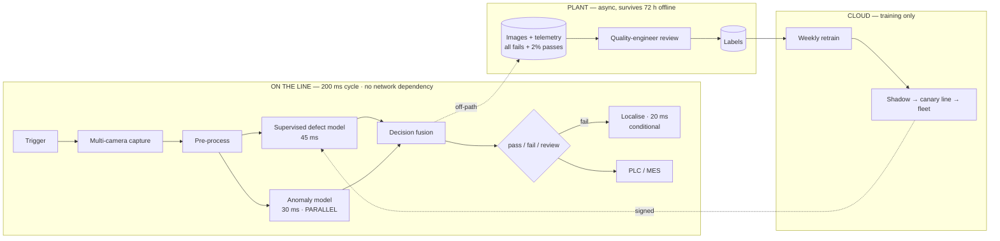

# 06 — Manufacturing: Computer Vision Quality Inspection

> **Archetype F · Sensor & edge.** The system that must run on the line, at line rate, without the network.

---

## The three-sentence compression

1. **The choice that matters most:** inference is **on the edge, on-premises, per line** — and the cost framing follows from duty cycle, not from cloud-first instinct. Renting cloud GPUs for 24/7 line-rate inference would cost ~$210k/month; amortised on-prem hardware costs **~$2.7k/month**, roughly **75× cheaper**.
2. **The alternative I rejected:** a purely supervised defect classifier. Defects are rare (~50 examples per class per year) and **open-ended** — new modes appear whenever a supplier or tool changes. So the design runs an anomaly model **in parallel** with the supervised one, which costs nothing (it's overlapped) and catches defect types no classifier has seen.
3. **The failure mode I'd volunteer:** **escape rate ≤ 0.2% and false-reject ≤ 1.5% are in direct tension**, and the three-way `review` class is what relieves it — at the cost of human capacity, capped at 3% of units. That cap, not model accuracy, sets the operating threshold.

---

## Architecture at a glance

---

## Key numbers

| | |
|---|---|
| **The binding constraint** | **200 ms line cycle time** — inference must fit with margin |
| Latency budget | ~100 ms typical · ~120 ms on a failing unit ✅ 50 ms headroom |
| Scale | 12 lines × 5 units/s × 16 h/day = **3.46M units/day** |
| **Escape rate** | **≤ 0.2%** of defective units (customer-facing quality target) |
| **False reject** | **≤ 1.5%** — above this, scrap and stoppages exceed the benefit |
| Review queue | **≤ 3%** of units — one quality engineer per line |
| Network independence | Full function offline **≥ 72 h** |
| **Total cost** | **~$4.2k/month** (~$0.00004/unit) — edge hardware amortised, not rented |

---

## Files

| File | Contents |
|---|---|
| [`01_requirements.md`](01_requirements.md) | The three-way decision, the rare-and-open-ended defect problem, the build-vs-rent arithmetic |
| [`02_hld.md`](02_hld.md) | Architecture, component choices with rejected alternatives, data flow, NFR mapping, failure modes, scale plan |
| [`03_lld.md`](03_lld.md) | Schemas, PLC contract, fusion + anomaly algorithms, sequence diagrams, state machines, edge cases |
| [`04_production_and_interview.md`](04_production_and_interview.md) | AI-specific concerns, runbook, common mistakes, interview follow-ups, glossary |

**Shared requirements block:** [`../00_requirements_all_systems.md#6-manufacturing--computer-vision-quality-inspection`](../00_requirements_all_systems.md#6-manufacturing--computer-vision-quality-inspection)

---

## The two findings to leave with

1. **Duty cycle inverts the build-vs-rent decision.** For continuous, latency-bound inference, owning the hardware is ~75× cheaper than renting it. Recognising when the usual cloud default is wrong is the design skill here.
2. **A three-way output is how you resolve two conflicting NFRs.** Escape rate and false-reject rate pull against each other; `review` converts an impossible binary threshold into a deferred decision — bounded by human capacity, which is the real constraint.
