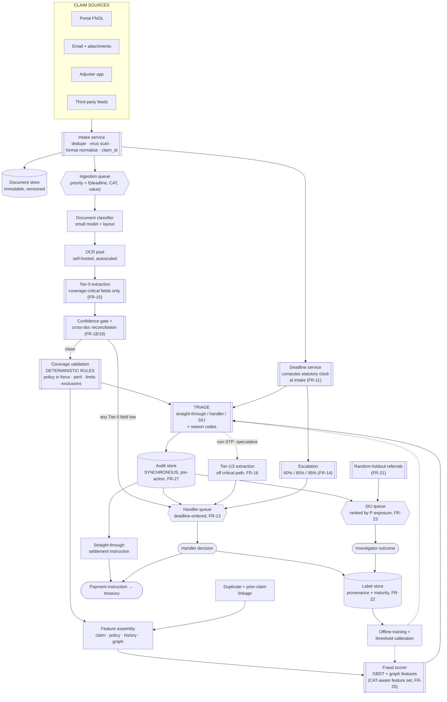

# 07 · HLD — Insurance: Claims Automation

> ← [`01_requirements.md`](01_requirements.md) · **Next:** [`03_lld.md`](03_lld.md) →

---

## 2.1 Architecture



---

## 2.2 Component choices

Each row names what I chose, what I rejected, and the threshold at which I would change my mind.

### Document classification — small multimodal model with layout features

| | |
|---|---|
| **Chosen** | Small VLM/layout classifier over the first page of each document, ~14 docs/claim |
| **Rejected — filename/MIME heuristics** | Email attachments are named `IMG_4471.jpg` and `scan0003.pdf`. Filenames carry no information in this domain |
| **Rejected — frontier VLM per page** | 3.36M pages/month at frontier rates is ~$50k/month for a task a small model does at ≥ 0.97 accuracy. Classification is *easy*; spend the budget on extraction |
| **Revisit when** | Classification accuracy < 0.95 on any high-volume document type, or a new document type appears that layout features cannot separate |

### OCR — self-hosted, GPU pool, autoscaled

| | |
|---|---|
| **Chosen** | Self-hosted OCR on a GPU pool: **747 GPU-h/month ≈ $747** |
| **Rejected — commercial OCR API** | At 3.36M pages/month, per-page API pricing is one to two orders of magnitude more, and CAT surge triples it exactly when cost scrutiny is highest |
| **Rejected — VLM-only, no OCR step** | Tempting (one model, fewer stages) but wasteful: OCR text is reused by classification, keyword rules, linkage, and search. Re-deriving it from pixels each time pays for the same information repeatedly |
| **Revisit when** | Volume falls below ~200k pages/month (API becomes cheaper than the ops burden) or OCR quality on handwritten claim forms becomes the accuracy bottleneck |

### Field extraction — frontier VLM, tiered and confidence-gated

| | |
|---|---|
| **Chosen** | Frontier VLM on document images + OCR text, **Tier 0 for all claims**, higher tiers on demand. ~$10.8k/month — 85% of system cost |
| **Rejected — pure layout model (LayoutLM-family) everywhere** | Excellent on templated FNOL forms, poor on the long tail: handwritten notes, photographed invoices, foreign-language police reports. Those are where errors are most expensive |
| **Rejected — eager full extraction** | −30% cost available from laziness alone (FR-15); see [`01_requirements.md#b-lazy-extraction`](01_requirements.md) |
| **Hybrid I would actually ship** | Layout model first on documents matching a known template; VLM only for low-confidence pages and non-templated documents. The shared block's two other levers (−60% on templated pages, −45% blended) compose with laziness |
| **Revisit when** | Extraction exceeds 90% of cost, or a specialist model reaches VLM parity on the long tail |

### Coverage validation — deterministic rules, not a model

| | |
|---|---|
| **Chosen** | A versioned rules engine: policy in force at loss date, peril in scope, limits/deductibles applied, exclusions evaluated |
| **Rejected — LLM reading the policy wording** | Three fatal problems for this component: not reproducible, not auditable field-by-field, and a wrong answer here is a wrongful denial. A coverage decision must be *explainable as a rule that was applied* |
| **Where an LLM does belong** | As an **authoring aid** — proposing rule encodings from policy wordings for a human to approve, and flagging wordings the current ruleset cannot express. Off the decision path entirely |
| **Revisit when** | Open question 3 resolves negatively: if wordings genuinely cannot be encoded for the top perils, an LLM-assisted path with mandatory human confirmation is required, and the straight-through rate drops accordingly |

### Fraud scoring — GBDT plus graph features

| | |
|---|---|
| **Chosen** | Gradient-boosted trees over claim, policy, history, and graph features; reason codes from SHAP-style attribution |
| **Rejected — LLM fraud scoring** | Fraud signal lives in tabular relationships (claim frequency, timing versus policy inception, repair-shop networks, prior-claim overlap) — exactly what GBDTs excel at and LLMs are poor at. Cost, latency, and reproducibility all point the same direction |
| **Rejected — deep tabular models** | No reliable accuracy advantage on this data shape; worse interpretability, and reason codes are a functional requirement (FR-4) |
| **Where an LLM does help** | Reading *narrative* documents for inconsistency signals — a story that changes between the FNOL and the police report — emitted as a **feature into the GBDT**, not as a score |
| **Revisit when** | Graph features plateau and narrative inconsistency becomes the dominant remaining signal |

### Entity linkage — graph store, not pure fuzzy matching

| | |
|---|---|
| **Chosen** | A claims graph (claimants, vehicles, addresses, repair shops, providers, phone numbers) built incrementally; linkage queries traverse it |
| **Rejected — per-claim fuzzy string matching** | Finds duplicates, misses **networks**, and organised fraud is a network phenomenon: the same repair shop across 40 unrelated claimants is invisible to pairwise matching |
| **Rejected — full graph neural network** | Hand-crafted graph features (component size, shared-node counts, time-clustering) capture most of the signal at a fraction of the operational cost. A GNN is a v3 conversation |
| **Revisit when** | Hand-crafted features stop improving and confirmed organised-fraud cases are being missed at scale |

### Deadline tracking — a service with its own store and scheduler

| | |
|---|---|
| **Chosen** | A dedicated service owning the clock table, computing deadlines at intake, processing typed pause/resume events, and driving both escalation and queue priority |
| **Rejected — a column on the claim plus a nightly report** | The failure mode from [`01_requirements.md#a2`](01_requirements.md): a tracker that cannot reorder work produces excellent dashboards and breaches anyway |
| **Rejected — deadline logic inside the workflow engine** | Statutory clocks change by regulation, not by release. FR-11 requires them to be data with effective dates |
| **Revisit when** | Jurisdiction count grows enough that the clock table needs its own editorial workflow — at which point it becomes a compliance-owned product surface, which is the right end state anyway |

### Orchestration — durable workflow engine

| | |
|---|---|
| **Chosen** | A durable workflow engine (Temporal-class) — each claim is a long-lived workflow spanning minutes to weeks, with typed steps, retries, and human-task waits |
| **Rejected — a chain of queues with database state** | Buildable, but re-implements timers, retries, compensation, and human-wait semantics badly. Claims sit waiting on people for weeks; that is exactly what durable workflows are for |
| **Rejected — a request/response service** | The process is fundamentally asynchronous and long-running. Modelling it synchronously forces state into the client |
| **Revisit when** | Never, realistically. This is the right shape for the problem |

### Triage — a model, deliberately

| | |
|---|---|
| **Chosen** | A calibrated classifier over coverage outcome, fraud score, extraction-confidence profile, claim value, complexity signals, and **remaining clock** — producing route + reason codes |
| **Rejected — a rules-only decision table** | Where v1 should start, honestly, because it is auditable and immediately shippable. But rules cannot weigh six correlated signals against two capacity ceilings and a clock, and they cannot be recalibrated as capacity changes |
| **Rejected — an LLM router** | It would need to be right about coverage, fraud, *and* capacity economics, and it can explain itself persuasively while being wrong. Routing is a calibrated-probability problem |
| **The critical property** | Triage must be **capacity-aware**: it outputs a ranked routing preference that a capacity layer converts into actual assignment (see [`03_lld.md`](03_lld.md)). Otherwise the model happily routes 60% of claims to a handler pool that can absorb 20% |
| **Revisit when** | Straight-through rate stalls below target while handler review reveals a high rate of "this was obviously simple" — evidence that the routing boundary, not the models, is the limit |

---

## 2.3 Data flow

### Straight-through claim (the ~35% case)

```
FNOL submitted (portal, 3 documents)
  ↓  intake: dedupe, scan, normalise, claim_id issued              30 s
  ↓  DEADLINE SERVICE: product=motor, jurisdiction=X, loss_date
     ⇒ statutory deadline computed, clock started                  (parallel)
  ↓  classify 3 documents                                          25 s
  ↓  OCR (3 docs ≈ 6 pages, parallel)                              1.5 min
  ↓  TIER-0 EXTRACTION only: policy_no, loss_date, cause,
     amount, claimant                                              2 min
  ↓  confidence gate: all Tier-0 high            ✅
     cross-doc reconciliation: loss_date agrees across 2 docs ✅    45 s
  ↓  coverage validation: policy in force, peril covered,
     amount < limit, no exclusion triggered      ✅                 20 s
  ↓  linkage: no duplicate, no prior-claim overlap                  40 s
  ↓  fraud score: 0.04 — below referral threshold                   15 s
  ↓  TRIAGE: straight-through (reasons: low_value, clean_coverage,
     low_fraud, high_extraction_confidence)                         10 s
  ↓  AUDIT WRITE — synchronous, committed BEFORE action             15 s
  ↓  settlement instruction → treasury
                                            ≈ 5.5 min · no human touch
```

Note what was *not* done: no Tier-1 or Tier-2 extraction, no damage-estimation CV, no handler queue. That is the −30% lever paying out.

### Suspicious claim during a declared CAT event

```
Claim arrives, region matches declared CAT (hail, region R, date range D)
  ↓  intake; deadline computed; priority raised (CAT + clock)
  ↓  classify / OCR / Tier-0 extraction — CAT default: cheap extractor first
  ↓  confidence gate: claimed_amount LOW confidence (photographed invoice)
     ⇒ FR-18: straight-through BLOCKED regardless of everything else
  ↓  coverage validation: peril covered ✅
  ↓  fraud scoring with CAT FEATURE SET:
        population-concentration features SUPPRESSED (FR-25)
          — "40 similar claims this week in region R" is the event, not fraud
        individual features ACTIVE:
          policy inception 9 days before loss        ← contributes
          claimed amount 4× regional CAT median      ← contributes
          repair shop shared with 6 prior referrals  ← contributes
     ⇒ score 0.71
  ↓  TRIAGE: SIU referral
     ranked by P(fraud) × exposure = 0.71 × $28,400  (FR-23)
  ↓  AUDIT WRITE (synchronous), then referral emitted
  ↓  speculative Tier-1/2 extraction starts immediately (FR-16)
     — investigator opens a fully-extracted claim
  ↓  clock continues running; escalation armed at 60% / 85% / 95%
```

The CAT-aware feature set is the whole point of this trace: without FR-25 the population features would refer the entire legitimate event and drown SIU on the worst possible week.

---

## 2.4 How the NFRs are met

| NFR | Mechanism | Where it could fail |
|---|---|---|
| **0 statutory breaches** | Deadline service + typed pauses + escalation at 60/85/95% + deadline-ordered queues (FR-11..14) | A wrong clock table. The mechanism is only as good as compliance's input — which is why FR-11 makes it audited data |
| p95 ingestion→triage < 15 min | 10.5 min budget, 4.5 min headroom; extraction parallel per document | Queue depth during CAT. Headroom exists for exactly this |
| Straight-through ≥ 35% | Tier-0-only path; deterministic coverage; confidence gate as the only hard blocker | The gate is also the ceiling: if extraction confidence is weak on a common document type, straight-through drops even with perfect models |
| Extraction F1 ≥ 0.96 | Frontier VLM + cross-document reconciliation + per-field thresholds | Long-tail documents (handwriting, foreign language). Measured per document type, never in aggregate — aggregate hides exactly the cases that matter |
| Triage precision (SIU) ≥ 0.40 | Capacity-aware thresholding; expected-recovery ranking | Meaningless without SIU's real capacity (open question 2) |
| Fraud recall ≥ 0.60 | GBDT + graph features | **Unmeasurable without FR-21's random holdout.** Any recall number quoted without it describes imitation of the old policy |
| Availability 99.9% | Stateless services; durable workflows survive restarts; degraded mode = manual intake, which exists today | Audit store availability is the real floor: FR-27 makes it a hard dependency for action, by design |
| 25k claims/day peak | Autoscaled OCR/extraction; queue priority; CAT mode adjusting defaults | Handler headcount does not autoscale — the answer is routing policy, not infrastructure |
| Full audit, 7–10 yr | Synchronous pre-action writes; verbatim field provenance (FR-17) | Storage tiering must not break retrieval of a 9-year-old record during a dispute |

---

## 2.5 Failure modes

| Failure | Detection | Blast radius | Degraded mode |
|---|---|---|---|
| **Extraction service down** | Health + queue depth | All claims stall in the pipeline; **clock keeps running** | Claims queue with priority preserved; if outage > 2 h, high-value and near-deadline claims route to handlers for manual extraction. **Deadline escalation continues regardless of pipeline health** — this is the one component that must never depend on the pipeline |
| **OCR pool saturated (CAT)** | Queue age | Latency, not correctness | Autoscale; then degrade to a cheaper OCR tier for CAT-typical simple claims; then shed to handler queue by priority |
| **Audit store unavailable** | Write failure | **No settlements, denials, or referrals can be emitted** (FR-27) | **Fail closed, deliberately.** Claims accumulate as decided-but-unemitted. This is the correct trade: a settlement with no defensible record is worse than a delayed settlement. Contrast [`../02_banking_fraud_detection/`](../02_banking_fraud_detection/), which fails *open* to rules — because there, blocking would decline millions of legitimate cards |
| **Policy admin system unavailable** | Timeout | Coverage validation impossible | No straight-through (cannot confirm coverage without in-force data); claims route to handler, who can look it up manually |
| **Fraud scorer down** | Health check | No fraud signal | Route by coverage + value alone, with fraud reason `scorer_unavailable`; high-value claims default to handler review rather than straight-through. **Never straight-through a claim with no fraud signal above a value floor** |
| **Deadline service down** | Health check — **paged immediately** | The regulatory guarantee is unmet | Highest-severity incident in the system. Last-computed deadlines are cached and escalation runs from cache; recompute on recovery. This service is the one that gets the redundancy budget |
| **Wrong clock table entry** | Reconciliation against compliance's source of truth; breach anomalies | Systematic — every claim of that (product, jurisdiction) | Effective-dated table with audited changes; a daily diff against the compliance source. **This is the highest-consequence silent failure in the system**, because it produces confident, wrong deadlines |
| **Extraction confidence miscalibrated (over-confident)** | Handler override rate; post-settlement audit | Wrong automated settlements | Calibration monitored per field per document type; straight-through disabled per document type on regression |
| **CAT not declared in time** | Referral-rate spike in one region | SIU flooded with legitimate claims | Auto-detect candidate CAT (claim-rate anomaly by region+peril) and propose declaration; suppress population features provisionally pending human confirmation |
| **Organised fraud ring below individual thresholds** | Graph-component growth monitoring | Sustained leakage, invisible per-claim | Component-level alerting independent of per-claim scores — a ring is detectable as a *graph* fact even when every member claim looks ordinary |
| **Handler queue collapse** | Queue age p95 | Deadline breaches | Raise straight-through threshold (accepting leakage) and/or extend hours. **The trade is explicit and logged** — the same capacity-forces-a-threshold move as [`../06_manufacturing_cv_inspection/`](../06_manufacturing_cv_inspection/) |

---

## 2.6 Scale plan

### 10× (80k claims/day, ~2.4M/month)

| Bottleneck | Fix |
|---|---|
| Extraction cost (~$108k/mo at linear scaling) | The hybrid becomes mandatory, not optional: layout models on templated pages, VLM only for the tail. Combined with laziness, expect ~$35–45k rather than $108k |
| OCR pool (7,500 GPU-h/mo) | Still cheap (~$7.5k); pool sharding by region |
| Graph store | Linkage queries slow as the component sizes grow; partition by region with periodic global reconciliation |
| Handler/SIU capacity | The real limit. Straight-through rate must rise, which requires better *confidence calibration* rather than better extraction accuracy — a distinction worth naming, since the two are often conflated |
| Deadline service | Trivially scalable (it is a scheduler over rows), but now multi-jurisdiction, so the clock table gains an editorial workflow |

### 100× (800k claims/day) — the shape changes

Two things break qualitatively rather than quantitatively:

1. **Extraction economics invert.** At 336M pages/month, fine-tuned in-house extraction models per document type become obviously correct — the fixed cost of training and maintaining them is trivially amortised. The frontier VLM becomes the fallback for genuinely novel documents, not the workhorse.
2. **Human review stops being a capacity problem and becomes an organisational one.** 800k claims/day at even 10% handler review is 80k reviews/day. At that point the design question is no longer "how do we route to handlers" but "what does a handler do that the system cannot", and the honest answer reshapes the product: handlers become exception specialists and quality auditors, and the system needs a **sampling-based quality regime** rather than a per-claim review regime.

> The second point is the one I would raise unprompted, because it is where scale changes the design rather than the deployment. The rest is arithmetic.

---

← [`01_requirements.md`](01_requirements.md) · **Next:** [`03_lld.md`](03_lld.md) →
