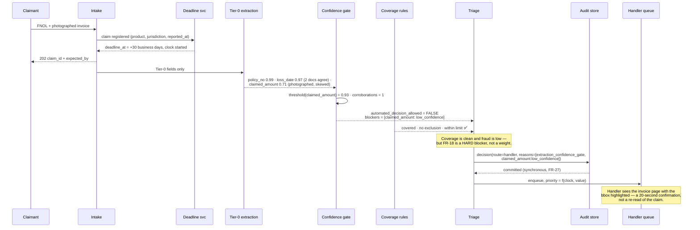
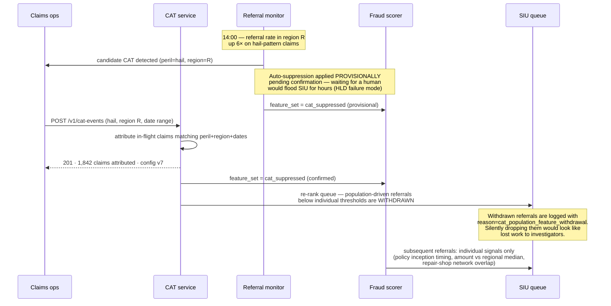
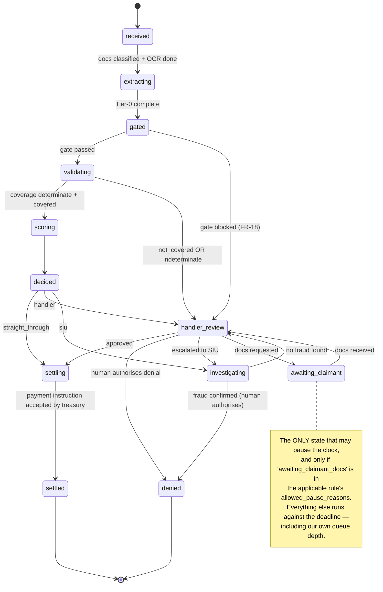
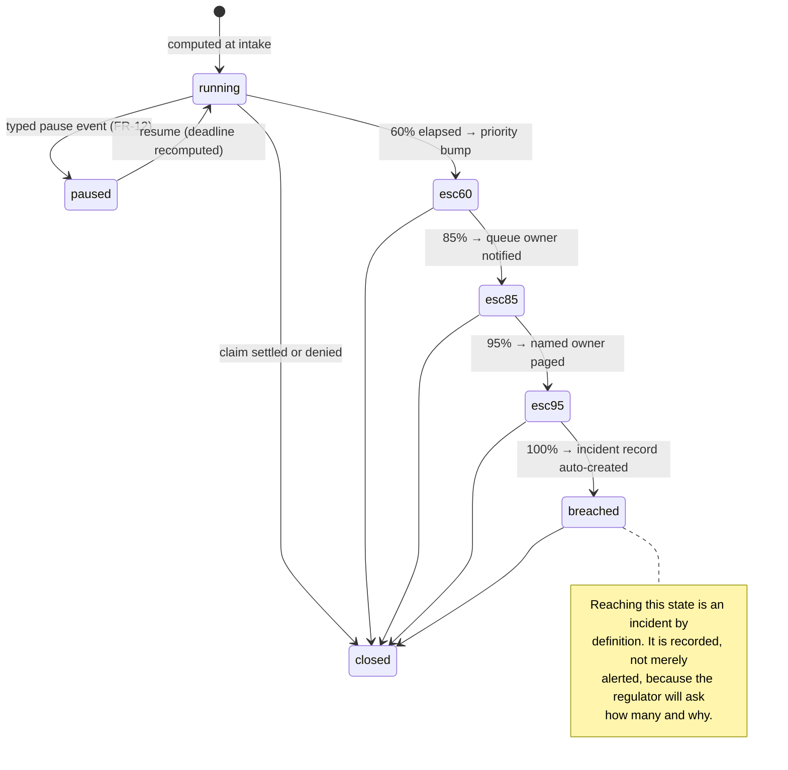

# 07 · LLD — Insurance: Claims Automation

> ← [`02_hld.md`](02_hld.md) · **Next:** [`04_production_and_interview.md`](04_production_and_interview.md) →

---

## 3.1 Schemas

### The claim and its clock

```sql
CREATE TABLE claims (
    claim_id            UUID PRIMARY KEY,
    policy_number       TEXT NOT NULL,
    product             TEXT NOT NULL,          -- motor | property | liability | ...
    jurisdiction        TEXT NOT NULL,          -- drives the clock table lookup
    claim_type          TEXT NOT NULL,
    loss_date           DATE,                   -- extracted; NULL until Tier-0 completes
    reported_at         TIMESTAMPTZ NOT NULL,
    claimed_amount_cents BIGINT,
    currency            CHAR(3) NOT NULL,
    status              TEXT NOT NULL,          -- see state machine, §3.4
    cat_event_id        UUID,                   -- non-NULL if attributed to a declared CAT
    created_at          TIMESTAMPTZ NOT NULL DEFAULT now(),
    updated_at          TIMESTAMPTZ NOT NULL
);

-- The statutory clock. Separate table because it has its own lifecycle,
-- its own audit requirements, and must survive pipeline failure (see HLD failure modes).
CREATE TABLE claim_deadlines (
    claim_id            UUID PRIMARY KEY REFERENCES claims(claim_id),
    clock_rule_id       UUID NOT NULL,          -- which statutory_clocks row was applied
    clock_rule_version  INT  NOT NULL,          -- pinned: a later regulation change must not
                                                -- silently re-date an in-flight claim
    started_at          TIMESTAMPTZ NOT NULL,
    duration_days       INT NOT NULL,
    business_days_only  BOOLEAN NOT NULL,
    paused_ms_total     BIGINT NOT NULL DEFAULT 0,   -- accumulated legitimate pause time
    currently_paused    BOOLEAN NOT NULL DEFAULT FALSE,
    paused_since        TIMESTAMPTZ,
    deadline_at         TIMESTAMPTZ NOT NULL,   -- materialised; recomputed on pause/resume
    escalation_60_at    TIMESTAMPTZ,            -- fired-at timestamps, NULL until fired
    escalation_85_at    TIMESTAMPTZ,
    escalation_95_at    TIMESTAMPTZ,
    breached_at         TIMESTAMPTZ,            -- non-NULL ⇒ incident record exists
    CHECK (currently_paused = (paused_since IS NOT NULL))
);
CREATE INDEX ON claim_deadlines (deadline_at) WHERE breached_at IS NULL;

-- FR-11: the clock table is DATA, effective-dated, audited.
CREATE TABLE statutory_clocks (
    clock_rule_id       UUID NOT NULL,
    version             INT  NOT NULL,
    product             TEXT NOT NULL,
    jurisdiction        TEXT NOT NULL,
    claim_type          TEXT NOT NULL,
    duration_days       INT  NOT NULL,
    business_days_only  BOOLEAN NOT NULL,
    clock_starts_from   TEXT NOT NULL,          -- 'reported_at' | 'loss_date' | 'docs_complete'
    allowed_pause_reasons TEXT[] NOT NULL,      -- FR-12: enumerated, not free text
    effective_from      DATE NOT NULL,
    effective_to        DATE,
    source_citation     TEXT NOT NULL,          -- the regulation. Non-null on purpose.
    approved_by         TEXT NOT NULL,
    PRIMARY KEY (clock_rule_id, version)
);

-- FR-12: pauses are typed events, never a mutable boolean someone flips.
CREATE TABLE clock_pause_events (
    event_id            BIGSERIAL PRIMARY KEY,
    claim_id            UUID NOT NULL REFERENCES claims(claim_id),
    reason              TEXT NOT NULL,          -- must be in allowed_pause_reasons
    paused_at           TIMESTAMPTZ NOT NULL,
    resumed_at          TIMESTAMPTZ,
    triggered_by        TEXT NOT NULL,          -- actor: user id or 'system:<component>'
    justification       TEXT
);
```

> **Why `clock_rule_version` is pinned per claim:** a regulation change must apply to claims reported after it takes effect, not retroactively re-date claims already in flight. Without pinning, a table update silently moves thousands of deadlines — some of them into the past.

### Documents and extraction provenance

```sql
CREATE TABLE claim_documents (
    document_id         UUID PRIMARY KEY,
    claim_id            UUID NOT NULL REFERENCES claims(claim_id),
    source              TEXT NOT NULL,          -- portal | email | adjuster_app | third_party
    blob_uri            TEXT NOT NULL,          -- immutable object store
    sha256              BYTEA NOT NULL,         -- dedupe across sources
    mime_type           TEXT NOT NULL,
    page_count          INT,
    doc_class           TEXT,                   -- fnol_form | police_report | invoice | photo | ...
    doc_class_conf      REAL,
    ocr_status          TEXT NOT NULL,
    received_at         TIMESTAMPTZ NOT NULL,
    UNIQUE (claim_id, sha256)                   -- same file attached twice is one document
);

-- FR-17: every field an automated decision relied on, with its source, verbatim.
CREATE TABLE extracted_fields (
    claim_id            UUID NOT NULL REFERENCES claims(claim_id),
    field_name          TEXT NOT NULL,
    tier                SMALLINT NOT NULL,      -- 0 | 1 | 2  (FR-15)
    value_text          TEXT,                   -- verbatim as extracted, never normalised
    value_normalised    JSONB,                  -- parsed form used by rules
    confidence          REAL NOT NULL,
    document_id         UUID REFERENCES claim_documents(document_id),
    page_number         INT,
    bbox                REAL[4],                -- so a human can be shown the evidence
    extractor_version   TEXT NOT NULL,
    corroborations      INT NOT NULL DEFAULT 0, -- FR-19: how many documents agree
    conflicts           JSONB,                  -- FR-19: disagreeing values, if any
    extracted_at        TIMESTAMPTZ NOT NULL,
    PRIMARY KEY (claim_id, field_name, document_id)
);
```

Note `value_text` is stored **verbatim** alongside the normalised form. Years later, a dispute is about what the document said, not about what the parser made of it.

### Decisions, audit, and labels

```sql
-- FR-27: written synchronously BEFORE any action is emitted.
CREATE TABLE claim_decisions (
    decision_id         UUID PRIMARY KEY,
    claim_id            UUID NOT NULL REFERENCES claims(claim_id),
    decided_at          TIMESTAMPTZ NOT NULL,
    route               TEXT NOT NULL,          -- straight_through | handler | siu
    reason_codes        TEXT[] NOT NULL,        -- FR-5: audit reasons, always populated
    coverage_result     JSONB NOT NULL,         -- rule-by-rule outcome, not a summary
    coverage_ruleset_ver TEXT NOT NULL,
    fraud_score         REAL,
    fraud_top_reasons   JSONB,
    fraud_model_ver     TEXT,
    fraud_feature_set   TEXT NOT NULL,          -- 'standard' | 'cat_suppressed' (FR-25)
    triage_model_ver    TEXT NOT NULL,
    threshold_ver       TEXT NOT NULL,
    tier0_min_conf      REAL NOT NULL,          -- the gate's actual margin, for later analysis
    remaining_clock_ms  BIGINT,                 -- what the clock looked like at decision time
    capacity_adjusted   BOOLEAN NOT NULL,       -- did the capacity layer override the preference?
    holdout             BOOLEAN NOT NULL DEFAULT FALSE  -- FR-21
);

CREATE TABLE fraud_labels (
    claim_id            UUID PRIMARY KEY REFERENCES claims(claim_id),
    label               TEXT NOT NULL,          -- fraud | legitimate | UNLABELLED
    source              TEXT NOT NULL,          -- siu_confirmed | retro_audit | recovery | holdout
    confidence          TEXT NOT NULL,          -- confirmed | probable
    labelled_at         TIMESTAMPTZ NOT NULL,
    loss_reported_at    TIMESTAMPTZ NOT NULL,   -- FR-22: label MATURITY = labelled_at - this.
                                                -- Evaluation windows must exclude claims whose
                                                -- labels are too young to have matured, or
                                                -- recall looks better than it is.
    exposure_cents      BIGINT                  -- what was at stake, for FR-23 ranking
);
```

> **`label = 'UNLABELLED'` is the important value.** A claim that was never investigated is not evidence of legitimacy (see [`01_requirements.md#d-the-fraud-label-problem`](01_requirements.md)). Encoding "we don't know" as a first-class label is what keeps the training set honest; collapsing it to `legitimate` is the single most common way fraud models come to measure the wrong thing.

### Queues

```sql
CREATE TABLE work_queue (
    item_id             BIGSERIAL PRIMARY KEY,
    claim_id            UUID NOT NULL REFERENCES claims(claim_id),
    queue               TEXT NOT NULL,          -- handler | siu
    priority            DOUBLE PRECISION NOT NULL,  -- recomputed; see §3.3
    deadline_at         TIMESTAMPTZ,            -- denormalised for ordering
    expected_recovery_cents BIGINT,             -- FR-23, SIU only
    assigned_to         TEXT,
    state               TEXT NOT NULL,          -- pending | assigned | done
    enqueued_at         TIMESTAMPTZ NOT NULL,
    UNIQUE (claim_id, queue)
);
CREATE INDEX ON work_queue (queue, priority DESC) WHERE state = 'pending';
```

---

## 3.2 API contracts

```
POST /v1/claims                                        (intake)
  → 202 { claim_id, deadline_at, clock_rule_id, tracking_url }

  The deadline is returned at intake, before extraction. It depends on
  product/jurisdiction/reported_at, which are known from the policy, not from
  the documents. Waiting for extraction to start the clock would be
  self-defeating: the clock started when the claim was reported.

GET  /v1/claims/{id}/status                            (FR-10, claimant-facing)
  → 200 { state, state_description, awaiting: [...], expected_by, is_paused, pause_reason }

  Deliberately narrow: workflow state only. No fraud score, no internal reason
  codes, no threshold information. The claimant-facing assistant answers from
  THIS, not from the claim record.

GET  /v1/claims/{id}/decision                          (internal, handler/audit)
  → 200 { route, reason_codes, coverage_result[], fraud: {...},
          fields: [{name, value, confidence, document_id, page, bbox}], versions: {...} }

POST /v1/claims/{id}/clock/pause                       (FR-12)
  body { reason, justification }
  → 200 { deadline_at, paused_since }
  → 422 { error: "reason_not_permitted", allowed: [...] }
       Rejecting an unenumerated pause reason at the API boundary is the whole
       mechanism. A free-text pause field becomes "awaiting stuff" within a month.

POST /v1/claims/{id}/clock/resume
  → 200 { deadline_at, paused_ms_total }

POST /v1/cat-events                                    (FR-24)
  body { peril, region_codes[], loss_date_from, loss_date_to,
         suppress_population_features: true, straight_through_delta }
  → 201 { cat_event_id, claims_attributed, config_version }
       Audited, reversible, and it retro-attributes matching in-flight claims.

GET  /v1/queues/{handler|siu}/next?assignee=            (work pull, not push)
  → 200 { claim_id, priority, deadline_at, why_this_one: [...] }

POST /v1/claims/{id}/handler-decision
  body { outcome, adjusted_amount_cents?, denial_reason?, override_of_route? }
  → 200 {}
       `override_of_route` is not optional metadata — it is the training signal
       for triage recalibration.
```

---

## 3.3 Core algorithms

### Deadline computation and the pause ledger

```python
def compute_deadline(claim, clock_rule) -> datetime:
    """Materialise the deadline. Called at intake and on every pause/resume.

    Two subtleties that cause real breaches if missed:
      1. business_days_only means calendar arithmetic is wrong.
      2. pause time is ACCUMULATED, not a single interval — a claim can
         pause and resume many times.
    """
    anchor = {
        'reported_at':  claim.reported_at,
        'loss_date':    claim.loss_date or claim.reported_at,   # loss_date may be unextracted
        'docs_complete': claim.docs_complete_at or claim.reported_at,
    }[clock_rule.clock_starts_from]

    if clock_rule.business_days_only:
        base = add_business_days(anchor, clock_rule.duration_days, claim.jurisdiction)
    else:
        base = anchor + timedelta(days=clock_rule.duration_days)

    dl = base + timedelta(milliseconds=claim.deadline.paused_ms_total)

    if claim.deadline.currently_paused:
        # While paused, the effective deadline moves with wall clock. Materialising
        # it as "now + remaining" and recomputing on resume avoids a clock that
        # appears frozen in one place and running in another.
        dl += (now() - claim.deadline.paused_since)
    return dl


def pause_clock(claim_id, reason, justification, actor):
    """FR-12. The enumeration check is the guardrail — enforce it here, not in the UI."""
    d = load_deadline(claim_id)
    rule = load_clock_rule(d.clock_rule_id, d.clock_rule_version)

    if reason not in rule.allowed_pause_reasons:
        raise PauseNotPermitted(allowed=rule.allowed_pause_reasons)
    if d.currently_paused:
        raise AlreadyPaused()          # idempotency matters; double-pause inflates the clock

    with transaction():
        insert(clock_pause_events, claim_id=claim_id, reason=reason,
               paused_at=now(), triggered_by=actor, justification=justification)
        d.currently_paused = True
        d.paused_since = now()
        save(d)
    audit('clock_paused', claim_id, reason=reason, actor=actor)
```

### Escalation scanner — runs independently of the pipeline

```python
def escalation_sweep():
    """Runs every 5 minutes, reads only claim_deadlines.

    DESIGN NOTE: this deliberately has no dependency on extraction, OCR, the
    fraud scorer, or the workflow engine. The regulatory guarantee must survive
    a pipeline outage — during which claims stall and the clock keeps running,
    which is precisely when escalation matters most.
    """
    for d in open_deadlines_ordered_by(deadline_at):
        if d.currently_paused:
            continue
        total  = d.duration_days * 86_400_000
        elapsed = ms_since(d.started_at) - d.paused_ms_total
        frac   = elapsed / total

        if frac >= 1.0 and not d.breached_at:
            mark_breached(d)                      # FR-14: an incident record, automatically
            page(severity='sev1', reason='statutory_breach', claim_id=d.claim_id)
        elif frac >= 0.95 and not d.escalation_95_at:
            fire(d, 95); page(severity='sev2', claim_id=d.claim_id)
        elif frac >= 0.85 and not d.escalation_85_at:
            fire(d, 85); notify_queue_owner(d)
        elif frac >= 0.60 and not d.escalation_60_at:
            fire(d, 60)                           # priority bump only; no human interrupt yet

        bump_queue_priority(d.claim_id)           # FR-13: escalation REORDERS work
```

### Priority function — where the clock actually bites

```python
def queue_priority(claim, deadline, queue) -> float:
    """FR-13. The deadline must dominate as it approaches, without starving
    everything else while it is distant."""
    remaining_frac = max(0.0, 1.0 - elapsed_fraction(deadline))

    # Urgency rises sharply in the last 20% rather than linearly across the window:
    # a claim at 50% of its clock is not "half urgent", it is fine.
    urgency = (1.0 - remaining_frac) ** 4

    value    = min(1.0, claim.claimed_amount_cents / VALUE_NORMALISER)
    cat      = 0.15 if claim.cat_event_id else 0.0
    recovery = (min(1.0, expected_recovery(claim) / RECOVERY_NORMALISER)
                if queue == 'siu' else 0.0)      # FR-23

    return (0.55 * urgency) + (0.20 * value) + (0.25 * recovery) + cat
```

### Confidence gate with cross-document reconciliation

```python
TIER0 = ['policy_number', 'loss_date', 'cause_of_loss', 'claimed_amount', 'claimant_identity']

def confidence_gate(claim_id) -> GateResult:
    """FR-18/19. Returns whether an AUTOMATED decision is permitted at all."""
    blockers, fraud_signals = [], []

    for field in TIER0:
        instances = load_field_instances(claim_id, field)     # one per document mentioning it
        if not instances:
            blockers.append((field, 'missing'))
            continue

        threshold = per_field_threshold(field, claim.product)  # FR-20

        # Cross-document agreement is stronger evidence than any single confidence score.
        values = {normalise(i.value_text, field) for i in instances}
        if len(values) > 1:
            blockers.append((field, 'cross_document_conflict'))
            fraud_signals.append(f'conflicting_{field}')       # FR-19: also a fraud indicator
            continue

        best = max(instances, key=lambda i: i.confidence)
        corroborated = len(instances) >= 2

        # Corroboration substitutes for raw confidence: two independent documents
        # agreeing at 0.88 is better evidence than one document at 0.95.
        effective = best.confidence + (CORROBORATION_BONUS if corroborated else 0.0)
        if effective < threshold:
            blockers.append((field, 'low_confidence'))

    return GateResult(
        automated_decision_allowed = not blockers,
        blockers                   = blockers,
        fraud_signals              = fraud_signals,
        min_confidence             = min_conf_seen,
    )
```

### Triage with a capacity layer

```python
def triage(claim, coverage, fraud, gate, clock) -> Decision:
    """The model expresses a PREFERENCE; the capacity layer decides what is
    actually possible. Conflating the two is how a triage model comes to route
    60% of claims into a pool that absorbs 20%."""

    # Hard blockers first — these are not tradeable against anything.
    if not gate.automated_decision_allowed:
        return Decision('handler', ['extraction_confidence_gate'] +
                        [f'{f}:{r}' for f, r in gate.blockers])
    if coverage.result == 'not_covered':
        # FR: no autonomous denial, ever. A denial is a human act.
        return Decision('handler', ['coverage_denial_requires_human'])
    if coverage.result == 'indeterminate':
        return Decision('handler', ['coverage_indeterminate'])
    if fraud.scorer_unavailable and claim.claimed_amount_cents > NO_SIGNAL_VALUE_FLOOR:
        return Decision('handler', ['fraud_scorer_unavailable_above_value_floor'])

    p_fraud  = fraud.score
    exposure = claim.claimed_amount_cents
    expected_recovery = p_fraud * exposure           # FR-23

    prefs = []
    if p_fraud >= thresholds.siu_referral:
        prefs.append(('siu', expected_recovery))
    if (p_fraud < thresholds.straight_through_fraud
            and exposure <= thresholds.straight_through_value
            and coverage.all_rules_clean
            and gate.min_confidence >= thresholds.stp_confidence):
        prefs.append(('straight_through', 0))
    prefs.append(('handler', 0))                      # always the fallback

    route, score = prefs[0]

    # --- capacity layer ---------------------------------------------------
    # SIU: a referral that will not be investigated before the deadline is worse
    # than no referral, because it consumes a slot AND delays the claim.
    if route == 'siu':
        if not siu_has_capacity(expected_by=clock.deadline_at, rank=score):
            route = 'handler'
            reasons = ['siu_capacity_exhausted', 'downgraded_from_siu']
            return Decision(route, reasons, capacity_adjusted=True)

    if route == 'handler' and handler_queue_projected_breach(clock):
        # The explicit, logged trade from the HLD: accept some leakage to protect
        # the regulatory guarantee. Only for claims that are otherwise clean.
        if coverage.all_rules_clean and p_fraud < thresholds.stp_relaxed_fraud:
            return Decision('straight_through',
                            ['handler_capacity_breach_risk', 'relaxed_threshold_applied'],
                            capacity_adjusted=True)

    return Decision(route, reason_codes_for(route, coverage, fraud, gate))
```

> The `handler_capacity_breach_risk` branch is the uncomfortable one, and it should be. It encodes a real business decision — *when the queue cannot absorb the work, missing a statutory deadline is worse than paying a small amount of avoidable leakage* — and it makes that decision visible in `reason_codes` and `capacity_adjusted` rather than letting it happen as an unlogged queue overflow.

### CAT-aware fraud features

```python
POPULATION_FEATURES = {                 # FR-25: suppressed under a declared CAT
    'similar_claims_same_region_7d',
    'peril_concentration_zscore',
    'regional_claim_rate_ratio',
    'same_peril_cluster_size',
}

def build_fraud_features(claim, cat_event) -> tuple[dict, str]:
    f = assemble_all_features(claim)
    if cat_event is None:
        return f, 'standard'
    for k in POPULATION_FEATURES:
        f.pop(k, None)                  # dropped, not zeroed — a zero is a value the model reads
    return f, 'cat_suppressed'
```

Two details worth stating: the features are **removed** rather than set to zero (a zero is itself a signal the model will interpret), which requires the model to be trained with a CAT-suppressed variant; and `fraud_feature_set` is recorded on every decision, because a referral made under suppression is not comparable to one made under the standard set.

### Lazy extraction orchestration

```python
async def process_claim(claim_id):
    """FR-15/16. Tier 0 blocks the triage decision; higher tiers do not."""
    docs = await classify_documents(claim_id)
    await ocr_all(docs)                                    # reused by many downstream steps

    await extract_tier(claim_id, tier=0, fields=TIER0)     # ~2 min, the only blocking extraction
    gate = confidence_gate(claim_id)

    coverage = validate_coverage(claim_id)                 # deterministic rules
    if gate.automated_decision_allowed and coverage.all_rules_clean \
            and claim_is_low_complexity(claim_id):
        fraud = await score_fraud(claim_id, tier=0)
        d = triage(...)
        if d.route == 'straight_through':
            await write_audit_sync(d)                      # FR-27, BEFORE the action
            await emit_settlement(claim_id)
            return                                         # Tier 1/2 never extracted

    # Not straight-through: fire Tier 1 (needed for triage quality) and Tier 2
    # (needed by whoever picks this up) — Tier 2 speculatively, off the path.
    await extract_tier(claim_id, tier=1, fields=TIER1)
    spawn(extract_tier(claim_id, tier=2, fields=TIER2))    # FR-16: not awaited

    fraud = await score_fraud(claim_id, tier=1)
    d = triage(...)
    await write_audit_sync(d)
    await enqueue(claim_id, d.route)
```

---

## 3.4 Sequence diagrams

### Low-confidence field blocks an otherwise-perfect straight-through claim



The point of the trace: the handler's job here is one field, not the claim. Storing `page_number` and `bbox` (FR-17) is what converts a blocked claim from a full manual review into a twenty-second confirmation — which is what makes the confidence gate affordable enough to keep strict.

### CAT declaration mid-event, with retro-attribution



---

## 3.5 State machines

### Claim lifecycle



### Clock state



---

## 3.6 Edge cases

| # | Case | Handling |
|---|---|---|
| 1 | `loss_date` extracted **after** the clock started, and the rule anchors on `loss_date` | Recompute the deadline; if the new deadline is already past, create a breach incident immediately rather than backdating quietly. **This is why `clock_starts_from` is explicit per rule** |
| 2 | Same claim submitted via portal **and** email | `UNIQUE(claim_id, sha256)` dedupes documents; claim-level dedupe on (policy, loss_date, cause) within a window, surfaced for confirmation rather than auto-merged |
| 3 | Claim reported before the policy's inception date | Coverage → `not_covered`, but **never auto-denied**; handler with reason `loss_predates_inception`. Also a fraud indicator |
| 4 | Policy admin system says in-force, extracted policy number is a near-miss (transposed digits) | Fuzzy resolution proposes a candidate; **never** auto-accepted for a coverage decision. Gate blocks; handler confirms |
| 5 | Claimed amount above the straight-through value ceiling by 2% | Value ceilings are hard; no fuzzy band. A soft edge here is unauditable — "why did this $10,200 claim settle automatically" has no good answer if the ceiling is $10,000 |
| 6 | Clock rule updated by regulation mid-flight | `clock_rule_version` pinned per claim; new version applies to claims reported after `effective_from` only |
| 7 | Pause requested with an unenumerated reason | 422 at the API boundary, `allowed` list returned. No free-text pauses, ever |
| 8 | Claim paused for 6 months awaiting claimant docs | Legitimate pause, but a separate **stale-claim** track fires at 90 days: the claim is not breaching, but it is also not progressing, and nobody is looking at it |
| 9 | Handler overrides straight-through-eligible to denial | Logged as `override_of_route`; feeds triage recalibration. A rising override rate is the strongest evidence that thresholds are wrong |
| 10 | Fraud score high, exposure trivial ($180) | FR-23 ranking puts it far down the SIU queue and it never gets investigated — **correct**. Expected recovery, not probability, is the currency of investigator time |
| 11 | Two documents disagree on `loss_date` by one day | Cross-document conflict → gate blocks + fraud signal. One day is often a timezone or reporting artefact, so the fraud weight is small; the gate block is what matters |
| 12 | CAT declared, then reversed (misattributed event) | `cat_events` are versioned and reversible; affected claims are re-scored with the standard feature set and re-triaged. Decisions already emitted are **not** retracted, but are flagged for review |
| 13 | Extraction returns a value with confidence 1.0 | Treated as suspicious, not perfect — real extractors are not certain. Calibration monitoring alerts on confidence-distribution degeneracy |
| 14 | Audit store write times out after the settlement was emitted | Cannot happen by construction (FR-27 ordering), and the ordering is enforced in code, not convention. If the audit write fails, the settlement is never emitted and the claim returns to `decided` for retry |
| 15 | Claim with zero documents (phone FNOL only) | Valid: Tier-0 fields come from the structured FNOL. No documents means no cross-document corroboration, so the confidence gate is stricter — corroboration bonus unavailable |
| 16 | Duplicate claim detected after the first was settled | Second claim → handler with `prior_settlement_exists`; the graph link makes this cheap to detect, and it is one of the highest-yield fraud patterns |
| 17 | Holdout claim scores 0.02 and is referred anyway (FR-21) | Investigator sees `referral_reason = random_holdout` so the referral is not mistaken for a model failure. Excluded from precision metrics, included in recall estimation |
| 18 | Queue priority recomputation storm at CAT onset | Priorities are recomputed on a schedule and on escalation events, not on every read; `work_queue.priority` is materialised and indexed |

---

← [`02_hld.md`](02_hld.md) · **Next:** [`04_production_and_interview.md`](04_production_and_interview.md) →
