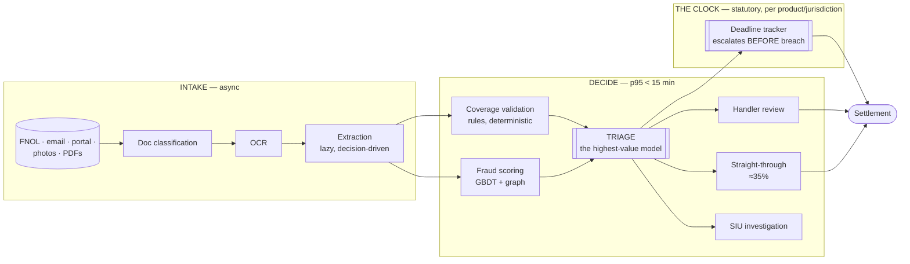

# 07 — Insurance: Claims Automation

> **Archetype G · Document workflow.** The system where a regulated clock runs against an inherently slow investigation.
>
> **Related:** [`../../21_ai-system-design-deep-dives/02_document_intelligence_agent.md`](../../21_ai-system-design-deep-dives/02_document_intelligence_agent.md) and [`../../27_ai-platform-system-design/05_document_intelligence/README.md`](../../27_ai-platform-system-design/05_document_intelligence/README.md) own the **extraction pipeline** and go deeper on it. This design is about the **workflow and the clock**.

---

## The three-sentence compression

1. **The choice that matters most:** **triage is the highest-value model in the system**, not extraction and not fraud scoring. Regulated settlement timelines are hard deadlines with penalties; fraud investigation is inherently slow. Deciding early which claims go straight-through, which need a handler, and which need investigation is what reconciles the two.
2. **The alternative I rejected:** extracting every field from every document before deciding anything. Rejected because a straight-through claim needs only coverage-relevant fields — **lazy, decision-driven extraction is a ~30% cost saving** that comes from reading the workflow rather than the model card.
3. **The failure mode I'd volunteer:** **catastrophe surge.** A hailstorm produces ~10× normal volume in 48 hours while the statutory clock keeps running. A system sized for the average collapses exactly when it matters most, so autoscaling and queue-priority design are functional requirements here, not operational afterthoughts.

---

## Architecture at a glance

---

## Key numbers

| | |
|---|---|
| Ingestion → triage | **p95 < 15 min** (budget ~10.5 min — 4.5 min headroom, sized for surge) |
| **Straight-through rate** | **≥ 35%** of claims settled without human touch |
| Volume | 8k claims/day normal · **25k/day CAT peak (~10×)** |
| **Statutory deadline breaches** | **0** — the non-negotiable |
| Extraction accuracy | ≥ 0.96 field-level F1, confidence-gated |
| Triage precision (fraud → SIU) | ≥ 0.40 — bounded by SIU capacity, not by the model |
| **Cost** | **~$12.7k/month ≈ $0.053/claim** — extraction is ~85% of it |
| Audit write | **On-path, synchronous** — the opposite call from [`../02_banking_fraud_detection/`](../02_banking_fraud_detection/) |

---

## Files

| File | Contents |
|---|---|
| [`01_requirements.md`](01_requirements.md) | The clock-vs-investigation tension, lazy extraction, CAT surge, selection bias in fraud labels |
| [`02_hld.md`](02_hld.md) | Architecture, component choices with rejected alternatives, data flow, NFR mapping, failure modes, scale plan |
| [`03_lld.md`](03_lld.md) | Schemas, API contracts, triage + deadline algorithms, sequence diagrams, state machines, edge cases |
| [`04_production_and_interview.md`](04_production_and_interview.md) | AI-specific concerns, runbook, common mistakes, interview follow-ups, glossary |

**Shared requirements block:** [`../00_requirements_all_systems.md#7-insurance--claims-automation`](../00_requirements_all_systems.md#7-insurance--claims-automation)

---

## The two findings to leave with

1. **Read the workflow before optimising the model.** Extracting lazily — only the fields the *next decision* requires — beats any model swap, and it's invisible if you look only at extraction accuracy.
2. **Human capacity sets two different ceilings here.** Handler review caps straight-through economics; SIU capacity caps fraud-triage precision. Neither is a modelling parameter, and quoting a precision target without checking it against investigator headcount is quoting a number nobody can staff.
