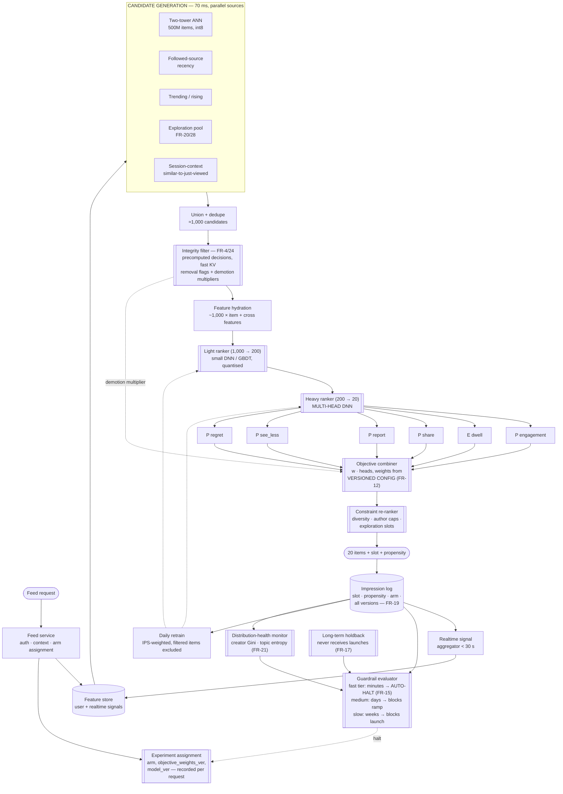
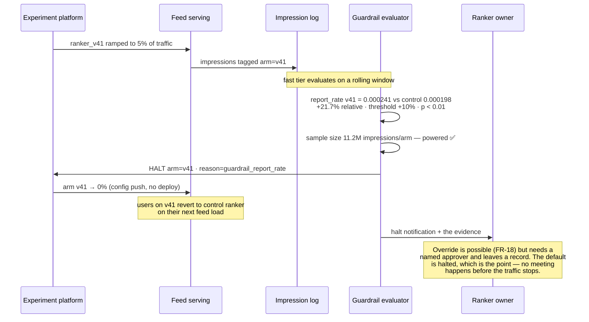

# 08 · HLD — Media: Content Recommendation & Ranking

> ← [`01_requirements.md`](01_requirements.md) · **Next:** [`03_lld.md`](03_lld.md) →
>
> **Mechanics owned elsewhere:** two-tower training, ANN index build, feature-store internals → [`../../27_ai-platform-system-design/06_recommendation_system/README.md`](../../27_ai-platform-system-design/06_recommendation_system/README.md).

---

## 2.1 Architecture



---

## 2.2 Component choices

### Candidate generation — two-tower ANN plus heuristic sources

| | |
|---|---|
| **Chosen** | A two-tower ANN over 500M items (int8, ~128 GB, ~48 nodes, ~$25k/month) **union** several cheap heuristic sources: followed-source recency, trending, exploration pool, session-context similarity |
| **Rejected — ANN only** | Learned retrieval inherits the training distribution's blind spots, so anything the model has not learned to like is unreachable *at retrieval time* and no amount of ranker quality can recover it. Heuristic sources are the diversity insurance |
| **Rejected — heuristics only** | Cannot personalise over 500M items; recency and popularity are the two degenerate feeds |
| **Rejected — a single fused retrieval model** | Elegant, and it removes the ability to reason about *why* a candidate is present. Source attribution per candidate is diagnostically essential — "the feed got worse" is answerable when you can see which source's share moved |
| **Revisit when** | A source's contribution to final impressions falls below ~1% for a sustained period — then it is cost without value and should be retired explicitly rather than left running |

### Integrity filter — precomputed decisions in a fast KV store, before ranking

| | |
|---|---|
| **Chosen** | Removal flags + graded demotion multipliers, precomputed by the integrity platform, served as a KV lookup over ~1,000 candidates in 25 ms |
| **Rejected — synchronous classifier calls** | 1,000 classifier invocations inside 25 ms at 60k RPS is not affordable and not achievable. Integrity decisions are item-level and cacheable; recomputing them per request pays repeatedly for the same answer |
| **Rejected — post-ranking filtering** | Leaves holes in the response and, far worse, lets violating content **into the training data** (FR-25). The model then learns the pattern that made it engaging and generalises to borderline content that cannot be removed |
| **Revisit when** | Never on the ordering. On the mechanism: if integrity decisions become highly context-dependent (same item acceptable in one locale, not another), the KV key gains dimensions rather than the filter gaining a model |

### Ranking — cascaded light then heavy, and the heavy model is multi-head

| | |
|---|---|
| **Chosen** | Light ranker 1,000 → 200 (40 ms), heavy multi-head DNN 200 → 20 (65 ms) |
| **Rejected — single heavy ranker over 1,000 candidates** | The arithmetic settles it: ~65 ms for 200 candidates scales to **~325 ms for 1,000**, against a 335 ms total budget. There is no version of this that fits |
| **Rejected — separate models per objective head** | Six models means six feature hydrations, six inference calls, and six independently-drifting calibrations. **Shared-trunk multi-head is both cheaper and more consistent**, and the heads' correlations are learned rather than assumed away |
| **Rejected — LLM ranker** | 60k RPS inside 350 ms. Not affordable, not fast enough, and not better at this task: ranking is a calibrated-probability problem over dense behavioural features, which is what DNNs do well |
| **Revisit when** | Heavy-ranker latency exceeds ~80 ms (shrink the shortlist or distil), or a head's calibration degrades enough to need its own model |

### The objective combiner — a separate, config-driven stage

| | |
|---|---|
| **Chosen** | Head outputs combined in an explicit stage reading versioned weights, applied after inference and before re-ranking |
| **Rejected — weights baked into the training loss** | Then a weight change requires a retrain, which means weights change rarely, opaquely, and by whoever is training. FR-12 exists to prevent exactly this |
| **Rejected — weights as a learned function of context** | Tempting (different weights for different surfaces) and it destroys accountability: nobody can state what the system is optimising. If context-dependence is needed, it is a **small set of named, reviewable weight profiles**, not a learned function |
| **Revisit when** | Distinct surfaces (video feed, text feed, search) genuinely need different trade-offs — then named profiles per surface, each separately owned |

### Constraint re-ranking — deterministic, after scoring

| | |
|---|---|
| **Chosen** | A deterministic pass enforcing author caps (≤ 3 consecutive), topic spacing, and exploration-slot reservations |
| **Rejected — diversity as a term in the objective only** | A soft penalty produces "usually diverse", and the requirement is a hard cap. Soft constraints are unverifiable; a reviewer cannot confirm ≤ 3 consecutive from a weight |
| **Rejected — MMR-style greedy diversification over the full candidate set** | Fine in principle, too slow over 1,000 candidates inside 20 ms; over the top 200 it is affordable and captures almost all the benefit |
| **Revisit when** | Constraint interactions become complex enough to need a solver — at which point see [`../05_logistics_forecast_optimisation/`](../05_logistics_forecast_optimisation/), though a feed's constraint set is far simpler than a VRPTW |

### Feature store — high-QPS KV with a realtime lane

| | |
|---|---|
| **Chosen** | KV store for precomputed user/item features (~$30k/month) plus a streaming aggregator for the < 30 s realtime lane |
| **Rejected — computing features per request** | 3.6B requests/day × feature computation is orders of magnitude more expensive than reading precomputed values |
| **Rejected — a single store for batch and realtime** | Different access patterns and consistency needs; the realtime lane is small, hot, and append-heavy. Forcing them together makes the batch store's write path the realtime path's bottleneck |
| **Revisit when** | Open question 3 resolves: if 5-minute freshness is imperceptible, the realtime lane collapses into micro-batch and the infrastructure simplifies enormously |

### Experimentation platform — the enforcement mechanism, therefore P0

| | |
|---|---|
| **Chosen** | Arm assignment at request time, recorded on every impression; tiered guardrail evaluation with **automatic halt** on fast-tier regression; a persistent long-term holdback |
| **Rejected — dashboards plus human review** | This is the choice that decides whether the harm NFR is real. Engagement metrics have a dashboard and an owner; harm metrics without auto-halt have a dashboard and a debate |
| **Rejected — offline evaluation only** | Offline metrics are computed on data the current ranker generated, and reward reproducing its biases (see [`01_requirements.md#c-the-feedback-loop`](01_requirements.md)) |
| **Revisit when** | Never on the auto-halt. On the tiering: as traffic grows, fast-tier detection windows shrink and more guardrails can gain halt authority |

### Training — IPS-weighted, daily, with filtered items excluded

| | |
|---|---|
| **Chosen** | Daily retrain on IPS-weighted impression logs, excluding removed items' engagement (FR-25), with a randomised-slot stream as an unbiased evaluation set |
| **Rejected — naive training on impressions** | Learns position bias as if it were preference, then serves it, then relearns it. The loop tightens each day |
| **Rejected — randomising all slots** | Unbiased and unshippable; a randomised feed is a bad feed |
| **Revisit when** | IPS variance becomes the limiting factor — then doubly-robust estimators, at the cost of a reward model that itself needs validating |

---

## 2.3 Data flow

### A normal feed request

```
GET /feed  (user U, session S, surface = home)
  ↓  auth, context assembly, ARM ASSIGNMENT
     arm = ranker_v41_candidate · objective_weights_ver = w17          15 ms
  ↓  feature fetch: U's embedding, long-term interests,
     realtime session signals (last 30 s of interactions)              30 ms
  ↓  CANDIDATE GENERATION — 5 sources in parallel                      70 ms
       two-tower ANN            → 600 candidates
       followed-source recency  → 200
       trending                 → 100
       exploration pool         →  60   (FR-20: uncertainty + new items)
       session-context          →  90
     union + dedupe            → 1,010 candidates, each tagged with source
  ↓  INTEGRITY FILTER (FR-4)                                           25 ms
       38 removed (policy)
       114 carry demotion multipliers 0.2–0.8
       → 972 candidates survive
  ↓  feature hydration for 972 candidates                              55 ms
  ↓  LIGHT RANKER → top 200                                            40 ms
  ↓  HEAVY RANKER, 6 heads × 200 candidates                            65 ms
  ↓  OBJECTIVE COMBINER, weights w17                                    (in-stage)
       item #3 by engagement score falls to #27 because
       P(report) = 0.011 against a base rate of 0.0002
  ↓  CONSTRAINT RE-RANK                                                20 ms
       author cap: one creator had 5 of the top 20 → 2 displaced
       2 exploration slots reserved (slots 7 and 14)
  ↓  response assembly, propensity attached per slot                   15 ms
                                                            ≈ 335 ms
  ↓  IMPRESSION LOG: 20 rows × (item, slot, propensity, source,
     arm, model_ver, objective_weights_ver, integrity_ver)
```

The single most important line in that trace is the objective combiner demoting an item from #3 to #27 on predicted report probability. That is the whole design working: not a filter catching something after the fact, but the ranker **anticipating** harm and pricing it.

### A guardrail auto-halt



Note what is *not* in that diagram: a human deciding to stop. The halt precedes the conversation.

---

## 2.4 How the NFRs are met

| NFR | Mechanism | Where it could fail |
|---|---|---|
| p95 < 350 ms | 335 ms budget; cascaded ranking; parallel candidate sources; precomputed integrity and features | **15 ms headroom is genuinely thin.** Any new stage must displace an existing one, and a feature-store p99 excursion is the most likely breach |
| p99 < 600 ms | Per-stage timeouts with partial degradation: a slow candidate source is dropped, not waited on | A slow *heavy ranker* cannot be dropped; it degrades to light-ranker order |
| 60k RPS peak | ~100 GPUs for the heavy ranker; horizontally scaled retrieval and feature reads | Regional imbalance; GPU fleet is the expensive constraint |
| Availability 99.95% | Degraded ladder: full → light-ranker-only → cached feed → followed-source chronological | The cached feed must be genuinely warm; a cold fallback is a blank screen |
| Freshness < 30 s | Streaming aggregator into the realtime feature lane | If this is over-engineered relative to real need (open question 3), it is the most expensive unnecessary component in the design |
| **Harm guardrails release-blocking** | Multi-head prediction (FR-11) + versioned weights (FR-12) + tiered guardrails with auto-halt (FR-15) + holdback (FR-17) | Thresholds set permissively; slow metrics not instrumented at sufficient volume (open question 2). **The mechanism is sound and the numbers are the risk** |
| Diversity ≤ 3 consecutive/author | Hard constraint in the deterministic re-ranker | Interaction with exploration slots — resolved by fixed precedence, see [`03_lld.md`](03_lld.md) |
| Cost ≤ $0.00012/request | ~$0.0000012 achieved — 100× inside | **The binding constraint is total spend (~$132k/mo), not per-request.** Ranker size is the lever |
| Ranker retrained ≥ daily | Daily IPS-weighted retrain | Training on biased logs without correction is worse than not retraining |
| Integrity coverage 100% | Filter-first over the full candidate set | Filter freshness (FR-27): a newly-actioned item must stop being served within 60 s |

---

## 2.5 Failure modes

| Failure | Detection | Blast radius | Degraded mode |
|---|---|---|---|
| **Heavy ranker unavailable** | Health + timeout | All feeds lose personalised ordering quality | **Serve light-ranker order for the top 200.** Materially worse, entirely acceptable — and note the light ranker must therefore be trained to be *usable alone*, not merely as a filter |
| **Feature store slow (p99 excursion)** | Latency | Most likely cause of a p95 breach | Serve with stale features (last known values) rather than waiting; mark impressions `stale_features` so training can down-weight them |
| **A candidate source times out** | Per-source latency | Reduced diversity | Drop that source, proceed with the rest. Record which source was missing — the impression log must not imply a source contributed nothing when it was absent |
| **Integrity KV unavailable** | Health | **Cannot guarantee policy compliance** | **Fail closed to a safe subset:** serve only from followed sources and items with a cached clearance. A blank-ish feed is recoverable; a single amplified violation is a reputational event. Contrast [`../02_banking_fraud_detection/`](../02_banking_fraud_detection/)'s fail-open — there, blocking everything harms millions of legitimate users; here, the safe subset is still a usable product |
| **Integrity decisions stale** | Freshness lag metric | Recently-actioned content still served | Hard freshness alarm at 60 s (FR-27); this is a correctness failure, not a latency one |
| **Objective weights misconfigured** | Guardrail fast tier | Potentially severe and fast — this is the config that decides what the product amplifies | Weights are versioned with instant rollback; **weight changes ramp through experiments (FR-14)** so a bad weight set is caught at 1% traffic, not 100% |
| **Guardrail evaluator down** | Health check — **blocks all ramps** | Cannot enforce the primary NFR | **No experiment may ramp while the evaluator is down.** Freezing ramps is the correct degradation; ramping blind is how the mechanism becomes decorative |
| **Feedback-loop collapse** | Creator Gini rising, topic entropy falling, offline metrics improving | Slow, weeks-long, and **invisible to every standard metric** | Distribution health as a release guardrail (FR-21); exploration floor (FR-20/28). The signature to watch for is offline AUC up while diversity down |
| **Popularity runaway** | Top-1% creator impression share | Supply side starves; corpus stops renewing | New-item impression floor; distribution-fairness term in the objective |
| **Position-bias amplification** | Divergence between IPS-corrected and naive offline metrics | The model learns slot position as preference | IPS weighting + randomised-slot stream (FR-22) as ground truth |
| **Exploration pool poisoned** | Exploration-slot report rate | Untested content in guaranteed slots is an attack surface: post something, get a free impression floor | Exploration items pass the **same** integrity filter, plus a stricter reputation floor for the guaranteed-impression path |
| **Cold-start user gets a degenerate feed** | New-user session-2 return rate | Poor first impression, high churn cost at the worst moment | Popularity + locale + declared-interest fallback with heavy diversity, then rapid personalisation from session signals |
| **Realtime lane lagging** | Consumer lag | Feed feels unresponsive to just-taken actions | Serve from batch features; the feed degrades in *reactivity*, not correctness |

---

## 2.6 Scale plan

### 10× (600k RPS, 3B DAU-equivalent load)

| Bottleneck | Fix |
|---|---|
| Heavy-ranker GPU fleet (~1,000 GPUs, ~$730k/mo) | This is where the money is. **Distillation and quantisation stop being optimisations and become the roadmap** — a 30% size cut is ~$220k/month |
| ANN index (5B items) | Multi-tier: hot shard in memory, cold on SSD; aggressive int8/PQ; regional index partitioning |
| Feature store QPS | Regional replicas; batch feature reads per request rather than per candidate |
| Impression log volume (36B/day) | Sampling for training (full-fidelity logging only for guardrails and a training sample); this is the first place where full logging genuinely stops being affordable |
| Guardrail detection | *Easier* at 10× — more traffic means faster detection, so more guardrails can gain auto-halt authority. The rare case where scale helps the safety mechanism |

### 100× — where the shape changes

Two qualitative changes:

1. **Retrieval and ranking merge under latency pressure.** At 500B items, a two-stage funnel from the full corpus stops being viable, and the architecture moves to hierarchical retrieval — coarse partitioning (locale, language, broad topic) before any learned retrieval. The funnel gains a stage rather than the stages getting faster.
2. **The objective becomes multi-surface and the weights fragment.** One weight set cannot serve a video surface, a text surface, a search surface, and a messaging surface, and the temptation is to learn the weights contextually — which destroys the accountability that makes FR-12 valuable. The right answer is **named weight profiles per surface, each with an owner**, and the organisational cost of that is the real scaling problem, not the compute.

> The second point is worth stating in an interview because it is where scale threatens the *governance* rather than the infrastructure — and governance is what this design's primary NFR depends on.

---

← [`01_requirements.md`](01_requirements.md) · **Next:** [`03_lld.md`](03_lld.md) →
