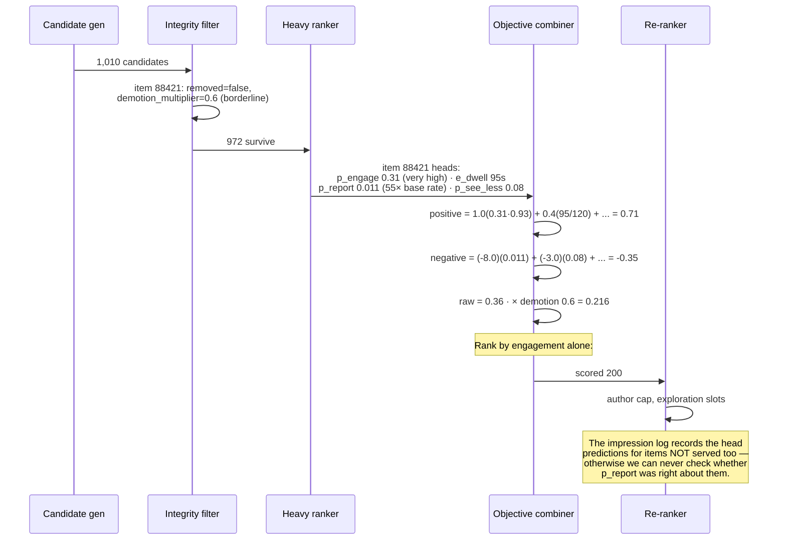
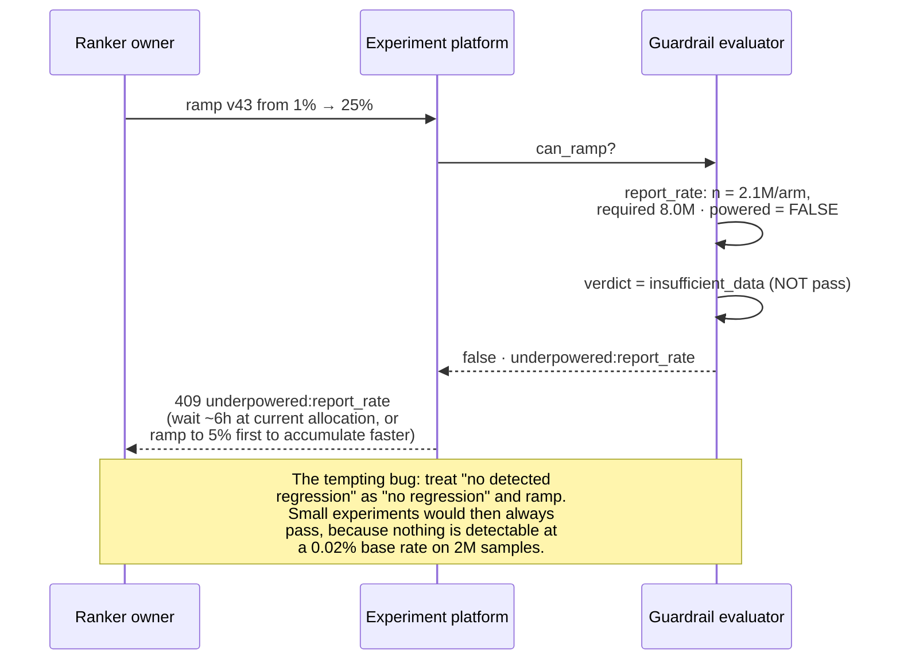
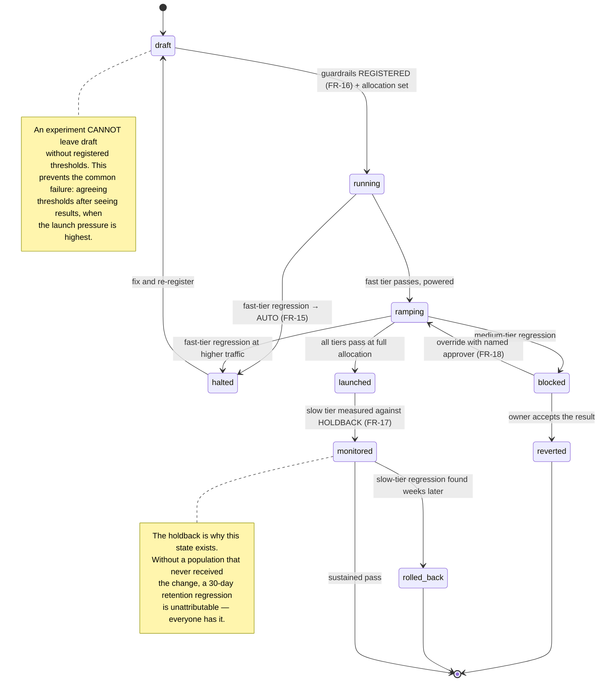
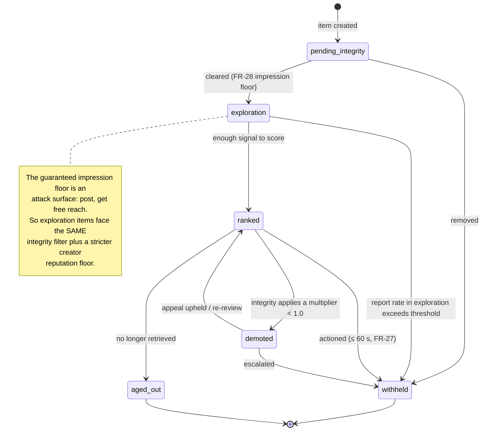

# 08 · LLD — Media: Content Recommendation & Ranking

> ← [`02_hld.md`](02_hld.md) · **Next:** [`04_production_and_interview.md`](04_production_and_interview.md) →

---

## 3.1 Schemas

### The objective weights — the most important config in the system

```sql
-- FR-12. Versioned, owned, auditable. This table decides what the product amplifies.
CREATE TABLE objective_weight_sets (
    weights_ver         TEXT PRIMARY KEY,       -- 'w17'
    surface             TEXT NOT NULL,          -- home | video | search  (named profiles, not learned)
    weights             JSONB NOT NULL,         -- {engage: 1.0, dwell: 0.4, report: -8.0, ...}
    satiation_caps      JSONB NOT NULL,         -- FR-13: per-term caps, e.g. {dwell_s: 120}
    owner               TEXT NOT NULL,          -- a NAMED PERSON, not a team alias
    rationale           TEXT NOT NULL,          -- why these numbers. Non-null on purpose.
    approved_by         TEXT NOT NULL,
    experiment_id       TEXT,                   -- FR-14: how it was validated before 100%
    effective_from      TIMESTAMPTZ NOT NULL,
    superseded_by       TEXT REFERENCES objective_weight_sets(weights_ver),
    CHECK (jsonb_typeof(weights) = 'object')
);
```

> **Why `rationale` and `owner` are NOT NULL:** the negative weights encode how much engagement a unit of user-reported harm is worth. That number will be questioned — by a regulator, by a journalist, by a new engineer — and "it was in the config" is not an answer. Requiring a written rationale at write time is cheap; reconstructing one two years later is not.

### Impressions — the training data, the guardrail data, and the bias correction

```sql
-- FR-19. 3.6B rows/day. Columnar store, partitioned by hour.
CREATE TABLE impressions (
    impression_id       BIGINT,
    request_id          BIGINT NOT NULL,
    user_id             BIGINT NOT NULL,
    item_id             BIGINT NOT NULL,
    served_at           TIMESTAMPTZ NOT NULL,
    surface             TEXT NOT NULL,

    slot                SMALLINT NOT NULL,      -- 0..19. Without this, position bias is untrainable.
    propensity          REAL NOT NULL,          -- P(this item in this slot | policy) for IPS
    randomised_slot     BOOLEAN NOT NULL,       -- FR-22: bias-free evaluation stream
    exploration_slot    BOOLEAN NOT NULL,       -- FR-20: served for exploration, not score

    candidate_source    TEXT NOT NULL,          -- ann | followed | trending | exploration | session
    candidate_set_size  SMALLINT NOT NULL,      -- what it competed against

    -- head predictions, retained so calibration is measurable per head
    p_engage            REAL NOT NULL,
    e_dwell             REAL NOT NULL,
    p_share             REAL NOT NULL,
    p_report            REAL NOT NULL,
    p_see_less          REAL NOT NULL,
    p_regret            REAL NOT NULL,
    demotion_multiplier REAL NOT NULL,          -- FR-26, from integrity
    final_score         REAL NOT NULL,

    -- every version that produced this row
    arm                 TEXT NOT NULL,
    light_ranker_ver    TEXT NOT NULL,
    heavy_ranker_ver    TEXT NOT NULL,
    weights_ver         TEXT NOT NULL,
    integrity_ver       TEXT NOT NULL,
    stale_features      BOOLEAN NOT NULL DEFAULT FALSE,  -- degraded serving; down-weight in training
    holdback            BOOLEAN NOT NULL DEFAULT FALSE   -- FR-17
) PARTITION BY RANGE (served_at);

-- Outcomes arrive separately and late. Joined by impression_id.
CREATE TABLE interactions (
    impression_id       BIGINT NOT NULL,
    kind                TEXT NOT NULL,          -- click | dwell | share | report | see_less
                                                --   | hide | follow | back_out
    value               REAL,                   -- dwell seconds; share sentiment; etc.
    occurred_at         TIMESTAMPTZ NOT NULL
);
```

Storing the **head predictions** on every impression is what makes per-head calibration measurable after the fact. An aggregate AUC cannot tell you that `p_report` has drifted while `p_engage` is fine — and `p_report` drifting is the failure that matters.

### Integrity decisions — read at 1,000 keys per request

```sql
-- FR-24/26. Written by the integrity platform, read by serving. Never computed inline.
-- Physically a KV store (item_id → packed struct); shown as a table for clarity.
CREATE TABLE integrity_decisions (
    item_id             BIGINT PRIMARY KEY,
    removed             BOOLEAN NOT NULL,       -- hard exclusion
    demotion_multiplier REAL NOT NULL DEFAULT 1.0,   -- graded, 0.0–1.0
    reason_class        TEXT,                   -- for creator transparency (FR-30), aggregated
    locale_overrides    JSONB,                  -- per-market variation, if any
    decided_at          TIMESTAMPTZ NOT NULL,
    integrity_ver       TEXT NOT NULL
);
```

Graded demotion (FR-26) matters because the binary alternative forces every borderline case into either full promotion or removal, and the borderline set is large. A 0.3 multiplier is the honest representation of "probably fine, don't amplify".

### Experiments and guardrails

```sql
CREATE TABLE experiments (
    experiment_id       TEXT PRIMARY KEY,
    hypothesis          TEXT NOT NULL,
    arms                JSONB NOT NULL,         -- {control: {...}, v41: {ranker_ver, weights_ver}}
    traffic_allocation  JSONB NOT NULL,
    state               TEXT NOT NULL,          -- draft | running | halted | ramping | launched
    started_at          TIMESTAMPTZ,
    halted_at           TIMESTAMPTZ,
    halt_reason         TEXT
);

-- FR-16: thresholds are PRE-REGISTERED. An experiment cannot start without them.
CREATE TABLE guardrail_registrations (
    experiment_id       TEXT NOT NULL REFERENCES experiments(experiment_id),
    metric              TEXT NOT NULL,          -- report_rate | see_less_rate | creator_gini | ...
    tier                TEXT NOT NULL,          -- fast | medium | slow
    max_relative_regression REAL NOT NULL,      -- e.g. 0.10
    min_sample_per_arm  BIGINT NOT NULL,        -- powered, computed at registration time
    halt_authority      BOOLEAN NOT NULL,       -- only fast tier is TRUE
    registered_at       TIMESTAMPTZ NOT NULL,
    registered_by       TEXT NOT NULL,
    PRIMARY KEY (experiment_id, metric)
);

CREATE TABLE guardrail_evaluations (
    evaluation_id       BIGSERIAL PRIMARY KEY,
    experiment_id       TEXT NOT NULL,
    metric              TEXT NOT NULL,
    arm                 TEXT NOT NULL,
    control_value       DOUBLE PRECISION NOT NULL,
    arm_value           DOUBLE PRECISION NOT NULL,
    relative_delta      DOUBLE PRECISION NOT NULL,
    p_value             DOUBLE PRECISION NOT NULL,
    samples_per_arm     BIGINT NOT NULL,
    powered             BOOLEAN NOT NULL,       -- underpowered ⇒ NOT a pass, just "unknown"
    verdict             TEXT NOT NULL,          -- pass | regression | insufficient_data
    action              TEXT,                   -- halt | block_ramp | none
    evaluated_at        TIMESTAMPTZ NOT NULL
);

CREATE TABLE guardrail_overrides (            -- FR-18
    evaluation_id       BIGINT NOT NULL REFERENCES guardrail_evaluations(evaluation_id),
    approver            TEXT NOT NULL,
    justification       TEXT NOT NULL,
    approved_at         TIMESTAMPTZ NOT NULL
);
```

> `powered` deserves a note. An underpowered evaluation is `insufficient_data`, never `pass`. Treating "we couldn't detect a regression" as "there is no regression" is the most common way a guardrail becomes decorative — small experiments sail through because nothing was detectable.

---

## 3.2 API contracts

```
GET /v1/feed?surface=home&cursor=<opaque>
  → 200 {
      items: [ { item_id, slot, render_hints, exploration: bool } ],
      cursor: <opaque>,
      debug_token: <opaque>     -- resolves to the full decision trace internally only
    }

  Deliberately absent from the response: scores, head predictions, arm name,
  weights version. All of it is internal, and all of it is logged. A client
  that can see the score is a client that can be optimised against.

POST /v1/feedback
  body { item_id, kind: see_less | hide | report | not_interested, reason? }
  → 202 {}
  FR-10: must MEASURABLY alter subsequent ranking. Enters the realtime lane
  within 30 s, and is a training label, not just a UI acknowledgement.

GET  /internal/v1/decision/{debug_token}
  → 200 { candidates_by_source, integrity_actions, head_predictions,
          objective_weights, constraint_adjustments, versions }
  The complete trace for one request. Retained briefly (hours) — it is a
  debugging tool, not an audit store.

POST /internal/v1/experiments/{id}/ramp
  body { allocation }
  → 200 {}
  → 409 { error: "guardrail_evaluator_unavailable" }
       No ramping while the evaluator is down. Ramping blind is exactly how
       the mechanism becomes decorative.
  → 409 { error: "guardrail_regression", metric, evaluation_id }

GET  /v1/creator/{id}/distribution                       -- FR-30
  → 200 { impressions_7d, delta_vs_prior, top_factors: [
            { factor: "see_less_rate", direction: "above_typical", magnitude: "moderate" } ] }
  Aggregate and qualitative on purpose. Per-item, precisely-quantified
  explanations are a ranking-gaming manual.
```

---

## 3.3 Core algorithms

### The scoring function

```python
def score_item(heads, weights, caps, demotion_multiplier) -> float:
    """The objective. Every term is either bounded or composite (FR-13)."""

    # Composite: a click that is immediately backed out of is not engagement.
    engage = heads.p_engage * (1.0 - heads.p_back_out)

    # Satiation-capped: credit rises to the cap, then flattens. Without this,
    # slow and withholding content outranks content that answers immediately.
    dwell = min(heads.e_dwell, caps['dwell_s']) / caps['dwell_s']

    # Shares are signed. A post shared in outrage is shared AGAINST.
    share = heads.p_share * heads.share_sentiment          # sentiment ∈ [-1, 1]

    positive = (weights['engage']    * engage
              + weights['dwell']     * dwell
              + weights['share']     * share
              + weights['diversity'] * heads.novelty
              + weights['creator']   * heads.distribution_fairness)

    # Negative terms use weights that are LARGE relative to the positives, because
    # the base rates are tiny. w_report ≈ -8 against P(report) ≈ 0.0002 means a
    # 50× elevated report probability (0.01) costs -0.08 — comparable to a strong
    # engagement signal. Setting w_report = -1 would make the term arithmetically
    # invisible, which is the most common way a multi-objective ranker is
    # single-objective in practice.
    negative = (weights['report']  * heads.p_report
              + weights['seeless'] * heads.p_see_less
              + weights['hide']    * heads.p_hide
              + weights['regret']  * heads.p_regret)

    raw = positive + negative                               # negative weights are negative

    # Integrity demotion is MULTIPLICATIVE and applied last: it scales whatever
    # the objective concluded, so a highly-engaging borderline item is demoted
    # proportionally rather than being rescued by a large positive score.
    return raw * demotion_multiplier
```

> The comment about weight magnitude is the practical trap. A team can add negative terms, ship them, and have changed nothing measurable, because a −1 weight on a 0.0002 base rate is arithmetic noise next to a 1.0 weight on a 0.15 engagement probability. **Multi-objective is not a structure, it is a set of magnitudes** — which is another reason `rationale` on the weight set is mandatory.

### Constraint re-ranking with explicit precedence

```python
def constrained_rerank(scored, k=20, cfg=...) -> list[Item]:
    """Deterministic. Precedence is FIXED and documented, because constraints
    conflict and 'it depends' is unverifiable."""

    # Precedence, highest first:
    #   1. exploration slot reservations   (FR-20/28 — supply-side survival)
    #   2. author consecutive cap          (FR-5 — hard requirement)
    #   3. topic spacing                   (soft, best-effort)
    #   4. score order                     (everything else)

    out, consec_author, recent_topics = [], {}, deque(maxlen=cfg.topic_window)
    explore_slots = set(cfg.exploration_slots)              # e.g. {7, 14}
    pool = sorted(scored, key=lambda x: -x.score)
    explore_pool = [x for x in pool if x.is_exploration]

    for slot in range(k):
        if slot in explore_slots and explore_pool:
            pick = explore_pool.pop(0)                       # precedence 1
        else:
            pick = None
            for cand in pool:
                if cand.placed:
                    continue
                last = out[-1].author_id if out else None
                run = consec_author.get(cand.author_id, 0) if cand.author_id == last else 0
                if run >= cfg.max_consecutive_author:        # precedence 2: HARD
                    continue
                if cand.topic in recent_topics and not cfg.allow_topic_repeat:
                    continue                                 # precedence 3: soft
                pick = cand
                break
            if pick is None:
                # Every remaining candidate violates a soft constraint. Relax
                # topic spacing rather than returning a short feed — a hole is
                # worse than a repeat, and the author cap is never relaxed.
                pick = next(c for c in pool
                            if not c.placed
                            and consec_run(c, out) < cfg.max_consecutive_author)

        pick.placed = True
        pick.slot = slot
        pick.propensity = estimate_propensity(pick, pool, slot)   # FR-19, for IPS
        out.append(pick)
        recent_topics.append(pick.topic)
        consec_author[pick.author_id] = (
            consec_author.get(pick.author_id, 0) + 1 if out[-2:-1] and
            out[-2].author_id == pick.author_id else 1)

    return out
```

Two decisions worth naming: exploration slots win over score because otherwise they are silently starved by a strong candidate; and the author cap is **never** relaxed while topic spacing is, because one is a stated requirement and the other is a preference.

### Guardrail evaluation with auto-halt

```python
def evaluate_guardrails(experiment_id):
    """FR-15. The halt precedes the conversation."""
    exp = load_experiment(experiment_id)
    if exp.state not in ('running', 'ramping'):
        return

    for reg in load_registrations(experiment_id):
        for arm in exp.treatment_arms:
            c = metric_value(reg.metric, exp.control_arm, window=reg.window)
            t = metric_value(reg.metric, arm,             window=reg.window)
            n = min(samples(exp.control_arm), samples(arm))

            powered = n >= reg.min_sample_per_arm
            delta   = (t - c) / c if c else 0.0
            p       = two_proportion_p_value(c, t, n) if is_rate(reg.metric) else t_test_p(...)

            if not powered:
                # NOT a pass. "Undetectable" is not "absent".
                verdict, action = 'insufficient_data', None
            elif delta > reg.max_relative_regression and p < 0.05:
                verdict = 'regression'
                action  = 'halt' if reg.halt_authority else 'block_ramp'
            else:
                verdict, action = 'pass', None

            eid = record_evaluation(...)

            if action == 'halt':
                halt_experiment(experiment_id, arm,
                                reason=f'guardrail_{reg.metric}')   # config push, no deploy
                notify_owner(exp.owner, eid)
            elif action == 'block_ramp':
                block_ramp(experiment_id, reason=reg.metric)


def can_ramp(experiment_id) -> tuple[bool, str]:
    if not guardrail_evaluator_healthy():
        return False, 'guardrail_evaluator_unavailable'   # freeze, don't proceed blind
    for reg in load_registrations(experiment_id):
        latest = latest_evaluation(experiment_id, reg.metric)
        if latest is None:
            return False, f'no_evaluation_yet:{reg.metric}'
        if latest.verdict == 'regression' and not has_override(latest.evaluation_id):
            return False, f'guardrail_regression:{reg.metric}'
        if latest.verdict == 'insufficient_data' and reg.tier != 'slow':
            return False, f'underpowered:{reg.metric}'    # wait for data, don't assume
    return True, ''
```

### IPS-weighted training

```python
def build_training_batch(window):
    """Correct for the fact that the training data is the system's own output."""
    rows = []
    for imp in impressions_in(window):
        if imp.removed_by_integrity:
            continue                    # FR-25: never a positive label, ever
        if imp.holdback:
            continue                    # FR-17: holdback stays clean for measurement

        # Inverse propensity: an item shown in slot 0 with high propensity carries
        # less weight than an equally-engaged item shown in slot 18. Without this
        # the model learns slot position and calls it preference.
        w = 1.0 / max(imp.propensity, MIN_PROPENSITY)   # clipped: unbounded weights
                                                        # from tiny propensities are
                                                        # the classic IPS variance blow-up
        if imp.stale_features:
            w *= STALE_FEATURE_DISCOUNT                 # degraded serving; weaker evidence

        labels = load_labels(imp.impression_id)
        rows.append(TrainingRow(features=..., labels=labels, weight=w))

    return rows


def evaluate_offline(model):
    """Evaluate on the RANDOMISED-SLOT stream (FR-22), not on normal traffic.

    Evaluating on normal-traffic logs measures agreement with the current policy,
    which is exactly the thing we might be trying to change. Offline AUC rising on
    biased logs while creator diversity falls is the signature of the loop closing,
    and it is easy to mistake for progress.
    """
    return metrics_on(model, randomised_slot_impressions())
```

### Distribution-health monitoring

```python
def distribution_health(arm, window) -> dict:
    """FR-21. The cheapest mitigation for the feedback loop, and the most skipped."""
    imps = impressions(arm, window)
    by_creator = counter(i.author_id for i in imps)
    by_topic   = counter(i.topic     for i in imps)

    return {
        'creator_gini':        gini(by_creator.values()),
        'top1pct_share':       top_k_share(by_creator, pct=0.01),
        'topic_entropy':       entropy(by_topic.values()),
        'new_item_share':      share(i for i in imps if i.item_age_h < 24),
        'new_creator_estab':   new_creators_reaching_threshold(window),
        'exploration_share':   share(i for i in imps if i.exploration_slot),
    }
```

---

## 3.4 Sequence diagrams

### The objective demoting a high-engagement item



That last note is a real design detail: shortlisted-but-unserved items are logged with their predictions, because calibrating `p_report` requires knowing what happened to items the model *predicted* would be reported — and if they were never served, the only evidence is what similar served items did.

### An underpowered experiment tries to ramp



---

## 3.5 State machines

### Experiment lifecycle



### Item distribution lifecycle



---

## 3.6 Edge cases

| # | Case | Handling |
|---|---|---|
| 1 | Fewer than 20 candidates survive integrity filtering | Backfill from followed-source recency and popularity; **never return a short feed** — but log it, because a systematically short feed for a user segment is a real bug hiding as a UI quirk |
| 2 | All top-200 candidates share one author (a user follows exactly one prolific creator) | Author cap would return 3 items. Cap applies to *consecutive* items, not total, precisely for this case; and if the cap still cannot be satisfied, it yields rather than truncating the feed |
| 3 | Exploration slot has no eligible exploration candidate | Slot reverts to score order; the impression is **not** marked `exploration_slot`, or the exploration-share metric becomes a lie |
| 4 | `p_report` head predicts 0.4 for a mainstream item | Almost certainly miscalibration, not a discovery. Per-head calibration monitoring alarms; a head whose calibration has degraded gets its weight zeroed by config until fixed — **the weight is the kill switch** |
| 5 | User reports an item that the ranker gave a very low `p_report` | Exactly the training signal wanted. High-surprise reports are up-weighted in the next retrain |
| 6 | Feature store returns stale features | Serve with them; mark `stale_features`; down-weight in training. Waiting would breach the 15 ms headroom |
| 7 | Two candidate sources return the same item | Deduped, but `candidate_source` records the **highest-priority** source and a `also_from` list — otherwise source-contribution analysis double-counts |
| 8 | An item is actioned by integrity 5 seconds after being served | It was served legitimately under the then-current decision. `integrity_ver` on the impression makes that reconstructable; it is not retroactively a violation |
| 9 | Objective weight set references a head the model doesn't produce | Rejected at config-push validation, not at serving time. A serving-time failure here would degrade every feed silently |
| 10 | Guardrail evaluator sees a *improvement* beyond threshold | Not a halt, but flagged: a large unexpected improvement in a harm metric is usually an instrumentation bug (e.g. the report button broke) |
| 11 | Experiment arm has a tiny allocation and never reaches power | Stays `insufficient_data` forever and cannot ramp. Correct, and the fix is a larger allocation — not a lower bar |
| 12 | User in the long-term holdback triggers a launched feature via a shared surface | Holdback integrity is checked at feature-flag level, and violations are logged. A leaky holdback silently invalidates all slow-metric measurement, so leaks must be visible |
| 13 | Cold-start user, zero history | Popularity + locale + declared interests, heavy diversity, exploration share raised. Session signals dominate within ~3 interactions |
| 14 | Brand-new item with zero engagement | FR-28 impression floor within its first N hours; `propensity` reflects the exploration policy, not the ranker, so IPS handles it correctly |
| 15 | A creator's reach drops because of a *ranker* change, not their content | FR-30's aggregate explanation must be honest about this: `top_factors` can include `ranking_model_update`. Attributing a ranker change to the creator's content is the dishonest failure mode |
| 16 | Randomised-slot request served to a user who then has a bad session | Accepted cost, and the reason randomised-slot share is small and capped per user per week — the same user should not repeatedly get the degraded feed |
| 17 | Heavy ranker returns NaN for a head | Item dropped from scoring with an alarm; NaN propagating into the combiner would corrupt the whole ranking, so the guard is per-item |
| 18 | Weights version rolled back mid-session | Feed composition changes between loads. Acceptable; the impression log records which version served each load, so analysis is not confused by the mix |

---

← [`02_hld.md`](02_hld.md) · **Next:** [`04_production_and_interview.md`](04_production_and_interview.md) →
