# 08 — Media: Content Recommendation & Ranking

> **Archetype D · Retrieval & ranking.** The system where **the objective function is the design**.
>
> **Related:** [`../../27_ai-platform-system-design/06_recommendation_system/README.md`](../../27_ai-platform-system-design/06_recommendation_system/README.md) is the reference recsys design in this repo and owns the **mechanics** — two-tower training, ANN indexing, feature stores, cascaded ranking. **Read it for how the pipeline works.** This design's distinctive contribution is what that pipeline is pointed *at*: a multi-term objective with release-blocking harm guardrails, and the architecture that a blocking guardrail forces.

---

## The three-sentence compression

1. **The choice that matters most:** the ranking objective is **multi-term with explicit negative weights**, and the weights live in versioned config owned by a named product owner — not in a modeller's loss function. A single-objective ranker trained on clicks reliably discovers that outrage and cliffhangers maximise clicks; that is a property of the objective, not a bug in the model.
2. **The alternative I rejected:** monitoring harm metrics on a dashboard beside the engagement metrics. Rejected because engagement wins every time it is measured against something advisory — **the guardrails have to be release-blocking with auto-halt**, which is an architectural requirement on the experimentation platform, not a policy statement.
3. **The failure mode I'd volunteer:** **feedback-loop collapse.** The ranker's own outputs become tomorrow's training data, so a small early bias compounds into a degenerate distribution — a handful of creators, a narrowing topic set — and every offline metric looks fine because the model is predicting its own behaviour accurately.

---

## Architecture at a glance

```mermaid
flowchart LR
    REQ([Feed request]) --> CTX[Context +<br/>user features]
    CTX --> CG[["Candidate generation<br/>500M → ~1,000<br/>two-tower ANN + heuristic sources"]]
    CG --> INT[["Integrity filter<br/>BEFORE ranking (FR-4)"]]
    INT --> HYD[Feature hydration<br/>~1,000 candidates]
    HYD --> L1[["Light ranker<br/>1,000 → 200"]]
    L1 --> L2[["Heavy ranker<br/>200 → 20<br/>multi-head: engagement AND harm"]]
    L2 --> OBJ[["Objective combiner<br/>weights from VERSIONED CONFIG"]]
    OBJ --> DIV[Diversity +<br/>constraint re-rank]
    DIV --> OUT([20 items])
    OUT -.->|impressions, dwell,<br/>reports, 'see less'| LOG[(Interaction log)]
    LOG --> GUARD[["Guardrail evaluator<br/>can AUTO-HALT a rollout (FR-9)"]]
    LOG --> TRAIN[Daily retrain]
    TRAIN -.-> L2
```

---

## Key numbers

| | |
|---|---|
| Feed latency | **p95 < 350 ms** (budget ~335 ms — **15 ms headroom**, the thinnest in this collection) |
| Funnel | 500M → ~1,000 → 200 → 20 |
| Throughput | 60k feed requests/s peak · 3.6B requests/day |
| **Harm guardrails** | Reported-content rate, "see less" rate, regret score — **release-blocking**, equal status to engagement |
| Signal freshness | Interaction → next load **< 30 s** |
| Cost | **~$132k/month**, but **~$0.0000012/request — 100× inside the ceiling** |
| The cost inversion | Per-request cost is trivial; **total** cost is large ⇒ the lever is model size and fleet utilisation, not per-request efficiency |
| No LLM in the serving path | 60k RPS × 350 ms makes it neither affordable nor fast enough |

---

## Files

| File | Contents |
|---|---|
| [`01_requirements.md`](01_requirements.md) | The objective function as the design, blocking guardrails, feedback loops, position bias, creator-side distribution |
| [`02_hld.md`](02_hld.md) | Architecture, component choices with rejected alternatives, data flow, NFR mapping, failure modes, scale plan |
| [`03_lld.md`](03_lld.md) | Schemas, API contracts, the scoring function, diversity re-ranking, guardrail evaluation, sequence diagrams, edge cases |
| [`04_production_and_interview.md`](04_production_and_interview.md) | AI-specific concerns, runbook, common mistakes, interview follow-ups, glossary |

**Shared requirements block:** [`../00_requirements_all_systems.md#8-media--content-recommendation--ranking`](../00_requirements_all_systems.md#8-media--content-recommendation--ranking)

---

## The three findings to leave with

1. **Cascading exists because of arithmetic, not elegance.** Scoring 1,000 candidates with the heavy ranker costs ~325 ms of a 350 ms budget on its own. The 1,000 → 200 → 20 ratio is tuned against that budget and nothing else.
2. **A metric that cannot block a release is not a constraint.** The difference between a design that says it cares about harm and one that does is whether the experimentation platform can halt a rollout without a human deciding to.
3. **The training data is the system's own output.** Every recsys is a closed loop, so exploration, position-bias correction, and distribution monitoring are not extras — they are what stops the model from confidently learning to predict itself.
