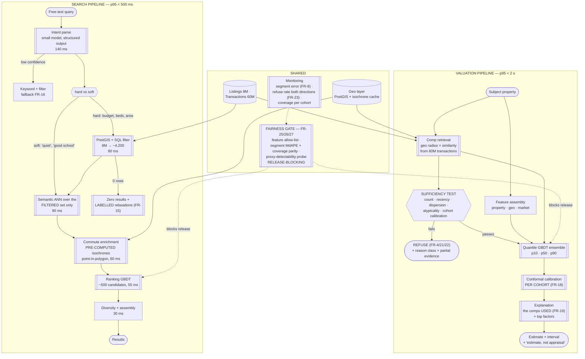

# 09 · HLD — Real Estate: Property Search, Valuation & Recommendation

> ← [`01_requirements.md`](01_requirements.md) · **Next:** [`03_lld.md`](03_lld.md) →

---

## 2.1 Architecture

Two pipelines, drawn separately because they *are* separate. They share the corpus, the geo layer, and the fairness gate.



---

## 2.2 Component choices

### Intent parsing — small model with structured output

| | |
|---|---|
| **Chosen** | A small-tier model returning a strict schema: hard constraints, soft preferences, detected location. 140 ms, ~$13k/month at 4M searches/day |
| **Rejected — frontier model** | 20× the cost for a task the small tier does well. Intent parsing over a bounded schema is not where frontier capability pays |
| **Rejected — rules/regex parsing** | Handles "3 bed under 90 lakh" and fails on "somewhere I could raise kids without a two-hour commute", which is exactly the query the product exists to answer |
| **Rejected — embedding the whole query** | The core error: it makes budget a soft preference. See [`01_requirements.md#b-hard-constraints-are-filters`](01_requirements.md) |
| **Critical property** | Output is **validated against a schema and against reality** — a parsed `max_price` of ₹90 must be rejected as a unit error, not filtered on. A hallucinated constraint is worse than no constraint (FR-16) |
| **Revisit when** | Parse failure rate exceeds ~2%, or a market's phrasing conventions defeat the current prompt |

### Hard filtering — PostGIS and SQL, before anything semantic

| | |
|---|---|
| **Chosen** | Relational + spatial filter first: 8M → typically a few thousand candidates in 80 ms |
| **Rejected — filter after ANN** | Returns over-budget properties, and the ANN cost is paid over 8M instead of 4,200 |
| **Rejected — filters as ANN metadata predicates** | Workable in some vector stores, but the geo predicates here (polygon containment, radius, administrative boundaries) are what PostGIS is genuinely good at, and the transaction corpus already lives there |
| **Revisit when** | Filtered candidate sets routinely exceed ~50k (very broad queries), at which point pre-filtered ANN partitions per market segment become worthwhile |

### Semantic ranking — ANN over the filtered set, then a GBDT

| | |
|---|---|
| **Chosen** | Listing embeddings (description + attributes + photo features) for the soft terms; a GBDT ranker over ~500 candidates combining semantic score, commute, amenity, freshness, and behavioural features |
| **Rejected — pure semantic ordering** | Embedding similarity is a poor proxy for "which of these will this buyer enquire about". Behavioural features dominate, and a GBDT uses them properly |
| **Rejected — a DNN ranker** | 4M searches/day does not justify the operational cost; GBDT is ~free on CPU (~$400/month) and more interpretable, which the fairness testing needs |
| **Rejected — an LLM re-ranker** | 500 candidates × 4M searches/day inside a 55 ms slot. Not affordable, not fast enough |
| **Revisit when** | Behavioural data volume makes a two-tower + DNN ranker clearly better, which is a scale question — see [`../08_media_recommendation_ranking/`](../08_media_recommendation_ranking/) for that regime |

### Commute enrichment — pre-computed isochrones

| | |
|---|---|
| **Chosen** | Isochrone polygons per (origin cell, mode, duration band), cached; enrichment is a point-in-polygon test per candidate |
| **Rejected — live routing API per candidate** | 500 candidates × even a batched 80 ms is seconds, against a 470 ms total budget. **This is the dependency that looks free in a diagram** |
| **Rejected — straight-line distance** | Cheap and wrong: a river, a rail line, or a single bridge makes straight-line distance actively misleading, and commute is a top-three buyer criterion |
| **Cost of the choice** | Staleness (typical traffic, not live) and storage. Both acceptable; a 30-minute isochrone is stable day to day. **FR-31 requires saying so** rather than implying live data |
| **Revisit when** | Users need departure-time-specific commutes, which would mean isochrone bands per time-of-day — a storage multiplier, still not a live call |

### Valuation model — quantile GBDT ensemble, not an LLM, not a plain regressor

| | |
|---|---|
| **Chosen** | Gradient-boosted quantile regression (p10/p50/p90) over property, geo, market, and **comp-derived** features, with per-cohort conformal calibration |
| **Rejected — an LLM** | Cannot produce a calibrated interval. Coverage guarantees come from a held-out set, a nonconformity score, and an empirical quantile — a statistical procedure, not a generation task. It would produce a plausible number and a plausible interval, and the interval would mean nothing |
| **Rejected — a point regressor plus a heuristic ± band** | The band would not cover at its stated rate, and an uncalibrated interval is worse than none (users treat 90% as 90%) |
| **Rejected — a deep tabular model** | No reliable accuracy gain on this data shape; worse interpretability, and FR-3 requires per-estimate factor attribution |
| **Rejected — comps-only (pure appraisal-style average)** | Transparent and defensible, but leaves real signal unused and cannot express uncertainty properly. **Kept as the fallback**, which is a useful property: the degraded mode is the industry's own method |
| **Revisit when** | Cohort-level coverage cannot be achieved with quantile GBDT + conformal — then a hierarchical/Bayesian model that shares strength across thin cohorts, at a large complexity cost |

### Comp retrieval — evidence, not decoration

| | |
|---|---|
| **Chosen** | Comps retrieved *before* the estimate, from the transaction corpus, by geo radius × attribute similarity × recency, with adjustment factors; comp-derived features feed the model |
| **Rejected — retrieving comps after the estimate to justify it** | Then they are decoration, sometimes contradictory decoration, and FR-19's test (remove a displayed comp, the estimate should change) fails |
| **Rejected — a fixed radius** | Urban and rural comp density differ by orders of magnitude; a fixed radius either starves rural valuations or floods urban ones with irrelevant comps |
| **Revisit when** | Comp scarcity dominates the refuse rate — then the work is data acquisition, not retrieval tuning |

### Conformal calibration — per cohort, and it gates the refuse path

| | |
|---|---|
| **Chosen** | Nonconformity scores on a held-out set, empirical quantiles computed **per (geography × price band) cohort**; cohorts below a volume threshold have no validated coverage and therefore **refuse** (FR-22) |
| **Rejected — global calibration** | Global coverage of 90% can hide 96% in dense urban cohorts and 74% in thin rural ones. The average is honest and the individual answer is not, and the affected cohorts correlate with exactly the fairness-sensitive segments |
| **Rejected — parametric intervals from model variance** | Assumes a distributional form that house prices do not honour (skewed, heteroscedastic across price bands) |
| **Revisit when** | Cohort proliferation makes per-cohort volume too thin — then hierarchical shrinkage toward a parent cohort, with the shrinkage disclosed |

### Fairness gate — in the release pipeline, blocking

| | |
|---|---|
| **Chosen** | A pipeline stage computing segment MdAPE spread, per-cohort coverage, and a proxy-detectability probe; **blocks the release** on failure (FR-26) |
| **Rejected — a fairness dashboard reviewed periodically** | The same argument as [`../08_media_recommendation_ranking/`](../08_media_recommendation_ranking/)'s guardrails: a metric that cannot block a release is advisory, and advisory metrics lose. Here the stakes are legal rather than reputational |
| **Rejected — fairness constraints inside the training objective only** | Useful, and insufficient: it optimises a proxy for fairness during training and proves nothing about the shipped artifact. **Both** — constrained training *and* a blocking gate on the artifact |
| **Revisit when** | Never on the blocking property. Cohort definitions, however, need periodic revision (open question 2) |

---

## 2.3 Data flow

### A search with a hard constraint that bites

```
"3-bed house under ₹90 lakh in Whitefield, quiet street, near a good school,
 max 30 min drive to Koramangala"
  ↓  intent parse (small model, strict schema)                          140 ms
       hard:  { beds: 3, type: house, max_price: 9_000_000,
                area: "Whitefield" }
       soft:  [ "quiet street", "near a good school" ]
       commute: { to: "Koramangala", mode: drive, max_min: 30 }
       ⇒ schema validated; max_price sanity-checked against market range
  ↓  PostGIS + SQL hard filter                                           80 ms
       8,000,000 → 4,214 candidates
       (nothing over ₹90 lakh survives, at any semantic similarity)
  ↓  semantic ANN over 4,214 for the SOFT terms only                     90 ms
       → 500 candidates
  ↓  commute enrichment: point-in-polygon against the cached
     30-min drive isochrone for Koramangala                              60 ms
       → 500 → 218 within the isochrone (commute is a HARD constraint
          the user stated; treated as a filter, not a feature)
  ↓  ranking GBDT over 218                                               55 ms
       features: semantic score, commute minutes, school proximity*,
                 price-vs-cohort, days-on-market, photo quality,
                 behavioural similarity
       (*subject to the market's fairness allow-list — FR-25/28)
  ↓  diversity (max 2 per building/developer) + assembly                 30 ms
                                                            ≈ 455 ms
```

### A valuation that refuses

```
Subject: 6-bedroom heritage bungalow, 0.8 acre plot, mixed-use zoning
  ↓  feature assembly: property, geo, market
  ↓  comp retrieval from 60M transactions
       radius 2 km:      41 transactions, but similarity-filtered → 3
       radius 5 km:      similarity-filtered → 5
       recency window:   2 of those 5 are older than the window
  ↓  SUFFICIENCY TEST
       comp count (3 within tight bounds)          FAIL  (< N)
       comp recency                                MARGINAL
       comp dispersion (₹4.2cr – ₹11.8cr)          FAIL  (too dispersed)
       atypicality (plot size, zoning, age)        FAIL  (outside training dist.)
       cohort calibration (heritage / >₹4cr band)  FAIL  (cohort under volume)
  ↓  REFUSE — reason_class = atypical_property_and_thin_cohort
       returned WITH:
         - the 5 comps found, each with its dissimilarity flagged
         - a labelled indicative range (₹4.5cr–₹10cr) marked
           "too wide to be useful — shown for transparency, not guidance"
         - the reason in plain language
         - a route to a human valuer
```

> The refusal is more useful than a number would have been. A p50 of ₹7.1 crore on that comp set would have been arithmetic dressed as knowledge — and any seller who priced on it would have learned that the hard way.

---

## 2.4 How the NFRs are met

| NFR | Mechanism | Where it could fail |
|---|---|---|
| Search p95 < 500 ms | 470 ms budget; hard filter shrinks the ANN problem; pre-computed isochrones | Intent parse is the single largest leg (140 ms) and depends on an external model provider — its p99 is the likeliest breach |
| Valuation p95 < 2 s | Comp retrieval + GBDT ensemble is milliseconds of compute; the budget is dominated by data fetch | Comp retrieval over 60M rows in a thin market can require radius expansion; bounded by a max-expansion cap |
| **MdAPE ≤ 6%** | Quantile GBDT with comp-derived features | Thin markets; measured **per cohort**, never only in aggregate |
| **Interval coverage 88–92%** | Conformal calibration on held-out data | Distribution shift: a fast-moving market invalidates calibration computed on last quarter. Recalibration cadence is a first-class operational concern |
| **Segment bias ≤ 2 pp** | Blocking release gate (FR-26) | Cohort definition (open question 2). A coarse cohort can hide the bias the requirement targets — this is the honest weak point |
| Refuse rate 3–8% | Evidence-based sufficiency test with alarms both directions | A 0% rate means the test is not firing; a > 15% rate means data coverage, not modelling |
| Availability 99.9% | Search degrades to filter-only; valuation degrades to comps-only, then queues | Comps-only is a genuinely usable fallback — the industry's own method |
| Freshness < 5 min | Listing ingestion → index update pipeline | Isochrone staleness is separate and deliberately looser |
| Cost | ~$15.4k/month; both per-unit ceilings met ~100× over | **The real spend is fairness testing and calibration monitoring** — labour and infrastructure, not inference |

---

## 2.5 Failure modes

| Failure | Detection | Blast radius | Degraded mode |
|---|---|---|---|
| **Intent parse unavailable** | Health / timeout | All natural-language search | Keyword + explicit filter UI (FR-16). Worse UX, correct results — and crucially **not** a guessed constraint set |
| **Intent parse hallucinates a constraint** | Schema validation + market-range sanity checks | Silently wrong result sets, per query | Validate parsed constraints against reality (a ₹90 `max_price` is a unit error); on failure, fall back rather than filter on nonsense |
| **ANN index stale** | Freshness lag | New listings unsearchable | Hard filter still finds them (they are in Postgres); semantic ranking degrades for new stock only |
| **Isochrone cache miss** | Cache hit rate | Commute filtering unavailable for that origin | Fall back to radius-based distance **with an explicit label**; never silently substitute a worse metric for a stated constraint |
| **Comp corpus lag** | Ingestion lag | Valuations use stale market evidence | Widen recency window and disclose it; in a fast market, prefer refusing over a stale estimate |
| **Calibration stale (market moved)** | Rolling coverage measurement | **Intervals no longer mean what they say** — the most insidious failure here | Recalibrate on a rolling window; if coverage drifts out of band for a cohort, that cohort **refuses** until recalibrated |
| **A cohort's coverage degrades** | Per-cohort coverage monitor | Users in that cohort get intervals that under-cover | Cohort-level refuse (FR-22). Refusing a segment is uncomfortable and correct |
| **Segment bias appears in a new model** | Blocking release gate | Would be a legal exposure if shipped | Release blocked. The gate is the mechanism; the risk is a permissive cohort definition |
| **Proxy detectability increases** | Adversarial probe per release | Fairness exposure via features, without intent | Requires documented sign-off; feature allow-list revision |
| **Refuse rate spikes to 25%** | Refuse-rate alarm | Product looks broken | Almost always comp-data coverage. **Do not "fix" it by loosening the sufficiency test** — that converts a visible data problem into invisible bad estimates |
| **Refuse rate falls to 0%** | Same alarm, other direction | Model guessing in thin markets, silently | Investigate the sufficiency test; a 0% rate is a bug |
| **Listing photo CV features drift (FR-9)** | Feature distribution monitoring | Valuation error in segments with unusual photography | Photo features are auxiliary and can be dropped without breaking valuation — deliberately kept non-load-bearing |
| **A lender starts consuming the AVM** | Consumer register (FR-13) | Regulatory obligations arrive unannounced | Registration makes it discoverable; the response is legal, not technical |

---

## 2.6 Scale plan

### 10× (40M searches/day, 2M valuations/day)

| Bottleneck | Fix |
|---|---|
| Intent parse cost (~$130k/month) | **Now the dominant line item.** Cache parses of common query patterns (a large fraction of searches are near-duplicates); distil a small in-house parser for the top intent shapes; reserve the API model for the tail |
| PostGIS filter QPS | Read replicas partitioned by market; materialised candidate sets for common filter combinations |
| ANN serving | Still small (~6 GB int8); replicate per region |
| Isochrone storage | Origin-cell granularity becomes the cost driver; coarsen cells in low-demand areas |
| Valuation compute | Still trivial — GBDT on CPU |
| **Calibration and fairness testing** | The genuine scaling problem: 10× the cohorts to validate, 10× the segment analyses per release. This is where headcount goes, and it does not parallelise as neatly as compute |

### 100× — where the shape changes

1. **Intent parsing moves in-house and becomes a cache.** At 400M searches/day, an external model call per search is the whole cost structure. The endgame is a distilled parser plus an aggressive semantic cache keyed on normalised query shape — and at that point the interesting engineering is cache-key design, not modelling.
2. **Per-cohort calibration becomes a hierarchical model.** More markets means more cohorts means thinner per-cohort volume — the opposite of what conformal calibration wants. The answer is hierarchical shrinkage toward parent cohorts, with the shrinkage **disclosed** rather than hidden, because a shrunk interval borrows strength from a market the property is not in. That is defensible only if it is stated.

> The second point is the one worth raising unprompted: naive scaling makes the *uncertainty quantification* worse, not better, because the statistical machinery needs volume per cohort and scale delivers volume per *system*. That inversion is not obvious from the throughput numbers.

---

← [`01_requirements.md`](01_requirements.md) · **Next:** [`03_lld.md`](03_lld.md) →
