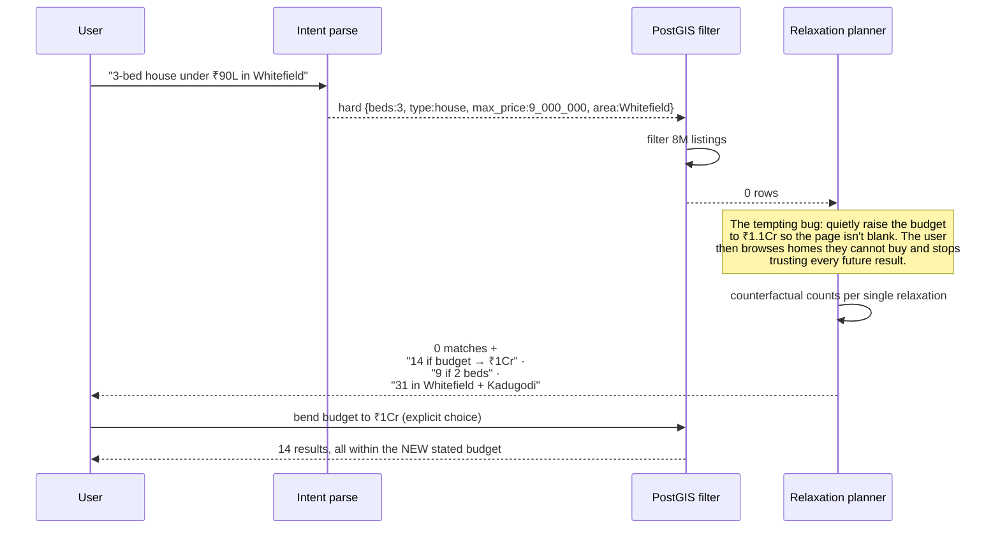
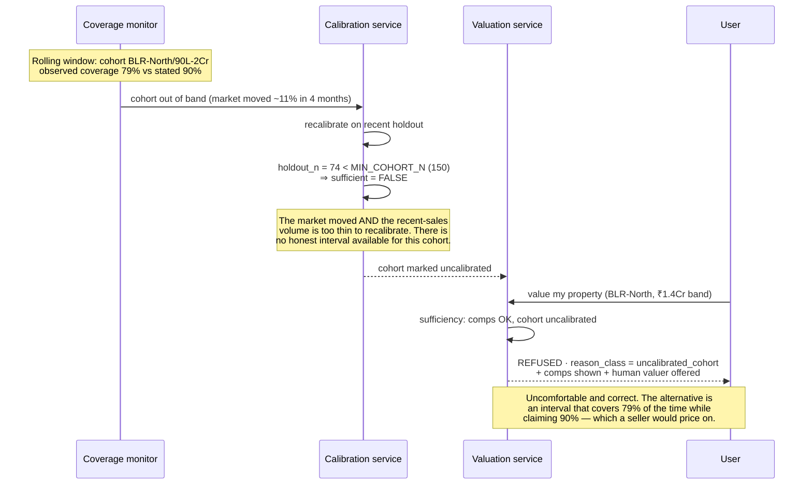
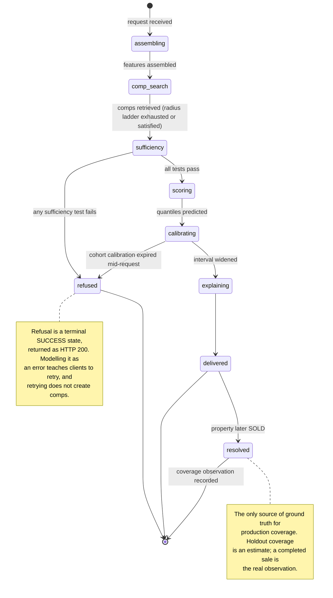
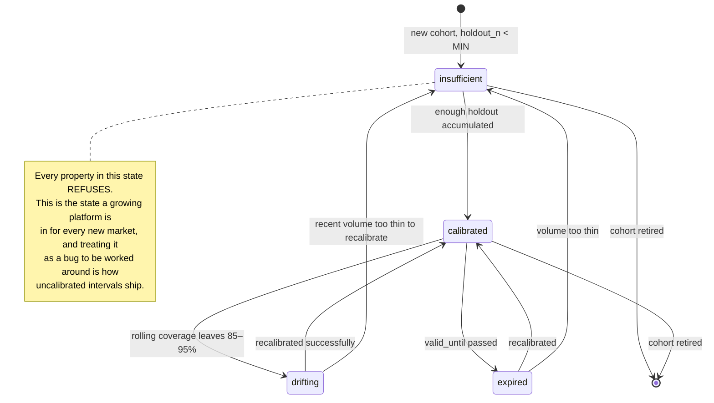

# 09 · LLD — Real Estate: Property Search, Valuation & Recommendation

> ← [`02_hld.md`](02_hld.md) · **Next:** [`04_production_and_interview.md`](04_production_and_interview.md) →

---

## 3.1 Schemas

### Properties, listings, transactions

```sql
CREATE TABLE properties (
    property_id         UUID PRIMARY KEY,
    geom                GEOGRAPHY(POINT, 4326) NOT NULL,   -- PostGIS
    address_hash        BYTEA NOT NULL,                    -- dedupe across sources
    market_id           TEXT NOT NULL,                     -- fairness policy is per market
    property_type       TEXT NOT NULL,
    bedrooms            SMALLINT,
    bathrooms           SMALLINT,
    built_area_sqft     INT,
    plot_area_sqft      INT,
    year_built          SMALLINT,
    floor               SMALLINT,
    total_floors        SMALLINT,
    zoning              TEXT,
    attributes          JSONB,                             -- parking, facing, amenities
    cohort_id           TEXT NOT NULL,                     -- (geo × price band); drives
                                                           -- calibration and fairness analysis
    updated_at          TIMESTAMPTZ NOT NULL
);
CREATE INDEX ON properties USING GIST (geom);
CREATE INDEX ON properties (market_id, property_type, bedrooms, built_area_sqft);

CREATE TABLE listings (
    listing_id          UUID PRIMARY KEY,
    property_id         UUID NOT NULL REFERENCES properties(property_id),
    asking_price_cents  BIGINT NOT NULL,
    listed_at           TIMESTAMPTZ NOT NULL,
    status              TEXT NOT NULL,              -- active | under_offer | withdrawn | sold
    description         TEXT,
    embedding           VECTOR(768),                -- description + attributes + photo features
    photo_features      JSONB,                      -- FR-9; AUXILIARY, droppable
    days_on_market      INT GENERATED ALWAYS AS (0) STORED,   -- maintained by ETL
    searchable_at       TIMESTAMPTZ                 -- < 5 min after listed_at (freshness NFR)
);

-- The evidence base for valuation. 60M rows.
CREATE TABLE transactions (
    transaction_id      UUID PRIMARY KEY,
    property_id         UUID REFERENCES properties(property_id),
    geom                GEOGRAPHY(POINT, 4326) NOT NULL,   -- denormalised: comp queries are geo-first
    sale_price_cents    BIGINT NOT NULL,
    sale_date           DATE NOT NULL,
    source              TEXT NOT NULL,             -- registry | portal | agent
    verified            BOOLEAN NOT NULL,          -- unverified sources are weighted down
    -- snapshot of attributes AT SALE TIME: a property renovated since then is not
    -- evidence about its pre-renovation self, and joining live attributes would
    -- silently backdate today's condition onto a three-year-old sale.
    attrs_at_sale       JSONB NOT NULL
);
CREATE INDEX ON transactions USING GIST (geom);
CREATE INDEX ON transactions (sale_date DESC);
```

> `attrs_at_sale` is the schema decision that most affects AVM accuracy and is easiest to get wrong. Comps must be compared on what they *were* when they sold.

### Valuations — the interval, the evidence, and the refusal

```sql
CREATE TABLE valuations (
    valuation_id        UUID PRIMARY KEY,
    property_id         UUID NOT NULL REFERENCES properties(property_id),
    requested_at        TIMESTAMPTZ NOT NULL,
    requested_by        TEXT,                       -- FR-13: consumer registration
    outcome             TEXT NOT NULL,              -- estimated | refused

    -- populated when outcome = 'estimated'
    p50_cents           BIGINT,
    p10_cents           BIGINT,                     -- calibrated interval bounds
    p90_cents           BIGINT,
    interval_width_pct  REAL,                       -- FR-20: surfaced, never buried
    cohort_id           TEXT NOT NULL,
    calibration_ver     TEXT,                       -- which per-cohort calibration applied
    conformal_delta     REAL,                       -- the widening applied by calibration

    -- populated when outcome = 'refused'
    refuse_reason_class TEXT,                       -- thin_market | atypical_property
                                                    --   | uncalibrated_cohort | stale_comps
    refuse_detail       JSONB,

    -- always populated
    comp_ids            UUID[] NOT NULL,            -- FR-19: the comps USED, not decoration
    top_factors         JSONB NOT NULL,             -- FR-3
    model_ver           TEXT NOT NULL,
    feature_allowlist_ver TEXT NOT NULL,            -- FR-25: which fairness policy applied
    is_appraisal        BOOLEAN NOT NULL DEFAULT FALSE  -- always FALSE. Present so the
                                                    -- payload asserts it (FR-12), rather
                                                    -- than the label living only in the UI.
);
CREATE INDEX ON valuations (cohort_id, requested_at DESC);
```

### Calibration state — per cohort, with a volume gate

```sql
-- FR-17/18/22. This table is what makes the interval mean something.
CREATE TABLE cohort_calibration (
    cohort_id           TEXT NOT NULL,
    calibration_ver     TEXT NOT NULL,
    model_ver           TEXT NOT NULL,
    holdout_n           INT NOT NULL,               -- volume behind this calibration
    conformal_delta     REAL NOT NULL,              -- widening for target coverage
    measured_coverage   REAL NOT NULL,              -- on the holdout
    measured_mdape      REAL NOT NULL,
    sufficient          BOOLEAN NOT NULL,           -- holdout_n >= MIN_COHORT_N
                                                    -- FALSE ⇒ every property in this
                                                    -- cohort REFUSES (FR-22)
    computed_at         TIMESTAMPTZ NOT NULL,
    valid_until         TIMESTAMPTZ NOT NULL,       -- calibration EXPIRES; a moving market
                                                    -- invalidates last quarter's quantiles
    PRIMARY KEY (cohort_id, calibration_ver)
);

-- Rolling production coverage, independent of the holdout. Catches drift.
CREATE TABLE coverage_observations (
    cohort_id           TEXT NOT NULL,
    observation_window  DATERANGE NOT NULL,
    n_resolved          INT NOT NULL,               -- valuations whose property later SOLD
    n_within_interval   INT NOT NULL,
    observed_coverage   REAL NOT NULL,
    in_band             BOOLEAN NOT NULL,           -- 85–95% per cohort
    PRIMARY KEY (cohort_id, observation_window)
);
```

> `valid_until` is the field that prevents the most insidious failure in this design. Calibration computed on a stable market silently stops being valid when the market moves, and nothing in the model complains. An expiry forces recalibration or refusal — the interval either means what it says or is not offered.

### The fairness register

```sql
-- FR-25: no feature reaches production without a recorded review.
CREATE TABLE feature_allowlist (
    allowlist_ver       TEXT NOT NULL,
    market_id           TEXT NOT NULL,              -- FR-28: policy differs by jurisdiction
    feature_name        TEXT NOT NULL,
    used_in             TEXT[] NOT NULL,            -- {ranking} | {valuation} | both
    proxy_risk          TEXT NOT NULL,              -- none | low | material
    review_note         TEXT NOT NULL,
    approved_by         TEXT NOT NULL,              -- legal, not engineering, for material risk
    approved_at         TIMESTAMPTZ NOT NULL,
    PRIMARY KEY (allowlist_ver, market_id, feature_name)
);

CREATE TABLE fairness_gate_runs (                   -- FR-26/27, blocking
    run_id              UUID PRIMARY KEY,
    candidate_model_ver TEXT NOT NULL,
    surface             TEXT NOT NULL,              -- ranking | valuation
    mdape_by_cohort     JSONB NOT NULL,
    mdape_spread_pp     REAL NOT NULL,              -- gate: <= 2.0
    coverage_by_cohort  JSONB NOT NULL,
    cohorts_out_of_band INT NOT NULL,               -- gate: 0
    proxy_probe_auc     REAL NOT NULL,              -- FR-27: adversarial detectability
    proxy_probe_delta   REAL NOT NULL,              -- vs the incumbent model
    verdict             TEXT NOT NULL,              -- pass | blocked
    blocked_reason      TEXT,
    signed_off_by       TEXT,                       -- required if proxy_probe_delta material
    run_at              TIMESTAMPTZ NOT NULL
);
```

---

## 3.2 API contracts

```
POST /v1/search
  body { query: "3-bed under 90 lakh in Whitefield, quiet, 30 min to Koramangala",
         page, page_size }
  → 200 {
      results: [ { listing_id, ..., why: ["within 22 min drive", "quiet street score 0.81"] } ],
      parsed: { hard: {...}, soft: [...], commute: {...} },   -- SHOWN to the user
      total_matches: 218
    }
  → 200 {                                          -- FR-15: zero is a real answer
      results: [],
      total_matches: 0,
      relaxations: [
        { bend: "max_price", to: 10_000_000, matches: 14 },
        { bend: "bedrooms",  to: 2,          matches: 9  },
        { bend: "area",      to: ["Whitefield","Kadugodi"], matches: 31 }
      ]
    }

  `parsed` is returned deliberately. The user can see that we read "90 lakh" as
  a ceiling and "quiet" as a preference, and correct us. Hiding the parse is how
  a misparse becomes an unexplainable bad result page.

POST /v1/valuation
  body { property_id | property_attributes }
  → 200 {                                          -- estimated
      outcome: "estimated",
      estimate: { p50: 8_400_000, p10: 7_900_000, p90: 9_100_000,
                  interval_width_pct: 14.3 },
      comps: [ { transaction_id, sale_price, sale_date, distance_m,
                 similarity, adjustments: {...} } ],
      top_factors: [ { factor: "built_area_sqft", direction: "+", weight: "high" } ],
      disclaimer: "Estimate, not a formal appraisal.",
      cohort: "BLR-East/40-90L", calibration_ver: "c2026-08"
    }
  → 200 {                                          -- FR-4/21/22: refusal, not an error
      outcome: "refused",
      reason_class: "atypical_property_and_thin_cohort",
      reason: "Too few comparable sales for a property of this size and zoning.",
      partial_evidence: { comps: [...], indicative_range: {low, high,
                          note: "too wide to be useful; shown for transparency" } },
      next_step: { human_valuation_available: true }
    }

  NOTE: a refusal is HTTP 200. It is a valid, informative answer, not a failure.
  Returning 4xx/5xx would teach clients to retry, and retrying will not create comps.

GET  /v1/valuation/{id}/comps
  → 200 { comps: [...] }
       The comps that PRODUCED the estimate. Removing one and re-valuing changes
       the number — that's FR-19's acceptance test.

GET  /internal/v1/cohorts/{cohort_id}/calibration
  → 200 { conformal_delta, measured_coverage, holdout_n, sufficient, valid_until }
  → 200 { sufficient: false, reason: "holdout_n below MIN_COHORT_N" }
       Every property in an insufficient cohort refuses. Surfaced internally so
       "why did this refuse" is answerable in one call.
```

---

## 3.3 Core algorithms

### Intent parse validation — a hallucinated constraint is worse than none

```python
def parse_intent(query: str, market: Market) -> ParsedIntent | None:
    raw = small_model.structured(query, schema=INTENT_SCHEMA)   # 140 ms

    # Schema conformance is necessary and NOT sufficient. A well-formed
    # max_price of 9_000_000_00 (unit error) or 90 (magnitude error) passes
    # the schema and destroys the result set.
    if raw.hard.max_price is not None:
        lo, hi = market.plausible_price_range          # e.g. ₹5L .. ₹100Cr
        if not (lo <= raw.hard.max_price <= hi):
            log_parse_anomaly('max_price_out_of_range', query, raw)
            return None                               # FR-16: fall back, don't guess

    if raw.hard.bedrooms is not None and not (0 <= raw.hard.bedrooms <= 20):
        return None

    if raw.hard.area and not market.resolves_area(raw.hard.area):
        # An unresolvable area is a parse failure, not an empty result. Filtering
        # on a nonexistent area returns zero and blames the user's requirements.
        raw.soft.append(raw.hard.area)                # demote to a soft term
        raw.hard.area = None

    if raw.confidence < PARSE_CONFIDENCE_FLOOR:
        return None                                   # keyword + filter fallback

    return raw
```

### Comp selection — expanding search with a hard cap

```python
def select_comps(subject, market) -> CompSet:
    """Radius expands until enough comps or the cap is hit. Urban and rural comp
    density differ by orders of magnitude, so a fixed radius is wrong everywhere."""
    for radius_m in market.radius_ladder:            # e.g. [500, 1000, 2000, 5000]
        raw = query_transactions_within(subject.geom, radius_m,
                                        since=today() - market.recency_window)
        scored = []
        for t in raw:
            sim = attribute_similarity(subject, t.attrs_at_sale)   # NOT live attrs
            if sim < MIN_SIMILARITY:
                continue
            adj = adjustment_factors(subject, t)      # time, size, floor, condition
            scored.append(Comp(t, similarity=sim, adjustments=adj,
                               weight=sim * recency_weight(t.sale_date)
                                          * (1.0 if t.verified else UNVERIFIED_DISCOUNT)))

        if len(scored) >= market.min_comps:
            return CompSet(scored, radius_m=radius_m, expanded=(radius_m > market.radius_ladder[0]))

    # Cap reached. Return what exists — the sufficiency test decides, not this function.
    return CompSet(scored, radius_m=market.radius_ladder[-1], insufficient=True)
```

Separating *retrieval* from *sufficiency judgement* matters: retrieval should return honest evidence, and one place should decide whether it is enough. Merging them tends to produce a retrieval function that quietly loosens its own standards.

### The sufficiency test — evidence, not confidence

```python
def sufficiency(subject, comps, cohort_cal) -> Sufficiency:
    """FR-21/22. Note what is NOT consulted here: the model's own confidence.
    A model can be confidently wrong precisely where evidence is absent, so
    confidence is not admissible as evidence about evidence."""
    fails = []

    if len(comps) < MIN_COMPS:
        fails.append('comp_count')

    if comps and max(c.sale_date for c in comps) < today() - MAX_STALENESS:
        fails.append('comp_recency')

    if len(comps) >= 3:
        prices = sorted(c.adjusted_price for c in comps)
        iqr_ratio = (percentile(prices, 75) - percentile(prices, 25)) / median(prices)
        if iqr_ratio > MAX_DISPERSION:               # comps disagree too much to
            fails.append('comp_dispersion')         # support ANY point estimate

    if atypicality_score(subject) > MAX_ATYPICALITY:
        fails.append('atypical_property')           # outside the training distribution

    # The test that gets missed: we may have comps AND a model, and still no
    # validated coverage for this cohort. Offering an interval we have never
    # verified would make FR-17's guarantee nominal rather than real.
    if not cohort_cal.sufficient or cohort_cal.valid_until < now():
        fails.append('uncalibrated_cohort')

    return Sufficiency(ok=not fails, fails=fails,
                       reason_class=classify_refusal(fails))
```

### Conformal calibration, per cohort

```python
def calibrate_cohort(cohort_id, model, holdout) -> CohortCalibration:
    """Turn a quantile model's nominal 80% band into one that actually covers.

    Quantile regression is NOT automatically calibrated: the p10/p90 heads are
    fitted, not guaranteed. Conformal calibration measures the miss on held-out
    data and widens by the empirical quantile of the nonconformity score.
    """
    rows = [r for r in holdout if r.cohort_id == cohort_id]
    if len(rows) < MIN_COHORT_N:
        # Not enough data to make a coverage claim. Do NOT fall back to global
        # calibration and pretend: global 90% can be 96% urban and 74% rural,
        # and the thin cohorts are exactly the fairness-sensitive ones.
        return CohortCalibration(cohort_id, sufficient=False)

    scores = []
    for r in rows:
        p10, p50, p90 = model.predict_quantiles(r.features)
        # Nonconformity: how far outside the predicted band the truth fell,
        # scaled by band width so it is comparable across price levels.
        width = max(p90 - p10, 1.0)
        if r.actual_price < p10:
            scores.append((p10 - r.actual_price) / width)
        elif r.actual_price > p90:
            scores.append((r.actual_price - p90) / width)
        else:
            scores.append(0.0)

    # Empirical (1-α) quantile with the finite-sample correction.
    alpha = 0.10
    k = ceil((len(scores) + 1) * (1 - alpha))
    delta = sorted(scores)[min(k, len(scores)) - 1]

    coverage = measure_coverage(model, rows, delta)
    return CohortCalibration(cohort_id, conformal_delta=delta,
                             holdout_n=len(rows), measured_coverage=coverage,
                             sufficient=True,
                             valid_until=now() + CALIBRATION_TTL)


def valuate(subject, comps, cohort_cal) -> Valuation:
    p10, p50, p90 = model.predict_quantiles(features(subject, comps))
    width = p90 - p10
    d = cohort_cal.conformal_delta
    return Valuation(
        p50=p50,
        p10=p10 - d * width,          # widened to honour the stated coverage
        p90=p90 + d * width,
        interval_width_pct=100.0 * ((p90 + d*width) - (p10 - d*width)) / p50,
        calibration_ver=cohort_cal.calibration_ver,
    )
```

### The fairness gate

```python
def fairness_gate(candidate_model, surface) -> GateResult:
    """FR-26/27. BLOCKING. Runs on the artifact, not on the training objective."""
    mdape, coverage = {}, {}
    for cohort in production_cohorts():
        rows = holdout_for(cohort)
        if len(rows) < MIN_COHORT_N:
            continue                                  # those cohorts refuse anyway
        mdape[cohort]    = median_ape(candidate_model, rows)
        coverage[cohort] = coverage_of(candidate_model, rows)

    spread = max(mdape.values()) - min(mdape.values())     # in percentage POINTS
    out_of_band = [c for c, v in coverage.items() if not (0.85 <= v <= 0.95)]

    # FR-27: can a probe recover protected characteristics from our feature vector?
    # This usually succeeds to some degree with rich geo features. The gate is on
    # the DELTA versus the incumbent, because an absolute zero is not achievable
    # and pretending otherwise turns the test into theatre.
    probe_auc   = train_protected_probe(candidate_model.feature_space)
    probe_delta = probe_auc - incumbent_probe_auc()

    if spread > 2.0:
        return GateResult('blocked', f'mdape_spread_{spread:.2f}pp', mdape=mdape)
    if out_of_band:
        return GateResult('blocked', f'coverage_out_of_band:{out_of_band}')
    if probe_delta > PROBE_DELTA_THRESHOLD:
        return GateResult('blocked', 'proxy_detectability_increased',
                          requires_signoff=True)      # overridable, never silently
    return GateResult('pass', mdape=mdape, coverage=coverage, probe_auc=probe_auc)
```

---

## 3.4 Sequence diagrams

### Zero results handled honestly



### Calibration expiry forces a cohort to refuse



---

## 3.5 State machines

### Valuation request



### Cohort calibration lifecycle



---

## 3.6 Edge cases

| # | Case | Handling |
|---|---|---|
| 1 | Query with no hard constraints at all ("nice place near a park") | Everything is soft; ANN over a market-scoped set with a volume cap. Ranking quality carries the whole result |
| 2 | Parsed `max_price` = 90 (magnitude error) | Market-range sanity check rejects it; fall back to keyword + filter UI. **Never filter on an implausible parse** |
| 3 | Stated area doesn't resolve | Demoted to a soft term rather than filtered on — otherwise a misspelling returns zero and blames the user |
| 4 | Commute constraint with an unresolvable destination | Commute dropped with an explicit note; the rest of the query still runs |
| 5 | Isochrone cache miss for a rare origin | Radius fallback **with a visible label**; a stated constraint must not be silently satisfied by a weaker metric |
| 6 | Property has been renovated since its own last sale | Comps use `attrs_at_sale`; the subject uses current attributes. Renovation is a feature on the subject, not a correction to history |
| 7 | Subject property *is* one of its own comps (recent sale) | Excluded — self-referential comps make the interval fictitiously narrow. Its own recent sale is instead a strong prior surfaced separately |
| 8 | Comps exist but all from one developer/building | Flagged as `low_comp_diversity`; dispersion may look excellent while being uninformative about the wider market. Widens the interval rather than narrowing it |
| 9 | All comps unverified (agent-reported) | `UNVERIFIED_DISCOUNT` weighting; if *all* comps are unverified, sufficiency fails on evidence quality |
| 10 | Market moved sharply since calibration | `valid_until` expiry forces recalibration or refusal (see §3.4) |
| 11 | Cohort has comps but never enough holdout for calibration | Permanent refuse for that cohort until volume arrives. Honest; and the refuse-rate monitor makes it visible rather than a quiet gap |
| 12 | A cohort passes MdAPE but fails coverage | Blocked. Accuracy and calibration are different properties, and the interval's promise is the one users act on |
| 13 | Fairness gate blocks a model that is materially more accurate overall | Blocked anyway. A model with 5.1% overall MdAPE and a 3.4 pp cohort spread is worse than one at 5.8% and 1.2 pp — the spread is the legal exposure |
| 14 | Proxy probe AUC rises because a *new market* was added | Probe delta is computed within comparable market scope; a market-mix change is not evidence about the feature set |
| 15 | Refuse rate drops to 0.4% after a model change | Alarm (FR-23). Almost always the sufficiency test was weakened or a threshold got tuned during model work |
| 16 | Two valuations of the same property days apart give different numbers | Expected — comps and market features moved. Both are logged with `model_ver` and `calibration_ver`; the API can return the prior estimate for comparison |
| 17 | A lender calls the valuation API | `requested_by` records it (FR-13); the response payload carries `is_appraisal: false`. Escalated to legal, because open question 3 is now live |
| 18 | Photo CV features unavailable for a listing | Valuation proceeds; photo features are auxiliary by design, never load-bearing |
| 19 | Listing indexed but embedding not yet computed | Findable by hard filter, absent from semantic ranking. Better than being invisible; freshness NFR covers the gap |
| 20 | Property straddles two cohorts (boundary case) | Cohort assignment is deterministic and recorded; a boundary property gets one cohort's calibration and the choice is auditable. Silently blending two calibrations would make coverage unverifiable |

---

← [`02_hld.md`](02_hld.md) · **Next:** [`04_production_and_interview.md`](04_production_and_interview.md) →
