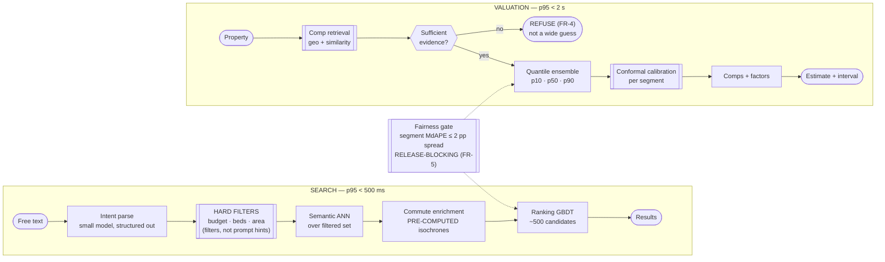

# 09 — Real Estate: Property Search, Valuation & Recommendation

> **Archetype D · Retrieval & ranking**, with a **regression** problem bolted on.
>
> **Related:** [`../../27_ai-platform-system-design/06_recommendation_system/README.md`](../../27_ai-platform-system-design/06_recommendation_system/README.md) owns the ranking mechanics. **The valuation half is what makes this design distinctive**, and it carries direct legal exposure.

---

## The three-sentence compression

1. **The choice that matters most:** **these are two systems, not one.** Search is a ranking problem where being approximately right is fine; valuation is a regression problem where the **prediction interval matters as much as the point estimate**, and where systematic error across neighbourhoods is a fair-housing exposure. They share a product surface and almost nothing else — no shared model, no shared evaluation, no shared failure ladder.
2. **The alternative I rejected:** an LLM producing the valuation. Rejected because FR-2 and FR-3 demand a *calibrated interval* and *comparable sales as evidence*, and an LLM provides neither. The valuation model is a **gradient-boosted quantile ensemble with conformal calibration** — and that is a direct architectural consequence of one NFR row.
3. **The failure mode I'd volunteer:** **silent segment bias.** An AVM at 5.8% MdAPE overall can be at 4.1% in one cohort and 9.4% in another, and the aggregate metric will never show it. Systematic under-valuation by neighbourhood is a legal problem, not a metric miss, so segment-level error is a release gate.

---

## Architecture at a glance

---

## Key numbers

| | |
|---|---|
| Search latency | **p95 < 500 ms** (budget ~470 ms — 30 ms headroom) |
| Valuation latency | p95 < 2 s — a considered, single-shot action |
| **AVM accuracy** | **MdAPE ≤ 6%** |
| **Interval calibration** | 90% interval must cover **88–92%** of the time |
| **Segment fairness** | **No systematic MdAPE bias > 2 pp across neighbourhood cohorts** |
| **Refuse rate** | 3–8% expected — **a 0% refuse rate means the model is guessing** |
| Corpus | 8M active listings · 60M historical transactions |
| Cost | **~$15.4k/month** — $0.00011/search, $0.0003/valuation, both ~100× inside ceiling |
| Where the headroom goes | **Fairness testing and calibration monitoring** — labour and infrastructure, not inference |

---

## Files

| File | Contents |
|---|---|
| [`01_requirements.md`](01_requirements.md) | The two-systems split, why intervals force the architecture, the refuse path, fair-housing proxies, comp scarcity |
| [`02_hld.md`](02_hld.md) | Architecture, component choices with rejected alternatives, data flow, NFR mapping, failure modes, scale plan |
| [`03_lld.md`](03_lld.md) | Schemas, API contracts, conformal calibration, comp selection, sufficiency test, sequence diagrams, edge cases |
| [`04_production_and_interview.md`](04_production_and_interview.md) | AI-specific concerns, runbook, common mistakes, interview follow-ups, glossary |

**Shared requirements block:** [`../00_requirements_all_systems.md#9-real-estate--property-search-valuation--recommendation`](../00_requirements_all_systems.md#9-real-estate--property-search-valuation--recommendation)

---

## The three findings to leave with

1. **An uncalibrated interval is worse than no interval**, because users treat a stated 90% interval as a 90% interval. That single sentence rules out a bare point model and forces quantile regression plus conformal calibration.
2. **Refusing to answer is a feature with a target rate.** A model that always produces a number in a thin market is not more capable, it is less honest — and a 0% refuse rate is a monitoring alarm, not a success metric.
3. **Aggregate accuracy hides the legally dangerous failure.** Segment-level error by geography and price band is the metric that matters, and it has to gate releases rather than appear on a dashboard.
